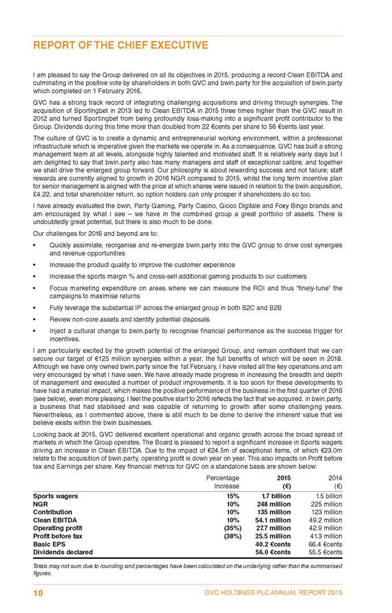
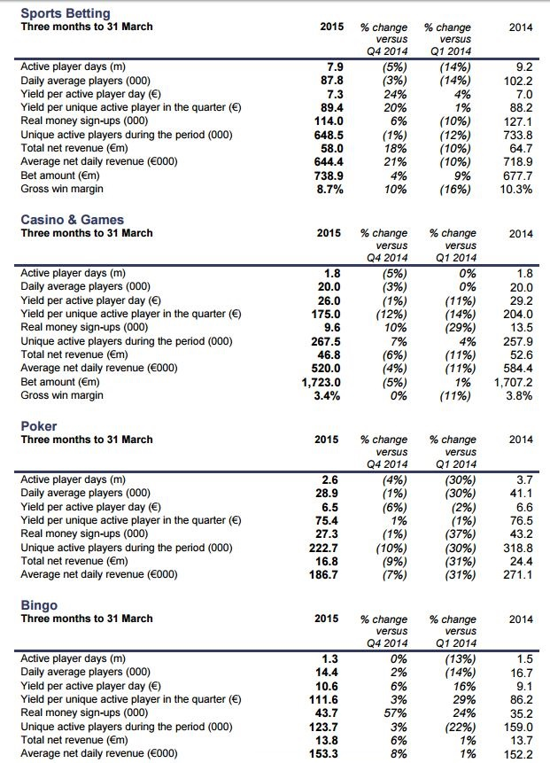
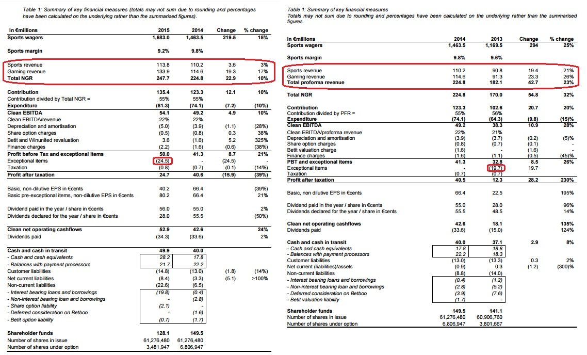

```{r load-pkgs, include = FALSE}
suppressMessages(library('plyr'))
pkgs <- c('plyr', 'dplyr', 'magrittr', 'knitr', 'stringr', 'tidyr', 'googleVis', 'DT', 'rCharts', 'formattable', 'lubridate', 'rvest')
suppressMessages(l_ply(pkgs, library, character.only = TRUE))
rm(pkgs)

## Set the googleVis options first to change the behaviour of plot.gvis, so that only the chart 
##  component of the HTML file is written into the output file.
op <- options(gvis.plot.tag = 'chart')
```

# 1. Introduction

  - Section [1.1 Instructions]
    + Section [1.1.1 Overview]
    + Section [1.1.2 How to Use Peer Review]
    + Section [1.1.3 Assignment Details]
  - Section [1.2 Review Criteria]
  - Section [1.3 Reminders]

## 1.1 Instructions

### 1.1.1 Overview

  There are multiple steps for this mini-project. First, you will submit your answers to the questions in Parts 1, 2, 3, and 4 based on the information in the Assignment Details section. Enter your answers directly in the spaces provided in the My submission tab. Please answer each question fully and concisely, including the steps of your calculations and/or citations as needed (you may use the library guidelines to citations as a guide). Then, you will evaluate the submission of at least four of your peers based on the instructions provided.

### 1.1.2 How to Use Peer Review

1. **Submit your own assignment**. Click the **My submission** tab to begin working on your own assignment. You can save drafts of your work as you go, and you can come back later to continue working on your draft. When you are finished working, click the **Preview** button, verify your identity, and then **Submit** the assignment
2. **Give feedback to your peers**. You are required to give feedback to at least four peers to complete this assignment. You can begin giving feedback to other students as soon as you submit your assignment. Click the **Review peers** tab to get started. Feel free to provide additional reviews beyond the four required!
3. **Read feedback from your peers**. Your peers will also begin reviewing your project as soon as you submit it. You will receive an email notification of each new review. Only you will be able to see the feedback you receive. If you find someone’s review helpful, click the **This review is helpful** button to thank the reviewer.
4. **Browse other projects**. You can browse through all of the submitted assignments, even if you don't plan to review each one. Click the like button if you think someone did a great job on their assignment.

### 1.1.3 Assignment Details

  For this project, you will actually be "creating" exercises. In fact, this is one of the most effective means by which true understanding of a concept or topic is demonstrated – when you show how to "test" this understanding.

  Please choose two (different) common business decisions from those discussed in the Module 1 videos. These include:

  - Make or buy decisions
  - Keep or drop a product line, business unit, department, etc.
  - Retain or replace equipment, machinery, factory, etc.
  - Sell or process further
  - Accept a special order

Your Deliverable

  Provide the following for **each of the two decisions** you choose:

**Part 1**: Describe a specific setting, the decision, decision alternatives, and any other information that would comprise an interesting and challenging problem.

**Part 2**: Create a "deliverable" list for the person who would be completing the problem. This deliverable list should be comprised of (at least) two calculations and (at least) one qualitative discussion deliverable (i.e., requiring explanation, additional considerations, etc.).

**Part 3**: In general, ensure that your exercise tests the person's knowledge related to the use of relevant information in decision making. That is, your exercise should contain some relevant and some "irrelevant" information so that the person must distinguish between the two types of information.

  Further, your exercise should allow a person to demonstrate their understanding related to at least two of the following items:

  - Opportunity costs
  - Sunk costs
  - Allocated fixed costs
  - Fixed-cost per unit information
  
**Part 4**: Finally, you should provide a solution for your exercise.

## 1.2 Review criteria

  You will give a quantitative assessment of all parts of the submission. Then, you will provide qualitative feedback for the submission as a whole.

  The following represents a guide for the quantitative assessments of **Parts 1-4**:

  - **0 points: No answer, completely irrelevant answer, inadequate material, and/or evidence does not fit the argument**.
  - **5 points: Insufficient answer, incomplete, lacks supporting evidence**. An insufficient response is incomplete or incorrect. For calculations, the response fails to provide supporting calculations/steps.
  - **7 points: Passing, meets expectations**. A passing response addresses/answers the question, but some of the answer is not thoroughly explained. For calculations, the supporting calculations/steps are not clear.
  - **9 points: Well above average, exceeds expectations** An above average response addresses/answers the entire question and most of the answer is thoroughly explained. For calculations, most of the supporting calculations/steps are clear, but there are some minor deficiencies.
  - **10 points: Superior performance, excellent**. An excellent response answers the entire question, and thoroughly explains the answer. For calculations, all supporting calculations/steps are clearly presented.

  Recommendations for Fair Peer Review:

  - The score should not be based on whether or not you agree with the answer, rather on whether the answer is complete and well-supported.
  - Both content and organization are important components of a response. Good writing is confident and clearly focused with relevant details to enrich the content. Good writing also follows instructions, such as word limits, and offers requested information.
  - A clear and concise answer is preferable to a long response that lacks coherence.
  - Focus should be on content; try not to unduly penalize responses for spelling or grammar.

## 1.3 Reminders

**Using the Forums**

  Your fellow students are a great resource, and we encourage you to sharpen your ideas against them in the forums. You can post your arguments in the forums and receive feedback before submitting your assignment.

**Honor Code**

  Please remember that you have agreed to the Honor Code, and your submission should be entirely yours. Our definition of plagiarism follows from standard literature: passing off someone else's work as your own, whether from your peers or Wikipedia. If you need to quote material, remember to cite your source, for example: "But, as expressed by Spinoza, all things excellent are as difficult as they are rare (Baruch Spinoza, "Ethica" source: thinkexist.com)."

# 2. Case Study

  - Section 2.1 [Summary]
  - Section 2.2 [Part 1]
  - Section 2.3 [Part 2]
  - Section 2.4 [Part 3]
  - Section 2.5 [Part 4]

## Summary

  In order to conduct the assignment, I try to using sportsbook industry business as my assignment. *[Football Form Labs](http://www.footballformlabs.com/), [Star Lizard](http://www.starlizard.com/), [SmartOdds](http://www.smartodds.co.uk/)*^[You can refer to Reference 03 and reference 04 to know the background of the sportsbook consultancy firms as well as the founders.] are famous sportsbook consultancy firms in sportsbook industry. I try to put myself into stand point of view as a StarLizarder since I used to used work in *Telebiz* which is a backend sportsbookmaker while taking bets from high rollers and *Star Lizard* is the one of crucial client.
  
  However there has no financial report since there are private company. Here I try to take a public listed company which is [*GVC*](http://www.gvc-plc.com)^[You can refer to [Annual & Interim Reports (including Sportingbet and bwin.party)](http://www.gvc-plc.com/html/investor/annual_report.asp) for more details.] as an observation for the assignment. The company has made some successful acquisation and takeover activities since decade.

```{r timeline, echo = FALSE, results = 'asis'}
tmline <- data_frame(Year = c(2004, 2007, 2008, 2009, 2010, 2011, 2012, 2013, 2014, 2015, 2016), Event = c('Incorporation of Gaming VC Holdings SA in Luxembourg, shares admitted to trading on AIM, acquisition of CasinoClub.', 'Launch of a sportsbook, Grant of Maltese license, Kenneth Alexander joins as Chief Executive Officer and starts to reinvigorate the group.', 'Richard Cooper joins as Group Financial Director, Karl joins as a non-executive director.', 'Acquisition of Betboo, a Brazilian-focused Bingo/sportsbook product.', 'Re-domicile from Luxembourg to the Isle of Man to improve post tax dividend return for shareholders.', 'Launch of Betboo outside Latin America Acquisition of the rights to provide back-office services to East Pioneer Corporation BV, who in turn acquired Superbahis, a Sportingbet branded sportsbook.', 'Announced exclusive talks with William Hill to acquire Sportingbet.', 'Acquisitioin of Sportingbet (ex Australia) completes March 2013.', 'Announcement on 14 May of strategic investment in Scandinavian markets.', 'Announced a bid for bwin.aprty digital entertainment plc Trading update announces revenue of EUR247.7 million for the year.', 'Acquisition of bwin.party completes 1 February 2016, admitted to Main Market of London Stock Exchange 2 February Appointment of Norbert Teufelberger, Stephen Morana and Peter Isola as non-executive directors.')) %>% mutate(No = seq(nrow(.))) %>% select(No, Year, Event)

G <- gvisTable(tmline, options = list(width = 'automatic', height = 400))
M <- gvisMotionChart(tmline, idvar = 'Event', date.format = '%b-%Y', timevar = 'Year', options = list(width = 'automatic', height = 400))
GM <- gvisMerge(G, M, horizontal = TRUE, tableOptions = "bgcolor=\'#CCCCCC\' cellspacing=10")
rm(tmline, G, M)
plot(GM)
```

*graph 2.1.1 : Acquisition history of GVC group*


**Health of bwin Party before Acquisition**

  By refer to **Operations Management - Module 1: Operations Strategy** *by ®γσ, Eng Lian Hu 2016*^[Refer to [Reference 06](## 4.4 References)], we know the :
  - Asset Turnover Ratio
  - Operating Margin
  - Return On Equity (ROE)

  Now we try to evaluate if the acquisition is worth or value buy (short term analysis, but acquisition is a long term business decision)? Due to the acquisition has just made less than one year therefore we have inssuficient data and information for analyse. Here I try to refer to quarterly report as short term analysis.

  Firstly, we review the [annual financial statement of bwin.party digital entertainment](http://www.redmayne.co.uk/research/securitydetails/financials.htm?tkr=BPTY) from year 2010 to year 2014.

```{r financial-history, echo = FALSE, results = 'asis'}
lnk <- 'http://www.redmayne.co.uk/research/securitydetails/financials.htm?tkr=BPTY'
fintab <- lnk %>% read_html %>% html_nodes(xpath = '//*[@id="Layout4"]/table[1]') %>% html_table %>% .[[1]] %>% tbl_df

fintab %>% datatable(
  caption = "Table 2.1.1 : Annual Financial Report of bwin Party (2010 - 2014)", 
  escape = FALSE, filter = "top", rownames = FALSE, 
  extensions = list("ColReorder" = NULL, #'@ "RowReorder" = NULL, "Buttons" = NULL, 
                    "Responsive" = NULL, "FixedColumns" = list(leftColumns = 1)), 
  options = list(dom = 'BRrltpi', autoWidth = TRUE, 
                 lengthMenu = list(c(10, 50, 100, -1), c('10', '50', '100', 'All')), 
                 ColReorder = TRUE, rowReorder = TRUE, 
                 buttons = list('copy', 'print', 
                                list(extend = 'collection', 
                                     buttons = c('csv', 'excel', 'pdf'), 
                                     text = 'Download'), I('colvis'))))
rm(lnk)
```

*table 2.1.1 : Annual financial statement of bwin Party from year 2010 to 2014.*

  By refer to above table, we try to evaluate the company's health.

*Asset Turnover Ratio*

```{r tbl1, echo = FALSE, results = 'asis'}
tbl1 <- fintab %>% filter(`Assets (€m)` %in% c('Turnover', 'Net Assets')) %>% .[2:1, ]
tb <- tbl1[-1] %>% mutate_each(funs(as.numeric))

bt <- c('Asset Turnover Ratio', paste0(round(tb[1, ] / tb[2, ], 4) * 100, '%'))
names(bt) <- names(tbl1)

tbl1 %<>% rbind(., bt)
rm(tb, bt)

tbl1 %>% kable(caption = 'Table 2.1.2: Asset Turnover Ratio (Year 2010 - 2014)')
```

*table 2.1.2 : Asset turnover ratio of bwin Party from year 2010 to 2014.*

*Operating Margin*

```{r tbl2, echo = FALSE, results = 'asis'}
tbl2 <- fintab %>% filter(`Assets (€m)` %in% c('Operating Profit', 'Turnover'))
tb <- as.character(tbl2[2, -1]) %>% str_replace_all('\\(', '-') %>% str_replace_all('\\)', '')
tb %<>% rbind(., tbl2[1, -1]) %>% mutate_each(funs(as.numeric))

bt <- c('Operating Margin', paste0(round(tb[1, ] / tb[2, ], 4) * 100, '%'))
names(bt) <- names(tbl2)

tbl2 %<>% rbind(., bt)
rm(tb, bt)

tbl2 %>% kable(caption = 'Table 2.1.3: Operating Margin (Year 2010 - 2014)')
```

*table 2.1.3 : Operating margin of bwin Party from year 2010 to 2014.*

*Return On Equity (ROE)*

```{r tbl3, echo = FALSE, results = 'asis'}
tbl3 <- fintab %>% filter(`Assets (€m)` %in% c('Operating Profit', 'Total Equity'))
tb <- as.character(tbl3[2, -1]) %>% str_replace_all('\\(', '-') %>% str_replace_all('\\)', '')
tb %<>% rbind(., tbl3[1, -1]) %>% mutate_each(funs(as.numeric))

bt <- c('Return On Equity (ROE)', paste0(round(tb[1, ] / tb[2, ], 4) * 100, '%'))
names(bt) <- names(tbl3)

tbl3 %<>% rbind(., bt)
rm(tb, bt)

tbl3 %>% kable(caption = 'Table 2.1.4: Return On Equity (Year 2010 - 2014)')
```

*table 2.1.4 : Return on equity of bwin Party from year 2010 to 2014.*

*Summary*

```{r tbl4, echo = FALSE, results = 'asis'}
tbl4 <- bind_rows(list(tbl1[nrow(tbl1), ], tbl2[nrow(tbl2), ], tbl3[nrow(tbl3), ]))
tbl4 %>% kable(caption = 'Table 2.1.5: Financial Analysis (Year 2010 - 2014)')
```

*table 2.1.5 : Financial analysis of bwin Party from year 2010 to 2014.*

  From the table above, we observed that the asset turnover ratio fluctuates after 2010. Besides, the operating margin represents the cost management is not efficient. After that, the ROE ratio similar with asset turnover ratio which is not stable. We can know there might be some unexpected issues to cause the stability of growth of the business of bwin Party is bad. However the *GVc* dicided to takeover and reported generates profit within last quarter in year 2015 prior to acquisition^[Kindly read the article [bwin.party reports revenue growth in fourth quarter](http://www.igamingbusiness.com/news/bwinparty-reports-revenue-growth-fourth-quarter) and [Bwin.Party has good fourth quarter before GVC takeover](http://www.proactiveinvestors.co.uk/companies/news/120963/bwinparty-has-good-fourth-quarter-before-gvc-takeover-120963.html)].
  Let's look at the financial report of year 2015 in order to know more details as in [Report of the Chief Executive](http://www.gvc-plc.com/annual_reports/2015/012.asp).



  We observed that the Sports wager has been increased 15% from EUR1.5 billion to EUR1.7 billion from 2014 to 2015 and the Net Gaming Revenue incaresed 10% from 225 million to 248 million. However the operating profit decreased 35% which was from EUR42.9 million to EUR27.7 million. The CEO has declared the one among the challenges for 2016 is the re-energize the *bwin Party* into the *GVC* group to drive cost synergies and revenue opportunities.


  Above 1st table shows the revenue of *bwin Party* is EUR562.1 million compare to *GVC* group's EUR247.7 million which is more than double. The sports margin gain around 9% from wagers. We can know the business size of *bwin Party* is greater than *GVC*.
  2nd and 3rd tables display the average wager per day in 1st quarter of 2016 and 2015. The average stakes per day increase 180% compare to year 2015. You can refer to [Preliminary Results for year ended 31 December 2015 - 2016 Trading Update](http://www.gvc-plc.com/html/investor/news/archive/2016/250416.asp) for more details.

## Part 1

  For **each of the two decisions** you choose:

Describe a specific setting, the decision, decision alternatives, and any other information that would comprise an interesting and challenging problem.

**1 Make or buy decisions**

  Based on above section, we know that the Net Gaming Revenue increases but there has no profit declared, secondly there has just only an quarter after acquisition, therefore we unable to conclude that the acquisition is worth in short term. Below information is required in order to determine if the acquisition is worth or not:
  - The breakdown financial statement between *GVC* and *bwin Party* in order to differentiate the ROI on *GVC*. *GVC* can dicide either expand its existing *Sportingbet* or takeover *bwin Party*.
  - The interim report doesn't content financial statement in cost and also profit breakdown.
  - Besides, we can refer to page 9 inside [Preliminary Results for year ended 31 December 2014, Trading Update for period from 1 January 2015 to 18 March 2015](http://www.gvc-plc.com/archive/results/prelims_2014.pdf) which summarise the cash flow on acquisition activities. The cash flow and liabilities of the company need to be considered prior to conduct an acquisition decision.

*2016 Trading Update*

  - Q1-2016 Total Group NGR at EUR167.7 million, up 180% (Q1-2015: EUR60.0 million) following the acquisition of bwin.party on 1 February 2016.
  - Q1-2016, like-for-like, constant currency basis, average NGR per day, up 9%
  - Year to 20 April 2016, like-for-like, constant currency basis, average NGR per day increases were:
    + Group: +13%
    + GVC brands: +18%
    + Bwin.party brands: +11%
  - PartyPoker shows first year on year quarterly growth for five years
  - On track to secure €125 million of synergies by the end of 2017 from enlarged GVC

*Financial position*

  - Gross cash position as at 17 April EUR327 million
  - Group net debt*** as at 17 April EUR193 million

  Although the 2016 interim reports do not state the breakdown, however you can try to refer to year 2015.
  



  You can refer to [AGM trading update and Q1 2015 key performance indicators](http://www.gvc-plc.com/archive/bwin-party-accounts/2015/20150521%202015%20Q1%20KPIs%20-%20RNS%20Release.pdf) and [Unaudited results for the six months ended 30 June 2015](http://www.gvc-plc.com/archive/bwin-party-accounts/2015/20150828%202015%20Half%20Year%20Results%20-%20RNS%20Release.pdf) for more details.

**2 Keep or drop a product line, business unit, department, etc.**



  Let us look at the key financial statement above regarding *bwin Party* 2013, 2014 and 2015 to know the income generates from online gaming and sportsbook. The revenue generates from online gaming is greater than sportsbook while both increasing beyond the year.
  
  However below article descript which sportsbook increase but the other online games declined in revenue.

```
  Sport betting revenue increase by 1% although Casino & games, poker and bingo revenues declined, with poker revenues taking a massive 29% hit. Pulling out of Greece and “challenging conditions in several markets” were blamed for poker’s poor performance...
```  
  
  You can refer to [Bwin.party digital entertainment plc Posts €97.9 Million Loss](http://uk.pokernews.com/news/2015/03/bwin-party-digital-entertainment-plc-posts-97-9-million-loss-16892.htm) for more details.
  
  Well, now we try to summarise if both online gaming and sportsbook business should be kept or dropped? Then the question come again due to insufficient information about independent cost and profit listing on both. Secondly, above financial statement states an *exceptional item* element which cost to company. We unable to know the profit generates seperately from both. Therefore I try to conclude that based on the limited information, both business should keep operating in year 2014 and then we try to compare to the revenue of year 2015.

## Part 2

  For **each of the two decisions** you choose:

Create a "deliverable" list for the person who would be completing the problem. This deliverable list should be comprised of (at least) two calculations and (at least) one qualitative discussion deliverable (i.e., requiring explanation, additional considerations, etc).

**1 Make or buy decisions**

  When we talk about the calculation, there has insufficient information about the cost and profit breakdown for both individual sportsbook and online gaming departments. Here we can try to refer to **Summary** section in 2.1 (before section Part 1) for *bwin Party* business before acquisition. Then [Part 1] eleborate the insifficient information to judge.
  
  However we can refer to below video which has eleborate there must be profitable in order to make an acquisition.
  - The profit generates must be able to growth and more than the cost of acquisition.
  - There might probably resizing employees upon acquisition to cut cost. For example traders, customer service and also financial department might united to handle both *Sportingbet* and *bwin Party*.^[I am the one among the traders used to monitor few brands when I worked in Telebiz and Caspo. For example: SB1888 and 188Bet or Singbet1 and Singbet3, AS3388 and RCM]
  - Sharing technology like platform, service and tools. Some products or technology might be fully utilised accross two brands.

  For example :

```{r ex1, echo = FALSE, results = 'asis'}
ex1 <- data_frame(Category = c('Customers', 'Website & Server', 'Cost to Acquire a New Customer', 'Labor Cost', 'Admin Cost', 'Overhead'), ComA = c(1200000, 100000, 200, 575000, 500000, 260000), ComB = c(600000, 80000, 400, 33000, 50000, 23000), Combine = ComA + ComB, Merge = c(2000000, 200000, 200, 585000, 510000, 265000), Diff = Combine - Merge)

ex1 %>% kable(caption = 'Table 2.3.1: Comparison of the Benefit of Merging')
```

*table 2.3.1 : Example of merging.*

  From above table, we can know the basic cost of *Company A* and *Comapny B*, and *Combined Figure* is the lump sum figure of both company, *Merged Company* is the cost after merging, *Difference* is the cost save/waste upon takeover. After merge, there will not only lump sum the number of customer for the business group but also allowed customers to register account at another partner website.
  
  Besides, the advertisement cost will be save since both sister-companies can promote to each other. The cost of acquire a new customer keep $200 after takeover which has saved cost. The labor cost and overhead can be saved due to resizing employees and daily expense or rental can be saved upon work in same office or branches. The server might probably upgrade upon invest some fund for long term use, but the data of customers and also stakes might link which easier to handle by employees (example: traders, customer service executives etc.).
  
  - Customers number = additional 200000 upon takeover (since the customers from company website A might also auto awarded an account at company website B, geographical customers might enjoy different website which under same business group. For example: Sportingbet is a British company but bwin is an Austrian company but both under GVC. Let say British customers who familiar with bwin website will able to choose bwin but not only existing Sportingbet website. Some customers who are soccer fans always watching soccer matches will know bwin from advertisement of Real Madrid famous club etc. can also get an account of Sportingbet.)
  - Website & server cost = additional 20000 (but linked the database of customers migh easier for GVC group. Especially similar with Macrogaming, easily handle anti-fraud and arbitrage activities among both websites.)
  - Saved cost of acquire a new customer = 400 (saved cost. For example customers of Sportingbet will automatically awarded an account on bwin and verce vice.)
  - Saved labor cost = 23000
  - Saved admin cost = 40000
  - Saved overhead cost = 18000

<iframe width="560" height="315" src="https://www.youtube.com/embed/CkTLglpn-zs" frameborder="0" allowfullscreen></iframe>

**2 Keep or drop a product line, business unit, department, etc.**

  Similar with previous topic which is insufficient information to proof if casino & games, sportsbook, poker, bingo making profit and cost listing independently. An organization might decide to close a department which was not profitable.
  
  For example :

```{r ex2, echo = FALSE, results = 'asis'}
ex2 <- data_frame(Category = c('Revenue', 'Variable Cost', 'Fixed Cost', 'Operating Profit'), Sportsbook = c(800000, 520000, 80000, 200000), `Casino & Gaming` = c(300000, 210000, 50000, 40000), Poker = c(100000, 90000, 30000, -20000), `Horse Racing` = c(250000, 190000, 40000, 20000))

ex2 %>% kable(caption = 'Table 2.3.2: Department Breakdown of Company C')
```

*table 2.3.2 : Example of division breakdown of company C.*

  - Total profit = `r suppressWarnings(ex2[nrow(ex2), ] %>% as.character %>% as.numeric %>% sum(na.rm = TRUE))`
  - Total revenue loss = -100000
  - Saved Variable Cost = 90000
  - Saved Variable Cost = 30000
  - **Total Saved Cost = `r suppressWarnings(ex2[nrow(ex2), ] %>% as.character %>% as.numeric %>% sum(na.rm = TRUE)) - 100000 + 30000 + 90000`**

<iframe width="560" height="315" src="https://www.youtube.com/embed/IEw2e9XstBY" frameborder="0" allowfullscreen></iframe>

## Part 3

  For **each of the two decisions** you choose:

  In general, ensure that your exercise tests the person's knowledge related to the use of relevant information in decision making. That is, your exercise should contain some relevant and some "irrelevant" information, so that the person must distinguish between the two types of information. Further, your exercise should allow the person to demonstrate their understanding related to at least two of the following items:

  - Opportunity costs
  - Sunk costs
  - Allocated fixed costs
  - Fixed-cost per unit information

**1 Make or buy decisions**

  - Opportunity costs
    + The decision of acquisition *bwin Party* is an opportunity cost before they invest the fund for takeover the company since they can acquire other companies or use the fund to expand existing *Sportingbet*'s business.
  - Sunk costs
    + When *GVC* decide to takeover *Sportingbet* and signed the agreement. All the payment will became sunk costs if *GVC* want to terminate the agreement with penalty fees. You can read the article [GVC Hldgs Takeover Rumours (GVC)](http://uk.advfn.com/stock-market/london/gvc-hldgs-GVC/takeover) to know the stock price blooming 2 times from February. There is another article [Online betting company Bwin accepts GVC takeover bid](http://www.bbc.com/news/business-34149794) but there is another decision **Accept a special order** or **Sell or process further** which is decided by *Sportingbet*.

**2 Keep or drop a product line, business unit, department, etc.**

  - Opportunity costs
    + The choice of either keep operates or close the department which made loss constantly.
    + We can know from *table 2.3.2* which is Poker game (product) made loss, however we need to observe if it is made loss constantly accross few quarter, the cost management factor as well as if it is due to product quality or unprofessional/unskillful of anti-faud team. (For example: I  temporarily closed my server to save cost as I have quite some short term debt which need to be settle within 1 year. Meanwhile the studying fees is an opprtunity for me as well which is option to me for self improve.)
  - Sunk costs
    + If the company C decide to close Poker business, then the cost spent will became sunk costs. (For example: when we purchased a movie ticket but we didn't attend to watch the movie, then the cost will became sunk cost since the ticket is not refundable.)
    + If the Poker product is constantly make profit accross the years but only made loss in specific quarter, then it will be another issue while accounting department need to breakdown all revenue and costs spent throughly.

## Part 4

  Finally, provide a solution for your exercise.

  From the case study for *GVC* and *bwin Party*. The income statement after acquisition shows a negative operating profit figure where the CEO's report declared that the cost synergy is one of crucial action need to implement. From the history statement which is from 2010 to 2014, *bwin Party* is keeping making loss on opearing profit before sell to *GVC*, and now made loss after acquisition but the revenue is keeping increase every year. Therefore we can concludes that the problem is with the cost management as declared in CEO's report as well.

  With regards to **Part 3**, I simply made an example of company with a ramdom figure to eleborate about the profitable/unprofitable business and decision making.

```{r, echo = FALSE, results = 'asis'}
## Set options back to original options
options(op)
```

# 3. Conclusion

  I completed the assignment based on my limited knowledge. Due to the quarter financial report of *GVC* doen't provides a breakdown profit and loss (P&L) of every single division simlir with *figure 2.2.1*, we unable to judge and make a brilliant and efficient business decision.

  As mentioned in section [Speech and Blooper], I need to self improve in financial statement analysis section but also products my research [Analyse the Finance and Stocks Price of Bookmakers](https://github.com/scibrokes/analyse-the-finance-and-stocks-price-of-bookmakers).

# 4. Appendices

  - Section [4.1 Documenting File Creation]
  - Section [4.2 Versions' Log]
  - Section [4.3 Speech and Blooper]
  - Section [4.4 References]

## 4.1 Documenting File Creation

  It's useful to record some information about how your file was created.
  
  - File creation date: 2016-07-02
  - File latest updated date: `r Sys.Date()`
  - `r R.version.string`
  - R version (short form): `r getRversion()`
  - [**rmarkdown** package]() version: `r packageVersion('rmarkdown')`
  - [**tufte** package](https://github.com/rstudio/tufte) version: `r packageVersion('tufte')`
  - File version: 1.0.0
  - Author Profile: [®γσ, Eng Lian Hu](https://beta.rstudioconnect.com/englianhu/ryo-eng/)
  - GitHub: [Source Code](https://github.com/englianhu/Coursera-Improving-Business-Finances-and-Operations/tree/master/2%20Managerial%20Accounting%20-%20Tools%20for%20Facilitating%20and%20Guiding%20Business%20Decisions)
  - Additional session information:

```{r info, echo = FALSE, results = 'asis'}
lubridate::now()
devtools::session_info()$platform
Sys.info()
```

## 4.2 Versions' Log

  - *July 02, 2016*: [version: 1.0.0](https://github.com/englianhu/Coursera-Improving-Business-Finances-and-Operations/blob/master/2%20Managerial%20Accounting%20-%20Tools%20for%20Facilitating%20and%20Guiding%20Business%20Decisions/Module-01-Assignment.Rmd)

## 4.3 Speech and Blooper

  I do appreciate that [University of Illinois at Urbana–Champaign](http://illinois.edu/) provides the [Improving Business Finances and Operations](https://www.coursera.org/specializations/business-operations) specialization via [Coursera](http://www.coursera.org). I used to study [Certified Accounting Technician (CAT)](http://www.accaglobal.com/ie/en/student/exam-support-resources/foundation-level-study-resources.html) course at [PAAC](http://www.paac.edu.my/index.php?p=location) more more decade. Now I need to review the finance and accounting course prior to conduct my research [Analyse the Finance and Stocks Price of Bookmakers](https://github.com/scibrokes/analyse-the-finance-and-stocks-price-of-bookmakers).
  There are few books that I need to read for further understanding.
  - [Managerial Accounting](https://github.com/englianhu/Coursera-Improving-Business-Finances-and-Operations/blob/master/2%20Managerial%20Accounting%20-%20Tools%20for%20Facilitating%20and%20Guiding%20Business%20Decisions/data/Managerial%20Accounting.pdf)
  - [**Financial Statement** A Step-by-Step Guide to Understanding and Creating Financial Reports *by Thomas R. Ittelson 2009*](https://github.com/scibrokes/analyse-the-finance-and-stocks-price-of-bookmakers/blob/master/data/finance.pdf)

```
The biggest driver of sales growth was Bwin's sports betting and casino operations. That will reassure GVC investors because the company plans to move its sports punters onto Bwin’s betting platform following the acquisition, which is officially due to complete on February 1...
```
  I can access *Sporting.com* yesterday on 06-Jul-2016 but not today. Believed that is because of wizards. You can refer to [Bwin returns to growth as GVC takeover nears completion](http://www.telegraph.co.uk/finance/newsbysector/retailandconsumer/leisure/12082476/Bwin-returns-to-growth-as-GVC-takeover-nears-completion.html) for more details.

## 4.4 References

  1. [HFR Industry Reports](https://www.hedgefundresearch.com/hfr-industry-reports)
  2. [**The Evolving Dynamics of the Hedge Fund Industry** *2015 Global Hedge Fund and Investor Survey*](https://github.com/englianhu/Coursera-Improving-Business-Finances-and-Operations/blob/master/2%20Managerial%20Accounting%20-%20Tools%20for%20Facilitating%20and%20Guiding%20Business%20Decisions/data/The%20Evolving%20Dynamics%20of%20the%20Hedge%20Fund%20Industry%202015.pdf)
  3. [**Mugs and Millionaires: Inside the Murky World of Professional Football Gambling** *by Ed Hawkins 2014*](http://bleacherreport.com/articles/2200795-mugs-and-millionaires-inside-the-murky-world-of-professional-football-gambling)
  4. [**Inside Starlizard: The story of Britain's most successful gambler and the secretive company that helps him win** *by Oscar Williams Grut 2016*](http://www.businessinsider.my/inside-story-star-lizard-tony-bloom-2016-2/?r=UK&IR=T#zP2CXUxHzPL9Armk.97)
  5. [**Annual & Interim Reports (including Sportingbet and bwin.party)**](http://www.gvc-plc.com/html/investor/annual_report.asp)
  6. **Operations Management - Module 1: Operations Strategy** *by ®γσ, Eng Lian Hu 2016* [Assignment 2](http://rpubs.com/englianhu/187414), [Alternative link](http://englianhu.github.io/2016/06/operations%20management/Module-01-Assignment-02.html)

