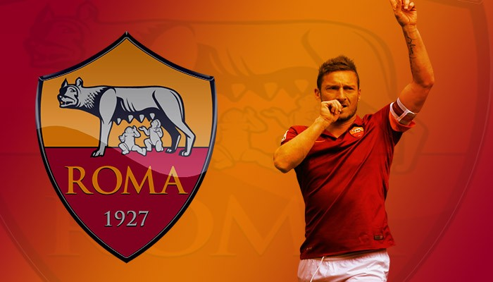
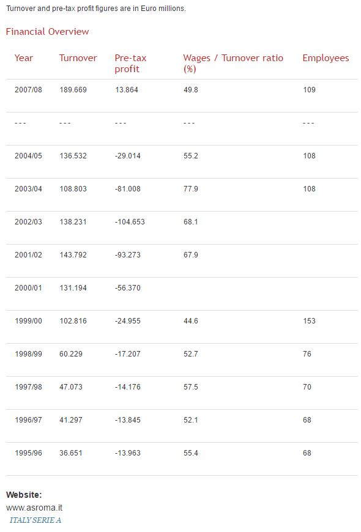
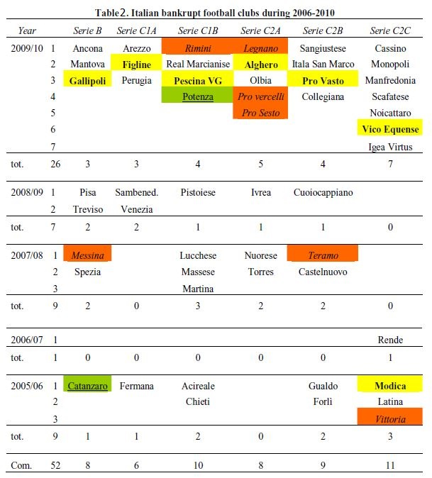
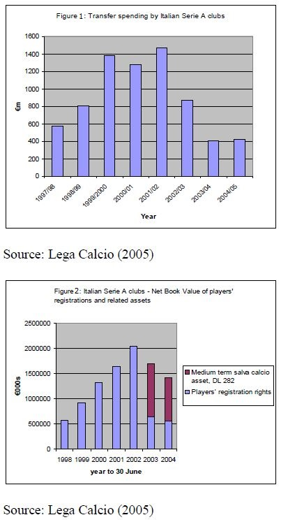
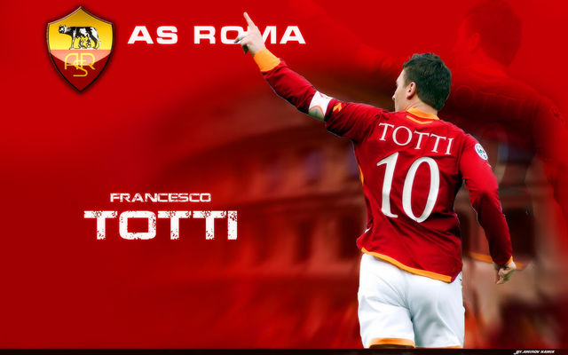

```{r load-pkgs, include = FALSE}
suppressMessages(library('plyr'))
pkgs <- c('plyr', 'dplyr', 'magrittr', 'knitr', 'stringr', 'tidyr', 'googleVis', 'DT', 'rCharts', 'formattable', 'lubridate', 'rvest', 'FinCal', 'purrr')
suppressMessages(l_ply(pkgs, library, character.only = TRUE))
rm(pkgs)

## Set the googleVis options first to change the behaviour of plot.gvis, so that only the chart 
##  component of the HTML file is written into the output file.
op <- options(gvis.plot.tag = 'chart')
```

# 1. Introduction

  - Section [1.1 Instructions]
    + Section [1.1.1 Overview]
    + Section [1.1.2 How to Use Peer Review]
    + Section [1.1.3 Assignment Details]
  - Section [1.2 Review Criteria]
  - Section [1.3 Reminders]

## 1.1 Instructions

### 1.1.1 Overview

  There are multiple steps to this mini-project. First, you will submit your answers to the questions in Parts 1, 2, and 3 based on the information in the Assignment Details section. Enter your answers directly in the spaces provided in the **My submission** tab. Please answer each question fully and concisely, including the steps of your calculations and/or citations as needed (you may use the [library guidelines to citations](http://www.library.illinois.edu/ugl/howdoi/citations.html) as a guide). Then, you will evaluate the submission of at least four of your peers based on the instructions provided.

### 1.1.2 How to Use Peer Review

1. **Submit your own assignment**. Click the My submission tab to begin working on your own assignment. You can save drafts of your work as you go, and you can come back later to continue working on your draft. When you are finished working, click the Preview button, verify your identity, and then Submit the assignment

2. **Give feedback to your peers**. You are required to give feedback to at least four peers to complete this assignment. You can begin giving feedback to other students as soon as you submit your assignment. Click the Review peers tab to get started. Feel free to provide additional reviews beyond the four required!

3. **Read feedback from your peers**.Your peers will also begin reviewing your project as soon as you submit it. You will receive an email notification of each new review. Only you will be able to see the feedback you receive. If you find someone’s review helpful, click the **This review is helpful** button to thank the reviewer.
Browse other projects. You can browse through all of the submitted assignments, even if you don't plan to review each one. Click the **like** button if you think someone did a great job on their assignment.

### 1.1.3 Assignment Details

  Choose an organizational setting and envision a strategic performance measurement system that would help facilitate and influence managers' and employees' actions and decisions related to pursuing organizational goals.

  The following are potential settings on which to focus. Again, **you only need to choose one setting**.

  - Business school within a large, public university
  - Recently opened food stand owned by an entrepreneur chef
  - Sports team ownership group (sport of your choosing)
  - Large-scale manufacturer
  - Not-for-profit organization addressing poverty issues in a local community

  *Note: If none of the above scenarios are interesting to you, please feel free to identify and use one of your choosing.*

**Your Deliverable**

  - **Part 1**: Clearly identify and describe your setting of interest.
  - **Part 2**: Briefly describe the overarching strategy of the organization, as well as the various perspectives (e.g., customer perspective, etc.) that the organization could adopt.
  - **Part 3**: Identify and describe no less than four organizational goals/objectives relevant to your setting. Be specific.
  - **Part 4**: Identify and describe at least two measures that correspond to each goal you identified in Part 3. Describe the measures in enough detail that would allow someone to implement and use the measure (i.e., how is the measure captured, what scale is used for the measure, etc.)
  - **Part 5**: Describe how you would provide incentives to managers and employees based on (at least) two of the measures you identified in Part 4.
  - **Part 6**: How might managers use subjective performance evaluation in this setting?

### 1.2 Review criteria

  You will give a quantitative assessment of all parts of the submission. Then, you will provide qualitative feedback for the submission as a whole.

The following represents a guide for the quantitative assessment of **Part 1-3**:

  - **0 points: No answer, completely irrelevant answer, inadequate material, and/or evidence does not fit the argument**.
 - **5 points: Insufficient answer, incomplete, lacks supporting evidence**. An insufficientresponse is incomplete or incorrect. For calculations, the response fails to provide supporting calculations/steps.
  - **7 points: Passing, meets expectations**. A passing response addresses/answers the question, but some of the answer is not thoroughly explained. For calculations, the supporting calculations/steps are not clear.
  - **9 points: Well above average, exceeds expectations** An above average response addresses/answers the entire question and most of the answer is thoroughly explained. For calculations, most of the supporting calculations/steps are clear, but there are some minor deficiencies.
  - **10 points: Superior performance, excellent**. An excellent response answers the entire question, and thoroughly explains the answer. For calculations, all supporting calculations/steps are clearly presented.

**Recommendations for Fair Peer Review:**

  - The score should not be based on whether or not you agree with the answer, rather on whether the answer is complete and well-supported.
Both content and organization are important components of a response. Good writing is confident and clearly focused with relevant details to enrich the content. Good writing also follows instructions, such as word limits, and offers requested information.
  - A clear and concise answer is preferable to a long response that lacks coherence.
  - Focus should be on content; try not to unduly penalize responses for spelling or grammar.

### 1.3 Reminders

**Using the Forums**

  Your fellow students are a great resource, and we encourage you to sharpen your ideas against them in the forums. You can post your arguments in the forums and receive feedback before submitting your assignment.

**Honor Code**

  Please remember that you have agreed to the Honor Code, and your submission should be entirely yours. Our definition of plagiarism follows from standard literature: passing off someone else's work as your own, whether from your peers or Wikipedia. If you need to quote material, remember to cite your source, for example: "But, as expressed by Spinoza, all things excellent are as difficult as they are rare (Baruch Spinoza, "Ethica" source: thinkexist.com)."

# 2. Case Study

  - Section [2.1 Part 1]
  - Section [2.2 Part 2]
  - Section [2.3 Part 3]
  - Section [2.4 Part 4]
  - Section [2.5 Part 5]
  - Section [2.6 Part 6]

## 2.1 Part 1

**Question**:

> Using the information provided in the Assignment Details section of the **Instructions** tab, choose an organizational setting.
> Clearly identify and describe your setting of interest.

**Answer**:

  I do choose **Sports team ownership group (soccer sport)** as my 4th assignment.

  I have started refer to some references for my project [Analyse the Finance and Stocks Price of Bookmakers](https://github.com/scibrokes/analyse-the-finance-and-stocks-price-of-bookmakers) which includes:
  
  - The economics of soccer sports.
  - The economics of soccer betting industry.
  - Analysis of the public listed sportsbook makers.
  - Analysis of Anonymous sportbookmakers' product profit & loss.
  
  My first job to join sportsbook industry in year 2005 is Betworks/AS3388. I heard from my senior SK (Lee Seow Kheong) told that the CTO (Chief Technology Officer) of Telebiz used to work for [AS Roma](http://www.asroma.com/en) as chief programmer to write the [AS Roma](http://www.asroma.com/en)'s website prior to join Telebiz and MG-SC Sdn Bhd. AS3388 is one of follower to [Starlizard](http://www.starlizard.com/).
  I heard from my ex-colleague who work with [SmartOdds](http://www.smartodds.co.uk/) who said Starlizard has venture business with AS3388 and has strong background with Italian Mafia compare to SmartOdds.



## 2.2 Part 2

**Question**:

> Briefly describe the overarching strategy of the organization, as well as the various perspectives (e.g., customer perspective, etc.) that the organization could adopt.

**Answer**:

  From *Financial Evaluation and Strategy: Corporate Finance : Module 1 by ®yo, Eng Lian Hu 2016*^[Please refer to 5th reference paper in [4.4 References].], we know a business group pursuit for profit.



  You are feel free to browse over the financial statement of vaious soccer clubs via [FOOTBALL ECONOMY.COM: *A.S. Roma SpA | Associazione Sportiva Roma*](http://www.footballeconomy.com/content/roma-spa-associazione-sportiva-roma) or latest news & updates from [AS Roma official website](http://www.asroma.com/en/club/corporate).

  From above table, we know that AS Roma used to make loss before year 2007/08. Then we try to refer to *Stephen Morrow 2006*^[Kindly refer to 2nd reference paper in [4.4 References]], the paper has states Italian Serie A clubs reported a loss (not only AS Roma, you might refer to every single Italian soccer clubs from the link from last paragraph) as below :-

```
  Over a number of years, many prominent Italian clubs had invested heavily in player purchases and related salaries. However, in the most recent years revenues had failed to grow at the same pace, such that at the end of season 2003/04, Serie A clubs reported a global operating loss of €948m (Paterson, 2004), with total debts of approximately €2.5bn (Deloitte & Touche, 2004).
```

  Lets look at the *Carmine Zoccali 2011*^[Kindly refer to 3rd paper in [4.4 References]] which has conduct a case study on the financial issues of Italian soccer clubs.

  - The paper observed on Italian football clubs, playing in Serie A, Serie B and Lega-Pro leagues, went out of business during the period 2006-2010.
  - In the observation period, 52 football clubs went out of business, and of these: 7 after relegation (the red ones in italics), 7 after promotion (the yellow ones in bold) and 2 after repechage (the green ones underlined).
  - The participation of each Italian club in its league depends on the correct functioning of a univariate model. This research highlights how, among the ratios adopted bythe Italian watchdog committee, only the *ratio Equity to Total assets (E/TA)*^[Kindly refer to *graph 2.2.1*.] isable to completely split bankrupt from non-bankrupt football clubs. The othersratios (VP/DF and R/I) do not have the same ability because their mean valuesoverlap time after time. These ratios have no ability to predict firms’ failure anddecisions to raise or reduce their level do not give a significant variation in theability of predicting failure.



```{r tbl2-2-3, echo = FALSE, results = 'asis'}
data_frame(No = 1:8, Bankrupt = c('Alghero', 'Ancona', 'Collegiana', 'Igea Virtus', 'Mantova', 'Pro Vasto', 'Pro Vercelli', 'Real Marcianise'), 'Non-bankrupt' = c('Cesena', 'Cittadella', 'Cremonese', 'Frosinone', 'Ravenna', 'Salernitana', 'Ternana', 'Verona')) %>% formattable %>% as.htmlwidget
```

*table 2.2.3 : Selected sample Italian soccer clubs.*

**What is the 'Shareholder Equity Ratio'**

  The shareholder equity ratio determines how much shareholders would receive in the event of a company-wide liquidation. The ratio, expressed as a percentage, is calculated by dividing total shareholders' equity by total assets of the firm, and it represents the amount of assets on which shareholders have a residual claim. The figures used to calculate the ratio are taken from the company balance sheet.

$$Shareholder\ Equity\ Ratio = \frac{Total\ Shareholder\ Equity}{Total Assets} \cdots equation\ 2.2.1$$

  Read more: [Shareholder Equity Ratio Definition | Investopedia](http://www.investopedia.com/terms/s/shareholderequityratio.asp#ixzz4GbdQede5)


  *Stephen Morrow 2006*^[Kindly refer to 2nd reference paper in [4.4 References]] also states below points cause a deficit financial statement :
  
  - European EUFA licening system issue.
  - High wages and transfering fees for players.
  - High taxes for government.
  - Overvalued of the signed players.
  - Political business, for example the Italian prime minister is the shareholder of AC Milan.



```
  - Based on above statement and also data analysis, we can know the most of Italian clubs' (not only AS Roma) shareholders benefit has been has been abused by the management which might probably bought over-valued players.
  
  - Lets assume that the supporters are customers since they spend money to watch the competition in the stadium and also some clothes and gifts. They would expect the manager and the teams have quality and high productivity (high scores, high ranking, and acquite more awards etc.)
  
  - The shareholders expect the management conduct a profitable business and supporters expect the team has high quality. Therefore the team need to be more focus on the practice and the competition, the salary paid will be increased depends on the ability. Undervalued will be only temporary for the players and manager if they keep up practice to be stronger and eventually proof by the achievement.
```

## 2.3 Part 3

**Question**:

> Identify and describe no less than four organizational goals/objectives relevant to your setting. Be specific.

**Answer**:

```
  - Always put the results, achievement as first priority since the high productivity is high quality of the team and also brilliant management. Players will be awarded both prize and salary paid based on performance. Same theory applied to with manager.
  
  - Always planted the idea of patriotism and honorific mindset to the clubs and also nations especially participate EUFA and other international matches. Proud as the team members and also the nations, both individual and team achievement are rewards and also spirit to supporters.
  
  - Set a target and goal to achieve, from history result AS Roma had below honors:-
  
    + Serie A : Winners (3): 1941–42, 1982–83, 2000–01
    + Coppa Italia : Winners (9): 1963–64, 1968–69, 1979–80, 1980–81, 1983–84, 1985–86, 1990–91, 2006–07, 2007–08
    + Supercoppa Italiana : Winners (2): 2001, 2007
    + Serie B : Winners (1): 1951–52
    + Inter-Cities Fairs Cup : Winners (1): 1960–61
    Source from https://en.wikipedia.org/wiki/A.S._Roma.
    
  - From above achievement, we can know AS Roma used to rank in Serie B few decades ago and slowly stronger and awards quite some times of winners in various national competitions.
```

## 2.4 Part 4

**Question**:

> Identify and describe at least two measures that correspond to each goal you identified in Part 3. Describe the measures in enough detail that would allow someone to implement and use the measure (i.e., how is the measure captured, what scale is used for the measure, etc.)

**Answer**:

```
  - Provides efficient practice and training and players allocation base on whose strength.
  
  - Do upgrade the equipment, venue and scedule for training. For example, Alex Ferguson from Manchester United is a good manager who lead Man Utd to be one of the best clubs in the World. His organization skill and also planing skill are very good. Not only good management but also the high technology training material and equipment which fit for players. A physiotherapist who also keep track on the healthiness and fitness of the players for every single participated games and giving advice, cure and also medical assistant to the players.
  
  - An adequate training schedule with sufficient rest time to players to increase the efficiency. Physiotherapist always play an importance role to co-orperates with manager.
  
  - Manager need to give an appropriate reward and punishment to players. Stimulate players and also arrange players to play with appropriate role and position base on thier strengthen. Always observe and also discuss with players from both training and match competition to know the level and progress of the players to handle his position.
  
  - Sometimes the stress to players especially UEFA Championship. Need to provides an efficient rest and consultance to them.
```

## 2.5 Part 5

**Question**:

> Describe how you would provide incentives to managers and employees based on (at least) two of the measures you identified in Part 4.

**Answer**:

```
 - Base on the performance, the incentives to manager and players will definitely increase if there has any achievement.
 
 - The awards not only phisically rewards to the team but also stimulate them to keep up fighting for the next season. Achievement might cause the spiritual effects to the team as well. Once a team keep up leading the league, the n the team will always represent the nation to participate the UEFA and proud to the nation but not only individual or the club. For example, AS Roma's result in season 2000/01.
 
 - A high productivity (high scoring, high wining rates and less loss goals) can lead to famous, and the income generates from the commercial advertisement and also shirts, gifts. Meanwhile the attendance and broadcasting will also increase. Shareholders of the football group will eventually get high return from the investment.
```

## 2.6 Part 6

**Question**:

> How might managers use subjective performance evaluation in this setting?

**Answer**:


```
  - Lets refer to https://en.wikipedia.org/wiki/2000%E2%80%9301_A.S._Roma_season to observe the top performance of AS Roma in season 2000/01. Gabriel Batistuta, Vincenzo Montella and Francesco Totti are the main three spiritual partners who lead the team to be final winner.
  
  - The website http://www.zonalmarking.net/2010/02/09/teams-of-the-decade-10-roma-2000-01/ has analyse the secret of winning in season 2000/01:-
  
    + The real reason Roma became title winners was because others stepped up and became truly top-class players. Vincent Candela went from being an average left-back to a rampaging wing-back, Damiano Tomassi and Cristiano Zanetti had the seasons of their careers, and Francesco Totti became truly world-class.
    
    + Against a 4-4-2, this side worked brilliantly. The three centre-backs marked the opposition forwards with a man to spare, the Roma 4 sat deeper than the opposition 4 in midfield, and negated their ability to counter. Totti played inbetween the lines – with two strikers upfront, the opposition could only mark him with a holding midfielder, which then created room for Tomassi or Zanetti. It did leave the opposition full-backs free, but they were effectively playing against two full-backs playing high up the pitch (Cafu and Candela) who were both defensively very aware.
    
    + The three-man defence worked because if one wing-back got bypassed on the flank, the centre-back closest to him was comfortable covering in a wide area, and the wing-back on the opposite side would tuck in, to make a back four. So if Candela got beaten on the overlap, Samuel would come to meet the winger, Aldair/Zago and Zebina would cover in the centre, and Cafu would defend the back post.
    
    + The only real debate in this side concerned Batistuta’s partner. Marco Delvecchio was the tall, gangly targetman who rarely scored but supposedly did a great job for the team; Vincenzo Montella was the small, pacey poacher with an incredible scoring record.
    
  - Overall, when we talk about a manager going to evaluate a winning team, definitely the teamwork and the tacit understanding are the most crucial reason, as well as the ability and the adequate position and line up of the team. Tacit understanding among team members are very subjective since when a stricker is attacking and the other players will automatically get a best position to coordinate with him. Once passing the ball will shooting, heading or dribbling plus shooting. A team with all famous and strong players might not as strong as a team cooperates with tacit understanding.
```

```{r, echo = FALSE, results = 'asis'}
## Set options back to original options
options(op)
```

# 3. Conclusion



<iframe width="560" height="315" src="https://www.youtube.com/embed/lLDcTANMUK4" frameborder="0" allowfullscreen></iframe>

# 4. Appendices

  - Section [4.1 Documenting File Creation]
  - Section [4.2 Versions' Log]
  - Section [4.3 Speech and Blooper]
  - Section [4.4 References]

## 4.1 Documenting File Creation

  It's useful to record some information about how your file was created.
  
  - File creation date: 2016-08-02
  - File latest updated date: `r Sys.Date()`
  - `r R.version.string`
  - R version (short form): `r getRversion()`
  - [**rmarkdown** package](https://github.com/rstudio/rmarkdown) version: `r packageVersion('rmarkdown')`
  - [**tufte** package](https://github.com/rstudio/tufte) version: `r packageVersion('tufte')`
  - File version: 1.0.0
  - Author Profile: [®γσ, Eng Lian Hu](https://beta.rstudioconnect.com/englianhu/ryo-eng/)
  - GitHub: [Source Code](https://github.com/englianhu/Coursera-Improving-Business-Finances-and-Operations/tree/master/2%20Managerial%20Accounting%20-%20Tools%20for%20Facilitating%20and%20Guiding%20Business%20Decisions)
  - Additional session information:

```{r info, echo = FALSE, results = 'asis'}
lubridate::now()
devtools::session_info()$platform
Sys.info()
```

## 4.2 Versions' Log

  - *August 02, 2016*: [version: 1.0.0](https://github.com/englianhu/Coursera-Improving-Business-Finances-and-Operations/blob/master/2%20Managerial%20Accounting%20-%20Tools%20for%20Facilitating%20and%20Guiding%20Business%20Decisions/Module-04-Assignment.Rmd)

## 4.3 Speech and Blooper

  I do appreciate that [University of Illinois at Urbana–Champaign](http://illinois.edu/) provides the [Improving Business Finances and Operations](https://www.coursera.org/specializations/business-operations) specialization via [Coursera](http://www.coursera.org). I used to study [Certified Accounting Technician (CAT)](http://www.accaglobal.com/ie/en/student/exam-support-resources/foundation-level-study-resources.html) course at [PAAC](http://www.paac.edu.my/index.php?p=location) more more decade. Now I need to review the finance and accounting course prior to conduct my research [Analyse the Finance and Stocks Price of Bookmakers](https://github.com/scibrokes/analyse-the-finance-and-stocks-price-of-bookmakers).

## 4.4 References

  1. [**Coursera Improving Business Finances and Operations** *by ®γσ Eng Lian Hu 2016*](https://github.com/englianhu/Coursera-Improving-Business-Finances-and-Operations)
  2. [**Impression Management in Football Club Financial Reporting** *by Stephen Morrow 2006*](https://github.com/englianhu/Coursera-Improving-Business-Finances-and-Operations/blob/master/2%20Managerial%20Accounting%20-%20Tools%20for%20Facilitating%20and%20Guiding%20Business%20Decisions/reference/Impression%20Management%20in%20Football%20Club%20Financial%20Reporting.pdf)
  3. [**The Role of Financial Indicators in the Life of Italian Foot** *by Carmine Zoccali 2011*](https://github.com/englianhu/Coursera-Improving-Business-Finances-and-Operations/blob/master/2%20Managerial%20Accounting%20-%20Tools%20for%20Facilitating%20and%20Guiding%20Business%20Decisions/reference/The%20Role%20of%20Financial%20Indicators%20in%20the%20Life%20of%20Italian%20Foot.pdf)
  4. [**KPMG Football Clubs' Valuation Report 26 May 2016**](https://github.com/englianhu/Coursera-Improving-Business-Finances-and-Operations/blob/master/2%20Managerial%20Accounting%20-%20Tools%20for%20Facilitating%20and%20Guiding%20Business%20Decisions/reference/KPMG%20Football%20Clubs'%20Valuation%20Report%2026%20May%202016.pdf)
  5. [**Financial Evaluation and Strategy: Corporate Finance : Module 1** *by ®yo, Eng Lian Hu 2016*](http://rpubs.com/englianhu/financial-evaluation-and-strategy-corporate-finance-assignment-01)


