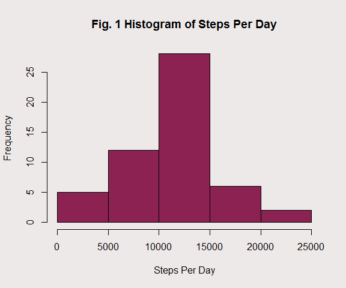
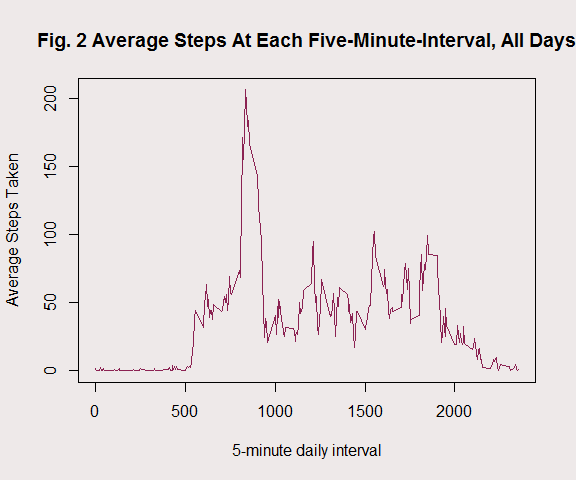

<center> <h2>Reproducible Research - Project 1</h2> </center>
<center> By [James Lamb](http://www.linkedin.com/in/jameslamb1/)</center>
<center>-----------------------------------------------------------------------------------------------------------------------------------------------------</center>

###I. Introduction

This is a brief project prepared in partial fulfillment of the requirements for the [Reproducible Research](https://class.coursera.org/repdata-010) course offered by Johns Hopkins University via Coursera, as part of the JHU Data Science Specialization. 

In this project, we were asked to pull in some health data from a personal activity monitoring device, perform some exploratory analysis, and collect our findings in a literate statistical program written in RStudio and compiled in knitr.

###II. The Data

The data were provided by [the instructor](https://twitter.com/rdpeng), and can be downloaded [here](http://d396qusza40orc.cloudfront.net/repdata%2Fdata%2Factivity.zip). The included variables are as follows:

- **steps**: Number of steps taken in a 5-minute interval
- **date**: The date on which the measurement was takend in YYYY-MM-DD format
- **interval**: Identifier for the 5-minute interval in which measurement was taken

There are a total of 17,568 observations in the dataset. All missing data were coded as "NA" in the original dataset.

###III. Loading the Data

To make this analysis reproducible on other machines, I began by writing a routine in which R downloads and unzips the data (rather than reading it in from a local directory). After reading in the data, the raw dataset is immediately written back into the working directory in a file called "activity.csv". To improve speed, in future runs of the program, R will first check in the working directory to find "activity.csv" and read directly from it.

Please note that my code uses Windows relative path references. I do not know enough computer science to make these relative paths OS-agnostic. If you (the reader/reviewer) do know how to do this, please click my name under the title and send me a message with a resource that explains it. I'm always willing to learn more!


```r
###---Loading and Preprocessing the Data---###

## If no directory for the project exists in current directory AND we aren't already in it, create a new directory called "REPROD_PROJECT1" and set the working directory there
if ("REPROD_PROJECT1"%in%list.files()==FALSE & grepl("REPROD_PROJECT1", getwd())==FALSE) {
    dir.create("REPROD_PROJECT1")
    setwd(".\\REPROD_PROJECT1")
}

## if the file exists in the directory, read it in directly. Otherwise, download it, unzip it, read it in, and write it to the directory

if (file.exists(".\\activity.csv")) {
    data <- read.csv(".\\activity.csv", 
                     header=TRUE,
                     stringsAsFactors=FALSE, 
                     colClasses = c("steps"="numeric", "date"="Date", "interval" = "factor"))
} else {
    data_url <- "http://d396qusza40orc.cloudfront.net/repdata%2Fdata%2Factivity.zip"
    temp <- tempfile()
    download.file(data_url, temp)
    data <- read.csv(unz(temp, "activity.csv"), 
                     header=TRUE, stringsAsFactors=FALSE, 
                     colClasses = c("steps"="numeric", "date"="Date", "interval" = "factor"))
    unlink(temp)
    write.csv(data, file=".\\activity.csv")
}
```

###IV. Total Daily Steps

With the data downloaded, it was time to start analyzing it. To begin, I wanted to get a sense of the distribution of activity patterns. The code block below expresses some features of the distribution of total steps taken each day. It plots a histogram (Figure 1) and reports the mean and median daily steps taken.

Note that at this point, missing values were simply ignored by the calculations (i.e. no imputation was done). 


```r
###---Analysis of Daily Step Counts---###

## create a new data frame with steps aggregated by day
daytotal_df <- aggregate(steps ~ date, data=data, na.rm=FALSE,sum)

## plot a histogram of the total number of steps taken each day
par(bg = "snow2")
hist1 <- hist(daytotal_df$steps, 
              main = "Fig. 1 Histogram of Steps Per Day", 
              xlab = "Steps Per Day",
              col = "violetred4")
```



```r
## calculate the mean and median, round them for cleaner reporting
mean1 <- round(mean(daytotal_df$steps), digits=0)        
    mean_text <- as.character(mean1)                  ## character, for human-readable
median1 <- round(median(daytotal_df$steps), digits=0)   
    median_text <- as.character(median1)                 ## character, for human-readable
```

In this sample, total daily steps averaged 10766, with a median of 10765. 

### V. What is the Average Daily Activity Pattern?

Next, I took a look at the intraday patterns in walking activity. The code below generates a time-series plot (Figure 2) of average steps taken at each 5-minute interval, averaged across all days in the sample. 

As was fairly noted [on the course forums](https://class.coursera.org/repdata-010/forum/thread?thread_id=11), the notion of "time" on the x-axis is not technically correct. The data are coded as {8:00a = 800, 12:45p = 1245, 11:55p = 2355, etc.}. This means that we are dealing with a non-continuous, non-evenly-spaced measure of time on the x axis. In other words, gaps between realizations may distort the apparent time series properties of the data.

In this project, I neglected to make special allowances for this technical note. I felt justified in leaving the time scale as-is for the following reasons:

1. It was not obvious that professor Peng made such adjustments (compare [the example panel plot](https://github.com/JayLamb20/RepData_PeerAssessment1/blob/master/instructions_fig/sample_panelplot.png) with my Figure 4 below)
2. The goal here was to determine a maximum point, not any time-series characteristics like autocorrelation. The visual representation of the maximum was not affected by the scale distortion.


```r
###---Figuring Out Interday Averages at Each Interval---###

## convert interval (currently factor) into numeric (for correct sorting)
data$intnum <- as.numeric(as.character(data$interval))

## create a new dataframe, taking averages by interval
mintotal_df <- aggregate(steps ~ intnum, data=data, mean)

## set plotbackground color to light white/gray
par(bg = "snow2")

## create a time series plot of average steps taken
plot(mintotal_df$intnum, 
     mintotal_df$steps,
     type = "l",
     main = "Fig. 2 Average Steps At Each Five-Minute-Interval, All Days",
     xlab = "5-minute daily interval",
     ylab = "Average Steps Taken",
     col = "violetred4")
```



```r
## calculate maximum average steps taken
max1 <- max(mintotal_df$steps)
    max1_text <- round(max1, 0)
max1_int <- mintotal_df[mintotal_df$steps==max1,1] #interval with highest average steps

## convert interval into human readable time (e.g. 800 = "8:00 a.m.")
if(nchar(as.character(max1_int))==1) {
    max1_int_text <- paste("12:0", as.character(max1_int), " a.m.", sep="")
} 
if(nchar(as.character(max1_int))==2) {
    max1_int_text <- paste("12:", as.character(max1_int), " a.m.", sep="")
} 
if(nchar(as.character(max1_int))==3) {
    max1_int_text <- paste(substr(as.character(max1_int),1,1)
                           , ":",substr(as.character(max1_int),2,3), 
                           " a.m.", sep="")
} 
if(nchar(as.character(max1_int))==4 & max1_int <= 1155) {
    max1_int_text <- paste(substr(as.character(max1_int),1,2)
                           , ":",substr(as.character(max1_int),3,4), 
                           " a.m.", sep="")
}
if(nchar(as.character(max1_int))==4 & max1_int >= 1200) {
    max1_int_text <- paste(substr(as.character(max1_int),1,2)
                           , ":", substr(as.character(max1_int),3,4), 
                           "p.m", sep="")
}
```

For this sample, it appears that average daily steps taken was highest in the five-minute interval beginning at 8:35 a.m.. On average, subjects took 206 steps during this interval.

###VI. Imputing Missing Values

Next, I took a look at the severity of the missing-value problem in this dataset. The code below calculates the total number of records with missing values and the proportion of the sample they represent.


```r
###---Severity of the Missing-Value Problem---###

#calculate the total number of missing values
totrec_text <- as.character(nrow(data))

#count the number of NAs and the % of observations they represent
nacount <- nrow(data[is.na(data$steps),])
    na_count_text <- as.character(nacount) #pretty for the text
naprop <- round(100*(nacount/nrow(data)),2)
    naprop_text <- paste(as.character(naprop), "%", sep="") #pretty for the text
```

The data studied here are far from perfect. Of the 17568 lines of data in the dataset, 2304 (13.11%) are missing values. 

In an attempt to address this issue, I used mean imputation to replace the missing values. This introduces [well-known biases](http://www.stat.columbia.edu/~gelman/arm/missing.pdf), but none that I expected to influence the very basic analysis undertaken in this project.The specific mean chosen was the interday average steps taken at each interval.


```r
###---Replacing the NAs---###

## create a new dataset with NAs filled in
dimp <- data

## fill in NAs with across-day, within-interval mean
dimp[is.na(dimp$steps),]$steps <- mintotal_df[mintotal_df$intnum==dimp[is.na(dimp$steps),]$intnum,2]


## create a new data frame with steps aggregated by day
dimptot <- aggregate(steps ~ date, data=dimp, sum)

## plot a histogram of the total number of steps taken each day
par(bg = "snow2")

## plot the histograms next to each other
par(mfrow = c(1,2), mar=c(5,5,5,2), cex.main=0.7)
hist1 <- hist(daytotal_df$steps, 
              main = "Fig. 1 Histogram of Steps Per Day", 
              xlab = "Steps Per Day",
              col = "violetred4")
hist2 <- hist(dimptot$steps, 
              main = "Fig. 3 Histogram of Steps Per Day \n(NAs Replaced with Mean Imputation)",
              xlab = "Steps Per Day",
              col = "violetred4")
```


```r
## calculate the mean and median, round them for cleaner reporting
mean2 <- round(mean(dimptot$steps), digits=0)
    mean2_text <- as.character(mean2)
median2 <- round(median(dimptot$steps), digits=0)
    median2_text <- as.character(median2)
```

Figure 3 above shows the distribution of interday mean step counts at each 5-minute interval. Figure 1 is reprinted here to the left of Figure 3. At first glance, the distributions do not appear to be substantially different.

Unsurprisingly, this distribution is nearly identical (in central tendency) to the one calculated with missing values dropped. In the new dataset, with NAs replaced using mean imputation, the mean is 10766 and the median is 10766. 

I chose mean imputation precisely for this reason (the preservation of central tendency). There was one additional concern that needed to be addressed, though. *What is the impact of imputing missing data on the estimates of the total daily number of steps?*

This "impact" would be felt more acutely in a regression setting, but in this exploratory phase I felt that looking at some descriptive statistics might be an informative exercise. The code chunk below gives tables of basic descriptive statistics for the two distributions of step sums.


```r
###---Closer Look at the Two Distributions---###

## load the pastecs package, get descriptive stats for both distributinons
library(pastecs)
stat_table <- stat.desc(daytotal_df$steps)
stat_table <- as.data.frame(cbind(stat_table, stat.desc(dimptot$steps)))
names(stat_table) <- c("original", "W_Imputation")
                    
## print table of Descriptive Stats (steps)
stat_table 
```

```
##               original W_Imputation
## nbr.val      5.300e+01    5.400e+01
## nbr.null     0.000e+00    0.000e+00
## nbr.na       0.000e+00    0.000e+00
## min          4.100e+01    4.100e+01
## max          2.119e+04    2.119e+04
## range        2.115e+04    2.115e+04
## sum          5.706e+05    5.814e+05
## median       1.076e+04    1.077e+04
## mean         1.077e+04    1.077e+04
## SE.mean      5.864e+02    5.755e+02
## CI.mean.0.95 1.177e+03    1.154e+03
## var          1.823e+07    1.788e+07
## std.dev      4.269e+03    4.229e+03
## coef.var     3.965e-01    3.928e-01
```

A few small differences can be seen in the descriptive statistics tables. The sum of steps for the sample with imputation is slightly higher than in the sample with missing values omitted. As could have been expected, the variance and standard deviation of the second distribution was a bit tighter. This is a natural result of adding a bunch of values near the center of the distribution. 

At first glance, the differences between the two distributions do appear not substantial. However, we must be cautious. Using mean imputation artificially tightens the variance of the distribution, which would pull measure of correlation (like regression coefficients) between steps and some other variable toward zero.

###VII. Are There Differences in Activity Patterns Between Weekdays and Weekends?

Finally, I took a quick look at activity differences between weekdays and weekends. The code below uses the ```weekdays()``` function to create a factor, splitting the sample into weekdays vs. weekends. 

Figure 4 below shows the difference in intraday activity between weekend days and weekdays.  


```r
#Weekday vs. Weekend distinction
data$day <- "Weekday"
data[substr(weekdays(data$date),1,1)=="S",]$day <- "Weekend"
data$day <- as.factor(data$day)


#new dataset with averages across interval/day distinciton
data$weekfac <- paste0(as.character(data$day), as.character(data$intnum))
weekdif <- aggregate(steps ~ weekfac+day+intnum, data=data, mean)

#Panel Plot

#make a new data frame with within-interval averages
library(lattice)
xyplot(steps ~ intnum | day, 
       data=weekdif, 
       type="l",
       main = "Fig. 4 Average Steps by 5-Minute Interval \nWeekdays vs. Weekends",
       xlab = "Time of Day (5-min Interval)",
       ylab = "Average Steps Taken",
       layout = c(1,2)
       )
```


```r
#Let's look at a simple linear correlation
corr1 <- cor(weekdif[weekdif$day=="Weekday","steps"], weekdif[weekdif$day=="Weekend","steps"])
```

Just eyeballing the graph above, it appears that weekend exercise intensity is more evenly spread throughout the day while the weekdays are characterized by a high level of activity in the 8:00a-9:45a block.

###VIII. Concluding Remarks

Thank you for taking the time to read through this brief report. The analyses undertaken were really just a vehicle for the assignment, with no particular research goal in mind, so I have no summarizing thoughts to give here.

If you have questions or concerns when grading my paper, I encourage you to contact me on [LinkedIN](http://www.linkedin.com/in/jameslamb1/)

###References

In this type of project, novice users like me inevitably end up scouring Inside-R, Stack, CRAN, r-bloggers, and elsewhere in search of helpful hints and solutions to error messages. The links below are presented to give credit where credit is due. I hope that you find them as useful as I did.

[1] http://stackoverflow.com/questions/3053833/using-r-to-download-zipped-data-file-extract-and-import-data 

[2] http://www.r-bloggers.com/using-colclasses-to-load-data-more-quickly-in-r/ 

[3] http://stackoverflow.com/questions/21607464/what-is-the-equivalent-of-the-sumif-function-in-r 

[4] http://www.statmethods.net/advgraphs/parameters.html

[5] http://www.stat.columbia.edu/~tzheng/files/Rcolor.pdf

[6] http://stackoverflow.com/questions/19890633/r-produces-unsupported-url-scheme-error-when-getting-data-from-https-sites

[7] http://r.789695.n4.nabble.com/Invalid-plot-type-1-td2318088.html

[8] http://stackoverflow.com/questions/6774339/r-how-do-i-put-two-box-plots-next-to-each-other-keeping-same-y-range-for-both

[9] http://seananderson.ca/courses/11-multipanel/multipanel.pdf

[10] http://yihui.name/knitr/options/#chunk_options

[11] http://rmarkdown.rstudio.com/html_document_format.html

[12] http://stackoverflow.com/questions/15978985/how-to-aggregate-some-columns-while-keeping-other-columns-in-r

[13] http://cran.r-project.org/web/packages/lattice/lattice.pdf

[14] http://cran.r-project.org/web/packages/pastecs/index.html
