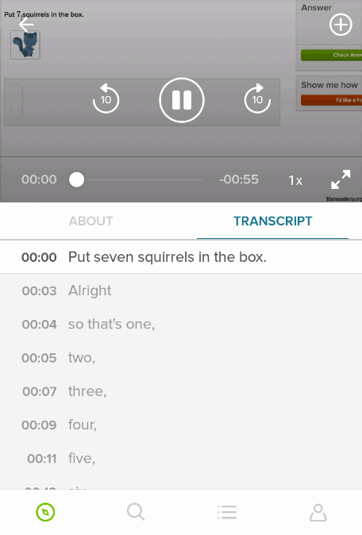

### Understand `switchMap`

This has absolutely no scientific basis, but I will contend this: Understanding `switchMap` is an essential step on the path to using RxJava effectively. Upon understanding this operator, you will find use cases for it everywhere. Furthermore, using it opens the door to using a wide variety of other helpful operators.

The Javadoc for `switchMap` says:

> Returns a new `Observable` by applying a function that you supply to each item emitted by the source `Observable` that returns an `Observable`, and then emitting the items emitted by the most recently emitted of these `Observables`.

Its marble diagram from the Javadoc is:


And its method signature is:

```java
public final <R> Observable<R> switchMap(Func1<? super T,? extends Observable<? extends R>> func)
```

Let's ignore the bounding by the `? super` and `? extends` clauses, and break this down so that it is hopefully more understandable. You have some upstream observable that is emitting values of type `T`, and you have downstream subscribers that are receiving values of type `R`.

Upon the upstream observable emitting the *first value* of type `T`, that value is passed to the provided function, which returns a value of type `Observable<R>`. When the returned `Observable<R>` emits a value of type `R`, downstream subscribers will receive it.

The interesting part is when the upstream observable emits the *next value* of type `T`. Again, this value is passed to the provided function, which returns another value of type `Observable<R>`. At this point, downstream subscribers will stop receiving events emitted by the previously created `Observable<R>`, and will start receiving events emitted by this `Observable<R>`. These downstream subscribers are unaware of this upstream change.

If you have read the [item on understanding subscriber chains](understand-observable-and-observer-chains.md), you can intuit how `switchMap` works: Whenever the function returns a new `Observable<R>`, the `Observable<R>` returned by the `switchMap` operator implicitly unsubscribes from the last `Observable<R>` returned, and then implicitly subscribes to this new `Observable<R>` returned.

To demonstrate this power, let's look at an example from the [Khan Academy Android application](https://play.google.com/store/apps/details?id=org.khanacademy.android).

#### An example: Transcript highlighting

[Khan Academy](https://www.khanacademy.org/) has over 6,500 videos on many topics in many languages. The video player is therefore an important component of the application. The video plays above a transcript. As it plays, the corresponding text of the transcript is highlighted.



The transcript is represented as a `List` of `TranscriptPart` instances, sorted by ascending `timeMillis` values:

```java
@AutoValue
public abstract class TranscriptPart {
    /** The time at which this part of the transcript starts, in milliseconds. */
    public abstract long timeMillis();

    public abstract String text();

    public static TranscriptPart create(long timeMillis, String text) {
        checkArgument(timeMillis >= 0, "Invalid timeMillis: " + timeMillis);
        return new AutoValue_TranscriptPart(timeMillis, checkNotEmpty(text));
    }
}
```

Given a time, we can easily find the `TranscriptPart` that spans that time, and highlight it on screen. The real task is to create an `Observable` that, as the video plays, emits the playback time at regular intervals.

To start, we provide an `ExoPlayer.Listener` implementation to the `ExoPlayer` instance. [ExoPlayer](http://google.github.io/ExoPlayer/) is the library from Google we use to play videos. As the `ExoPlayer` instance changes state, the `onPlayerStateChanged` method of its listener is invoked. This method converts each ExoPlayer state to a state belonging to our own `VideoPlayerState` enumeration, and emits that enumeration value on a subject named `mPlayerStateSubject`:

```java
private final ExoPlayer.Listener mExoPlayerListener = new ExoPlayer.Listener() {
    @Override
    public void onPlayerStateChanged(boolean playWhenReady, int state) {
        switch (state) {
            case ExoPlayer.STATE_BUFFERING:
                mPlayerStateSubject.onNext(VideoPlayerState.BUFFERING);
                return;
            case ExoPlayer.STATE_READY:
                mPlayerStateSubject.onNext(
                        playWhenReady ? VideoPlayerState.PLAYING : VideoPlayerState.PAUSED
                );
                return;
            // remaining states follow here ...
        }
    }
    // remaining methods follow here ...
}
```

If the `ExoPlayer` instance is playing, then the `case` statement for `STATE_READY` above emits a `VideoPlayerState` value of `PLAYING`. Other `case` statements emit other `VideoPlayerState` values that are consumed by subscribers of `mPlayerStateSubject`. 

We can now transform the `mPlayerStateSubject` into the desired `Observable` that emits the video playback time at regular intervals as it plays:

```java
public Observable<Long> getPlayingTimeMillisObservable() {
    return mPlayerStateSubject
            .map(state -> state == VideoPlayerState.PLAYING)
            .distinctUntilChanged()
            .switchMap(isPlaying -> {
                if (isPlaying) {
                    return Observable.timer(
                            0, PLAYING_VIDEO_POLLING_RATE_MS, TimeUnit.MILLISECONDS
                    );
                } else {
                    return Observable.never();
                }
            })
            // Transition from the computation scheduler of timer back to the main thread.
            .observeOn(AndroidSchedulers.mainThread())
            .map(ignored -> mExoPlayer.getCurrentPosition());
}
```

Let's step through this from top to bottom.

The combination of the `map` and `distinctUntilChanged` operators emit to the downstream `switchMap` operator a value of `true` every time playbacks starts, and a value of `false` every time playback ends.

That `switchMap` operator is where the magic happens:

* If the `isPlaying` parameter is `true`, meaning that the video is now playing, then the subscriber to `switchMap` will observe the values emitted by the `Observable` returned by the `timer` static factory method. The call above to `timer` returns an `Observable` that emits `0` after an initial delay of `0` milliseconds (the first parameter) and ever incrementing numbers every `PLAYING_VIDEO_POLLING_RATE_MS` milliseconds (the second parameter). The static constant `PLAYING_VIDEO_POLLING_RATE_MS` is defined as `300` in our application.
* If the `isPlaying` parameter is `false`, meaning that the video is no longer playing, then the subscriber to `switchMap` will observe the values emitted by the `Observable` returned by the `never` static factory method. As its name implies, that `Observable` never emits any values.

In sum, the subscriber of `switchMap` will observe the sequence of values `0`, `1`, `2`, and so on every 300 milliseconds while the video is playing, and no values while the video is not playing.

To transform this `Observable` to emit the current playback time every 300 milliseconds when the video is playing, we apply the `map` operator. We can ignore the input parameter entirely and simply return the current playback time in milliseconds by invoking method `getCurrentPosition` on the `ExoPlayer` instance. Note that the `timer` method emits its values on the `computation` `Scheduler` instance, and so we must call `observeOn(AndroidSchedulers.mainThread())` first to ensure that this happens on the main thread.

The following marble diagram illustrates the full sequence:


Finally, a parent UI component subscribes to the `Observable` returned by method `getPlayingTimeMillisObservable`. When a new time is emitted, it highlights the `TranscriptPart` that spans that time.

