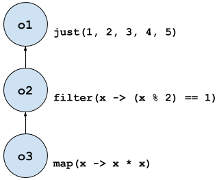
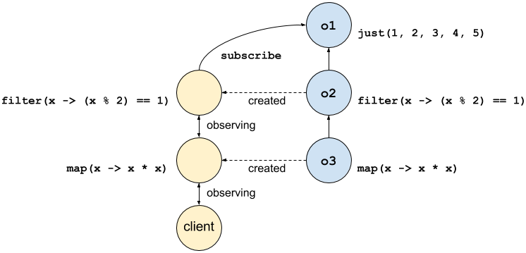

### Understand `Observable` and observer chains

Chains of `Observable` instances and observers are important. Understanding them is the key to understanding how your RxJava code executes.

To begin our understanding, let us start with the most banal of examples:

```java
Observable.just(1, 2, 3, 4, 5)
    .filter(x -> (x % 2) == 1)
    .map(x -> x * x)
    .subscribe(integer -> System.out.println("Received value: " + integer));
```

When run, this prints:

```text
Received value: 1
Received value: 9
Received value: 25
```

Now most newcomers to RxJava intuitively understand why these values are printed. They have seen `filter` and `map` in other contexts and in other languages, and so they can understand how the integer values are filtered and then transformed.

However, just as I did, they may fail to understand why code like the following does nothing:

```java
mBookmarkDatabase.addBookmark(contentItemId);
```

The `addBookmark` method returns an `Observable<Boolean>` that emits `true` if a new bookmark was added for the content item with the given identifier, or emits `false` if such a bookmark already existed. (This is similar to the `add` method of `Collection` returning `true` if the collection was changed.) But in this case, we do not care about which value is emitted, and so the returned `Observable` is not assigned to a value.

But the statement above does not write the bookmark to the database if it does not already exist. This is because the returned `Observable` is not *subscribed to*, either directly or through a chain of other `Observable` instances.

Again, to understand how RxJava code executes, you must understand this chain.

#### Creating an `Observable` chain

Factory methods like `just` and `filter` and `map` above return `Observable<T>` instances. Whereas `just` is a static factory method invoked on the `Observable` class, `filter` and `map` are instance factory methods invoked on an existing `Observable` instance. These two categories of factory methods have different state, different behavior, and a different purpose:

* Typically, an `Observable` created from a static factory has no upstream `Observable` instance. It is the root of any chain. It is constructed with some "work" to perform, which we discuss below.
* An `Observable` created from an instance factory method has an upstream `Observable` instance. This upstream `Observable` instance is the instance on which the factory method was invoked. It is an intermediate or end `Observable` of any chain. It is constructed with some logic to filter or transform emitted values, which we discuss below.

Let us rewrite our most banal of examples to include some intermediate variables for the `Observable` instances:

```java
Observable<Integer> o1 = Observable.just(1, 2, 3, 4, 5);
Observable<Integer> o2 = o1.filter(x -> (x % 2) == 1);
Observable<Integer> o3 = o2.map(x -> x * x);
```

We can diagram this as:



And now let us dissect what happens when the client invokes `subscribe` on `o3`.

#### Creating an observer chain

We often talk about subscribing to `Observable` instances, and we talk about `Observable` instances filtering or transforming values. But to increase our understanding at the risk of being completely pedantic, a client that calls `subscribe` on an `Observable` isn't really subscribing to the `Observable` instance itself. As we discuss below, calling `subscribe` on an `Observable` creates a parallel chain of observers. It is along that chain of observers that values are emitted, and then filtered or transformed.

Above, when the client invokes `subscribe` on `o3`, it registers itself as the most downstream observer on a chain of observers that will be implicitly created:


`o3` then implicitly calls `subscribe` on its upstream `Observable` instance, which is `o2`. To this `subscribe` method it passes an observer implementation that propagates all events to the observer that the client passed to the `subscribe` method of `o3`. But the observer implementation provided by `o3` also implements the behavior that `o3` was constructed with. Namely, the observer squares a value before propagating it. You can think of its `onNext` method as similar to:

```java
void onNext(T value) {
    // func is x -> x * x, provided on construction of o3
    final T transformedValue = func.call(value);
    downstreamObserver.onNext(transformedValue);
}
```

We can diagram this as:


Again, `o3` implicitly calls `subscribe` on `o2`. This repeats a similar process, where `o2` implicitly calls `subscribe` on `o1`. `o2` passes to this method an observer implementation that only propagates values that are odd, which again is the behavior that it was constructed with. You can think of the `onNext` method of this observer as similar to:

```java
void onNext(T value) {
    // func is x -> (x % 2) == 1, provided on construction of o2
    final boolean isSatisfied = func.call(value);
    if (isSatisfied) {
        downstreamObserver.onNext(value);
    }
}
```

We can diagram this as:



Again, `o2` implicitly calls `subscribe` on `o1`. But note that `o1` has no upstream `Observable` instance that it can invoke `subscribe` on. Instead, it is this call that completes the observer chain and begins the emission of events.

#### Emitting values on an observer chain

While `o3` and `o2` are configured to transform and filter values, respectively, `o1` is configured to emit values. When its `subscribe` method is invoked with an observer implementation, it emits the values that it is constructed with to that observer. More generally, the `Observable` that is the root in a chain of `Observable` instances is configured to perform some work upon its `subscribe` method being invoked. This work typically constitutes creating a side-effect that leads to the emission of zero or more values, followed by the delivery of the completion event.

Now we understand why the previous use of `addBookmark` did not actually write to the database: The side-effect of writing to the database only happens when `subscribe` is invoked on the returned `Observable`. By calling `subscribe`, this work is performed:

```java
mBookmarkDatabase.addBookmark(contentItemId)
        .subscribe(didNotExist -> { /* success */ });
```

Returning to our banal example, the "work" of `o1` is to emit all values to its observer, followed by a completion event. You can think of its `subscribe` method as executing the following:

```java
for (T element : list) {
    observer.onNext(element);
}
observer.onCompleted();
```

These events propagate down the observer chain, where the observer created by `o2` filters the values, and then the observer created by `o3` squares the values. Those values are then passed to the method passed to the `subscribe` method of `o3`, which prints them.

#### Unsubscribing

Note that in our banal example above, the `subscribe` method of `o1` immediately emitted all values to its observer and then it completed. That is, the work of the `Observable` instance happened immediately.

But other `Observable` instances might define work that takes time to complete or is scheduled for later execution, such as making a network request and emitting the response, or writing data to disk on another thread. In such cases, the time for the `Observable` to complete its work might exceed the lifetime of the client that invoked `subscribe`. In many cases, we do not want to extend the lifetime of the client so that it observes the completion of the work. Instead, we want to *unsubscribe* our observer from the chain of observers.

To do this, we retain the `Subscripton` instance returned by the `subscribe` method of `Observable`:

```java
Subscription s = o3.subscribe(integer -> System.out.println("Received value: " + integer));
```

If the client later invokes `unsunscribe` on this `Subscription` instance, then superficially the observer passed to the `subscribe` method of `o3` no longer receives any events.

To understand what happens implicitly, note that not only does each observer in the observer chain track the downstream observer that it will propagate events to, but each observer refers to the upstream observer that it will receive events from. Each implicitly created observer can unsubscribe from its upstream observer in turn:

* The client invokes `s.unsubscribe()`, which unsubscribes the client from the squaring observer implicitly created by calling `subscribe` on `o3`.
* This squaring observer then implicitly unsubscribes from the filtering observer implicitly created by calling `subscribe` on `o2`.
* This filtering observer then implicitly unsubscribes from the source `o1`.

The call to `unsubscribe` therefore destroys the chain of observers that was implicitly created by the call to `subscribe`.

#### Going forward

You should now have a mental model for how `Observable` instances form chains, and how observer chains are formed by the `Observable` instances and propagate events. Later, using this model, we will explore the difference between `subscribeOn` and `observeOn`, and discuss the difference between hot and cold observables.

