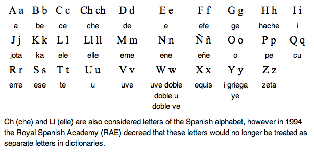

# Lecture # 2 (24-01-2017)

## 1. Spanish Alphabets

* **C**:

| "th" | "k" |
|------|-----|
| ce | ca |
| ci | co |
| | cu |

* **G**:

| "h" | "g" |
|-----|-----|
| ge | ga |
| gi | go |
| | gu |

* **R**:

| "rrr" | "rr" | "r" |
|-------|------|-----|
| raton |  | cara |
| rojo |  | caro |
| risa |  |  |
| | perro |  |

* **Q**: "k"
    * q~~u~~eso
    * q~~u~~iero

* **Z**: "th"
    * zapato
    * zoo

## 2. A Few Verbs
| Phrase | Verb (Basic Form) |
|----------|-------------------|
| Yo *soy* | *ser* |
| Yo *vivo* | *viver* |
| Yo me *llamo* | *llamarse* |

## 3. ¿En que trabajos? A qúe te dedicas?
* Yo soy profesor español.

## Notes
* El libro
* El queso
* Otra vez
* Igual
* Los deberes
* La casa
