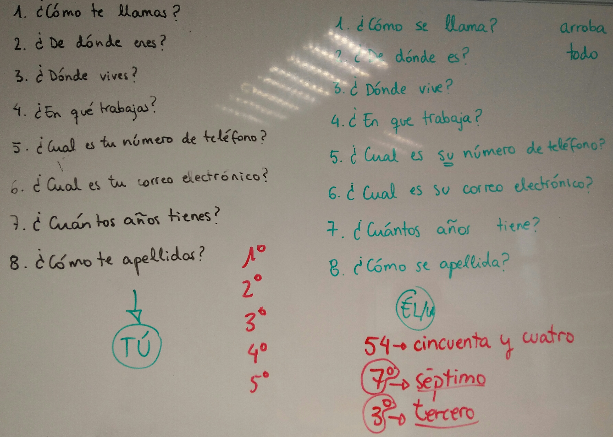

# Lecture # 3 (25-01-2017)
## 1. Las Profesiones
* (El) Deportista
* (El) Mecánico
* (La) Telefonista
* (El) Cocinero
* (El) Médico
* (El) Camarero
* (La) Agricultora
* (El) Músico

## 2. Numbers

## 3. ¿Cuantos años tienes?
Yo tengo 34 años.

## 4. ¿Como ye apellidas (apellidarse)?
* Yo me apellido Sheikh.
* Tu te apellidas ...

## 5. ¿Cual es tu numero de teléfono?

## 6. ¿Cual es tu correo electronico?

## 7. Summary

## Notes
* Arroba: At
* Todo: All
