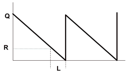
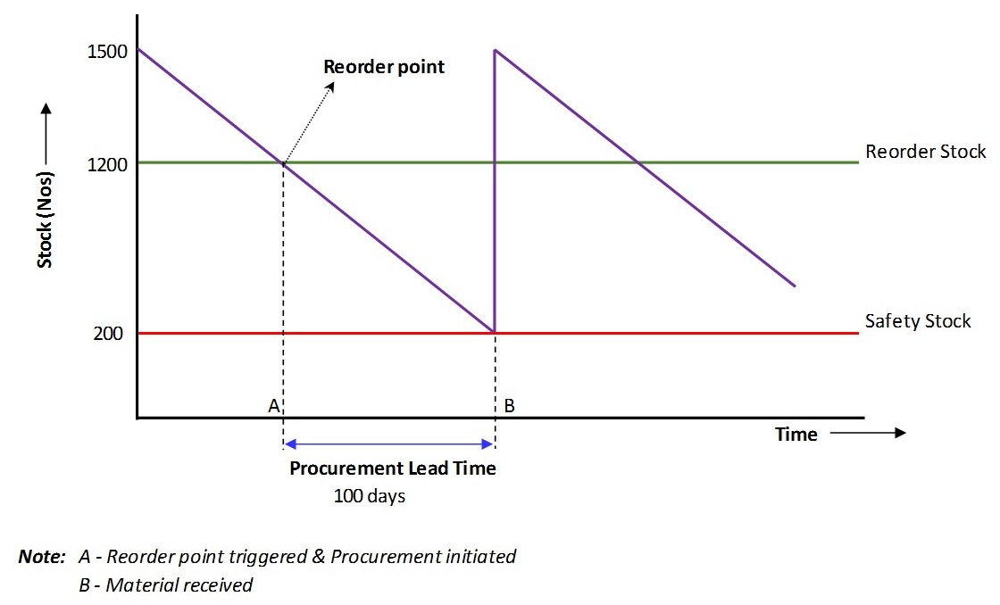

```{r load-pkgs, include = FALSE}
suppressMessages(library('plyr'))
pkgs <- c('dplyr', 'magrittr', 'knitr', 'readxl', 'googleVis', 'DT', 'rCharts', 'formattable')
suppressMessages(l_ply(pkgs, library, character.only = TRUE))
rm(pkgs)

## Set the googleVis options first to change the behaviour of plot.gvis, so that only the chart 
##  component of the HTML file is written into the output file.
op <- options(gvis.plot.tag = 'chart')
```

# 1. Introduction

## 1.1 Instructions

**Instructions**

  The purpose of this assignment is to give you the opportunity to apply the concepts you have learned in this module and to discuss some of the key ideas of the module in your own words. Follow the instructions provided and respond to each question. This a required activity for this module.

  Submit your answers to each of the questions based on the information provided below. Enter your answers directly in the spaces provided in the My submission tab. You may save a draft of your work as you go, and you can come back later to continue working on your draft. When you are finished working, click the Preview button, verify your identity, and then click Submit for review to submit the assignment. Please answer each question fully and concisely.

The discussion of the assignment solution is provided in the Module 4 Assignment Solution video. Do the assignment on your own first, before viewing the assignment discussion video!

For this assignment you will need the data in these spreadsheets:

- [Module4_Assignment_Table1.xlsx](https://d396qusza40orc.cloudfront.net/operationsmanagement/spreadsheets/Module4_Assignment_Table1.xlsx)
- [Module4_Assignment_RawData.xlsx](https://d396qusza40orc.cloudfront.net/operationsmanagement/spreadsheets/Module4_Assignment_RawData.xlsx)
- [Module4_Assignment_Table2.xlsx](https://d396qusza40orc.cloudfront.net/operationsmanagement/spreadsheets/Module4_Assignment_Table2.xlsx)

```{r data, echo = FALSE, results = 'asis'}
#'@ dat <- read_excel(path = './5 Operations Management/data/Module3_Assignment_Data.xlsx') %>% tbl_df
dat <- read_excel(path = './data/Module3_Assignment_Data.xlsx') %>% tbl_df %>% mutate(Sess = rep(1:4, each = 13), Insurance = 0.01) #, Stock.In = 200, Stock.YBL = `Year Before Last` - Stock.In, Stock.LY = `Last Year` - Stock.In, Cost = Stock.In + Insurance)
dat %>% datatable(
  caption = "Table 1.2.1 : Weekly Sales Report", 
  escape = FALSE, filter = "top", rownames = FALSE, 
  extensions = list("ColReorder" = NULL, #'@ "RowReorder" = NULL, "Buttons" = NULL, 
                    "Responsive" = NULL, "FixedColumns" = list(leftColumns = 1)), 
  options = list(dom = 'BRrltpi', autoWidth = TRUE, 
                 lengthMenu = list(c(10, 50, 100, -1), c('10', '50', '100', 'All')), 
                 ColReorder = TRUE, rowReorder = TRUE, 
                 buttons = list('copy', 'print', 
                                list(extend = 'collection', 
                                     buttons = c('csv', 'excel', 'pdf'), 
                                     text = 'Download'), I('colvis'))))
```

*Table 1.2.1 : Weekly sales table of Bintu Fehrenbacher's kiosks.*

```{r plot, echo = FALSE, results = 'asis'}
#'@ mPlot(x = 'Week', y = c('Year Before Last', 'Last Year'), type = 'Line', data = dat)

linechart <- gvisLineChart(dat, 'Week', c('Year Before Last', 'Last Year'), 
                       options = list(
                         title = "Hello World", 
                         titleTextStyle = "{color:'red', fontName:'Courier', fontSize:16}", 
                         backgroundColor = "#D3D3D3", 
                         vAxis="{gridlines:{color:'red', count:3}}", 
                         hAxis="{title:'Week', titleTextStyle:{color:'blue'}}", 
                         series="[{color:'green', targetAxisIndex: 0}, 
                                  {color: 'orange',targetAxisIndex:1}]", 
                         vAxes="[{title:'Year Before Last'}, {title:'Last Year'}]", 
                         legend="bottom", curveType = "function", gvis.editor = "Edit me!"
                         ))
plot(linechart)
```

*Graph 1.2.1 : Weekly sales graph of Bintu Fehrenbacher's kiosks.*

# 2. Operational Concepts

## Part 1

  Based on Bintu’s ordering policy, what is her total annual cost associated with inventory?

```{r annum-inv1, echo = FALSE}
dat %>% colSums %>% t %>% data.frame %>% mutate(Week = 52, Sess = 'All') %>% kable(caption = 'Annual Total Summary')
```

*Table 2.1.1 : Annual Summary*

  Below is a table which breakdown the seasonal orders which are 13 weeks once.

```{r annum-inv2, echo = FALSE}
ddply(dat, .(Sess), summarise, Sales.YBL = sum(`Year Before Last`), Sales.LY = sum(`Last Year`), Insurance = sum(Insurance)) %>% tbl_df %>% mutate(Stock.In = 2600, Stock.Bal.YBL = cumsum(Stock.In - Sales.YBL), Stock.Bal.LY = cumsum((Stock.In + c(Stock.Bal.YBL[4], 0, 0, 0)) - Sales.LY)) %>% 
  formattable(list(
    Sales.YBL = formatter('span', 
                          style = x ~ style(color = ifelse(rank(-x) <= 1, 'darkgoldenrod', 'silver')), 
                          x ~ sprintf('%d (rank: %02d)', x, rank(-x))), 
    Sales.LY = formatter('span', 
                         style = x ~ style(color = ifelse(rank(-x) <= 1, 'darkgoldenrod', 'silver')), 
                         x ~ sprintf('%d (rank: %02d)', x, rank(-x))),
    Stock.Bal.YBL = formatter('span', 
                              style = x ~ style(color = ifelse(x >= 0, 'green', 'red')), 
                              x ~ icontext(ifelse(x >= 0, 'ok', 'remove'), ifelse(x >= 0, x, x))), 
    Stock.Bal.LY = formatter('span', 
                              style = x ~ style(color = ifelse(x >= 0, 'green', 'red')), 
                              x ~ icontext(ifelse(x >= 0, 'ok', 'remove'), ifelse(x >= 0, x, x)))
    )) %>% as.htmlwidget
```

*Table 2.1.2 : Sessonal Summary*

$$total\ annual\ cost = orderding\ cost + inventory\ holding\ cost + insurance\ cost$$


  - Q = 2600 Units per season/order/lot.
  - H = The everage cost of a smartphone is $50, additional 11% and weekly $0.01 insure cost. Therefore the **holding cost per unit** is `r paste0('$', 50 * 0.11 + 0.01 * 52)`.
  - D = 10400 units where 52 Weeks ÷ 13 Weeks = 4 seasons/orders/lots per year.
  - S = \$200 cost per season/lot/order, then **annual ordering cost** will be `r paste0('$', 200 * 4)`.
  - Weekly insurance is 0.01, then **annual insurance** will be `r paste0('$', 0.01 * 52)`.

$$C = \frac{2,600 units}{2}(\$50 \times 11\% + \$0.01 \times 52 weeks) + \frac{10,400 units}{2,600 units}(\$200)$$

  Therefore annual cost (exclude other cost which has not given in the question) will be **`r paste0('$', (50 * 0.11 + 0.01 * 52) * 2600 / 2 + 10400 / 2600 * 200)`**. You can using calculator for inventory cost via [Total Inventory Cost](http://www.ultimatecalculators.com/total_inventory_cost_calculator.html).

## Part 2

  Compute the EOQ.
  
**What is an 'Economic Order Quantity - EOQ'?**

  An economic order quantity (EOQ) is an inventory-related equation that determines the optimum order quantity that a company should hold in its inventory given a set cost of production, demand rate and other variables. This is done to minimize variable inventory costs. The full equation is as follows:

**Economic Order Quantity (EOQ)**

$$EOQ = \sqrt{\frac{2SD}{PI}}$$

  where :

  - S = Setup costs
  - D = Demand rate
  - P = Production cost
  - I = Interest rate (considered an opportunity cost, so the risk-free rate can be used)

*Equation 2.2.1 : Economic Order Quantity (EOQ)*

  Read more: [Economic Order Quantity (EOQ) Definition | Investopedia](http://www.investopedia.com/terms/e/economicorderquantity.asp#ixzz4B5eToKHY)
  
  You can also read [ECONOMIC ORDER QUANTITY (EOQ) MODEL: Inventory Management Models : A Tutorial](https://scm.ncsu.edu/scm-articles/article/economic-order-quantity-eoq-model-inventory-management-models-a-tutorial) with example to know that cost of product is not in count.


  - A = Demand for the year
  - Cp = Cost to place a single order
  - Ch = Cost to hold one unit inventory for a year

  Now we try to given the value for every single parameter/variable.

  - Cost of holding a unit is `r paste0('$', 50 * 0.11 + 0.01 * 52)`.
  - S = $200
  - D = 10400 annual sales
  - P = 50 x 11% = $5.5
  - I = $0.01 x 52 weeks = $0.52

  The optimal order quantity is **EOQ = `r sqrt((2 * 200 * 10400)/(5.5 + 0.52))`** units.

## Part 3

  What is her total annual cost associated with inventory using EOQ?

**Total Relevant Cost (TRC)**

$$Total\ Relevant\ Cost\ (TRC) = Yearly\ Holding\ Cost + Yearly\ Ordering\ Cost$$




  - A = Demand for the year
  - Cp = Cost to place a single order
  - Ch = Cost to hold one unit inventory for a year
  - Q = Quantity/size per order

** *Relevant* because they are affected by the order quantity Q

  - **Yearly holding cost** = `r paste0('$', 50 * 0.11 + 0.01 * 52)` x `r floor(sqrt((2 * 200 * 10400)/(5.5 + 0.52)))` units ÷ 2 = `r paste0('$', (50 * 0.11 + 0.01 * 52) * floor(sqrt((2 * 200 * 10400)/(5.5 + 0.52))) / 2)`.
  - **Yearly ordering cost** = 10400 units ÷ `r floor(sqrt((2 * 200 * 10400)/(5.5 + 0.52)))` units x $200 = `r paste0('$', round(10400 / sqrt((2 * 200 * 10400)/(5.5 + 0.01 * 52)) * 200, 2))`.
  
  **Total Relevant Cost (TRC) = `r paste0('$', ((50 * 0.11 + 0.01 * 52) * floor(sqrt((2 * 200 * 10400)/(5.5 + 0.52))) / 2) + (round(10400 / sqrt((2 * 200 * 10400)/(5.5 + 0.01 * 52)) * 200, 2)))`**
  
  Where you can refer to [Economic Order Quantity Models](http://www.prenhall.com/divisions/bp/app/russellcd/PROTECT/CHAPTERS/CHAP12/HEAD03.HTM) for more details.

## Part 4

  If there is a lead time of two weeks for smartphones, and given that the standard deviation of demand is 29, what would be the reorder point for a cycle service level of 90% (safety stock service factor = 1.28) using the continuous review inventory management system?




 - Average weekly demand = 2600 units ÷ 13 weeks = `r 2600 / 13` units.
 - Lead time = 2 weeks
 - Standard deviation of demand = 29
 - Standard deviation to service level probability = 1.28
 
 **R = `r (2600 / 13 * 2) + (29 * 1.28 * sqrt(2))`** units.

## Part 5

  State the decision rules for Bintu if she now follows a continuous review inventory policy based on your computations.

  Bintu should reorder (EOQ) **`r floor(sqrt((2 * 200 * 10400)/(5.5 + 0.52)))`** units when the stocks balance reach (ROP) **`r floor((2600 / 13 * 2) + (29 * 1.28 * sqrt(2)))`** units.

```{r, echo = FALSE, results = 'asis'}
## Set options back to original options
options(op)
```

# 3. Conclusion

  Base from the dataset which we initially don't know the stocks balance, however we measure the optimal reorder point as well as the reorder size for Bintu.

<iframe width="560" height="315" src="https://www.youtube.com/embed/15WBkXwjWME" frameborder="0" allowfullscreen></iframe>
  
# 4. Appendices

  - Section [4.1 Documenting File Creation]
  - Section [4.2 Versions' Log]
  - Section [4.3 Speech and Blooper]
  - Section [4.4 References]

## 4.1 Documenting File Creation

  It's useful to record some information about how your file was created.
  
  - File creation date: 2016-06-08
  - File latest updated date: `r Sys.Date()`
  - `r R.version.string`
  - R version (short form): `r getRversion()`
  - [**rmarkdown** package]() version: `r packageVersion('rmarkdown')`
  - [**tufte** package](https://github.com/rstudio/tufte) version: `r packageVersion('tufte')`
  - File version: 1.0.0
  - Author Profile: [®γσ, Eng Lian Hu](https://beta.rstudioconnect.com/englianhu/ryo-eng/)
  - GitHub: [Source Code](https://github.com/englianhu/Coursera-Improving-Business-Finances-and-Operations/tree/master/5%20Operations%20Management)
  - Additional session information:

```{r info, echo = FALSE, results = 'asis'}
lubridate::now()
devtools::session_info()$platform
Sys.info()
```

## 4.2 Versions' Log

  - *June 11, 2016*: [version: 1.0.0](https://github.com/englianhu/Coursera-Improving-Business-Finances-and-Operations/blob/master/5%20Operations%20Management/Module-03-Assignment.Rmd)

## 4.3 Speech and Blooper

  Same as pevious assignment --- [Operations Management : Module 1 Assignment 1](http://rpubs.com/englianhu/operational-management-module1-assignment1), I do appreciate that [University of Illinois at Urbana–Champaign](http://illinois.edu/) provides the management course via [Coursera](http://www.coursera.org).
  
  I initially don't know how to calculate the reorder point and reorder size from the video solution. However I had searched and read the relevant articles to know the concepts and the formulas. I am a newbie in marketing, cost measurement and inventory management as well as whole operating chain. Keep up learning and hope to learn some management skills and knowledges from **Operations Management**.
  
  - `mPlot(x = 'Week', y = c('Year Before Last', 'Last Year'), type = 'Line', data = dat)` facing connection error to read the data with RMarkdown but working fine if run via chunk.
  - `googleVis::gvisLineChart()` only shows **Edit me!** but no graph.


## 4.4 References

  - [ECONOMIC ORDER QUANTITY (EOQ) MODEL: Inventory Management Models : A Tutorial](https://scm.ncsu.edu/scm-articles/article/economic-order-quantity-eoq-model-inventory-management-models-a-tutorial)
  - [Economic Order Quantity Models](http://www.prenhall.com/divisions/bp/app/russellcd/PROTECT/CHAPTERS/CHAP12/HEAD03.HTM) for more details

