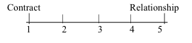
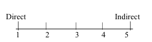
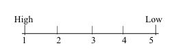
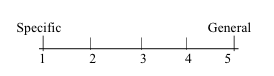
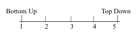
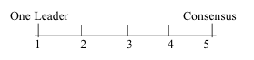

## 1. Introduction and Overview

*We all negotiate on a daily basis*. On a personal level, we negotiate with friends, family, landlords, car sellers and employers, among others. Negotiation is also the key to business success. No business can survive without profitable contracts. Within a company, negotiation skills can lead to your career advancement. Through this course, you’ll learn the strategies and skills that can lead to successful negotiations in your personal life and in business transactions.

### 1.1 How to Succeed in This Course

In this course, you’ll learn about and practice the four steps to a successful negotiation, with one module for each step:

- *Prepare*: Plan Your Negotiation Strategy
- *Negotiate*: Use Key Tactics for Success
- *Close*: Create a Contract
- *Perform and Evaluate*: The End Game

### 1.2 Suggested Readings

The suggested readings for the course are from the book *Negotiating for Success*. This book is available at Amazon and is priced so that it is affordable for everyone. I donate my royalties from book sales to the University of Michigan.

The book reinforces the videos and includes additional material for your use in personal and business negotiations. Chapters include short “Key Takeaways” that provide practical advice. Discussions of the law in the videos and in the book are not intended and should not be construed as legal advice.

You can purchase the English version of the book at the following places, in the formats noted, using the links included here:

· [Amazon (Paperback)](https://www.amazon.com/Negotiating-Success-Essential-Strategies-Skills/dp/0990367193/ref=sr_1_1?ie=UTF8&qid=1484615971&sr=8-1&keywords=negotiating+for+success)

· [Amazon (Kindle)](https://www.amazon.com/Negotiating-Success-Essential-Strategies-Skills-ebook/dp/B00OE85SDS/ref=tmm_kin_swatch_0?_encoding=UTF8&qid=1484615971&sr=8-1)

· [Google Play (EPUB)](https://play.google.com/store/books/details/George_Siedel_Negotiating_for_Success_Essential_St?id=fblDBQAAQBAJ)

· [Google Play (PDF)](https://play.google.com/store/books/details/George_Siedel_Negotiating_for_Success_Essential_St?id=lrVDBQAAQBAJ)

· [Smashwords (MOBI & EPUB)](https://www.smashwords.com/books/view/483669)

· Other places where the EPUB is available include: Apple, Barnes & Noble, Kobo, Inktera, Baker & Taylor, Txtr, OverDrive, Scribd, Gardners, Yuzu, Tolino, and Odilo.

If you want a Kindle version of the book but don't own a Kindle e-reader, you can download a free Kindle e-reading program or app.

You can purchase translated versions of the book at the following places, in the formats noted, using the links included here:

**Chinese Translation**

· [Amazon (Paperback)](https://www.amazon.com/Negotiating-Success-Essential-Strategies-Chinese/dp/0997056622/ref=sr_1_3?ie=UTF8&qid=1485040406&sr=8-3&keywords=negotiating+for+success+chinese)

· [Amazon (Kindle)](https://www.amazon.com/x8C08-x5411-x6210-x529F-x5FC5-ebook/dp/B01FN4H65E/ref=tmm_kin_swatch_0?_encoding=UTF8&qid=1485040406&sr=8-3)

· [Google Play (PDF)](https://play.google.com/store/books/details?id=M6QoDAAAQBAJ)

****

**French translation**

· [Amazon (Paperback)](https://www.amazon.com/N%C3%A9gocier-cl%C3%A9-succ%C3%A8s-comp%C3%A9tences-essentielles/dp/0990367177/ref=sr_1_1?ie=UTF8&qid=1485040676&sr=8-1&keywords=N%C3%A9gocier%2C+la+cl%C3%A9+du+succ%C3%A8s)

· [Amazon (Kindle)](https://www.amazon.com/N-gocier-cl-succ-s-comp-tences-essentielles-ebook/dp/B015VMHTX2/ref=tmm_kin_swatch_0?_encoding=UTF8&qid=1485040676&sr=8-1)

· [Google Play (PDF)](https://play.google.com/store/books/details?id=nfidCgAAQBAJ)

· [Smashwords (EPUB)](https://www.smashwords.com/books/view/580725)

****

**Portuguese Translation**

· [Amazon (Paperback)](https://www.amazon.com/Negocia%C3%A7%C3%A3o-Rumo-Sucesso-Estrat%C3%A9gias-Habilidades/dp/0997056665/ref=sr_1_fkmr0_4?ie=UTF8&qid=1485040553&sr=8-4-fkmr0&keywords=negotiating+for+success+portuguese)

· [Amazon (Kindle)](https://www.amazon.com/Negocia-o-Rumo-Sucesso-Estrat-gias-Habilidades-ebook/dp/B01KKSTBWO/ref=tmm_kin_swatch_0?_encoding=UTF8&qid=1485040553&sr=8-4-fkmr0)

· [Google Play (PDF)](https://play.google.com/store/books/details?id=NQXdDAAAQBAJ)

****

**Russian Translation**

· [Amazon (Paperback)](https://www.amazon.com/Negotiating-Success-Essential-Strategies-Russian/dp/0997056649/ref=sr_1_1?ie=UTF8&qid=1485040739&sr=8-1&keywords=negotiating+for+success+russian)

· [Amazon (Kindle)](https://www.amazon.com/x423-x441-x43F-x435-x448-ebook/dp/B01H98SOJO/ref=tmm_kin_swatch_0?_encoding=UTF8&qid=1485040739&sr=8-1)

· [Google Play (PDF)](https://play.google.com/store/books/details?id=7t1sDAAAQBAJ)

**Spanish Translation**

· [Amazon (Paperback)](https://www.amazon.com/Negociar-ruta-hacia-%C3%A9xito-Estrategias/dp/0990367150/ref=sr_1_1?ie=UTF8&qid=1485040477&sr=8-1&keywords=negociar+ruta+hacia)

· [Amazon (Kindle)](https://www.amazon.com/Negociar-ruta-hacia-xito-Estrategias-ebook/dp/B00TOYK84Q/ref=tmm_kin_swatch_0?_encoding=UTF8&qid=1485040477&sr=8-1)

· [Google Play (PDF)](https://play.google.com/store/books/details?id=uv-xBgAAQBAJ)

· [Smashwords (EPUB)](https://www.smashwords.com/books/view/520142)

Mark as completed

Other books if you want: The suggested readings for this course are from [Negotiating for Success: Essential Strategies and Skills](https://www.theseus.fi/bitstream/handle/10024/42807/Mahmoodi_Kosar.pdf?sequence=1)

## 2. Prepare: Plan Your Negotiation Strategy

This module focuses on *the first step in the negotiation process—planning for a negotiation*. After completing this module, you will be able to:

- Decide if a negotiation is position-based or interest-based
- Decide if a negotiation is dispute-resolution or deal-making
- Complete a negotiation analysis, including: setting a reservation price and stretch goal, identifying alternatives to a deal, and finding the zone of potential agreement
- Use a decision tree to determine your BATNA
- Conduct cross-cultural negotiations
- Resolve ethical issues in negotiations
- Decide if you should use an agent in a negotiation

### 2.1 Assessing Your Negotiating Style

To assess your negotiation style while preparing for negotiations, complete the following three steps:

> 

- Complete the attachment to assess and understand your negotiating style.
- Use the assessment to assess the style of the other side. This is especially important in cross-cultural negotiations. Remember that there can be considerable variation in negotiation style within a culture.
- Do a gap analysis. Locate the major gaps between your style and the style of the other side. Focus on these gaps when preparing for the negotiation.

Additional tip: After completing the gap analysis, try a role reversal exercise where you use the style of the other side. This will enable you to better understand the other side’s style.

- `Assessing Your Negotiating Style`

Instructions: Listed below are ten important traits of a person’s negotiating style and approach. Each trait demonstrates a wide range of variations, which can be organized along a continuum, as has been done below. With respect to each trait, indicate with an X where your own negotiating style and approach in business negotiation falls along each continuum.

- Goal: What is your goal in business negotiations: a binding contract or the creation of a relationship?

[

- Attitudes: What is your attitude toward negotiation: win/lose or win/win?

[

- Personal Styles: During negotiations, is your personal style informal or formal?

[

- Communications: Is your communication style in negotiation direct (for instance, clear and definite proposals and answers) or indirect (for instance, vague, evasive answers)?

[

- Time Sensitivity: In the negotiation process, is your sensitivity to time high (for instance, you want to make a deal quickly) or low (you negotiate slowly)?

[

- Emotionalism: During negotiations, is your emotionalism high (that is, you have a tendency to display your emotions) or low (you hide your feelings)?

[

- Agreement Form: Do you prefer agreements that are specific (that is, detailed) or general?

[

- Agreement Building: Do you view negotiation as bottom up (reach agreement on details first) or top down (begin with agreement on general principle)?

[

- Team Organization: As a member of a negotiating team, do you prefer having one leader who has authority to make a decision or decision making by consensus?

[

- Risk Taking: Is your tendency to take risks during negotiations high (for instance, your opening offer to sell is extremely high) or low?

[

## Checklist of Ethical Standards and Guidelines

Perhaps more than any other human activity, negotiations raise challenging ethical dilemmas. Some ethical standards are required by law; others are voluntary. Select one or more of the voluntary standards or guidelines before you begin a negotiation.

For further information and examples, see Chapter 4, “Decide How to Answer Ethical Questions,” in **Negotiating for Success**:

[http://www.amazon.com/Negotiating-Success-Essential-Strategies-Skills/dp/0990367193/ref=sr_1_1?s=boo...](http://www.amazon.com/Negotiating-Success-Essential-Strategies-Skills/dp/0990367193/ref=sr_1_1?s=books&ie=UTF8&qid=1413129983&sr=1-1&keywords=george+siedel).

[http://www.smashwords.com/books/view/483669](http://www.smashwords.com/books/view/483669)

### Required by Law:

1. **No Fraud.** (Do not lie.)
2. **Uphold your fiduciary duty.** (If there is a fiduciary relationship with the other side, you owe the highest duty of trust and loyalty.)
3. **Don’t act in an unconscionable manner.** (When you are in a dominant position of power, try to reach an agreement that is fair to the other side.)

### Voluntary Ethical Standards and Guidelines:

1. **Organizational standards.** (If your employer has a Code of Conduct, does it provide standards for your negotiations?)
2. **Someone you admire.** (What would someone you admire do in your situation?)
3. **Family test.** (How would you feel when describing to your family what you did during a negotiation?)
4. **Newspaper test.** (How would you feel if a newspaper article in the local paper described what you did during a negotiation?)
5. **Golden Rule.** (Treat others as you want to be treated. Keep in mind that fairness is very important to the other side.)

### 2.3 Should I Negotiate?

### 2.4 A Position Based Negotiation and Interest Based Negotiation

- *Prepare*: Plan Your Negotiation Strategypreliminary question: should I negotiate?Is this negotiation a position-based or interest-based?resolve a dispute or make a deal?How to analyse the negotiation?cross-cultural negotiation?How to handle ethical issues?Should use an agent to negotiate for me?

[

### 2.5 A Dispute Resolution or Deal Making Negotiation

- dispute resolution
- backwark looking
- position-based
- adverserial
- deal making
- forward looking
- interest-based
- problem solving

[

### 2.6 Analysing the Negotiation

- overall goal of the negotiation;
- the most important issues in reaching this goal;
- the best alternative to the negotiation agreement;
- the reservation price for the negotiation;
- most likely price;
- the stretch goal;

 

### 2.7 Best Alternative to a Negotiated Agreement

### 2.8 Use Decision Trees to Complete Your BATNA Analysis

### 2.9 Cross-Cultural Negotiations

cultures can influence the result of the negotiations, there are many variations within a cultures, therefore, be sensitive to culture. But you don't need fully understand local culture, moderate adaptation often better than major adaptation.

### 2.10 Ethical Issues and Standards

### 2.11 Agents

## 3. Negotiate: Use Key Tactics for Success

### 3.1 Course Materials

After completing this module, you will be able to:

- Recognize your source of power in negotiations
- Use and increase your power in negotiations
- Employ psychological tools during a negotiation
- Avoid psychological traps in a negotiation
- Use psychological tools when making leadership and financial decisions

### 3.2 Getting to Know the Other Side and Using Power in Negotiations