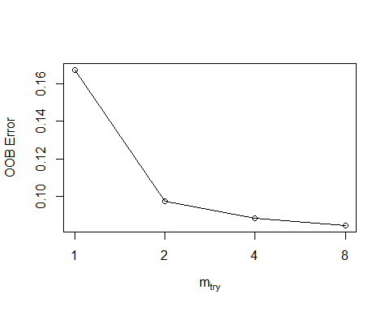
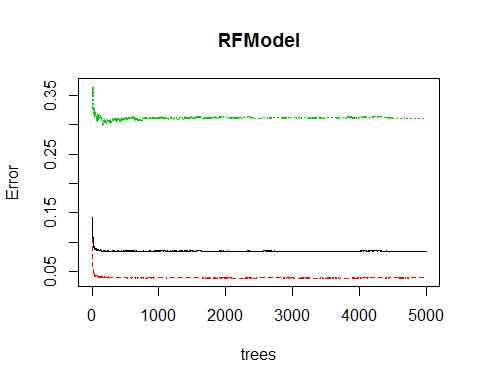
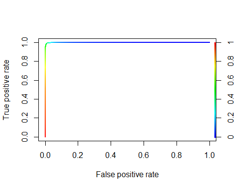

# Final Struggle
Ryan Zhang  
Monday, May 04, 2015  

#0 Environment  环境设定  
##0-1 Set working directory  设定工作环境  

```r
setwd("~/GitHub/edX/The Analytic Edge/Kaggle")
```

##0-2 Load Libraries  函数包  

```r
library(tm)
library(e1071)
library(neuralnet)
library(randomForest)
library(ROCR)
library(party)
library(rCUR)
library(topicmodels)
library(xgboost)
```

##0-3 Function Definition  自定义函数  
用于帮助求table后正类百分比的小函数    

```r
tCor <- function(t)round(t[,2]/rowSums(t),2)*100 
```

用于生成dummy encoding的数据框

```r
dummyEncoding <- function(df, colname){
  dDF <- as.data.frame(model.matrix(~df[,colname]))
  names(dDF) <- paste(colname,as.character(levels(df[,colname])),sep="")
  dDF}
```

#1 Data Preparing 数据准备工作
##1-1 Loading 装载

```r
NewsTrain <- read.csv("NYTimesBlogTrain.csv", stringsAsFactors = F)
NewsTest <- read.csv("NYTimesBlogTest.csv", stringsAsFactors = F)
```

##1-2 预处理
Store the number of training data points and the number of testing data points.        
记录一下训练数据和测试数据的数量。

```r
ntrain <- nrow(NewsTrain)
ntest <- nrow(NewsTest)
ntrain
```

```
## [1] 6532
```

```r
ntest
```

```
## [1] 1870
```

"Popular"" is the dependant variable, store it in a separate vector "Y", and delete the colomn from the dataframe "NewsTrain".      
要预测的因变量是“Popular”，将其存在一个单独的"Y"向量中,并从训练数据框中删除该列。

```r
Y <- as.factor(NewsTrain$Popular)
NewsTrain$Popular <- NULL
```

Combine "NewsTrain" and "NewsTest" into a single dataframe for the purpose of data preparing      
将训练数据和测试数据合并为一个单一的数据框，以便集中处理（这是否有问题？）    
**只要是非监督的变换应该都不算作弊**

```r
OriginalDF <- rbind(NewsTrain, NewsTest)
```

##处理缺失数据
Imputing the categorical data

```r
table(OriginalDF$NewsDesk)
```

```
## 
##          Business  Culture  Foreign Magazine    Metro National     OpEd 
##     2408     2026      909      477       34      262        4      680 
##  Science   Sports   Styles   Travel   TStyle 
##      251        2      373      147      829
```

```r
table(OriginalDF$SectionName)
```

```
## 
##                              Arts     Business Day Crosswords/Games 
##             2899              849             1437              165 
##           Health         Magazine       Multimedia    N.Y. / Region 
##              249               34              193              265 
##             Open          Opinion           Sports            Style 
##                5              783                1                2 
##       Technology           Travel             U.S.            World 
##              442              152              657              269
```

```r
table(OriginalDF$NewsDesk,OriginalDF$SectionName)
```

```
##           
##                 Arts Business Day Crosswords/Games Health Magazine
##            1626   11           18                5      1        0
##   Business    6    0         1419              160      0        0
##   Culture    71  838            0                0      0        0
##   Foreign   209    0            0                0      0        0
##   Magazine    0    0            0                0      0       34
##   Metro       0    0            0                0      0        0
##   National    2    0            0                0      0        0
##   OpEd       19    0            0                0      0        0
##   Science     4    0            0                0    247        0
##   Sports      1    0            0                0      0        0
##   Styles    132    0            0                0      1        0
##   Travel      0    0            0                0      0        0
##   TStyle    829    0            0                0      0        0
##           
##            Multimedia N.Y. / Region Open Opinion Sports Style Technology
##                   193             3    5     122      0     0          1
##   Business          0             0    0       0      0     0        441
##   Culture           0             0    0       0      0     0          0
##   Foreign           0             0    0       0      0     0          0
##   Magazine          0             0    0       0      0     0          0
##   Metro             0           262    0       0      0     0          0
##   National          0             0    0       0      0     0          0
##   OpEd              0             0    0     661      0     0          0
##   Science           0             0    0       0      0     0          0
##   Sports            0             0    0       0      1     0          0
##   Styles            0             0    0       0      0     2          0
##   Travel            0             0    0       0      0     0          0
##   TStyle            0             0    0       0      0     0          0
##           
##            Travel U.S. World
##                 5  417     1
##   Business      0    0     0
##   Culture       0    0     0
##   Foreign       0    0   268
##   Magazine      0    0     0
##   Metro         0    0     0
##   National      0    2     0
##   OpEd          0    0     0
##   Science       0    0     0
##   Sports        0    0     0
##   Styles        0  238     0
##   Travel      147    0     0
##   TStyle        0    0     0
```


```r
ImputedDF <- OriginalDF
IY <- Y
ImputedDF$NewsDesk[OriginalDF$SectionName == "Arts"] <- "Culture"
ImputedDF$NewsDesk[OriginalDF$SectionName == "Business Day"] <- "Business"
ImputedDF$NewsDesk[OriginalDF$SectionName == "Crosswords/Games"] <- "Games"
ImputedDF$NewsDesk[OriginalDF$SectionName == "Health"] <- "Science"
ImputedDF$NewsDesk[OriginalDF$SectionName == "N.Y. / Region"] <- "Metro"
ImputedDF$NewsDesk[OriginalDF$SectionName == "Open"] <- "OpEd"
ImputedDF$NewsDesk[OriginalDF$SectionName == "Opinion"] <- "OpEd"
ImputedDF$NewsDesk[OriginalDF$SectionName == "Technology"] <- "Tech"
ImputedDF$NewsDesk[OriginalDF$SectionName == "Travel"] <- "Travel"
ImputedDF$NewsDesk[OriginalDF$SectionName == "World"] <- "Foreign"
```


```r
table(OriginalDF$NewsDesk, OriginalDF$SubsectionName)
```

```
##           
##                 Asia Pacific Dealbook Education Fashion & Style Politics
##            1863            1       13       414               0        0
##   Business  607            0     1243         0               0        0
##   Culture   909            0        0         0               0        0
##   Foreign   219          258        0         0               0        0
##   Magazine   34            0        0         0               0        0
##   Metro     262            0        0         0               0        0
##   National    2            0        0         0               0        2
##   OpEd      680            0        0         0               0        0
##   Science   251            0        0         0               0        0
##   Sports      2            0        0         0               0        0
##   Styles    371            0        0         0               2        0
##   Travel    147            0        0         0               0        0
##   TStyle    829            0        0         0               0        0
##           
##            Room For Debate Small Business The Public Editor
##                         82              5                30
##   Business               0            176                 0
##   Culture                0              0                 0
##   Foreign                0              0                 0
##   Magazine               0              0                 0
##   Metro                  0              0                 0
##   National               0              0                 0
##   OpEd                   0              0                 0
##   Science                0              0                 0
##   Sports                 0              0                 0
##   Styles                 0              0                 0
##   Travel                 0              0                 0
##   TStyle                 0              0                 0
```


```r
ImputedDF$NewsDesk[OriginalDF$SubsectionName == "Education"] <- "Education"
```


```r
table(OriginalDF$SectionName, OriginalDF$SubsectionName)
```

```
##                   
##                         Asia Pacific Dealbook Education Fashion & Style
##                    2899            0        0         0               0
##   Arts              849            0        0         0               0
##   Business Day        0            0     1256         0               0
##   Crosswords/Games  165            0        0         0               0
##   Health            249            0        0         0               0
##   Magazine           34            0        0         0               0
##   Multimedia        193            0        0         0               0
##   N.Y. / Region     265            0        0         0               0
##   Open                5            0        0         0               0
##   Opinion           671            0        0         0               0
##   Sports              1            0        0         0               0
##   Style               0            0        0         0               2
##   Technology        442            0        0         0               0
##   Travel            152            0        0         0               0
##   U.S.              241            0        0       414               0
##   World              10          259        0         0               0
##                   
##                    Politics Room For Debate Small Business
##                           0               0              0
##   Arts                    0               0              0
##   Business Day            0               0            181
##   Crosswords/Games        0               0              0
##   Health                  0               0              0
##   Magazine                0               0              0
##   Multimedia              0               0              0
##   N.Y. / Region           0               0              0
##   Open                    0               0              0
##   Opinion                 0              82              0
##   Sports                  0               0              0
##   Style                   0               0              0
##   Technology              0               0              0
##   Travel                  0               0              0
##   U.S.                    2               0              0
##   World                   0               0              0
##                   
##                    The Public Editor
##                                    0
##   Arts                             0
##   Business Day                     0
##   Crosswords/Games                 0
##   Health                           0
##   Magazine                         0
##   Multimedia                       0
##   N.Y. / Region                    0
##   Open                             0
##   Opinion                         30
##   Sports                           0
##   Style                            0
##   Technology                       0
##   Travel                           0
##   U.S.                             0
##   World                            0
```


```r
ntrain <- ntrain - sum(ImputedDF$NewsDesk == "National")
IY <- IY[(ImputedDF$NewsDesk[1:length(IY)] != "National")]
ImputedDF <- ImputedDF[(ImputedDF$NewsDesk != "National"),]
ntrain <- ntrain - sum(ImputedDF$NewsDesk == "Sports")
IY <- IY[(ImputedDF$NewsDesk[1:length(IY)] != "Sports")]
ImputedDF <- ImputedDF[(ImputedDF$NewsDesk != "Sports"),]
```

Filling empty entries for the first three columns with name "Other"      
将前三列里面的“”用“Other”替代

```r
for (i in 1:nrow(ImputedDF)){
  for (j in 1:3){
    if (ImputedDF[i,j] == ""){
      ImputedDF[i,j] <- "Other"}}}
```

Change the first three columns to be factors     
将前三个变量改成factor类型

```r
ImputedDF$NewsDesk <- as.factor(ImputedDF$NewsDesk)
ImputedDF$SectionName <- as.factor(ImputedDF$SectionName)
ImputedDF$SubsectionName <- as.factor(ImputedDF$SubsectionName)
```

## Feature Extraction
QuestionRaised?

```r
QR <- rep(0,nrow(ImputedDF))
QR[grep("\\?", ImputedDF$Headline)] <- 1
ImputedDF$QR <- QR
```

Log Transform "WordCount"      
将WordCount做对数转换，（转换后变为正态分布）  

```r
ImputedDF$NWordCount <- log(ImputedDF$WordCount + 1)
```

Conver the PubDate and time variable to be more R friendly and extract the hour of day, the day on month and the day of week to be seperate variables. Finally delete the PubDate column.       
将PubDate改成R的日期-时间格式，并将周几、每月几号以及每天几点这些信息单独抽取出来，删除原本的PubDate

```r
ImputedDF$PubDate <- strptime(ImputedDF$PubDate, "%Y-%m-%d %H:%M:%S")
ImputedDF$Hour <- as.factor(ImputedDF$PubDate$h)
ImputedDF$Wday <- as.factor(ImputedDF$PubDate$wday)
ImputedDF$PubDate <- NULL
```

## TF-IDF 术语频次·逆文档频次  
Extract all headline and abstract to form a corpus    
抽取题名和摘要文本构建一个语料库    

```r
text <- vector()
for (i in 1:nrow(ImputedDF)) {
  text <- rbind(text, paste(ImputedDF$Headline[i], " ", ImputedDF$Abstract[i]))
}

Corpus <- Corpus(VectorSource(text))
```

Standard Corpus processing     
标准化的语料库处理     

```r
Corpus <- tm_map(Corpus, tolower)     
Corpus <- tm_map(Corpus, PlainTextDocument)    
Corpus <- tm_map(Corpus, removePunctuation)    
Corpus <- tm_map(Corpus, removeWords, stopwords("english"))     
Corpus <- tm_map(Corpus, stemDocument)
```

人为地移除一些术语

```r
Corpus <- tm_map(Corpus, removeWords, c("york","time","today","day","said","say","report","week","will","year","articl","can","daili","news"))
```

Document ~ TF-IDF matrix    
构建文档~TFIDF矩阵     

```r
dtm <- DocumentTermMatrix(Corpus, control = list(weighting = weightTfIdf))   
tfdtm <- DocumentTermMatrix(Corpus)   
```

看看那些词比较频繁

```r
sort(colSums(as.matrix(dtm,sparse = T)),decreasing = T)[1:20]
```

```
##       new      word   fashion     obama   compani     photo      clip 
## 286.17964 176.81273 163.62779 115.21436 113.04519 110.00297 108.92571 
##    presid       one      make     senat     first      take      show 
## 108.71591 106.96035 106.58076 102.07707 101.24981  98.86659  97.41820 
##      bank    appear      past     state      busi       get 
##  96.16363  94.66116  94.05807  93.46606  93.26179  92.54017
```

Get frequent terms matrix as feature

```r
sparse <- removeSparseTerms(dtm, 0.975)
words <- as.data.frame(as.matrix(sparse))
terms <- names(words)
row.names(words) <- c(1:nrow(ImputedDF))
ImputedDF <- cbind(ImputedDF, words)
```

## Clustering on TFIDF matrix 做个聚类

```r
kmclusters <- kmeans(words, 8, iter.max = 10000)
ImputedDF <- cbind(ImputedDF, kmclusters$cluster)
```

## PCA

```r
cMatrix <- cMatrix <- as.matrix(removeSparseTerms(dtm, 0.99))
s <- svd(cMatrix)
Sig <- diag(s$d)
plot(s$d)
```

 

```r
totaleng <- sum(Sig^2)
engsum <- 0
for (i in 1:nrow(Sig)){
  engsum <- engsum + Sig[i,i]^2
  if (engsum/totaleng > 0.8){
    print(i)
    break}}
```

```
## [1] 170
```
需要28个术语才能保留原TF-IDF矩阵80%的能量 

## CUR Matrix Decomposition CUR矩阵分解

```r
set.seed(1126)
res <- CUR(cMatrix, c = 9, r = 85, k = 170)
```

将投影加到训练、测试数据

```r
ncolC <- ncol(getC(res))
Ak <- getC(res) %*% getU(res)[,1:ncolC]
AkDF <- as.data.frame(Ak)
ImputedDF <- cbind(ImputedDF, AkDF)
```


## LDA

```r
lda <- LDA(tfdtm, control = list(seed = 880306, alpha = 0.1), k = 3)
ImputedDF$topic3 <- topics(lda)
lda <- LDA(tfdtm, control = list(seed = 880306, alpha = 0.1), k = 5)
ImputedDF$topic5 <- topics(lda)
lda <- LDA(tfdtm, control = list(seed = 880306, alpha = 0.1), k = 7)
ImputedDF$topic7 <- topics(lda)
lda <- LDA(tfdtm, control = list(seed = 880306, alpha = 0.1), k = 9)
ImputedDF$topic9 <- topics(lda)
```


```r
df <- ImputedDF[,c(1:3,9:ncol(ImputedDF))]
names(df) <- c(names(df)[1:52], "cluster", names(df)[54:ncol(df)])
df$QR <- as.factor(df$QR)
df$cluster <- as.factor(df$cluster)
df$topic3 <- as.factor(df$topic3)
df$topic5 <- as.factor(df$topic5)
df$topic7 <- as.factor(df$topic7)
df$topic9 <- as.factor(df$topic9)

x <- df[1:ntrain,]
xt <- df[(1+ntrain):nrow(df),]
```

## Random Forest Fitting

```r
tuneRF(x, IY, 1, ntreeTry=1000, stepFactor=2, improve=0.05,
  trace=TRUE, plot=TRUE, doBest=FALSE)
```

```
## mtry = 1  OOB error = 16.73% 
## Searching left ...
## Searching right ...
## mtry = 2 	OOB error = 9.76% 
## 0.4166667 0.05 
## mtry = 4 	OOB error = 8.86% 
## 0.09262166 0.05 
## mtry = 8 	OOB error = 8.46% 
## 0.0449827 0.05
```

 

```
##       mtry   OOBError
## 1.OOB    1 0.16733068
## 2.OOB    2 0.09760956
## 4.OOB    4 0.08856880
## 8.OOB    8 0.08458474
```


```r
result <- rfcv(trainx = x, 
               trainy = IY,
               cv.fold= 5,
               step = 3)               
```


```r
set.seed(1126)
RFModel <- randomForest(x = x,
                        y = IY,
                        ntree = 5000,
                        mtry = 8,
                        nodesize = 1,
                        importance = T,
                        proximity = F)
plot(RFModel)
```

 

```r
t(sort(RFModel$importance[,4],decreasing = T ))
```

```
##      NewsDesk SectionName NWordCount     Hour     Wday  topic9
## [1,] 323.5509    317.2422   200.4116 169.1141 69.88334 66.1072
##      SubsectionName   topic7   topic5   topic3  cluster      new       QR
## [1,]       51.57708 49.09101 39.46537 27.15413 27.12975 22.66703 21.14167
##           one      may     make       V3      V7       V8       V4
## [1,] 13.29907 12.66084 10.54656 10.44388 10.0939 9.999569 9.747293
##            V2       V5     help       V6       V1 american      get
## [1,] 9.710297 9.423491 9.283581 9.078159 8.565554 7.825711 7.442992
##         like    world    state      use      two  compani     plan
## [1,] 7.23181 7.171365 6.891616 6.549711 6.427744 6.416583 6.351273
##         polit     work     show     look     take    offer   presid
## [1,] 6.207513 6.181717 6.058102 6.031822 6.031378 5.990555 5.444044
##         share    bank     citi  million     back    first     unit
## [1,] 5.257607 4.76213 4.658475 4.334304 4.317317 4.085615 3.756454
##         senat   execut     deal   intern    obama  billion  fashion
## [1,] 3.752088 3.587549 3.473962 3.343082 3.325678 2.756876 2.004945
##        photo    china     busi     hous highlight   collect    herald
## [1,] 1.99739 1.969359 1.733853 1.454146  1.353356 0.6441242 0.2634419
##         archiv      2015    tribun
## [1,] 0.2599172 0.2353021 0.1739356
```

```r
RFModelPred <- predict(RFModel, x, type = "prob")
table(RFModelPred[,2] > 0.5,IY)
```

```
##        IY
##            0    1
##   FALSE 5415   34
##   TRUE    18 1059
```

```r
prediction <- ROCR::prediction(RFModelPred[,2], IY)
perf <- performance(prediction, "tpr", "fpr")
plot(perf, colorize = T, lwd = 2)
```

 

```r
auc <- performance(prediction, "auc")
auc@y.values
```

```
## [[1]]
## [1] 0.9994493
```

```r
RFModelPred <- predict(RFModel, newdata = xt, type = "prob")
MySubmission = data.frame(UniqueID = NewsTest$UniqueID, Probability1 = RFModelPred[,2])
write.csv(MySubmission, "finalStruggle.csv", row.names = F)
```


```r
taDF <- df
toEnco <- c("NewsDesk","SectionName","SubsectionName","Hour","Wday","cluster","topic3","topic5","topic7","topic9")

for (colname in toEnco){
  taDF <- cbind(taDF, dummyEncoding(taDF, colname))
}

taDF <- taDF[,c(4:5,8:52,54:63,68:ncol(taDF))]
taDF$QR <- as.numeric(as.character(taDF$QR))
x <- taDF[1:ntrain,]

xt <- taDF[((1+ntrain):nrow(taDF)),]
```


不知道为毛Knit的时候就报错.public board 9.2620

```r
# dtrain <- xgb.DMatrix(data = as.matrix(x), label = as.numeric(as.character(IY)))
# nround <- 30
# param <- list(max.depth=6, eta=0.5,silent=1,nthread = 4, objective='binary:logistic')
# 
# xgb.cv(param, dtrain, nround, nfold=5, metrics={'auc'},showsd = FALSE)
# 
# set.seed(1126)
# dtrain <- xgb.DMatrix(data = as.matrix(x), label = as.numeric(as.character(IY)))
# bst <- xgboost(data = dtrain,
#                max.depth = 6,
#                eta = 0.5,
#                nround = 15,
#                nthread = 4,
#                eval_metric = "auc",
#                objective = "binary:logistic")
# 
# pred <- predict(bst, as.matrix(x))
# table(pred > 0.5,IY)
# prediction <- ROCR::prediction(pred, IY)
# perf <- performance(prediction, "tpr", "fpr")
# plot(perf, colorize = T, lwd = 2)
# auc <- performance(prediction, "auc")
# auc@y.values
# 
# XgboostPred <- predict(bst, newdata = as.matrix(xt))
# MySubmission = data.frame(UniqueID = NewsTest$UniqueID, Probability1 = XgboostPred)
# write.csv(MySubmission, "XGBOOST.csv", row.names = F)
```

