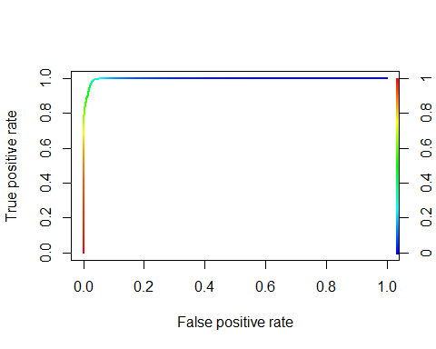
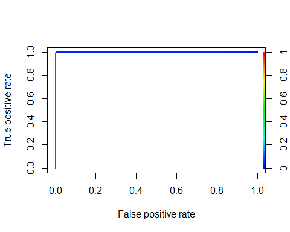
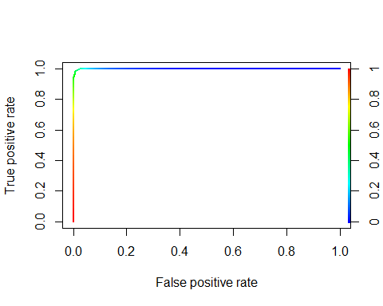

# Analytic Edge Kaggle NYT classifiction
Ryan Zhang  
Thursday, April 16, 2015  

#0 Environment  环境设定  
##0-1 Set working directory  设定工作环境  

```r
setwd("~/GitHub/edX/The Analytic Edge/Kaggle")
```

##0-2 Load Libraries  函数包  

```r
library(tm)
library(e1071)
library(neuralnet)
library(randomForest)
library(ROCR)
library(party)
library(rCUR)
```

##0-3 Function Definition  自定义函数  
用于帮助求table后正类百分比的小函数    

```r
tCor <- function(t)round(t[,2]/rowSums(t),2)*100 
```
用于生成dummy encoding的数据框

```r
dummyEncoding <- function(df, colname){
  dDF <- as.data.frame(model.matrix(~df[,colname]))
  names(dDF) <- paste(colname,as.character(levels(df[,colname])),sep="")
  dDF}
```

#1 Data Preparing 数据准备工作
##1-1 Loading 装载

```r
NewsTrain <- read.csv("NYTimesBlogTrain.csv", stringsAsFactors = F)
NewsTest <- read.csv("NYTimesBlogTest.csv", stringsAsFactors = F)
```

##1-2 预处理
Store the number of training data points and the number of testing data points.        
记录一下训练数据和测试数据的数量。

```r
ntrain <- nrow(NewsTrain)
ntest <- nrow(NewsTest)
ntrain
```

```
## [1] 6532
```

```r
ntest
```

```
## [1] 1870
```

"Popular"" is the dependant variable, store it in a separate vector "Y", and delete the colomn from the dataframe "NewsTrain".      
要预测的因变量是“Popular”，将其存在一个单独的"Y"向量中,并从训练数据框中删除该列。

```r
Y <- as.factor(NewsTrain$Popular)
NewsTrain$Popular <- NULL
```

Combine "NewsTrain" and "NewsTest" into a single dataframe for the purpose of data preparing      
将训练数据和测试数据合并为一个单一的数据框，以便集中处理（这是否有问题？）    
**只要是非监督的变换应该都不算作弊**

```r
OriginalDF <- rbind(NewsTrain, NewsTest)
```

Filling empty entries for the first three columns with name "Other"      
将前三列里面的“”用“Other”替代

```r
for (i in 1:nrow(OriginalDF)){
  for (j in 1:3){
    if (OriginalDF[i,j] == ""){
      OriginalDF[i,j] <- "Other"}}}
```

Change the first three columns to be factors     
将前三个变量改成factor类型

```r
OriginalDF$NewsDesk <- as.factor(OriginalDF$NewsDesk)
OriginalDF$SectionName <- as.factor(OriginalDF$SectionName)
OriginalDF$SubsectionName <- as.factor(OriginalDF$SubsectionName)
```

Log Transform "WordCount"      
将WordCount做对数转换，（转换后变为正态分布）  

```r
# OriginalDF$ZWordCount <- with(OriginalDF, (WordCount - mean(WordCount))/sd(WordCount))
OriginalDF$NWordCount <- log(OriginalDF$WordCount + 1)
```

Conver the PubDate and time variable to be more R friendly and extract the hour of day, the day on month and the day of week to be seperate variables. Finally delete the PubDate column.       
将PubDate改成R的日期-时间格式，并将周几、每月几号以及每天几点这些信息单独抽取出来，删除原本的PubDate

```r
OriginalDF$PubDate <- strptime(OriginalDF$PubDate, "%Y-%m-%d %H:%M:%S")
OriginalDF$Hour <- as.factor(OriginalDF$PubDate$h)
OriginalDF$Wday <- as.factor(OriginalDF$PubDate$wday)
OriginalDF$Mday <- as.factor(OriginalDF$PubDate$mday)
# OriginalDF$isWeekend <- as.numeric(OriginalDF$Wday %in% c(0,6))
OriginalDF$PubDate <- NULL
```

Generate training and testing set    
生成训练和测试数据    

```r
train <- OriginalDF[1:ntrain, c(1:3,9:12)]
test <- OriginalDF[(ntrain+1):nrow(OriginalDF),c(1:3,9:12)]
```

##2 Exploratory Data Analysis  探索式数据分析    
First Explore the few factor variable and their relationship to the depandent variable.    
先看看前三个factor型数据与要预测的Popular之间的关系。    

```r
tNewsDesk <- table(OriginalDF$NewsDesk[1:ntrain], Y)
t(tNewsDesk)
```

```
##    
## Y   Business Culture Foreign Magazine Metro National OpEd Other Science
##   0     1301     626     372       31   181        4  113  1710      73
##   1      247      50       3        0    17        0  408   136     121
##    
## Y   Sports Styles Travel TStyle
##   0      2    196    115    715
##   1      0    101      1      9
```

```r
tCor(tNewsDesk)
```

```
## Business  Culture  Foreign Magazine    Metro National     OpEd    Other 
##       16        7        1        0        9        0       78        7 
##  Science   Sports   Styles   Travel   TStyle 
##       62        0       34        1        1
```

```r
plot(tCor(tNewsDesk))
```

 

```r
tSectionName <- table(OriginalDF$SectionName[1:ntrain], Y)
t(tSectionName)
```

```
##    
## Y   Arts Business Day Crosswords/Games Health Magazine Multimedia
##   0  625          999               20     74       31        139
##   1   50           93              103    120        0          2
##    
## Y   N.Y. / Region Open Opinion Other Sports Style Technology Travel U.S.
##   0           181    4     182  2171      1     2        280    116  405
##   1            17    0     425   129      0     0         50      1  100
##    
## Y   World
##   0   209
##   1     3
```

```r
tCor(tSectionName)
```

```
##             Arts     Business Day Crosswords/Games           Health 
##                7                9               84               62 
##         Magazine       Multimedia    N.Y. / Region             Open 
##                0                1                9                0 
##          Opinion            Other           Sports            Style 
##               70                6                0                0 
##       Technology           Travel             U.S.            World 
##               15                1               20                1
```

```r
plot(tCor(tSectionName))
```

 

```r
tSubsectionName <- table(OriginalDF$SubsectionName[1:ntrain], Y)
t(tSubsectionName)
```

```
##    
## Y   Asia Pacific Dealbook Education Fashion & Style Other Politics
##   0          200      864       325               2  3846        2
##   1            3       88         0               0   980        0
##    
## Y   Room For Debate Small Business The Public Editor
##   0              61            135                 4
##   1               1              5                16
```

```r
tCor(tSubsectionName)
```

```
##      Asia Pacific          Dealbook         Education   Fashion & Style 
##                 1                 9                 0                 0 
##             Other          Politics   Room For Debate    Small Business 
##                20                 0                 2                 4 
## The Public Editor 
##                80
```

```r
plot(tCor(tSubsectionName))
```

 
    
SectionName, SubsectionName,NewsDesk应该都是有预测能力的变量，应该保留   

Looking at the text contents    
看看文本信息   
It seems that the "Snippet" is almost redudent with "Abstract", in since 98% cases they are the same. And "Abstract" contains a little bit more infomation than "Snippet"      
Snippet应该和Abstract的重合内容非常多，前者貌T似都属于后者，因而估计只用后者就好了。    

```r
sum(OriginalDF$Snippet == OriginalDF$Abstract)/nrow(OriginalDF)
```

```
## [1] 0.9846465
```

```r
which(OriginalDF$Snippet != OriginalDF$Abstract)[1]
```

```
## [1] 22
```

```r
OriginalDF[22,5]
```

```
## [1] "In an open letter, Su Yutong, a Chinese journalist who was fired from a German public broadcaster last month after a debate over the Tiananmen Square massacre, called on the broadcasters director general to speak out for press freedom while in..."
```

```r
OriginalDF[22,6]
```

```
## [1] "In an open letter, Su Yutong, a Chinese journalist who was fired from a German public broadcaster last month after a debate over the Tiananmen Square massacre, called on the broadcasters director general to speak out for press freedom while in China."
```

Looking at WordCount    
看看字数    
The distribution of WordCount seems to be a longtail / power-law distribution.    
字数的分布似乎是幂律分布的    

```r
summary(OriginalDF$WordCount)
```

```
##    Min. 1st Qu.  Median    Mean 3rd Qu.    Max. 
##     0.0   188.0   377.0   528.8   735.0 10910.0
```

```r
hist(OriginalDF$WordCount, breaks = 70)
```

 

```r
hist(OriginalDF$NWordCount)
```

 

Looking at publication day/weekday/hour related to Popular   
看看小时、周几、每月几号，这些有没有用   

```r
tHour <- table(OriginalDF$Hour[1:ntrain] , Y)
t(tCor(tHour))
```

```
##       0  1  2 3 4 5  6 7  8  9 10 11 12 13 14 15 16 17 18 19 20 21 22 23
## [1,] 18 11 12 5 1 4 14 6 12 16 18 18 18 13 17 21 16 13 18 27 28 31 60 31
```

```r
plot(tCor(tHour))
```

 

```r
tWday <- table(OriginalDF$Wday[1:ntrain], Y)
t(tCor(tWday))
```

```
##       0  1  2  3  4  5  6
## [1,] 32 17 15 16 16 14 27
```

```r
plot(tCor(tWday))
```

 

```r
tMday <- table(OriginalDF$Mday[1:ntrain], Y)
t(tCor(tMday))
```

```
##       1  2  3  4  5  6  7  8  9 10 11 12 13 14 15 16 17 18 19 20 21 22 23
## [1,] 18 20 17 13 20 15 18 17 18 16 17 21 20 13 20 16 15 17 16 18 15 16 12
##      24 25 26 27 28 29 30 31
## [1,] 14 19 18 18 20 15 18 13
```

```r
plot(tCor(tMday))
```

 

```r
#tWeekend <- table(OriginalDF$isWeekend[1:ntrain], Y)
#tCor(tWeekend)
#plot(tCor(tWeekend))
```
每月几号看上去没啥用   

#3 Model fitting  模型拟合  
##3-1 randomForest on Non-Text Features 用不含文本提取的特征做随机森林
randomForest model    
随机森林模型    
public board auc = 0.92699

```r
set.seed(880306)
rfModel <- randomForest(x = train,
                        y = Y,
                        ntree = 1000,
                        mtry = 2,
                        nodesize = 4,
                        importance = F,
                        proximity = F)
```

Evaluate on Training set 
根据测试集评价模型

```r
rfPred <- predict(rfModel, train, type = "prob")
table(rfPred[,2] > 0.5,Y)
```

```
##        Y
##            0    1
##   FALSE 5358  102
##   TRUE    81  991
```

```r
prediction <- ROCR::prediction(rfPred[,2], Y)
perf <- performance(prediction, "tpr", "fpr")
plot(perf, colorize = T, lwd = 2)
```

 

```r
auc <- performance(prediction, "auc")
auc@y.values
```

```
## [[1]]
## [1] 0.9967468
```

Make prediction with randomForest model
用随机森林模型做预测

```r
tpred <- predict(rfModel, test, type = "prob")
MySubmission = data.frame(UniqueID = NewsTest$UniqueID, Probability1 = tpred[,1])
write.csv(MySubmission, "rfRegularFeatures.csv", row.names = F)
```

#4 Try feature engineering with text content 尝试通过文本数据做特征工程     
##4-1 TFIDF   术语频次·逆文档频次  
Extract all headline and abstract to form a corpus    
抽取题名和摘要文本构建一个语料库    

```r
text <- vector()
for (i in 1:nrow(OriginalDF)) {
  text <- rbind(text, paste(OriginalDF$Headline[i], " ", OriginalDF$Abstract[i]))
}

Corpus <- Corpus(VectorSource(text))
```

Standard Corpus processing     
标准化的语料库处理     

```r
Corpus <- tm_map(Corpus, tolower)     
Corpus <- tm_map(Corpus, PlainTextDocument)    
Corpus <- tm_map(Corpus, removePunctuation)    
Corpus <- tm_map(Corpus, removeWords, stopwords("english"))     
Corpus <- tm_map(Corpus, stemDocument)    
```

Document ~ TF-IDF matrix    
构建文档~TFIDF矩阵     

```r
dtm <- DocumentTermMatrix(Corpus, control = list(weighting = weightTfIdf))    
```

Get the terms    
获取术语列表     

```r
terms <- dtm$dimnames$Terms    
terms[5101:5110]
```

```
##  [1] "envi"             "enviabl"          "environ"         
##  [4] "environment"      "environmentalist" "environmentmind" 
##  [7] "envoy"            "enzym"            "eon"             
## [10] "eotvo"
```

Get the matrix for training and testing set     
分别获得训练和测试数据的Document~TF-IDF矩阵     

```r
dtmTrain <- dtm[1:ntrain,]
dtmTest <- dtm[(1+ntrain):dtm$nrow,]
```

Get frequent terms matrix for testing set
获得测试集的频繁术语

```r
sparseTest <- removeSparseTerms(dtmTest, 0.96)
wordsTest <- as.data.frame(as.matrix(sparseTest))
termsTest <- names(wordsTest)
```

Filter the dtm based on frequent terms in testing set    
根据测试集的频繁术语，对原本的矩阵进行筛选     

```r
cols <- vector()
for (i in 1:length(termsTest)){
  cols = c(cols, which((terms == termsTest[i]) == T))}
dtmFiltered <- dtm[,cols]
```

Text Feature    
文本特征      

```r
termFeatures <- as.data.frame(as.matrix(dtmFiltered))
row.names(termFeatures) <- c(1:nrow(OriginalDF))
```

Append text features to the dataframe    

```r
TextADDDF <- as.data.frame(termFeatures)
```


```r
tatrain <- cbind(train, TextADDDF[1:ntrain,])
tatest <- cbind(test, TextADDDF[(ntrain+1):nrow(TextADDDF),])
```

##4-2 randomForest model with text features added  加了文本特征的随机森林模型  
public board auc = 

```r
set.seed(880306)
tarfModel <- randomForest(x = tatrain,
                        y = Y,
                        ntree = 1000,
                        nodesize = 4,
                        importance = T,
                        proximity = F)
```

Look at the importance of features via training randomForest   
看看文本特征的重要性    

```r
t(tarfModel$importance[,4])
```

```
##      NewsDesk SectionName SubsectionName NWordCount     Hour     Wday
## [1,] 299.4853    407.4268       49.07737   221.9428 188.6811 61.34828
##          Mday     busi      can  compani      day      get  holiday
## [1,] 192.4682 4.862253 14.06175 9.666681 7.926857 8.634849 1.928577
##           new    obama    one presid   report     said      say    state
## [1,] 21.87434 4.140176 14.222 6.4567 7.393292 10.74906 10.92274 7.056526
##          time    today     will     year     york
## [1,] 10.74981 6.192084 16.21156 10.71469 7.046009
```
  
貌似都挺低的。。。    

Make prediction on the training set
用加了文本特征的随机森林模型对训练数据进行预测

```r
tarfPred <- predict(tarfModel, tatrain, type = "prob")
table(tarfPred[,2] > 0.5,Y)
```

```
##        Y
##            0    1
##   FALSE 5400   63
##   TRUE    39 1030
```

```r
prediction <- ROCR::prediction(tarfPred[,2], Y)
perf <- performance(prediction, "tpr", "fpr")
plot(perf, colorize = T, lwd = 2)
```

 

```r
auc <- performance(prediction, "auc")
auc@y.values
```

```
## [[1]]
## [1] 0.9987317
```

Make prediction with randomForest model
加了文本特征的随机森林模型做预测

```r
tatpred <- predict(tarfModel, tatest, type = "prob")
MySubmission = data.frame(UniqueID = NewsTest$UniqueID, Probability1 = tatpred[,1])
write.csv(MySubmission, "rfText.csv", row.names = F)
```

##4-3 Why not a neural net?  试试神经网络      
Neural net based on numerical features.    
基于数值特征的神经网络（没有GPU 炒鸡慢）       

```r
nntrain <- tatrain[,c(4,8:26)]
nntest <- tatest[,c(4,8:26)]
nntrain$Popular <- as.numeric(as.character(Y))
nameofvars <- names(nntrain)
nnformula <- as.formula(paste("Popular ~", 
                        paste(nameofvars[!nameofvars %in% "Popular"], collapse = " + ")))
ptm <- proc.time()
nn <- neuralnet(formula = nnformula,
                data = nntrain, 
                hidden = 2,
                threshold = 0.02,
                stepmax = 1e8,
                err.fct="ce",
                linear.output=FALSE)
plot(nn)
pnn <- compute(nn,nntrain[,1:20])
summary(pnn$net.result)
```

```
##        V1            
##  Min.   :0.02651424  
##  1st Qu.:0.04543004  
##  Median :0.09536798  
##  Mean   :0.16732731  
##  3rd Qu.:0.28392093  
##  Max.   :0.99988792
```

```r
nnpredict <- as.vector(pnn$net.result)
prediction <- ROCR::prediction(nnpredict, Y)
perf <- performance(prediction, "tpr", "fpr")
plot(perf, colorize = T, lwd = 2)
auc <- performance(prediction, "auc")
auc@y.values
```

```
## [[1]]
## [1] 0.7848970206
```

```r
proc.time() - ptm
```

```
##    user  system elapsed 
##  323.78    0.08  325.50
```

##4-4 Support Vector Machine 支持向量机
先做下Dummy Encoding

```r
taDF <- rbind(tatrain, tatest)
names(taDF)
```

```
##  [1] "NewsDesk"       "SectionName"    "SubsectionName" "NWordCount"    
##  [5] "Hour"           "Wday"           "Mday"           "busi"          
##  [9] "can"            "compani"        "day"            "get"           
## [13] "holiday"        "new"            "obama"          "one"           
## [17] "presid"         "report"         "said"           "say"           
## [21] "state"          "time"           "today"          "will"          
## [25] "year"           "york"
```

```r
tadDF <- taDF[,c(4,8:26)]
toEnco <- c("NewsDesk","SectionName","SubsectionName","Hour","Wday","Mday")
for (colname in toEnco){
  tadDF <- cbind(tadDF, dummyEncoding(taDF, colname))
}
names(tadDF) <- make.names(tadDF)
tadtrain <- tadDF[1:ntrain,]
tadtest <- tadDF[((1+ntrain):nrow(tadDF)),]
```

SVM Model Fitting 支持向量机

```r
svmModel <- svm(x = tadtrain, 
                y = Y,
                cost = 100, gamma = 1, probability = T)
```

```
## Warning in svm.default(x = tadtrain, y = Y, cost = 100, gamma = 1,
## probability = T): Variable(s)
## 'c.1..1..1..1..1..1..1..1..1..1..1..1..1..1..1..1..1..1..1..1..1..1..1..1..1..1..1..1..1..1..1..1..1..1..1..1..1..1..1..1..1..1..1..1..1..1..1..1..1..1..1..1..1..1..1..1..1..1..1..1..1..1..1..1..1..1..1..1..1..1..1..1..1..1..1..1..1..1..1..1..1..1..1..1..1..1..1..1..1..1..1..1..1..1..1..1..1..1..1..1..1..1..1..1..1..1..1..1..1..1..1..1..1..1..1..1..1..1..1..1..1..1..1..1..1..1..1..1..1..1..1..1..1..1..1..1..1..1..1..1..1..1..1..1..1..1..1..1..1..1..1..1..1..1..1..1..1..1..1..1..1..1..1..1..1..1..1...1..1..1..1..1..1..1..1..1..1..1..1..1..1..1..1..1..1..1..1..1..1..1..1..1..1..1..1..1..1..1..1..1..1..1..1..1..1..1..1..1..1..1..1..1..1..1..1..1..1..1..1..1..1..1..1..1..1..1..1..1..1..1..1..1..1..1..1..1..1..1..1..1..1..1..1..1..1..1..1..1..1..1..1..1..1..1..1..1..1..1..1..1..1..1..1..1..1..1..1..1..1..1..1..1..1..1..1..1..1..1..1..1..1..1..1..1..1..1..1..1..1..1..1..1..1..1..1..1..1..1..1..1..1..1..1..1..1..1..1..1..1..1..1..1..1..1..1..1..1..1..1..1..1..1..1..1..1..1..1..1..1..1..1..1..1..1...1..1..1..1..1..1..1..1..1..1..1..1..1..1..1..1..1..1..1..1..1..1..1..1..1..1..1..1..1..1..1..1..1..1..1..1..1..1..1..1..1..1..1..1..1..1..1..1..1..1..1..1..1..1..1..1..1..1..1..1..1..1..1..1..1..1..1..1..1..1..1..1..1..1..1..1..1..1..1..1..1..1..1..1..1..1..1..1..1..1..1..1..1..1..1..1..1..1..1..1..1..1..1..1..1..1..1..1..1..1..1..1..1..1..1..1..1..1..1..1..1..1..1..1..1..1..1..1..1..1..1..1..1..1..1..1..1..1..1..1..1..1..1..1..1..1..1..1..1..1..1..1..1..1..1..1..1..1..1..1..1..1..1..1..1..1..1...1..1..1..1..1..1..1..1..1..1..1..1..1..1..1..1..1..1..1..1..1..1..1..1..1..1..1..1..1..1..1..1..1..1..1..1..1..1..1..1..1..1..1..1..1..1..1..1..1..1..1..1..1..1..1..1..1..1..1..1..1..1..1..1..1..1..1..1..1..1..1..1..1..1..1..1..1..1..1..1..1..1..1..1..1..1..1..1..1..1..1..1..1..1..1..1..1..1..1..1..1..1..1..1..1..1..1..1..1..1..1..1..1..1..1..1..1..1..1..1..1..1..1..1..1..1..1..1..1..1..1..1..1..1..1..1..1..1..1..1..1..1..1..1..1..1..1..1..1..1..1..1..1..1..1..1..1..1..1..1..1..1..1..1..1..1..1...1..1..1..1..1..1..1..1..1..1..1..1..1..1..1..1..1..1..1..1..1..1..1..1..1..1..1..1..1..1..1..1..1..1..1..1..1..1..1..1..1..1..1..1..1..1..1..1..1..1..1..1..1..1..1..1..1..1..1..1..1..1..1..1..1..1..1..1..1..1..1..1..1..1..1..1..1..1..1..1..1..1..1..1..1..1..1..1..1..1..1..1..1..1..1..1..1..1..1..1..1..1..1..1..1..1..1..1..1..1..1..1..1..1..1..1..1..1..1..1..1..1..1..1..1..1..1..1..1..1..1..1..1..1..1..1..1..1..1..1..1..1..1..1..1..1..1..1..1..1..1..1..1..1..1..1..1..1..1..1..1..1..1..1..1..1..1...1..1..1..1..1..1..1..1..1..1..1..1..1..1..1..1..1..1..1..1..1..1..1..1..1..1..1..1..1..1..1..1..1..1..1..1..1..1..1..1..1..1..1..1..1..1..1..1..1..1..1..1..1..1..1..1..1..1..1..1..1..1..1..1..1..1..1..1..1..1..1..1..1..1..1..1..1..1..1..1..1..1..1..1..1..1..1..1..1..1..1..1..1..1..1..1..1..1..1..1..1..1..1..1..1..1..1..1..1..1..1..1..1..1..1..1..1..1..1..1..1..1..1..1..1..1..1..1..1..1..1..1..1..1..1..1..1..1..1..1..1..1..1..1..1..1..1..1..1..1..1..1..1..1..1..1..1..1..1..1..1..1..1..1..1..1..1...1..1..1..1..1..1..1..1..1..1..1..1..1..1..1..1..1..1..1..1..1..1..1..1..1..1..1..1..1..1..1..1..1..1..1..1..1..1..1..1..1..1..1..1..1..1..1..1..1..1..1..1..1..1..1..1..1..1..1..1..1..1..1..1..1..1..1..1..1..1..1..1..1..1..1..1..1..1..1..1..1..1..1..1..1..1..1..1..1..1..1..1..1..1..1..1..1..1..1..1..1..1..1..1..1..1..1..1..1..1..1..1..1..1..1..1..1..1..1..1..1..1..1..1..1..1..1..1..1..1..1..1..1..1..1..1..1..1..1..1..1..1..1..1..1..1..1..1..1..1..1..1..1..1..1..1..1..1..1..1..1..1..1..1..1..1..1...1..1..1..1..1..1..1..1..1..1..1..1..1..1..1..1..1..1..1..1..1..1..1..1..1..1..1..1..1..1..1..1..1..1..1..1..1..1..1..1..1..1..1..1..1..1..1..1..1..1..1..1..1..1..1..1..1..1..1..1..1..1..1..1..1..1..1..1..1..1..1..1..1..1..1..1..1..1..1..1..1..1..1..1..1..1..1..1..1..1..1..1..1..1..1..1..1..1..1..1..1..1..1..1..1..1..1..1..1..1..1..1..1..1..1..1..1..1..1..1..1..1..1..1..1..1..1..1..1..1..1..1..1..1..1..1..1..1..1..1..1..1..1..1..1..1..1..1..1..1..1..1..1..1..1..1..1..1..1..1..1..1..1..1..1..1..1...1..1..1..1..1..1..1..1..1..1..1..1..1..1..1..1..1..1..1..1..1..1..1..1..1..1..1..1..1..1..1..1..1..1..1..1..1..1..1..1..1..1..1..1..1..1..1..1..1..1..1..1..1..1..1..1..1..1..1..1..1..1..1..1..1..1..1..1..1..1..1..1..1..1..1..1..1..1..1..1..1..1..1..1..1..1..1..1..1..1..1..1..1..1..1..1..1..1..1..1..1..1..1..1..1..1..1..1..1..1..1..1..1..1..1..1..1..1..1..1..1..1..1..1..1..1..1..1..1..1..1..1..1..1..1..1..1..1..1..1..1..1..1..1..1..1..1..1..1..1..1..1..1..1..1..1..1..1..1..1..1..1..1..1..1..1..1...1..1..1..1..1..1..1..1..1..1..1..1..1..1..1..1..1..1..1..1..1..1..1..1..1..1..1..1..1..1..1..1..1..1..1..1..1..1..1..1..1..1..1..1..1..1..1..1..1..1..1..1..1..1..1..1..1..1..1..1..1..1..1..1..1..1..1..1..1..1..1..1..1..1..1..1..1..1..1..1..1..1..1..1..1..1..1..1..1..1..1..1..1..1..1..1..1..1..1..1..1..1..1..1..1..1..1..1..1..1..1..1..1..1..1..1..1..1..1..1..1..1..1..1..1..1..1..1..1..1..1..1..1..1..1..1..1..1..1..1..1..1..1..1..1..1..1..1..1..1..1..1..1..1..1..1..1..1..1..1..1..1..1..1..1..1..1...1..1..1..1..1..1..1..1..1..1..1..1..1..1..1..1..1..1..1..1..1..1..1..1..1..1..1..1..1..1..1..1..1..1..1..1..1..1..1..1..1..1..1..1..1..1..1..1..1..1..1..1..1..1..1..1..1..1..1..1..1..1..1..1..1..1..1..1..1..1..1..1..1..1..1..1..1..1..1..1..1..1..1..1..1..1..1..1..1..1..1..1..1..1..1..1..1..1..1..1..1..1..1..1..1..1..1..1..1..1..1..1..1..1..1..1..1..1..1..1..1..1..1..1..1..1..1..1..1..1..1..1..1..1..1..1..1..1..1..1..1..1..1..1..1..1..1..1..1..1..1..1..1..1..1..1..1..1..1..1..1..1..1..1..1..1..1...1..1..1..1..1..1..1..1..1..1..1..1..1..1..1..1..1..1..1..1..1..1..1..1..1..1..1..1..1..1..1..1..1..1..1..1..1..1..1..1..1..1..1..1..1..1..1..1..1..1..1..1..1..1..1..1..1..1..1..1..1..1..1..1..1..1..1..1..1..1..1..1..1..1..1..1..1..1..1..1..1..1..1..1..1..1..1..1..1..1..1..1..1..1..1..1..1..1..1..1..1..1..1..1..1..1..1..1..1..1..1..1..1..1..1..1..1..1..1..1..1..1..1..1..1..1..1..1..1..1..1..1..1..1..1..1..1..1..1..1..1..1..1..1..1..1..1..1..1..1..1..1..1..1..1..1..1..1..1..1..1..1..1..1..1..1..1...1..1..1..1..1..1..1..1..1..1..1..1..1..1..1..1..1..1..1..1..1..1..1..1..1..1..1..1..1..1..1..1..1..1..1..1..1..1..1..1..1..1..1..1..1..1..1..1..1..1..1..1..1..1..1..1..1..1..1..1..1..1..1..1..1..1..1..1..1..1..1..1..1..1..1..1..1..1..1..1..1..1..1..1..1..1..1..1..1..1..1..1..1..1..1..1..1..1..1..1..1..1..1..1..1..1..1..1..1..1..1..1..1..1..1..1..1..1..1..1..1..1..1..1..1..1..1..1..1..1..1..1..1..1..1..1..1..1..1..1..1..1..1..1..1..1..1..1..1..1..1..1..1..1..1..1..1..1..1..1..1..1..1..1..1..1..1...1..1..1..1..1..1..1..1..1..1..1..1..1..1..1..1..1..1..1..1..1..1..1..1..1..1..1..1..1..1..1..1..1..1..1..1..1..1..1..1..1..1..1..1..1..1..1..1..1..1..1..1..1..1..1..1..1..1..1..1..1..1..1..1..1..1..1..1..1..1..1..1..1..1..1..1..1..1..1..1..1..1..1..1..1..1..1..1..1..1..1..1..1..1..1..1..1..1..1..1..1..1..1..1..1..1..1..1..1..1..1..1..1..1..1..1..1..1..1..1..1..1..1..1..1..1..1..1..1..1..1..1..1..1..1..1..1..1..1..1..1..1..1..1..1..1..1..1..1..1..1..1..1..1..1..1..1..1..1..1..1..1..1..1..1..1..1...1..1..1..1..1..1..1..1..1..1..1..1..1..1..1..1..1..1..1..1..1..1..1..1..1..1..1..1..1..1..1..1..1..1..1..1..1..1..1..1..1..1..1..1..1..1..1..1..1..1..1..1..1..1..1..1..1..1..1..1..1..1..1..1..1..1..1..1..1..1..1..1..1..1..1..1..1..1..1..1..1..1..1..1..1..1..1..1..1..1..1..1..1..1..1..1..1..1..1..1..1..1..1..1..1..1..1..1..1..1..1..1..1..1..1..1..1..1..1..1..1..1..1..1..1..1..1..1..1..1..1..1..1..1..1..1..1..1..1..1..1..1..1..1..1..1..1..1..1..1..1..1..1..1..1..1..1..1..1..1..1..1..1..1..1..1..1...1..1..1..1..1..1..1..1..1..1..1..1..1..1..1..1..1..1..1..1..1..1..1..1..1..1..1..1..1..1..1..1..1..1..1..1..1..1..1..1..1..1..1..1..1..1..1..1..1..1..1..1..1..1..1..1..1..1..1..1..1..1..1..1..1..1..1..1..1..1..1..1..1..1..1..1..1..1..1..1..1..1..1..1..1..1..1..1..1..1..1..1..1..1..1..1..1..1..1..1..1..1..1..1..1..1..1..1..1..1..1..1..1..1..1..1..1..1..1..1..1..1..1..1..1..1..1..1..1..1..1..1..1..1..1..1..1..1..1..1..1..1..1..1..1..1..1..1..1..1..1..1..1..1..1..1..1..1..1..1..1..1..1..1..1..1..1...1..1..1..1..1..1..1..1..1..1..1..1..1..1..1..1..1..1..1..1..1..1..1..1..1..1..1..1..1..1..1..1..1..1..1..1..1..1..1..1..1..1..1..1..1..1..1..1.
```

```r
svmpred <- predict(svmModel, tadtrain, decision.values = T, probability = T)
svmpredp <- attr(svmpred, "probabilities")[,1]
prediction <- ROCR::prediction(svmpredp, Y)
perf <- performance(prediction, "tpr", "fpr")
plot(perf, colorize = T, lwd = 2)
```

 

```r
auc <- performance(prediction, "auc")
auc@y.values
```

```
## [[1]]
## [1] 0.9999988
```

```r
svmtpred <- predict(svmModel, tadtest, probability = T)
svmtpredp <- attr(svmtpred, "probabilities")[,1]
MySubmission = data.frame(UniqueID = NewsTest$UniqueID, Probability1 = svmtpredp)
write.csv(MySubmission, "svmText.csv", row.names = F)
```

##4-5 Simple Ensemble 简单的组合模型
public board auc 0.91463

```r
enpred <- 0.5*svmtpredp+0.5*tatpred[,2]
MySubmission = data.frame(UniqueID = NewsTest$UniqueID, Probability1 = enpred)
write.csv(MySubmission, "svm_rf_ensemble.csv", row.names = F)
```


#5 Clustering on TFIDF matrix 做个聚类看看

```r
cTest <- removeSparseTerms(dtmTest, 0.98)
cWords <- as.data.frame(as.matrix(cTest))
cTerms <- names(cWords)

cols <- vector()
for (i in 1:length(cTerms)){
  cols = c(cols, which((terms == cTerms[i]) == T))
}
cdtm <- dtm[,cols]
cMatrix <- as.matrix(cdtm)
cDF <- as.data.frame(cMatrix)

kmclusters <- kmeans(cDF, 9, iter.max = 5000)

tactrain <- cbind(tatrain, kmclusters$cluster[1:ntrain])
names(tactrain) <- c(names(tactrain)[1:26],"cluster")
tactest <- cbind(tatest, kmclusters$cluster[(1+ntrain):nrow(OriginalDF)])
names(tactest) <- c(names(tactest)[1:26],"cluster")
```

##5-1 Another randomForest with cluster labels added 加上聚类标签后再来一个随机森林 
public board auc = 0.92495

```r
set.seed(1126)
tacrfModel <- randomForest(x = tactrain,
                        y = Y,
                        ntree = 1000,
                        mtry = 6,
                        nodesize = 4,
                        importance = T,
                        proximity = F)
t(tacrfModel$importance[,4])
```

```
##         NewsDesk SectionName SubsectionName  NWordCount        Hour
## [1,] 290.4090262 425.0239409    48.72399343 226.7651107 193.2293587
##             Wday       Mday        busi         can     compani
## [1,] 62.15639054 204.512549 4.694061149 14.02196006 9.264836769
##              day         get    holiday         new       obama
## [1,] 7.334311022 7.296188723 1.89542953 20.90701324 3.777619291
##              one      presid      report        said         say
## [1,] 13.79674084 5.901149564 7.103380622 10.27364284 10.80179445
##            state        time       today       will        year       york
## [1,] 6.712367237 10.57467696 5.054369754 16.0577489 10.01583073 6.76797255
##          cluster
## [1,] 16.38144645
```

```r
tacrfPred <- predict(tacrfModel, tactrain, type = "prob")
table(tacrfPred[,2] > 0.5,Y)
```

```
##        Y
##            0    1
##   FALSE 5414   49
##   TRUE    25 1044
```

```r
prediction <- ROCR::prediction(tacrfPred[,2], Y)
perf <- performance(prediction, "tpr", "fpr")
plot(perf, colorize = T, lwd = 2)
```

 

```r
auc <- performance(prediction, "auc")
auc@y.values
```

```
## [[1]]
## [1] 0.9994028422
```

```r
tacrfPred <- predict(tacrfModel, newdata = tactest, type = "prob")
MySubmission = data.frame(UniqueID = NewsTest$UniqueID, Probability1 = tacrfPred[,2])
write.csv(MySubmission, "rfTextCluster.csv", row.names = F)
```

#6 Matrix Factorization 矩阵分解  
##6-1 SVD 奇异值分解

```r
s <- svd(cMatrix)
Sig <- diag(s$d)
plot(s$d)
```

 

```r
totaleng <- sum(Sig^2)
engsum <- 0
for (i in 1:nrow(Sig)){
  engsum <- engsum + Sig[i,i]^2
  if (engsum/totaleng > 0.8){
    print(i)
    break}}
```

```
## [1] 60
```
需要60个术语才能保留原TF-IDF矩阵80%的能量   

##6-2 CUR Matrix Decomposition CUR矩阵分解

```r
res <- CUR(cMatrix, c = 10, r = 84, k = 60)
```

将投影加到训练、测试数据

```r
ncolC <- ncol(getC(res))
Ak <- getC(res) %*% getU(res)[,1:ncolC]
AkDF <- as.data.frame(Ak)
tacftrain <- cbind(tactrain, AkDF[1:ntrain,])
tacftest <- cbind(tactest, AkDF[((1+ntrain):nrow(AkDF)),])
```

##6-3 randomForest with pc added 加上主要成分投影后的随机森林
public board auc = 0.92511

```r
set.seed(1126)
tacfrfModel <- randomForest(x = tacftrain,
                        y = Y,
                        ntree = 1000,
                        mtry = 8,
                        nodesize = 4,
                        importance = T,
                        proximity = F)
t(tacfrfModel$importance[,4])
```

```
##         NewsDesk SectionName SubsectionName  NWordCount        Hour
## [1,] 296.6270117 411.6814807    47.26282126 214.6310346 185.4065041
##            Wday        Mday        busi         can    compani         day
## [1,] 58.7976065 200.0700057 3.626107631 11.87238401 7.72977479 5.868553204
##              get    holiday         new       obama         one
## [1,] 6.624192461 1.27423217 18.31609829 2.183239621 12.20440025
##           presid      report        said         say       state
## [1,] 2.120108148 5.775209586 9.111639719 9.405677251 5.751109346
##             time       today     will        year       york     cluster
## [1,] 8.812432122 5.073874376 14.08257 8.452473261 5.51828053 12.36294121
##               V1        V2          V3          V4          V5        V6
## [1,] 10.00467543 13.784102 13.06784363 10.80172419 11.40370952 12.329524
##               V7          V8
## [1,] 11.02568939 10.98426555
```

```r
tacfrfPred <- predict(tacfrfModel, tacftrain, type = "prob")
table(tacfrfPred[,2] > 0.5,Y)
```

```
##        Y
##            0    1
##   FALSE 5421   40
##   TRUE    18 1053
```

```r
prediction <- ROCR::prediction(tacfrfPred[,2], Y)
perf <- performance(prediction, "tpr", "fpr")
plot(perf, colorize = T, lwd = 2)
```

 

```r
auc <- performance(prediction, "auc")
auc@y.values
```

```
## [[1]]
## [1] 0.9996184918
```

```r
tacfrfPred <- predict(tacfrfModel, newdata = tacftest, type = "prob")
MySubmission = data.frame(UniqueID = NewsTest$UniqueID, Probability1 = tacfrfPred[,2])
write.csv(MySubmission, "rfTextClusterFactorization.csv", row.names = F)
```

