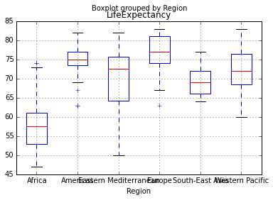

# The Analytic Edge Lecture code in Python
## With pandas, numpy

# VIDEO 2
## Basic Calculations

    8*6

    48

Python use ** for power

    2**16

    65536

type '\' and line break will allow you to continuetyping in code in new line

    2**\
    6

    64

## Functions
You can take square root without using a function...

    2**0.5

    1.4142135623730951

You can also use libraies like math, numpy or scipy for sqrt function

    from numpy import sqrt
    sqrt(2)

    1.4142135623730951

The absoluate value function

    abs(-65)

    65

to see help on function or object in python:

    help(sqrt)

    Help on ufunc object:
    
    sqrt = class ufunc(__builtin__.object)
     |  Functions that operate element by element on whole arrays.
     |  
     |  To see the documentation for a specific ufunc, use np.info().  For
     |  example, np.info(np.sin).  Because ufuncs are written in C
     |  (for speed) and linked into Python with NumPy's ufunc facility,
     |  Python's help() function finds this page whenever help() is called
     |  on a ufunc.
     |  
     |  A detailed explanation of ufuncs can be found in the "ufuncs.rst"
     |  file in the NumPy reference guide.
     ......
     
    
## Variables
Store the values in variables using assignment '=' , '<-' will not work in
Python

    SquareRoot2 = sqrt(2)
    SquareRoot2

    1.4142135623730951

    HoursYear = 365*24
    HoursYear

    8760

see names in current scope
You will see a much shorter list if you are using the basic python prompt
You can use 'name' in dir() to test if a object by that name existed in the
scope or not

    dir()[:5]

    ['ALLOW_THREADS', 'Annotation', 'Arrow', 'Artist', 'AutoLocator']

    'HoursYear' in dir()

    True

Similarily you can use locals().keys()

    locals().keys()[:5]

    ['disp', 'union1d', 'all', 'dist', 'issubsctype']

    'HoursYear' in locals().keys()

    True

# VIDEO 3

## Vectors
use numpy array to store a vector

    import numpy as np
    np.array([2,3,5,8,13])

    array([ 2,  3,  5,  8, 13])

    Country = np.array(["Brazil", "China", "India","Switzerland","USA"])
    LifeExpectancy = np.array([74,76,65,83,79])
    Country

    array(['Brazil', 'China', 'India', 'Switzerland', 'USA'], 
          dtype='|S11')

use print to see the output in a nicer way

    print Country

    ['Brazil' 'China' 'India' 'Switzerland' 'USA']
    

    print LifeExpectancy

    [74 76 65 83 79]
    

Getting the element from numpy arrary using index ( starts from 0 rahter than 1
in R)

    Country[0]

    'Brazil'

    LifeExpectancy[2]

    65

Create a array of fixed step integers using arange(), notice the end point is
excluded, so you need +1

    Sequence = np.arange(0,100+1,2)
    Sequence

    array([  0,   2,   4,   6,   8,  10,  12,  14,  16,  18,  20,  22,  24,
            26,  28,  30,  32,  34,  36,  38,  40,  42,  44,  46,  48,  50,
            52,  54,  56,  58,  60,  62,  64,  66,  68,  70,  72,  74,  76,
            78,  80,  82,  84,  86,  88,  90,  92,  94,  96,  98, 100])

## Data Frames
a DataFrame is a table-like data structure
there are many ways to create a dataframe, I prefer to pass in data as a
dictionary.
This way, which vector becomes which column will be very clear

    from pandas import DataFrame
    CountryData = DataFrame({'Country':Country, 'LifeExpectancy':LifeExpectancy})
    print CountryData

           Country  LifeExpectancy
    0       Brazil              74
    1        China              76
    2        India              65
    3  Switzerland              83
    4          USA              79
    

Use dataframeName['columnName'] to access column in the dataframe
Add a new column named 'Population'

    CountryData['Population'] = np.array([199000,1390000,1240000,7997,318000])
    print CountryData

           Country  LifeExpectancy  Population
    0       Brazil              74      199000
    1        China              76     1390000
    2        India              65     1240000
    3  Switzerland              83        7997
    4          USA              79      318000
    

Example of creating a new 'shorter' dateframe and append to the above one by row

    Country = np.array(['Australia','Greece'])
    LifeExpectancy = np.array([82, 81])
    Population = np.array([23050, 11125])
    
    NewCountryData = DataFrame({'Country':Country, 'LifeExpectancy':LifeExpectancy,
            'Population':Population})
    
    print NewCountryData

         Country  LifeExpectancy  Population
    0  Australia              82       23050
    1     Greece              81       11125
    

    AllCountryData = CountryData.append(NewCountryData)
    print AllCountryData

           Country  LifeExpectancy  Population
    0       Brazil              74      199000
    1        China              76     1390000
    2        India              65     1240000
    3  Switzerland              83        7997
    4          USA              79      318000
    0    Australia              82       23050
    1       Greece              81       11125
    

notice the index is not correctly updated, need a quick fix

    AllCountryData.index = range(len(AllCountryData))
    print AllCountryData

           Country  LifeExpectancy  Population
    0       Brazil              74      199000
    1        China              76     1390000
    2        India              65     1240000
    3  Switzerland              83        7997
    4          USA              79      318000
    5    Australia              82       23050
    6       Greece              81       11125
    

or we can add a second parameter when calling the

    print CountryData.append(NewCountryData, True)

           Country  LifeExpectancy  Population
    0       Brazil              74      199000
    1        China              76     1390000
    2        India              65     1240000
    3  Switzerland              83        7997
    4          USA              79      318000
    5    Australia              82       23050
    6       Greece              81       11125
    

# VIDEO 4
## change the working directory to where the data file loacted...

    import os
    path = 'C:\\ababasvasbsa\\The Analytic Edge\\week1'
    os.chdir(path)

## Loading csv files

    import pandas as pd
    WHO = pd.read_csv("WHO.csv")

see the first 5 rows in the dataframe

    WHO.head()

<table border="1" class="dataframe">
  <thead>
    <tr style="text-align: right;">
      <th></th>
      <th>Country</th>
      <th>Region</th>
      <th>Population</th>
      <th>Under15</th>
      <th>Over60</th>
      <th>FertilityRate</th>
      <th>LifeExpectancy</th>
      <th>ChildMortality</th>
      <th>CellularSubscribers</th>
      <th>LiteracyRate</th>
      <th>GNI</th>
      <th>PrimarySchoolEnrollmentMale</th>
      <th>PrimarySchoolEnrollmentFemale</th>
    </tr>
  </thead>
  <tbody>
    <tr>
      <th>0</th>
      <td> Afghanistan</td>
      <td> Eastern Mediterranean</td>
      <td> 29825</td>
      <td> 47.42</td>
      <td>  3.82</td>
      <td> 5.40</td>
      <td> 60</td>
      <td>  98.5</td>
      <td> 54.26</td>
      <td>  NaN</td>
      <td> 1140</td>
      <td>  NaN</td>
      <td>  NaN</td>
    </tr>
    <tr>
      <th>1</th>
      <td>     Albania</td>
      <td>                Europe</td>
      <td>  3162</td>
      <td> 21.33</td>
      <td> 14.93</td>
      <td> 1.75</td>
      <td> 74</td>
      <td>  16.7</td>
      <td> 96.39</td>
      <td>  NaN</td>
      <td> 8820</td>
      <td>  NaN</td>
      <td>  NaN</td>
    </tr>
    <tr>
      <th>2</th>
      <td>     Algeria</td>
      <td>                Africa</td>
      <td> 38482</td>
      <td> 27.42</td>
      <td>  7.17</td>
      <td> 2.83</td>
      <td> 73</td>
      <td>  20.0</td>
      <td> 98.99</td>
      <td>  NaN</td>
      <td> 8310</td>
      <td> 98.2</td>
      <td> 96.4</td>
    </tr>
    <tr>
      <th>3</th>
      <td>     Andorra</td>
      <td>                Europe</td>
      <td>    78</td>
      <td> 15.20</td>
      <td> 22.86</td>
      <td>  NaN</td>
      <td> 82</td>
      <td>   3.2</td>
      <td> 75.49</td>
      <td>  NaN</td>
      <td>  NaN</td>
      <td> 78.4</td>
      <td> 79.4</td>
    </tr>
    <tr>
      <th>4</th>
      <td>      Angola</td>
      <td>                Africa</td>
      <td> 20821</td>
      <td> 47.58</td>
      <td>  3.84</td>
      <td> 6.10</td>
      <td> 51</td>
      <td> 163.5</td>
      <td> 48.38</td>
      <td> 70.1</td>
      <td> 5230</td>
      <td> 93.1</td>
      <td> 78.2</td>
    </tr>
  </tbody>
</table>

# to see the structure of the data frame
Can't find a exact equalvalent function to str() in R

    print WHO.shape

    (194, 13)
    

    print WHO.dtypes

    Country                           object
    Region                            object
    Population                         int64
    Under15                          float64
    Over60                           float64
    FertilityRate                    float64
    LifeExpectancy                     int64
    ChildMortality                   float64
    CellularSubscribers              float64
    LiteracyRate                     float64
    GNI                              float64
    PrimarySchoolEnrollmentMale      float64
    PrimarySchoolEnrollmentFemale    float64
    dtype: object
    

    print WHO.values.T[:,:5]

    [['Afghanistan' 'Albania' 'Algeria' 'Andorra' 'Angola']
     ['Eastern Mediterranean' 'Europe' 'Africa' 'Europe' 'Africa']
     [29825L 3162L 38482L 78L 20821L]
     [47.42 21.33 27.42 15.2 47.58]
     [3.82 14.93 7.17 22.86 3.84]
     [5.4 1.75 2.83 nan 6.1]
     [60L 74L 73L 82L 51L]
     [98.5 16.7 20.0 3.2 163.5]
     [54.26 96.39 98.99 75.49 48.38]
     [nan nan nan nan 70.1]
     [1140.0 8820.0 8310.0 nan 5230.0]
     [nan nan 98.2 78.4 93.1]
     [nan nan 96.4 79.4 78.2]]
    

## Print out a summary of variables in the dataframe
The outputed infomation is slightly different

    WHO.describe(include = 'all')

<table border="1" class="dataframe">
  <thead>
    <tr style="text-align: right;">
      <th></th>
      <th>Country</th>
      <th>Region</th>
      <th>Population</th>
      <th>Under15</th>
      <th>Over60</th>
      <th>FertilityRate</th>
      <th>LifeExpectancy</th>
      <th>ChildMortality</th>
      <th>CellularSubscribers</th>
      <th>LiteracyRate</th>
      <th>GNI</th>
      <th>PrimarySchoolEnrollmentMale</th>
      <th>PrimarySchoolEnrollmentFemale</th>
    </tr>
  </thead>
  <tbody>
    <tr>
      <th>count</th>
      <td>                194</td>
      <td>    194</td>
      <td>     194.000000</td>
      <td> 194.000000</td>
      <td> 194.000000</td>
      <td> 183.000000</td>
      <td> 194.000000</td>
      <td> 194.000000</td>
      <td> 184.000000</td>
      <td> 103.000000</td>
      <td>   162.000000</td>
      <td> 101.000000</td>
      <td> 101.000000</td>
    </tr>
    <tr>
      <th>unique</th>
      <td>                194</td>
      <td>      6</td>
      <td>            NaN</td>
      <td>        NaN</td>
      <td>        NaN</td>
      <td>        NaN</td>
      <td>        NaN</td>
      <td>        NaN</td>
      <td>        NaN</td>
      <td>        NaN</td>
      <td>          NaN</td>
      <td>        NaN</td>
      <td>        NaN</td>
    </tr>
    <tr>
      <th>top</th>
      <td> Russian Federation</td>
      <td> Europe</td>
      <td>            NaN</td>
      <td>        NaN</td>
      <td>        NaN</td>
      <td>        NaN</td>
      <td>        NaN</td>
      <td>        NaN</td>
      <td>        NaN</td>
      <td>        NaN</td>
      <td>          NaN</td>
      <td>        NaN</td>
      <td>        NaN</td>
    </tr>
    <tr>
      <th>freq</th>
      <td>                  1</td>
      <td>     53</td>
      <td>            NaN</td>
      <td>        NaN</td>
      <td>        NaN</td>
      <td>        NaN</td>
      <td>        NaN</td>
      <td>        NaN</td>
      <td>        NaN</td>
      <td>        NaN</td>
      <td>          NaN</td>
      <td>        NaN</td>
      <td>        NaN</td>
    </tr>
    <tr>
      <th>mean</th>
      <td>                NaN</td>
      <td>    NaN</td>
      <td>   36359.974227</td>
      <td>  28.732423</td>
      <td>  11.163660</td>
      <td>   2.940656</td>
      <td>  70.010309</td>
      <td>  36.148969</td>
      <td>  93.641522</td>
      <td>  83.710680</td>
      <td> 13320.925926</td>
      <td>  90.850495</td>
      <td>  89.632673</td>
    </tr>
    <tr>
      <th>std</th>
      <td>                NaN</td>
      <td>    NaN</td>
      <td>  137903.141241</td>
      <td>  10.534573</td>
      <td>   7.149331</td>
      <td>   1.480984</td>
      <td>   9.259075</td>
      <td>  37.992935</td>
      <td>  41.400447</td>
      <td>  17.530645</td>
      <td> 15192.988650</td>
      <td>  11.017147</td>
      <td>  12.817614</td>
    </tr>
    <tr>
      <th>min</th>
      <td>                NaN</td>
      <td>    NaN</td>
      <td>       1.000000</td>
      <td>  13.120000</td>
      <td>   0.810000</td>
      <td>   1.260000</td>
      <td>  47.000000</td>
      <td>   2.200000</td>
      <td>   2.570000</td>
      <td>  31.100000</td>
      <td>   340.000000</td>
      <td>  37.200000</td>
      <td>  32.500000</td>
    </tr>
    <tr>
      <th>25%</th>
      <td>                NaN</td>
      <td>    NaN</td>
      <td>    1695.750000</td>
      <td>  18.717500</td>
      <td>   5.200000</td>
      <td>   1.835000</td>
      <td>  64.000000</td>
      <td>   8.425000</td>
      <td>  63.567500</td>
      <td>  71.600000</td>
      <td>  2335.000000</td>
      <td>  87.700000</td>
      <td>  87.300000</td>
    </tr>
    <tr>
      <th>50%</th>
      <td>                NaN</td>
      <td>    NaN</td>
      <td>    7790.000000</td>
      <td>  28.650000</td>
      <td>   8.530000</td>
      <td>   2.400000</td>
      <td>  72.500000</td>
      <td>  18.600000</td>
      <td>  97.745000</td>
      <td>  91.800000</td>
      <td>  7870.000000</td>
      <td>  94.700000</td>
      <td>  95.100000</td>
    </tr>
    <tr>
      <th>75%</th>
      <td>                NaN</td>
      <td>    NaN</td>
      <td>   24535.250000</td>
      <td>  37.752500</td>
      <td>  16.687500</td>
      <td>   3.905000</td>
      <td>  76.000000</td>
      <td>  55.975000</td>
      <td> 120.805000</td>
      <td>  97.850000</td>
      <td> 17557.500000</td>
      <td>  98.100000</td>
      <td>  97.900000</td>
    </tr>
    <tr>
      <th>max</th>
      <td>                NaN</td>
      <td>    NaN</td>
      <td> 1390000.000000</td>
      <td>  49.990000</td>
      <td>  31.920000</td>
      <td>   7.580000</td>
      <td>  83.000000</td>
      <td> 181.600000</td>
      <td> 196.410000</td>
      <td>  99.800000</td>
      <td> 86440.000000</td>
      <td> 100.000000</td>
      <td> 100.000000</td>
    </tr>
  </tbody>
</table>

## Subsetting

    WHO_Europe =  WHO[WHO.Region == "Europe"]
    WHO_Europe.shape

    (53, 13)

## Writing csv files

    WHO_Europe.to_csv("WHO_Europe.csv")

## Removing variables

    del(WHO_Europe)

# VIDEO 5
## Basic data analysis

    WHO['Under15'].mean()

    28.732422680412363

    WHO['Under15'].std()

    10.534573319923823

    WHO['Under15'].describe()

    count    194.000000
    mean      28.732423
    std       10.534573
    min       13.120000
    25%       18.717500
    50%       28.650000
    75%       37.752500
    max       49.990000
    Name: Under15, dtype: float64

    WHO['Under15'].idxmin()

    85

    WHO['Country'][85]

    'Japan'

    WHO['Under15'].idxmax()

    123

equvalent way to setting the value:

    WHO.at[123,'Country']

    'Niger'

## Scatterplot

    WHO.plot('GNI', 'FertilityRate', kind = 'scatter')

    <matplotlib.axes._subplots.AxesSubplot at 0xd5ca048>

## Subsetting

    Outliers = WHO[(WHO.GNI > 10000) & (WHO.FertilityRate > 2.5)]
    Outliers.shape[0]

    7

    Outliers[['Country','GNI','FertilityRate']]

<table border="1" class="dataframe">
  <thead>
    <tr style="text-align: right;">
      <th></th>
      <th>Country</th>
      <th>GNI</th>
      <th>FertilityRate</th>
    </tr>
  </thead>
  <tbody>
    <tr>
      <th>22 </th>
      <td>          Botswana</td>
      <td> 14550</td>
      <td> 2.71</td>
    </tr>
    <tr>
      <th>55 </th>
      <td> Equatorial Guinea</td>
      <td> 25620</td>
      <td> 5.04</td>
    </tr>
    <tr>
      <th>62 </th>
      <td>             Gabon</td>
      <td> 13740</td>
      <td> 4.18</td>
    </tr>
    <tr>
      <th>82 </th>
      <td>            Israel</td>
      <td> 27110</td>
      <td> 2.92</td>
    </tr>
    <tr>
      <th>87 </th>
      <td>        Kazakhstan</td>
      <td> 11250</td>
      <td> 2.52</td>
    </tr>
    <tr>
      <th>130</th>
      <td>            Panama</td>
      <td> 14510</td>
      <td> 2.52</td>
    </tr>
    <tr>
      <th>149</th>
      <td>      Saudi Arabia</td>
      <td> 24700</td>
      <td> 2.76</td>
    </tr>
  </tbody>
</table>

# VIDEO 6
## Histograms

    WHO.plot(y = 'CellularSubscribers', kind = 'hist', legend = False)

    <matplotlib.axes._subplots.AxesSubplot at 0xe3990b8>

## Boxplot
Using default settings

    WHO.boxplot('LifeExpectancy', by = 'Region')

    <matplotlib.axes._subplots.AxesSubplot at 0xe41b080>

tweaking the params a little bit to get a nicer plot
The code is a bit messy....

    fig = plt.figure()
    WHO.boxplot('LifeExpectancy', by = 'Region', rot = 60)
    plt.title("Life Expectancy of Countries by Region")
    plt.suptitle("")
    plt.ylabel("Life Expectancy")

    <matplotlib.text.Text at 0x11674240>

    <matplotlib.figure.Figure at 0x10946b70>

## Summary Tables
A bit more complicated than in R

    WHO.groupby('Region').size()

    Region
    Africa                   46
    Americas                 35
    Eastern Mediterranean    22
    Europe                   53
    South-East Asia          11
    Western Pacific          27
    dtype: int64

    WHO.groupby('Region')['Over60'].mean()

    Region
    Africa                    5.220652
    Americas                 10.943714
    Eastern Mediterranean     5.620000
    Europe                   19.774906
    South-East Asia           8.769091
    Western Pacific          10.162963
    Name: Over60, dtype: float64

    WHO.groupby('Region')['LiteracyRate'].min()

    Region
    Africa                   31.1
    Americas                 75.2
    Eastern Mediterranean    63.9
    Europe                   95.2
    South-East Asia          56.8
    Western Pacific          60.6
    Name: LiteracyRate, dtype: float64

