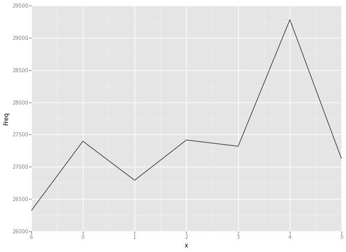

# Week 8 - Lecture 2, Predictive Policing
## VIDEO 3 - A Basic Line Plot
## Load our data:

    import os
    os.chdir('C:\\Users\\iris\\Downloads')
    import pandas as pd
    mvt = pd.read_csv("mvt.csv")
    def dfStr(df):
        print "The dataframe contains {0} rows and {1} columns".format(df.shape[0], df.shape[1])
        print "The data types of columns are: \n"
        print df.dtypes
    
    dfStr(mvt)

    The dataframe contains 191641 rows and 3 columns
    The data types of columns are: 
    
    Date          object
    Latitude     float64
    Longitude    float64
    dtype: object
    

## Convert the Date variable to time format

    mvt['Date'] = pd.to_datetime(mvt['Date'])

## Extract the hour and the day of the week:

    mvt['Weekday'] = mvt['Date'].dt.weekday
    mvt['Hour'] = mvt['Date'].dt.hour

## Let's take a look at the structure of our data again:

    dfStr(mvt)

    The dataframe contains 191641 rows and 5 columns
    The data types of columns are: 
    
    Date         datetime64[ns]
    Latitude            float64
    Longitude           float64
    Weekday               int64
    Hour                  int64
    dtype: object
    

## Create a simple line plot - need the total number of crimes on each day of
the week.
## We can get this information by creating a table:

    mvt.groupby('Weekday').size()

    Weekday
    0          27397
    1          26791
    2          27416
    3          27319
    4          29284
    5          27118
    6          26316
    dtype: int64

## Save this table as a data frame:

    WeekdayCounts = pd.DataFrame(mvt.groupby('Weekday').size(), columns = ['Freq'])
    WeekdayCounts['Weekdays'] = WeekdayCounts.index
    WeekdayCounts['Weekdays'] = WeekdayCounts['Weekdays'].astype('category')
    dfStr(WeekdayCounts)

    The dataframe contains 7 rows and 2 columns
    The data types of columns are: 
    
    Freq           int64
    Weekdays    category
    dtype: object
    

## Create our plot

    from ggplot import *
    ggplot(aes(x='Weekdays', y='Freq'), data = WeekdayCounts) + geom_line()  

    <ggplot: (18910170)>

## Make the "Weekdays" variable an ORDERED

    WeekdayCounts['Weekdays'] = pd.Categorical(WeekdayCounts['Weekdays'], categories = [6,0,1,2,3,4,5], ordered = True)

## Try again:

    ggplot(aes(x='Weekdays', y='Freq'), data = WeekdayCounts) + geom_line()  

    <ggplot: (10731941)>

## make the `x` values as ordered categorical data type won't help, it is
probably due to the difference in implementation `ggplot` in Python.

    WeekdayCounts['x'] = [(d+1)%7 for d in WeekdayCounts.index]
    ggplot(aes(x='x', y='Freq'), data = WeekdayCounts) + geom_line() + scale_x_discrete(labels = [6,0,1,2,3,4,5])

    <ggplot: (19100017)>

## Change our x and y labels:

    ggplot(aes(x='x', y='Freq'), data = WeekdayCounts) + \
        geom_line() + \
        scale_x_discrete(labels = [6,0,1,2,3,4,5]) + \
        xlab("Day of the Week") + \
        ylab("Total Motor Vehicle Thefts")

    <ggplot: (18989937)>

# VIDEO 4 - Adding the Hour of the Day
## Create a counts table for the weekday and hour:

    print pd.crosstab(mvt['Weekday'], mvt['Hour'])

    Hour       0     1     2    3    4    5    6     7     8     9   ...    14  \
    Weekday                                                          ...         
    0        1900   825   712  527  415  542  772  1123  1323  1235  ...   958   
    1        1691   777   603  464  414  520  845  1118  1175  1174  ...   908   
    2        1814   790   619  469  396  561  862  1140  1329  1237  ...   863   
    3        1856   816   696  508  400  534  799  1135  1298  1301  ...   831   
    4        1873   932   743  560  473  602  839  1203  1268  1286  ...   937   
    5        2050  1267   985  836  652  508  541   650   858  1039  ...   963   
    6        2028  1236  1019  838  607  461  478   483   615   864  ...   959   
    
    Hour       15    16    17    18    19    20    21    22    23  
    Weekday                                                        
    0        1059  1136  1252  1518  1503  1622  1815  2009  1490  
    1        1071  1090  1274  1553  1496  1696  1816  2044  1458  
    2        1075  1076  1289  1580  1507  1718  1748  2093  1511  
    3        1044  1131  1258  1510  1537  1668  1776  2134  1579  
    4        1140  1165  1318  1623  1652  1736  1881  2308  1921  
    5        1086  1055  1084  1348  1390  1570  1702  2078  1750  
    6        1037  1083  1160  1389  1342  1706  1696  2079  1584  
    
    [7 rows x 24 columns]
    

## Save this to a data frame:

    DayHourCounts = pd.DataFrame(pd.crosstab(mvt['Weekday'], mvt['Hour']))
    DayHourCounts = pd.DataFrame(DayHourCounts.transpose().stack(), columns = ['Freq'])

## Get variables `Hour` and `Weekdays`

    DayHourCounts['Weekdays'] = DayHourCounts.index.get_level_values(1).tolist()
    DayHourCounts['Hour'] = DayHourCounts.index.get_level_values(0).tolist()

## Create out plot/Change the colors
`ggplot` in python does not support `aes(group=Var)` yet
Also the `ggplot` version I got using `pip` does not seem to plot legend
correctly.

    p = ggplot(DayHourCounts, aes('Hour', 'Freq', color = 'Weekdays')) + geom_line(size =4 )
    p.draw()

    print p.legend['color']['dict']

    {u'#dbd057': 1, u'#8557db': 5, u'#75db57': 2, u'#57dbaa': 3, u'#db57c0': 6, u'#579bdb': 4, u'#db5f57': 0}
    

    DayHourCounts['Type'] = (DayHourCounts['Weekdays'] == 5) | (DayHourCounts['Weekdays'] == 6)

## Redo our plot, this time coloring by Type:

    p = ggplot(DayHourCounts, aes('Hour', 'Freq', color = 'Type')) + geom_line(size = 4)
    p.draw()

    print p.legend['color']['dict']

    {u'#57d3db': True, u'#db5f57': False}
    

## Make the lines a little transparent:

    p = ggplot(DayHourCounts, aes('Hour', 'Freq', color = 'Type')) + geom_line(alpha = 0.5,size = 4)
    p.draw()

## Make a heatmap:
Struggled to plot heatmap using `ggplot` in Python without success.
Turning to the old friend `matplotlib`

    zs = DayHourCounts['Freq'].reshape((24,7)).transpose()
    import matplotlib.pyplot as plt
    plt.figure(1,figsize=(10,10))
    plt.imshow(zs, interpolation='none')
    plt.grid(True)
    plt.colorbar()

    <matplotlib.colorbar.Colorbar instance at 0x0000000013B762C8>

## Change the color scheme and legend label

    from matplotlib import cm
    fig, ax = plt.subplots(figsize=(10,10))
    plt.imshow(zs, interpolation='none', cmap = cm.Reds)
    plt.grid(True)
    cbar = plt.colorbar()
    cbar.set_label('Total MV Thefts')
    ax.set_yticklabels(['' ,'SUN','SAT','FRI','THU','WED','TUE','MON'])

    [<matplotlib.text.Text at 0x13be89b0>,
     <matplotlib.text.Text at 0x13b8d710>,
     <matplotlib.text.Text at 0x13912048>,
     <matplotlib.text.Text at 0x13912b38>,
     <matplotlib.text.Text at 0x1390a4a8>,
     <matplotlib.text.Text at 0x1390ab38>,
     <matplotlib.text.Text at 0x138ed400>,
     <matplotlib.text.Text at 0x139090b8>]

## VIDEO 5 - Maps
Given up on it...

    
