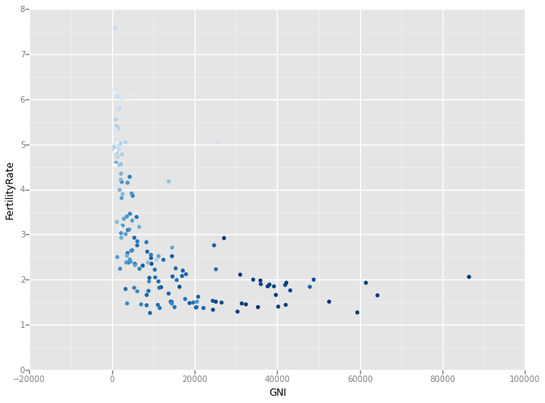
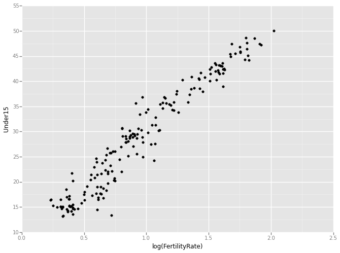
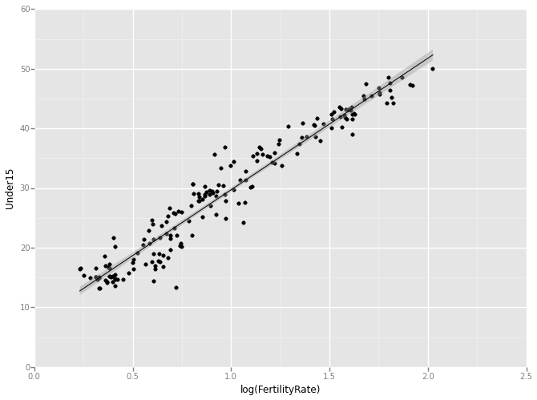

# WEEK 8 - Lecture 1
## VIDEO 4 - A BASIC SCATTERPLOT
## Read in data

    import os
    os.chdir('C:\\Users\\iris\\Downloads')
    import pandas as pd
    WHO = pd.read_csv("WHO.csv")
    def dfStr(df):
        print "The dataframe contains {0} rows and {1} columns".format(df.shape[0], df.shape[1])
        print "The data types of columns are: \n"
        print df.dtypes
    
    dfStr(WHO)

    The dataframe contains 194 rows and 13 columns
    The data types of columns are: 
    
    Country                           object
    Region                            object
    Population                         int64
    Under15                          float64
    Over60                           float64
    FertilityRate                    float64
    LifeExpectancy                     int64
    ChildMortality                   float64
    CellularSubscribers              float64
    LiteracyRate                     float64
    GNI                              float64
    PrimarySchoolEnrollmentMale      float64
    PrimarySchoolEnrollmentFemale    float64
    dtype: object
    

## Plot from Week 1

    WHO.plot('GNI', 'FertilityRate', kind = 'scatter')

    <matplotlib.axes._subplots.AxesSubplot at 0xa3dddd8>

## Let's redo this using ggplot
There is a `ggplot` library developed by `yhat` for python, but it is not as
developed as `ggplot2` in `R`.
Since the `ggplot` in `Python` is based on `matplotlib`, there are some small
differences.
Create the `ggplot` object with the data and the aesthetic mapping:

    from ggplot import *
    scatterplot = ggplot(aes(x = 'GNI', y = 'FertilityRate'), data = WHO)

## Add the geom_point geometry

    scatterplot + geom_point()

    <ggplot: (17833181)>

## Make a line graph instead:

    scatterplot + geom_line()

    <ggplot: (17775350)>

## Switch back to our points:

    scatterplot + geom_point()

    <ggplot: (10788707)>

## Redo the plot with blue triangles instead of circles:
To specify the type of plotting symbols, reference the
[marker](http://matplotlib.org/api/markers_api.html) in `matplotlib`
Also notice the `size` is different.

    scatterplot + geom_point(color = "blue", size = 50, shape = '^') 

    <ggplot: (10788717)>

## Another option:

    scatterplot + geom_point(color = "darkred", size = 50, shape = '*') 

    <ggplot: (19878397)>

## Add a title to the plot:

    scatterplot + \
        geom_point(colour = "blue", size = 50, shape = '^') +\
        ggtitle("Fertility Rate vs. Gross National Income")

    <ggplot: (19884190)>

## Save our plot:

    fertilityGNIplot = scatterplot + \
        geom_point(colour = "blue", size = 50, shape = '^') +\
        ggtitle("Fertility Rate vs. Gross National Income")
    ggsave("MyPlot.pdf", fertilityGNIplot)

    Saving 11.0 x 8.0 in image.
    

# VIDEO 5 - MORE ADVANCED SCATTERPLOTS
## Color the points by region:

    ggplot(aes(x = 'GNI', y = 'FertilityRate', color = 'Region'), data = WHO) +\
        geom_point()

    <ggplot: (17853458)>

## Color the points according to life expectancy:

    ggplot(aes(x = 'GNI', y = 'FertilityRate', color = 'LifeExpectancy'), data = WHO) +\
        geom_point()

    <ggplot: (19883454)>

## Is the fertility rate of a country was a good predictor of the percentage of
the population under 15?

    ggplot(aes(x = 'FertilityRate', y = 'Under15'), data = WHO) +\
        geom_point()

    <ggplot: (17503569)>

## Let's try a log transformation:

    ggplot(aes(x = 'log(FertilityRate)', y = 'Under15'), data = WHO) + \
        geom_point()

    <ggplot: (20084677)>

## Simple linear regression model to predict the percentage of the population
under 15, using the log of the fertility rate:

    import statsmodels.formula.api as smf
    mod = smf.ols('Under15 ~ log(FertilityRate)', data = WHO).fit()
    print mod.summary()

                                OLS Regression Results                            
    ==============================================================================
    Dep. Variable:                Under15   R-squared:                       0.939
    Model:                            OLS   Adj. R-squared:                  0.939
    Method:                 Least Squares   F-statistic:                     2790.
    Date:                Tue, 24 Mar 2015   Prob (F-statistic):          6.42e-112
    Time:                        13:15:36   Log-Likelihood:                -437.04
    No. Observations:                 183   AIC:                             878.1
    Df Residuals:                     181   BIC:                             884.5
    Df Model:                           1                                         
    Covariance Type:            nonrobust                                         
    ======================================================================================
                             coef    std err          t      P>|t|      [95.0% Conf. Int.]
    --------------------------------------------------------------------------------------
    Intercept              7.6540      0.448     17.094      0.000         6.771     8.538
    log(FertilityRate)    22.0547      0.418     52.821      0.000        21.231    22.879
    ==============================================================================
    Omnibus:                        6.698   Durbin-Watson:                   1.872
    Prob(Omnibus):                  0.035   Jarque-Bera (JB):                8.604
    Skew:                          -0.236   Prob(JB):                       0.0135
    Kurtosis:                       3.952   Cond. No.                         4.35
    ==============================================================================
    
    Warnings:
    [1] Standard Errors assume that the covariance matrix of the errors is correctly specified.
    

## Add this regression line to our plot:

    ggplot(aes(x = 'log(FertilityRate)', y = 'Under15'), data = WHO) + \
         geom_point() + \
         stat_smooth(method = "lm")

    <ggplot: (17853574)>

## 99% confidence interval

    ggplot(aes(x = 'log(FertilityRate)', y = 'Under15'), data = WHO) + \
         geom_point() + \
         stat_smooth(method = "lm", level = 0.99)

    <ggplot: (17981374)>

## No confidence interval in the plot

    ggplot(aes(x = 'log(FertilityRate)', y = 'Under15'), data = WHO) + \
         geom_point() + \
         stat_smooth(method = "lm", se = False)

    <ggplot: (19870892)>

## Change the color of the regression line:

    ggplot(aes(x = 'log(FertilityRate)', y = 'Under15'), data = WHO) + \
         geom_point() + \
         stat_smooth(method = "lm", color = 'orange')

    <ggplot: (17776977)>

