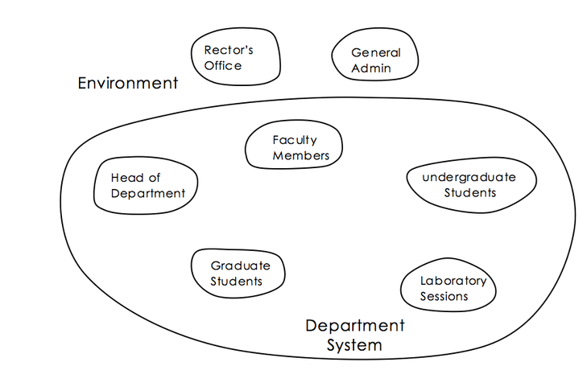

# Systems maps

A system map shows the components and boundary of a system and the components of the environment at a point in time. A system map is effectively a list of components, but some people find the graphical representation easier to assimilate.

The main use of a system map is to help structure a system and communicate the result to others. It allows you to: clarify thoughts at an early stage of analysis; decide on structural elements for a more detailed diagram of a different type; experiment with boundaries; decide on the level of interest, *i.e.* ‘focusing’; and communicate to others the basic structure of the system.

The elements of systems maps are blobs and words. Linking lines are not permitted.

#### The rules are:

- that the blobs represent boundaries of system components; words are used to name each component;
- blobs outside the main system boundary represent components of the environment;
- blobs inside the main system boundary represent components of the system, and components may themselves be grouped into subsystems;
- blobs may overlap only if one or more components (which need not be depicted) are common to both.

#### The guidelines for drawing system maps are:

- the system boundary must be clear;
- dashed lines can be used when boundaries are not clear;
- irregular blobs are preferable to regular boxes since the latter suggest precision;
- overlaps are to be avoided if possible;
- maps should show components but not try to represent their properties;
- the size of blobs does not represent importance, but avoid important blobs being smaller than less important blobs;
- blobs can be anywhere, but it is best to put important components close together;
- leave space in the map for clarity and later additions;
- don’t divide blobs except when emphasising a partition.

The systems map above shows the components of a university system, but not the relationships between them.

[**](https://www.futurelearn.com/courses/systems-thinking-complexity/3/steps/207342#fl-comments)