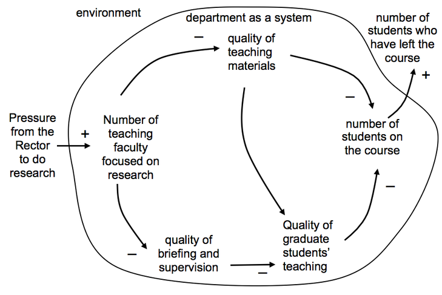

A sign graph depicting the influences resulting in students dropping out from a course.© CS-DC

# Sign graphs

Sign diagrams are used to represent relationships between variables. The go beyond the qualitative towards the quantitative. They are useful for investigating the likely effects of changes and interventions in a system.

In a sign diagram there are arrows between phrases showing how they interact. The arrows have signs according to whether they increase or decrease the value associated with the adjacent phrase.

The rules for drawing sign graphs are:

- a number(s) is associated with every phrase;
- the phrases do not themselves refer to variations (e.g. do not use ‘more, ‘less, ‘increase’, ‘decrease’ etc. in the phrases);
- a minus sign on an arrow means it produces an *opposite* change in the variable at the head;
- a plus sign means an arrow *reinforces* or *increases* the magnitude of the existing value.

The guidelines are:

- use the simplest diagram possible and elaborate it as necessary, in order to ensure the diagram is understood before it becomes too complex;
- when checking diagrams, it helps to ask ‘does more of the tail variable lead to more or less of the head variable?’;
- the diagram can be built up backwards, as with multiple cause diagrams, from a variable considered to be particularly important.

[**](https://www.futurelearn.com/courses/systems-thinking-complexity/3/steps/207345#fl-comments)