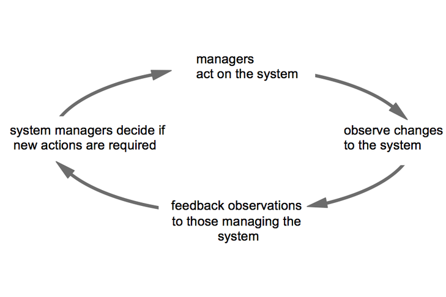

# Feedback and control

Feedback is a fundamental concept in systems thinking, and lack of appropriate feedback is often a cause of system failure.

The idea can be illustrated by a doctor treating a patient. After the first consultation, the doctor may prescribe a particular medicine. At the next session, the doctor asks if the patient feels better or is suffering any side effects. According to the feedback from the patient the doctor may continue with the same medicine or try something else.

Checking your bank balance is another form of feedback that guides your behaviour. If you are short of money, you may defer an expense.

Confusingly, this kind of feedback used to control systems is called negative feedback, even though its consequences such as changing inappropriate medicines could be considered to be positive.

It is called *negative feedback* because it provides information enabling the system to act against any deviation from the desired state.

Lack of appropriate feedback, or system owners and managers ignoring feedback, is a common cause of system failure.

**What do you think?**

Can you give an example of a feedback loop used to control a system? Write it in the comments below.

[** ](https://www.futurelearn.com/courses/systems-thinking-complexity/3/steps/207338#fl-comments)