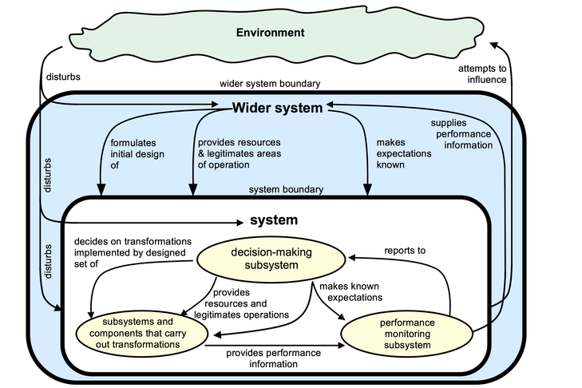

# Towards the Formal Systems Model

The image above is an illustration of the Formal Systems Model. We will work towards defining this model in the rest of the steps this week.

### Building a Formal Systems Model

This begins with *system maps*, which are drawn to show the structure of a system.

System maps are followed by *influence diagrams*, which represent the main structural features of a system and the important influences that exist among them.

*Multiple cause diagrams* are used to explore why changes or events happen in systems. They can give insights into the multiple causes of system behaviour and how to make undesirable behaviour less likely. *Sign graphs* provide a refinement of multiple cause diagrams.

Each of these will be considered as the building blocks for the Formal Systems Model shown above.

[**](https://www.futurelearn.com/courses/systems-thinking-complexity/3/steps/207341#fl-comments)