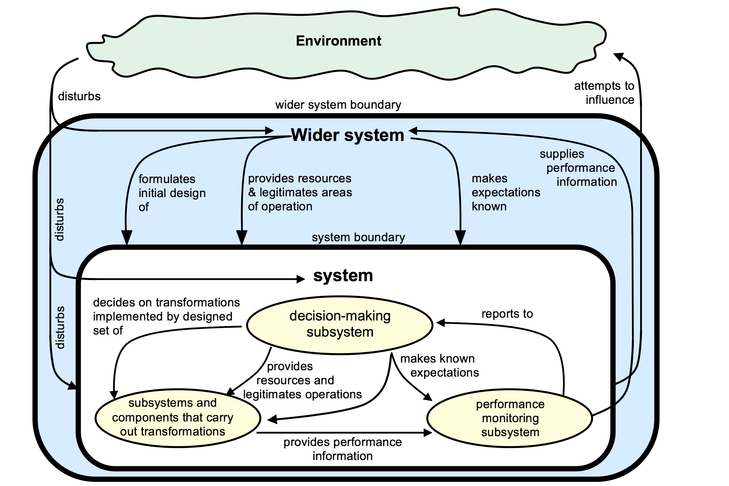

The Formal Systems Model© CS-DCC

# The Formal Systems Model

The diagram above, which you first saw in Week 1, shows a generalizable model of a robust system capable of purposeful activity without failure. It is called the Formal Systems Model [1].

At the centre of the diagram, against a white background, is the **system**. For example, this could be a local council in a city such as Birmingham.

## Case study: The city of Birmingham as a system

The system has a **decision-making subsystem** shown at the top-centre in yellow. In the case of Birmingham, the decision-making system is the city council and its officers. The decision-making system decides on the **transformations** the system needs to make and designs a set of subsystems and components to carry out those transformations. This is shown in yellow at the bottom left of the diagram. The decision-making system also has to provide the **necessary resources** required to carry out the transformations. For Birmingham Council, an example of a transformation is from full dustbins to empty ones, and these subsystems include the departments and infrastructure that provide its many services.

At the right of the white panel, shown in yellow, is the **performance monitoring subsystem**. For Birmingham this will include financial monitoring, and data such as the number of complaints about services from residents, and formal reports made to the Council by its various committees and the officers running its divisions and departments.

Typically, a system will exist within a **wider system**, shown in blue in the diagram. The wider system for Birmingham is the Government that designs and maintains the political and administrative structure of the UK. The Government makes known its **expectations** of Birmingham, provides **resources** to enable it to meet those expectations, and **legitimates** its areas of operation. The performance monitoring system provides **feedback** to the wider system. In the case of Birmingham its officers provide formal reports to the Government, and there are many other channels for feedback as well.

Finally, the system and wider system interacts with the **environment**, shown in green. The environment **disturbs** both the system and the wider system, and the system and wider system attempt to **influence the environment**. The environment for Birmingham includes many things, such as the market which provides it with goods and services, the financial climate, and so on.

### What do you think?

What is your view of the Formal Systems Model? Is it easy to understand? Is it clear how the components of the system and the relationships between them will be represented?

Can this model capture the dynamics of systems? Do you think it will be easy to apply by people who are not specialists in systems thinking? Give your views in the comments below.

### Reference

[1] Fortune, J., *Systems Paradigms*, Open University Press, 1993.