# Build a game playing agent

## Iterative Deepening

Search the level 1 and get an answer for what we thing is the best move, well keep that answer in case we run out of time but we'll start the process again and go to Level 2 this time.
If we finish searching Level 2 before time runs out, we'll keep its best move and restart the search from going from Level 3.
We'll continue doing this process until we run out of time and then return our best answer.

Iterative deepening doesn't waste that much time. Because of the exponential nature of the problem, the amount of time is dominated by the last level searched.
Iterative deepening means that our computer player always has an answer ready in case it runs out of time and it can search  as far as possible within its time constraints.

We limit our time to $2 sec$ per move. In some games like speed chess, we limit the total time a player can take for the entire game.
In those situations, our computer player will want to search deeper in some parts of the game, and shallower in other parts of the game.  Often we can crate a strategy for how deep we want to search.

TIP:
  - have a book of standar initial moves for beguining of game
  then search deeper in the middle and use less time towards the end relying on the reductin and branching Factor, iterative deepening to still allow our computer player to search to end of game or as deep as it can given the remaining time.

  - Or have a conservative amoutn of time we dedicate per move and use iterative deepening and quiescent searach to determine the few moves we wanted to spend extra time.
<!--  -->

### Understanding Exponential Time

$b=2, n = 2^{d+1}-1$
$b=3, n = \frac{3^{d+1}-1}{2}$

#### General formula
$b=k, n = \frac{k^{d+1}-1}{k-1}$

## Varying the Branch Factor

## Horizon Effect
A situation where is obvious to a human player that the game will be decided in the next move and a computer player cannot search far enough into the future to figure out the problem.

#### Option
- include  a check in the evaluation function to see if a partition is formed by the next move, and if so, Start counting the number of moves left to each player.
- COST?
Our evaluation function goes from a very simple function to compute to something that may involve a complicated check followed by a lot of counting.  Simply counting the number of squares a player can use is **similar to searching more levels down in the search  tree** and we know that is very time consuming.
So basically we just double the amount of time the evaluation function takes, that time become multiplied exponentially due to the branching factor as the search goes deeper.

### 
 Quiz: Good Evaluation Functions 

- *#* opponent_moves *(it would label board as good where opponent has a large number of moves)*
- *#* squares_remaining  *(it constantly decreasing with each move)*
- *#* squares_remaining - *#* my_moves *(penalize our comp player  for boards with more potential moves, which is counter productive)*
- *#* my_moves - *#* opponent_moves  *(it continues to take into account board shwere the current player can make a larger  num of moves, also penalizes boars where the opponent can make a large num of moves.)*    <--- answer

## Evaluating Evaluation Functions

`num_my_moves - num_opponent_moves`

The point of isolation is to illuminate the opponent's moves.
`num_my_moves` - `num_opponent_moves` causes the computer player to seek moves with the most options while trying to get in the way of the opponent's moves.

We can even weight the components of the  formula to try to encourage more aggressive or less aggressive game play.

Example:
`num_my_moves` $-$ $2*$`num_opponent_moves`  causes our computer player to chase after the opponent.

Steps for efficient game tree search before evaluation function:
- minimax
- iterative deepening
- ????

## Alpha beta pruning

Alpha-beta is a pruning technique that allows us to ignore whole sections of the game tree, but still get the  same answer as with minimax.

SO Alpha-beta never changes the answer and is more efficient than minimax.
#### Minimax tree for Level 3 of the five move Isolation board
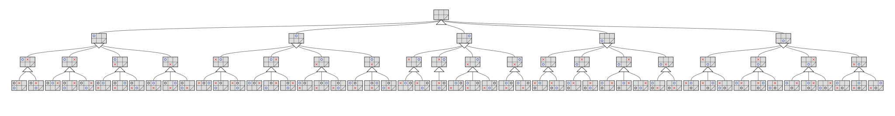

#### Branch 1
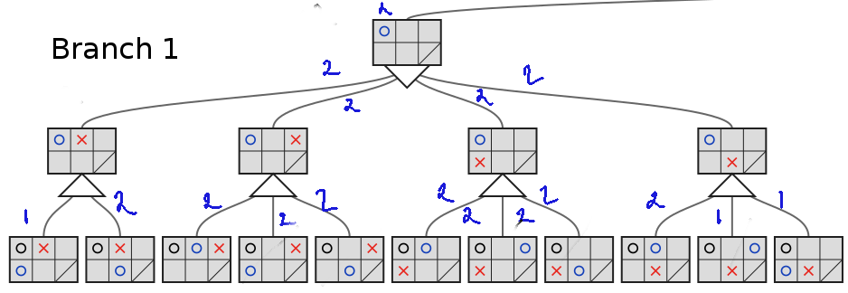

We assume that our player is evaluating the game tree from left to right.
We have 5 subtrees that we'll consider.
Looking at the first branch it has only two nodes with values of 1, and 2 respectively. Its the max level so we choose the 2 and propagate it up to the mean level.  Since the opponent **x** will choose a branch that minimizes the value, we know this subtree will have a value of 2 or less.  So That means for any of the remaining branches, as soon as we see a 2 or more, we could ignore the rest of the nodes because they will never be selected.  And we have 2s in the leftmost node of these three branches wich means we can ignore 6 of theser 11 nodes.

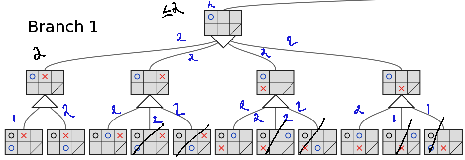

#### Branch 2:

As soon as we get to the two on the left hand branch, we know that this whole subtree is going to return a 2 or less.
But we already know that we have a two from `branch  1`, so at the highest node, we already know that we will get a 2 or more.

That means we can ignore all the remaining branches of the second sub tree
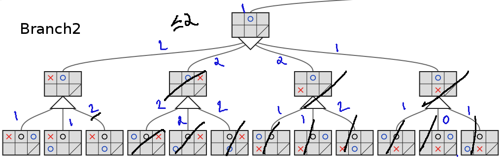

### Branch 3
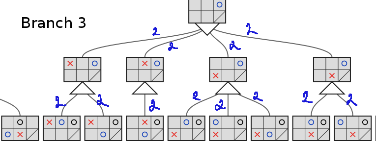
We get a 2 at the left most node, we don't have any constraints on the node above yet, so we keep exploring and get another 2. No other node is possible, so this max node returns a 2.

Now the node above is a minimizing  node, so it must return a 2 or less.

Thus because we know that the top most level already has a branch with a 2 value, we can ignore all the rest of the nodes in the subtree.
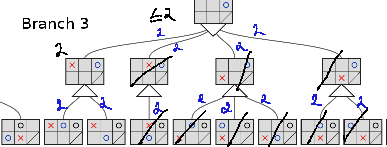

### Branch 4
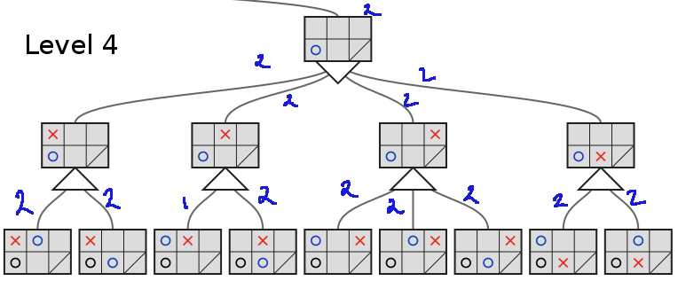
With the 4th sub tree we get a 2 early on, which means we can igonre most of the nodes in this subtree as well.

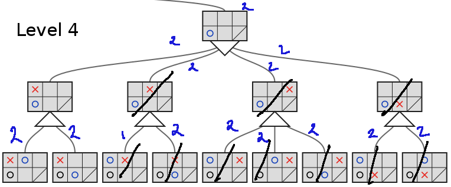

### Branch 5

Same this happens in this subtree.

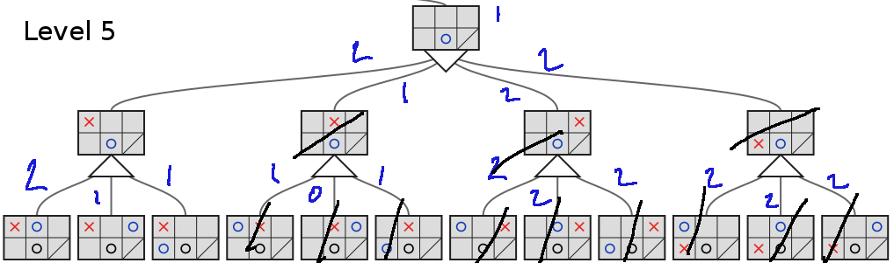

We assume that our goal is to play the game, not keep a list of all the equally good moves on a given level.
Out of 78  nodes, we only looked at 29 on the entire tree.

### **(optimal)** $b^d \to [\alpha-\beta] \to b^{\frac{d}{2}}$
### **(random)** $b^{\frac{3d}{4}}$

### Quiz: Minimax

Fill in the values in this minimax tree.

### Quiz: Minimax Alpha-beta

Which nodes can be  pruned with Alpha-beta?

### Quiz: Minimax Alpha-beta  Reordering Nodes

Reorder the leaf nodes of the tree in order to prune as as possible.
## Thad's Side notes
Many problems in AI are exponential in time, space or both.  *NP hard* problems are so common in AI that researchers joke half seriously, that AI is the study of finding clever hacks to exponential problems.  

Often when a clever hack is finally found,or when computers finally get fast enough to address that particular problem successfully, the world no longer thinks of the problem as one belonging  to artificial intelligence.

How many people thing about the system that helps consumers choose plane flights as an AI? Or the system that helps determine when to deploy an airbag on an SUV?

Yet at one point, these types of problems were considered to be part of AI.  That idea leads to another joke definition of AI.  Artificial intelligence consist of all the *NP hard* problems that have not yet been solved.

>What is exiting about AI, is that you get a chance to work on everyday problems that can improve peoples lives.

## Searching Complex games
### Reading
AIMA: Chapter 5.3-5.4

## Solving 5x5 Isolation

0. Implement the `minimax` algorithm with `Alpha-beta` pruning. This reduces the size of the search space from $b^d$ to $b^{\frac{d}{2}}$. Reducing it from approximately $8^{25}$to $8^{12}$.
0. Some moves are equivalent.

|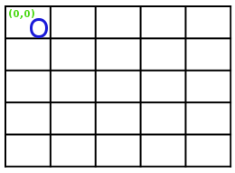 ||
|---|---|
| |   |

You can simply rotate the board $90^\circ$ and you have the same board state.

Therefore, if you know the game tree for our first move of $(0,0)$, you know the game tree for our first move of $(0,4)$. wich is the same as  $(4,4)$ and also  $(4,0)$

This is useful especially at the beginning of the game when the branching factor is high.
For example While player one has 25 possible moves.
### Six $1^{st}$Possible Moves

|Move   |equivalent values   | rotation|
|---|---|---|
||`[(0,0),(0,4),(4,4),(4,0)]`|rotate $90^\circ$|
||`[(0,2),(2,0),(2,4),(4,2)]`|rotate $90^\circ$|
||`[(1,1),(1,3),(3,1),(3,3)]`|rotate $90^\circ$|
||`[(1,2),(2,3),(3,2),(2,1)]`|rotate $90^\circ$|
||<ul><li>`[(1,0),(0,3),(3,4),(4,1)]`</li><li>`[(0,1),(3,0),(4,3),(1,4)]`</li></ul> |<ul><li>rotate $90^\circ$</li><li>transpose?</li></ul> |
|| `[(2,2)]`|no rotation|

## Symmetry
Symmetry cots down on the number of nodes we have to expand up to **level 3** of the search tree. After that, Symmetry is rare and the amount of effort needed to check for symmetry is not workt it.

You can know the outcome of the gamea as soon as there is a partition.  A partition separate two two players completely. Therefore, the player with the longest path wins.

|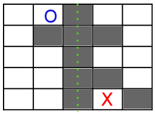|<ul><li>Player O has 8 moves</li><li>Player X has 6 moves</li></ul>|
|---|---|

### Aditional notes
- Player 2 always wins if they play optimally
- If player 1 first move is the center, and player 2 first move is one that player 1 can reflect, then player 1 can always win. All you have to do, is reflect every move player 2 makes.
- Player 2 avoid loosing my moving to a location that player 1 can not reflect.(8 possible moves)

#### TIPS
- If player 1, move to center square, then if possible, reflect player 2 moves.
- Its better to be player 2
- If player 1 does not occupy center square, then player 2 should occupy it.
- Create a good book of opening moves and hints
- use  your Understanding of opening moves and hash tables to load and search you order book efficiently
- You only have a limited amount of time to complete you move
- After exhausting you book of opening moves, implement minimax then add iterative deepening and finally Alpha-beta pruning.
- Finally focus on your evaluation Function

## 3 Player Games

### 3 player isolation
Same as Normal isolation but with 3 players trying to move, ilaicens can be formed but there can be only one winner.

Lets focus on `num_my_moves`. For multiplayer games we don't use **Minimax** anymore. Instead we evaluate the game board form the perspective of each player and propagate the values up the tree.

Lets imagine the 3-player isolation game where we search down to the level 3 of the tree.  On the leftmost branch we evaluate the  resulting game board from each of the players perspectives.
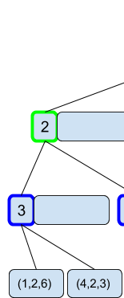
For player one, the valuation function returns a 1, for player 2 returns a 2 and for player 3 returns a 6.

We evaluate each of the boards nodes at this level and return triples for each of them. then we propigate the values up the tree.

|| at level 3, the max value nodes from leafs are added.       |
|-----------------------------------|--------|
||at level 2 the max nodes for level 2 are added   |
||at level 1, the max node according to level 1 is chosen.        |

### Quiz:

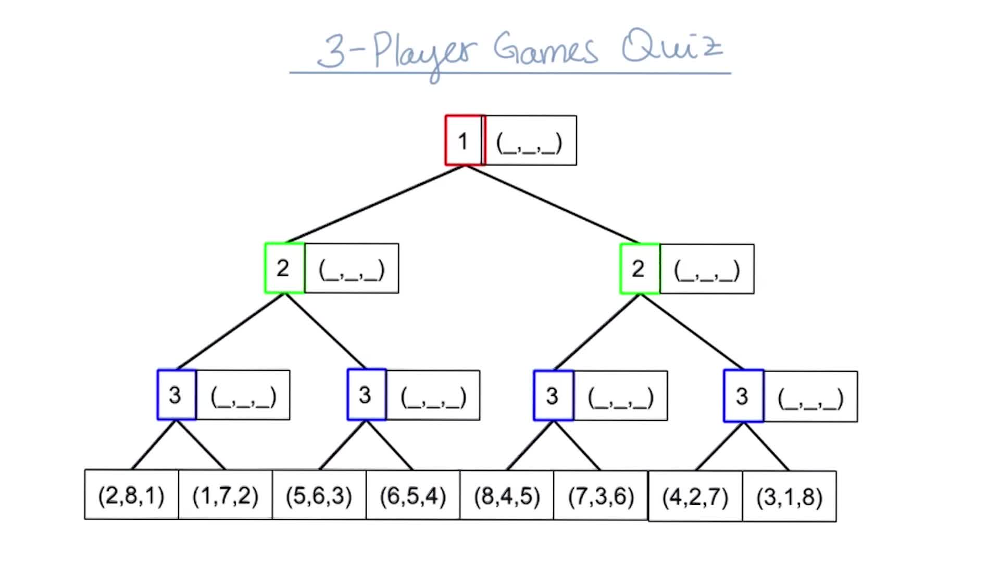
## 3-Player $\alpha-\beta$ pruning

According to a paper by `Korsh`, pruning can work as long as the values of the players and valuation function, has an upper bound and each player has a lower bound.

For our `num_of_my_moves`, the validation function for isolation, *zero* is a natural lower bound. but what about for upper bound?

If an evaluation function could estimate the number of total moves remaining for each player, it would work because the sum of the number of total moves should not exceed the number of empty squares on the isolation board.

#### Example 1:

This board, the limit should be **22**, or around **7** per player.
The upper bound would change  with each level of the game tree.

### Example 2:
For this example, We'll say the that the sum of the players  scores cant exceed **10**, and to make things easier, we'll say that the sum has to equal exactly **10**.
This will allow pruning.

This will allow both immediate pruning and shallow pruning. (no deep pruning )

##### Imeddiate pruning

Lets look at the left most bottom branch of the search tree.  Since we know the maximum value is **10**, there is no point in evaluation the next to branches to the right, they can return at most 10, and we already have that option. We can safely ignore them and propagate the values up the tree.

The value of `player 1` could be anywhere form 0 to 10 and the other values will be less than 10

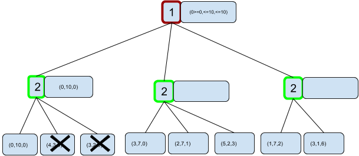

At the bottom level of the middle branch, `player 2`  will pick the left most option.

Now we see `player 1` will have a value grater than or equal to three, and since the sum has to be **10**, each of the others are limited to values less than or equal to **7**.

But in the next branch over, `player 2` will get a **7** or better.  Which means that `player 1` will get a **3** or less.

Since we already have a **3**, we can prune this last branch, its values will not mater, because we]re going to choose the option we already hae.

#
#### Quiz 3-Player MAX-MAX-MAX Pruning:

Fill in the value ranges for this tree player game tree and select which branches can be pruned.  The maximum combine score is **9**.  In this situation that means  that the sum of all three scores is less than or equal to **9**.  Since we are using  alpha beta, you can enter an exact number like 4 or a range like less than or equal to 4.

IF a branch is pruned, you may only be able to express it's parent's value as a range(e.g <=4). This must propagate up as per MAX-MAX-MAX rules.

For the first branch we pick the option where `player 2` has the best score

For the second branch, we'll start with the first leaf node on the left. `player 2` is only concerned with maximizing their own score, so we know they will choose a node where they get greater than or equal to **7**.  Because the scores add up to **9**, this restricts the other scores to at most less than **2**.

However, the next level up is player 1's move and they already have a better choice from the left branch, 3 compared to less than or equal to **2**.  That means that there is no way they will choose this second branch so we'll prune the remaining two nodes.

For the last branch, we can prune the right leaf node for the same reason.

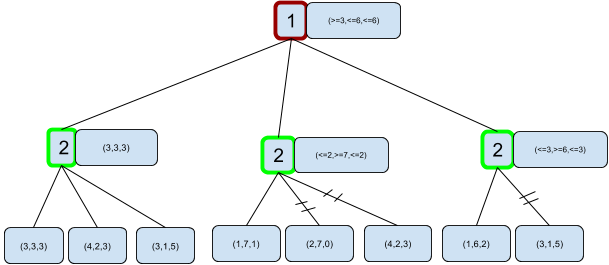

## Multi-player Alpha-Beta Pruning
Reading
Korf, 1991, Multi-player alpha-beta pruning.

In the above paper, you will get a chance to generalize minimax search techniques to games with more than three players. As you'll see, alpha-beta pruning doesn't work quite as effectively in this case as in the general case. Here are a few questions to keep in mind while reading through this paper:

Why might alpha-beta pruning only work well in the two player case?
How does the size of the search tree change with more than two players?

## Probabilistic game

For a Probabilistic game like backgammon you moves are limited each term base on the roles of two dice since you cant know the results of the dice ahead of time, it would seem at first that you can't do a game tree.
You can use an algorithm called **Expectimax**

### Sloppy Isolation

To show how Probabilistic games work, here is a version of isolation called Sloppy isolation.
In this game, player may not actually move where they intended.

#### Suppose the computer player is in place where moving is very constrained.
- Here the computer player is moving to the right, it can't go beyond the border, In that case, there is a **100%** chane it'll land on the intended square.

- Here, if the computer player is trying to move to the last square, there's a  **90%** of hitting its intended square and a **10%** chance of it falling short.

- Similarly, if our computer player is just trying to move over by one, there is a **90%** chance it will hit  the square, and a **10%** chance it will overshoot.

## Sloppy Isolation Expectedmax

## Alpha-Beta Expectedmax

The leftmost branches values calculated the probababilty chance percentage * the (min or max) value of the node.

#### left branch.
- $0.1*8$
- $0.5*5$
- $0.4*8$
- $= 0.1*8 + 0.5*5 + 0.4*8$
- $6.5$

#### middle branch
- $0.5*0$
- $0.5*5$
- $= 0.5*0 + 0.5*5$
- $= $

#### right branch
