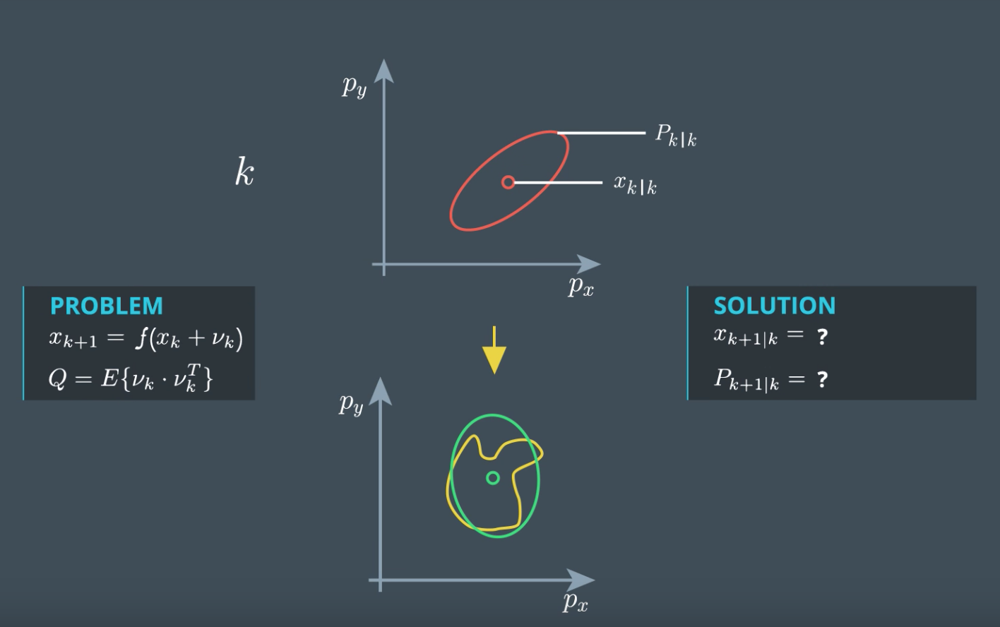

To deal with nonlinear functions, the UKF uses the unscented transformation. Let's quickly summarize again what the problem is with nonlinear process models or nonlinear measurement models.  

  Let's start again from the point where we have the state vector mean x and the state covariance P a time step k.  

What we want to do is predict the mean and the covariance to time step k+1.  So we have X k + 1 | k, and P k + 1 | k. You haven't seen this notation system yet.  I want to introduce it here because it is often used in the literature or  on Wikipedia.  

k | k means the estimation is for time step k, and  the measurement at time k has already been taken into account.  The is also called the **posterior** estimation. 

 k +1 | k means the estimation is for time k+1 but  the last measurement that has been taken into account was from k.  This is exactly what we have after the prediction.  And this is also called the a **priori** estimation.  

Now, what do these ellipses mean?  They visualize the distribution of our uncertainty.  All points on this line have the same probability density.  If the uncertainty is normally distributed,  these points have the shape of a **ellipse**.  It is often called **error ellipse**.  It can be seen as the visualization of the covariance matrix P.  If the process model is linear, the prediction problem looks like this.  

Here, Q is the covariance matrix of the process noise.  We can use the Kalman filter to solve this linear prediction problem.  How does this case look like if the process model is nonlinear?  Then the prediction is defined by a nonlinear function, f,  as we've just derived it for the CTR remodel.  

Predicting with a nonlinear function provides a distribution which is  generally not normally distributed anymore.  Actually it's not so easy to calculate this predicted distribution.  Generally, it can only be calculated numerically.  

Let's say we use some fancy algorithm which can do that, and  let it run for a while.  Then result might look like this.  

By the way, later in the localization course you will implement an algorithm  that does this kind of numerical calculation.  It's called a **Particle Filter**.  As you can see, this is not a normal distribution anymore.  Otherwise, it would be an ellipse again.  So the predicted state distribution is not normally distributed anymore.  But what the UKF does is keep going  as if the prediction was still normally distributed.  

This is not an analytical path anymore.  Of course, it is an approximation.  What we want to find now is the normal distribution  that represents the real predicted distribution as close as possible.  So what we are looking for is the normal distribution that has the same mean  value and the same covariance matrix as the real predicted distribution.  And this mean value and the covariance matrix might look like this.  

The question is, how do we find this mean vector and this covariance matrix?  And this is what the unscented transformation does for  us, as I will show you in the next video. 