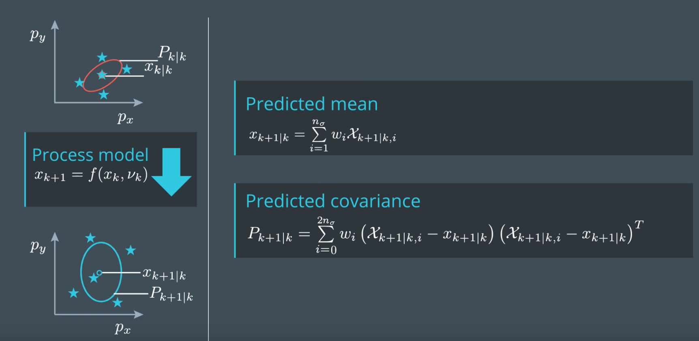
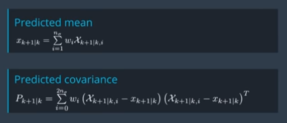
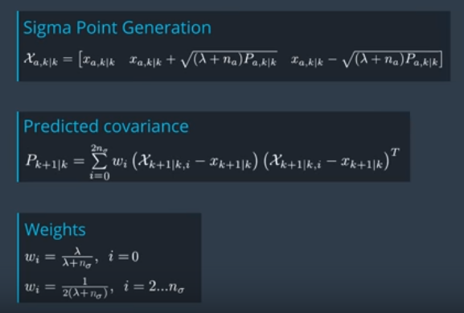

We can calculate the mean and covariance of the predicted state using the predicted sigma points. 


The standard rule for calculating the mean and covariance for a group of state samples is given by these equations:



We can calculate the mean and covariance of the predicted state using the predicted sigma points. The standard rule for calculating the mean and covariance for a group of state samples is given by these equations:

In this quiz, we have two objects we want to calculate. The mean predicted state X and the state prediction covariance P. This time we started the point but we already have the predicted sigma points. This is a vector where you can put them the weights for the sigma points. This is the vector for the predicted state mean and this is the metrics for the state prediction conversions. Good luck with this quiz. 

We can calculate the mean and covariance of the predicted state using the predicted sigma points. The standard rule for calculating the mean and covariance for a group of state samples is given by these equations:



The index **i** means we are talking about the column **i** of the matrix. We also have the weights to consider for each sigma point:



In the above image you can see how the weights are calculated, and how they depend on lambda. We have predicted sigma points and we want to recover the covariance matrix. We need to use lambda to invert the spreading of the sigma points, and this is what the weights do.

### Code

main.cpp:

```c++
#include <iostream>
#include "Dense"
#include <vector>
#include "ukf.h"

using namespace std;
using Eigen::MatrixXd;
using Eigen::VectorXd;
using std::vector;

int main() {

    //Create a UKF instance
    UKF ukf;

/*******************************************************************************
* Programming assignment calls
*******************************************************************************/
    
    VectorXd x_pred = VectorXd(5);
    MatrixXd P_pred = MatrixXd(5, 5);
    ukf.PredictMeanAndCovariance(&x_pred, &P_pred);

    return 0;
}
```

ukf.cpp:

```c++
#include <iostream>
#include "ukf.h"

UKF::UKF() {
  //TODO Auto-generated constructor stub
  Init();
}

UKF::~UKF() {
  //TODO Auto-generated destructor stub
}

void UKF::Init() {

}

/*******************************************************************************
* Programming assignment functions: 
*******************************************************************************/

void UKF::PredictMeanAndCovariance(VectorXd* x_out, MatrixXd* P_out) {

  //set state dimension
  int n_x = 5;

  //set augmented dimension
  int n_aug = 7;

  //define spreading parameter
  double lambda = 3 - n_aug;

  //create example matrix with predicted sigma points
  MatrixXd Xsig_pred = MatrixXd(n_x, 2 * n_aug + 1);
  Xsig_pred <<
         5.9374,  6.0640,   5.925,  5.9436,  5.9266,  5.9374,  5.9389,  5.9374,  5.8106,  5.9457,  5.9310,  5.9465,  5.9374,  5.9359,  5.93744,
           1.48,  1.4436,   1.660,  1.4934,  1.5036,    1.48,  1.4868,    1.48,  1.5271,  1.3104,  1.4787,  1.4674,    1.48,  1.4851,    1.486,
          2.204,  2.2841,  2.2455,  2.2958,   2.204,   2.204,  2.2395,   2.204,  2.1256,  2.1642,  2.1139,   2.204,   2.204,  2.1702,   2.2049,
         0.5367, 0.47338, 0.67809, 0.55455, 0.64364, 0.54337,  0.5367, 0.53851, 0.60017, 0.39546, 0.51900, 0.42991, 0.530188,  0.5367, 0.535048,
          0.352, 0.29997, 0.46212, 0.37633,  0.4841, 0.41872,   0.352, 0.38744, 0.40562, 0.24347, 0.32926,  0.2214, 0.28687,   0.352, 0.318159;

  //create vector for weights
  VectorXd weights = VectorXd(2*n_aug+1);
  
  //create vector for predicted state
  VectorXd x = VectorXd(n_x);

  //create covariance matrix for prediction
  MatrixXd P = MatrixXd(n_x, n_x);


/*******************************************************************************
 * Student part begin
 ******************************************************************************/

  // set weights
  double weight_0 = lambda/(lambda+n_aug);
  weights(0) = weight_0;
  for (int i=1; i<2*n_aug+1; i++) {  //2n+1 weights
    double weight = 0.5/(n_aug+lambda);
    weights(i) = weight;
  }

  //predicted state mean
  x.fill(0.0);
  for (int i = 0; i < 2 * n_aug + 1; i++) {  //iterate over sigma points
    x = x+ weights(i) * Xsig_pred.col(i);
  }

  //predicted state covariance matrix
  P.fill(0.0);
  for (int i = 0; i < 2 * n_aug + 1; i++) {  //iterate over sigma points

    // state difference
    VectorXd x_diff = Xsig_pred.col(i) - x;
    //angle normalization
    while (x_diff(3)> M_PI) x_diff(3)-=2.*M_PI;
    while (x_diff(3)<-M_PI) x_diff(3)+=2.*M_PI;

    P = P + weights(i) * x_diff * x_diff.transpose() ;
  }


/*******************************************************************************
 * Student part end
 ******************************************************************************/

  //print result
  std::cout << "Predicted state" << std::endl;
  std::cout << x << std::endl;
  std::cout << "Predicted covariance matrix" << std::endl;
  std::cout << P << std::endl;

  //write result
  *x_out = x;
  *P_out = P;
}
```

ukf.h:

```c++
#ifndef UKF_H
#define UKF_H
#include "Dense"
#include <vector>

using Eigen::MatrixXd;
using Eigen::VectorXd;

class UKF {
public:


  /**
     * Constructor
     */
    UKF();

    /**
     * Destructor
     */
    virtual ~UKF();

    /**
     * Init Initializes Unscented Kalman filter
     */
    void Init();

  /**
   * Student assignment functions
   */
  void GenerateSigmaPoints(MatrixXd* Xsig_out);
  void AugmentedSigmaPoints(MatrixXd* Xsig_out);
  void SigmaPointPrediction(MatrixXd* Xsig_out);
  void PredictMeanAndCovariance(VectorXd* x_pred, MatrixXd* P_pred);
  void PredictRadarMeasurement(VectorXd* z_out, MatrixXd* S_out);
  void UpdateState(VectorXd* x_out, MatrixXd* P_out);

};

#endif /* UKF_H */
```

