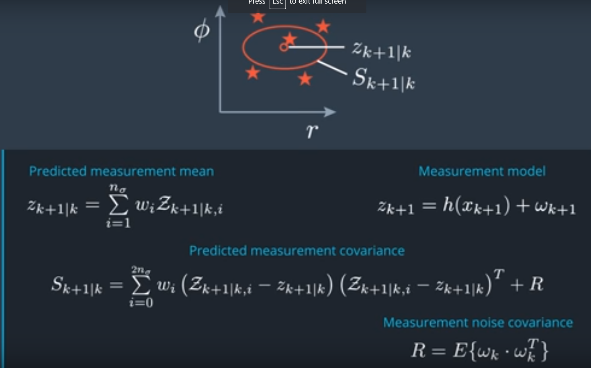

You have successfully predicted the state mean and covariance matrix. Terrific, this means we can go into the update step now and predict the measurement. This is where we are now. We have successfully predicted the state from times step k to times k step plus one. 


Now we have to transform the predicted state into the measurement space. The function that defines this transformation is the measurement model. Of course, now we have to consider what kind of sensor produced the current measurement and use the corresponding measurement model. The problem we have here is very similar to the problem we had in the prediction step. We need to transform a distribution through a non linear function so we can apply exactly the same on center transformation approach as we did before during the state prediction. However, we can take two shortcuts here and make it a little easier. Let me show you how. The first thing we did in the prediction step was generating [INAUDIBLE] points. We could do the same here again using the predicted mean and covariance matrix. However, a popular shortcut is to just reuse the signal points we already have from the prediction step. So we can skip generating sigma points this time. In this very case, we can also skip the augmentation step. Why is that? We needed the augmentation because the process noise had a non linear effect on the state. Let's assume we're talking about a greater measurement in this example. Here the measurement model was a non linear fraction, but the measurement noise had a purely additive effect. In this case we don't need to perform an augmentation, there is an easier way to consider the measurement noise. I will show you later how this works. So the only thing that's left for us to do is actually transforming the individual sigma points we already have into the measurement space and using them to calculate the mean and the covariance matrix S of the predicted measurement. Again, we want to store the transformed measurement signal points as columns in a matrix. I call this matrix colorgraphic Z. Remember the measurement space of the rater. This was the radial distance rho, the angle phi, and the radial velocity rho dot, so it is a three dimensional space. This means the matrix with the measurement sigma points has three rows and 15 columns in our case. Regarding for the measurement noise omega, just put in 0 here, since we will account for the measurement noise later. Now that we have the sigma points and the measurement space, We want to calculate the resulting mean and covariance of the predicted measurement. This is also very similar as before and given by these equations. The only thing that comes in addition here is that we add the measurement covariance noise. This is how we account for the measurement noise. Remember, we can do this instead of the augmentation here, because the measurement noise in our case does not have a non-linear effect on the measurement but it's purely additive. And that's how you predict the measurement mean and covariance. It's exactly the same problem set as before, but by using the two sharp cards I just introduced, it is a very easy step. After this step you have made it almost through the UKF processing chain. 


# Measurement Prediction

Now that we have successfully predicted the state mean and covariance matrix, we can start the update step of the UKF. The first part of the update step is predicting the measurement.

Up until this point we have successfully predicted the state from times **k** to time step **k+1**. Now we have to transform the predicted state into the measurement space. The function that defines this transformation is the measurement model. Now we have to consider what kind of sensor produced the current measurement, and use the corresponding measurement model.

The problem we have here is very similar to the problem we had in the prediction step. We need to transform a distribution through a nonlinear function. We can apply exactly the same center transformation approach as we did before during the state prediction. However, we can take two shortcuts to make it easier.

Since the first thing we did in the prediction step was to generate sigma points, we could do the same here again using the predicted mean and covariance matrix. However, we can just reuse the sigma points we already have from the prediction step, so we don't need to generate new ones. We can also skip the augmentation step since the process noise had a nonlinear effect on the state.

The only thing that is left to do is to transform the original sigma points we already have into the measurement space and use them to calculate the mean and the covariance matrix **s** of the predicted measurement. We want to store the transformed measurement sigma points as columns in a matrix. We can call this matrix **calligraphic z**. Remember to measurement space of the radar: the radial distance rho, the angle phi, and the radial velocity rho dot, so it is a three dimensional space. This means the matrix with the measurement sigma points has three rows and fifteen columns in our case. We will put in 0 for the measurement noise **omega** since we will account for the measurement noise later.

Now that we have the sigma points and the measurement space, we want to calculate the resulting mean and covariance of the predicted measurement. This is also very similar and given by these three equations:



The only thing that comes in addition here is that we add the measurement covariance noise. This is how we account for the measurement noise. We can do this instead of the augmentation here, because the measurement noise in this case does not have a nonlinear effect on the measurement but it's purely additive.

------

### Code

main.cpp:

```c++
#include <iostream>
#include "Dense"
#include <vector>
#include "ukf.h"

using namespace std;
using Eigen::MatrixXd;
using Eigen::VectorXd;
using std::vector;

int main() {

    //Create a UKF instance
    UKF ukf;

/*******************************************************************************
* Programming assignment calls
*******************************************************************************/
    
    VectorXd z_out = VectorXd(3);
    MatrixXd S_out = MatrixXd(3, 3);
    ukf.PredictRadarMeasurement(&z_out, &S_out);

    return 0;
}
```

ukf.cpp:

```c++
#include <iostream>
#include "ukf.h"

UKF::UKF() {
  //TODO Auto-generated constructor stub
  Init();
}

UKF::~UKF() {
  //TODO Auto-generated destructor stub
}

void UKF::Init() {

}

/*******************************************************************************
* Programming assignment functions: 
*******************************************************************************/

void UKF::PredictRadarMeasurement(VectorXd* z_out, MatrixXd* S_out) {

  //set state dimension
  int n_x = 5;

  //set augmented dimension
  int n_aug = 7;

  //set measurement dimension, radar can measure r, phi, and r_dot
  int n_z = 3;

  //define spreading parameter
  double lambda = 3 - n_aug;

  //set vector for weights
  VectorXd weights = VectorXd(2*n_aug+1);
   double weight_0 = lambda/(lambda+n_aug);
  weights(0) = weight_0;
  for (int i=1; i<2*n_aug+1; i++) {  
    double weight = 0.5/(n_aug+lambda);
    weights(i) = weight;
  }

  //radar measurement noise standard deviation radius in m
  double std_radr = 0.3;

  //radar measurement noise standard deviation angle in rad
  double std_radphi = 0.0175;

  //radar measurement noise standard deviation radius change in m/s
  double std_radrd = 0.1;

  //create example matrix with predicted sigma points
  MatrixXd Xsig_pred = MatrixXd(n_x, 2 * n_aug + 1);
  Xsig_pred <<
         5.9374,  6.0640,   5.925,  5.9436,  5.9266,  5.9374,  5.9389,  5.9374,  5.8106,  5.9457,  5.9310,  5.9465,  5.9374,  5.9359,  5.93744,
           1.48,  1.4436,   1.660,  1.4934,  1.5036,    1.48,  1.4868,    1.48,  1.5271,  1.3104,  1.4787,  1.4674,    1.48,  1.4851,    1.486,
          2.204,  2.2841,  2.2455,  2.2958,   2.204,   2.204,  2.2395,   2.204,  2.1256,  2.1642,  2.1139,   2.204,   2.204,  2.1702,   2.2049,
         0.5367, 0.47338, 0.67809, 0.55455, 0.64364, 0.54337,  0.5367, 0.53851, 0.60017, 0.39546, 0.51900, 0.42991, 0.530188,  0.5367, 0.535048,
          0.352, 0.29997, 0.46212, 0.37633,  0.4841, 0.41872,   0.352, 0.38744, 0.40562, 0.24347, 0.32926,  0.2214, 0.28687,   0.352, 0.318159;

  //create matrix for sigma points in measurement space
  MatrixXd Zsig = MatrixXd(n_z, 2 * n_aug + 1);

/*******************************************************************************
 * Student part begin
 ******************************************************************************/

  //transform sigma points into measurement space
  for (int i = 0; i < 2 * n_aug + 1; i++) {  //2n+1 simga points

    // extract values for better readibility
    double p_x = Xsig_pred(0,i);
    double p_y = Xsig_pred(1,i);
    double v  = Xsig_pred(2,i);
    double yaw = Xsig_pred(3,i);

    double v1 = cos(yaw)*v;
    double v2 = sin(yaw)*v;

    // measurement model
    Zsig(0,i) = sqrt(p_x*p_x + p_y*p_y);                        //r
    Zsig(1,i) = atan2(p_y,p_x);                                 //phi
    Zsig(2,i) = (p_x*v1 + p_y*v2 ) / sqrt(p_x*p_x + p_y*p_y);   //r_dot
  }

  //mean predicted measurement
  VectorXd z_pred = VectorXd(n_z);
  z_pred.fill(0.0);
  for (int i=0; i < 2*n_aug+1; i++) {
      z_pred = z_pred + weights(i) * Zsig.col(i);
  }

  //measurement covariance matrix S
  MatrixXd S = MatrixXd(n_z,n_z);
  S.fill(0.0);
  for (int i = 0; i < 2 * n_aug + 1; i++) {  //2n+1 simga points
    //residual
    VectorXd z_diff = Zsig.col(i) - z_pred;

    //angle normalization
    while (z_diff(1)> M_PI) z_diff(1)-=2.*M_PI;
    while (z_diff(1)<-M_PI) z_diff(1)+=2.*M_PI;

    S = S + weights(i) * z_diff * z_diff.transpose();
  }

  //add measurement noise covariance matrix
  MatrixXd R = MatrixXd(n_z,n_z);
  R <<    std_radr*std_radr, 0, 0,
          0, std_radphi*std_radphi, 0,
          0, 0,std_radrd*std_radrd;
  S = S + R;

  
/*******************************************************************************
 * Student part end
 ******************************************************************************/

  //print result
  std::cout << "z_pred: " << std::endl << z_pred << std::endl;
  std::cout << "S: " << std::endl << S << std::endl;

  //write result
  *z_out = z_pred;
  *S_out = S;
}
```

ukf.h: