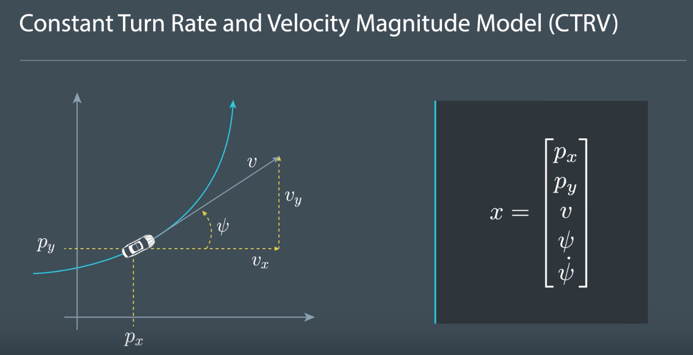

## CTRV - State Vector

The model we use so far assumes objects always keep going straight.The model we will use from now on assumes objects can move straight, but they can also move with a constant turnrate and a constant velocity magnitude.This model is often called the CTRV model.

Let's have a look at the statevector we are going to use.

- We keep calling the two-dimensional position of the bike px and py,where p stands for position.
- But instead of describing the velocity with vx and vy, we use the Speed(v) and yaw angle (ψ).

The speed is the magnitude of the velocity, which we'll call v.And the yaw angle is the orientation,which we'll call psi.Since we also want to be able to estimate the yaw rate psi dot,we add it to the state vector too.

Constant yaw rate and constant speed is a good model for vehicle behavior in real traffic scenarios.Let's try to get a feeling for that.

Vehicle moving in a straight line has a yaw rate (psi dot) of zero.