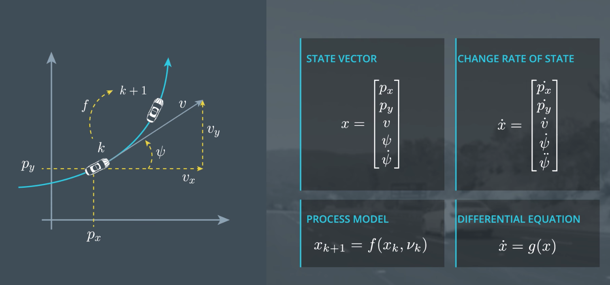

## CTRV Differential Equation

Now, let's take a look at how the assumption of a circular motion  leads to a process model.  So in this example, at time k, the car's here.  The goal of the process model **f** is to predict where the car is at time **k + 1**.  

Written as an equation, it looks like this.  

Prediction: find f, where .

The process model f predicts the state at time step k + 1.  Given the state at time step k and  a noise vector ν k, this is the function we want to find.  What we want to do now is derive this process model.  I will show you a very general and, therefore, powerful approach.  

You will be able to use this approach to derive process models for  many, many real world problems.  We cannot directly write down the process model simply by looking at this  figure.  But we can say something about the change rate of the state x,  called x dot.  From the geometric relations,  we can directly derive how the change rate x dot depends on the state x.  



Let us derive this differential equation.  The goal is to express each of the five-time relatives of the state,  independency of any of the state elements.

Lets take example of Px dot, it is the same as the velocity in x direction.  But unfortunately, the velocity in x direction  is not part of the state vector, otherwise, we would be finished already.  But the speed V and the origin of psi are both elements of the state vector.  And if I look at this triangle,  I can identify that 

`Vx = v * cos(ψ) ` 

Hence,

px_dot=cos(ψ)⋅v

Now, go ahead and pick the correct terms for  the four remaining change rates of the state. 

```
px_dot=cos(ψ)⋅v
py_dot = sin(ψ)⋅v
v_dot = 0 (as velocity is constant)
ψ_dot = ψ_dot
ψ_dot_dot = 0
```

(ψ-dot-dot is 0 as this is yaw acceleration, which is 0 if you assume a constant turn rate as in the CTRV model.)

