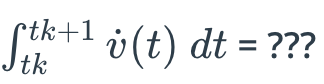

## CTRV Integral 1

We have the complete differential equation now, awesome.  

But how do we get from time step k to time step k+1? Let's say the discrete time step k relates to the continuous time value tk,  and the discrete time step k+1 relates to the continuous time value tk + 1.  The difference between tk +1 and tk is called Delta t.  

Δt = tk+1 - tk

Then this date at time k + 1 is given by the state of time  k + the integral over x_dot, from time tk to time tk + 1.  This can potentially be a very complex calculation.  

But in the special case of the CTRB,  this integral can be solved pretty easily.  In the first two rows, I will just insert the terms of the differential  equation without solving the integral, we will do this later.  Let's start with the last three rows which are the easiest.  Even if you don't really remember how to solve an integral,  you still might be able to choose the correct answer in the quiz below.  Remember we assume the weight and velocity are constant. 

What will be the solution of this?

The answer is 0, as v_dot is 0. Likewise we calculate remaining last 2. Here is the solution:

