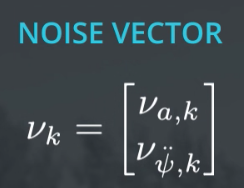
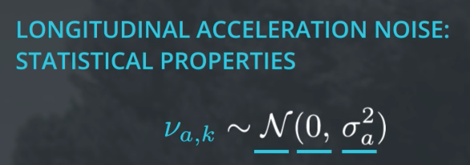

## CTRV Process Noise Vector

What we have introduced so far was the deterministic part of the process model.  But of course, we also need to consider the stochastic part of the process model  and that has something to do with the process noise νk.  

Note the notations:

- νk - Process noise
- νa,k - Longitudinal acceleratation noise
- νψ_dot_dot,k - Yaw acceleratation noise

We will describe the uncertainty of the process model with a two-dimensional  noise vector νk, consisting of two independent scalar noise processes.  

The first noise process is the longitudinal acceleration noise νa,k.  νa,k influences the longitudinal speed of the vehicle and  it randomly changes its value at every time step k.  The longitudinal acceleration is a normally distributed white  noise with zero mean and the variance sigma a squared.  

The other noise process is the yaw acceleration νψ_dot_dot,k.  It is also a normal distributed white noise with zero mean and  it has the variance sigma yaw dot dot squared.  

And what I want to discuss with you next is how the noise vector νk influences our process model. 

