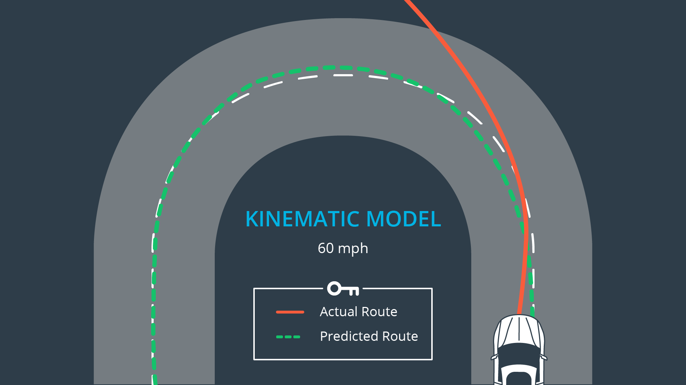
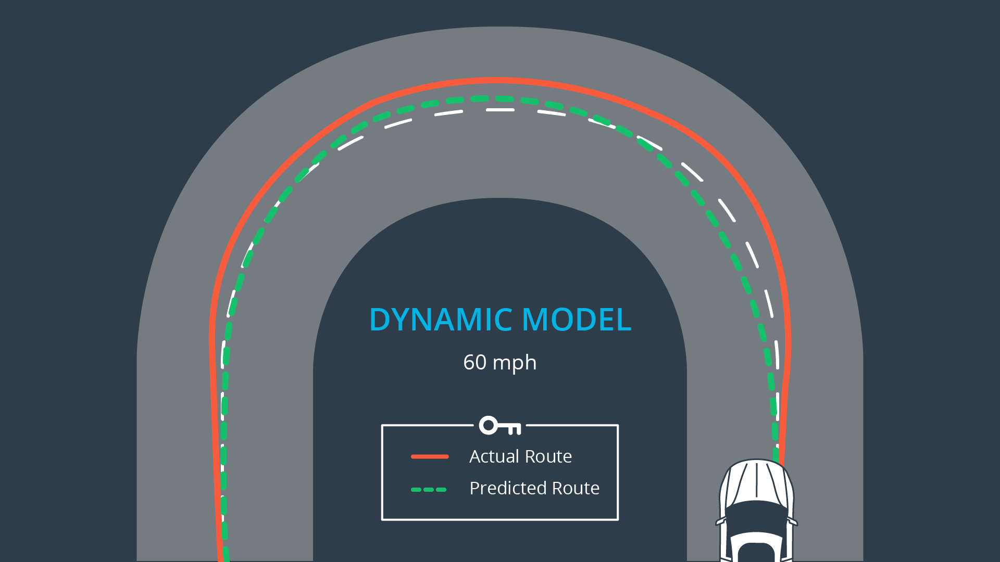

# Vehicle Models

### Kinematic Models

Kinematic models are simplifications of dynamic models that ignore tire forces, gravity, and mass. This simplification reduces the accuracy of the models, but it also makes them more tractable (easy to control or influence). At low and moderate speeds, kinematic models often approximate the actual vehicle dynamics.

The vehicle is forced off the road due to forces not accounted for

***

### Dynamic Models

Dynamic models aim to embody the actual vehicle dynamics as closely as possible. They might encompass tire forces, longitudinal and lateral forces, inertia, gravity, air resistance, drag, mass, and the geometry of the vehicle. Not all dynamic models are created equal! Some may consider more of these factors than others. Advanced dynamic models even take internal vehicle forces into account - for example, how responsive the chassis suspension is.

The dynamic model is able to stay on the road, knowledge of forces is embedded in the model
