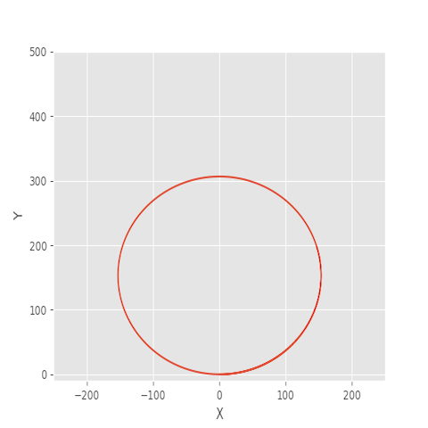

# Building A Kinematic Model

Now that we have established state as the values **x, y, ψ,** and **v**. We want to derive a model that captures how the state evolves over time, and how we can take an input to change it. Actual inputs allow us to control the vehicle state. 

### Actuators [δ,a]

Actuator inputs allow us to control the vehicle state.

Most cars have three actuators:

- the steering wheel
- the throttle pedal and
- the brake pedal.

For simplicity, we'll consider the throttle and brake pedals as a single actuator with negative values signifying braking and positive values signifying accelerating. This reduces the vehicle to two control inputs which we will denotes as **delta** for steering angle and **a** for acceleration - both positive or negative i.e.:

- δ for steering angle and a for acceleration (throttle/brake combined).

Now the model looks like this:

#### State: [x, y, ψ, v]

#### Control inputs: [delta, a]

***

### Which equation correctly models x?

x = x + v * cos(psi) * dt

### This equation models 'y' effectively:

y = y + v * sin(psi) * dt

### This equation models 'v' effectively

v=v+a∗dt

where a in [-1,1]

### This equation models 'ψ' effectively

ψ = ψ + v/L_f * delta * dt

In a nutshell, we add a multiplicative factor of the steering angle, **delta** to **cy**

**L_f** measures the distance between the front of the vehicle and its center of gravity. The larger the vehicle, the slower the turn rate.

If you've driven a vehicle you're well aware at higher speeds you turn quicker than at lower speeds. This is why **v** is the included in the update.

Testing the validity of a model:If the radius of the circle generated from driving the test vehicle around in a circle with a constant velocity and steering angle is similar to that of your model in the simulation, then you're on the right track.

***

On the topic of running a vehicle around in a circle, this is actually a good way to test the validity of a model! If the radius of the circle generated from driving the test vehicle around in a circle with a constant velocity and steering angle is similar to that of your model in the simulation, then you're on the right track.

This is how the value of **L_f** was chosen for the project

In the above image the vehicle started at the origin, oriented at 0 degrees and was then simulated driving with a **delta** value of 1 degree and **L_f** value of 2.67

Finally, let's take a look at how the velocity, **v** is modeled:

#### v = v + a * dt

where **a** can take value between and including -1 and 1

***

We've now defined the state, actuators and how the state changes over time based on the previous state and current actuator inputs:

##### x_t+1 = x_t + v_t * cos(ψ_t) * dt

##### y_t+1 = y_t + v_t * sin(ψ_t) * dt

##### ψ_t+1 = cy_t + v_t/L_f * delta_t * dt

##### v_t+1 = v_t + a_t * dt
