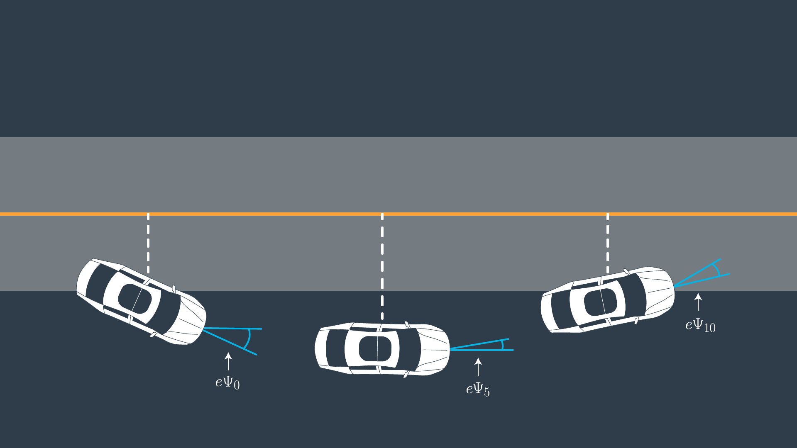

# Errors

A controller actuates the vehicle to follow the reference trajectory within a set of design requirements. One important requirement is to minimize the area between the reference trajectory and the vehicle's actual path. You can minimize this error by predicting the vehicle's actual path and then adjusting the control inputs to minimize the difference between that prediction and the reference trajectory. That's how to use a kinematic model to predict the vehicle's future state. Next, we'll define the predicted area between the trajectory and that predicted path of the vehicle. Once you've predicted the error you can actuate the vehicle to minimize the error over time. 

We want to minimize the distance of the vehicle from trajectory. We also want to minimize the difference of vehicle orientation and trajectory orientation.

***

We can capture how the errors we are interested in change over time by deriving our kinematic model around these errors as our new state vector.

The new state is: **x, y, cy, v, cte, e_ψ**

Let’s assume the vehicle is traveling down a straight road and the longitudinal direction is the same as the x-axis

#### Cross Track Error

Then we can express the error between the center of the road and the vehicle's position as the cross track error:

cte_t+1 = cte_t + v_t sin(e * ψ_t) * dt

In this case **cte_t** can be expressed as the difference between the line and the current vehicle position y. Assuming the reference line is a 1st order polynomial **f**:

cte_t = f(x_t) - y_t + (v_t * sin(e * ψ_t) * dt)

This can be broken up into two parts:

1. **f(x_t) - y_t** being current cross track error
2. **v_t * sin(e * ψ_t) * dt** being the change in error caused by the vehicle's movement

### Orientation Error

Ok, now let’s take a look at the orientation error:

e * psi_t+1 = e * psi_t + v_t/L_f * delta_t * dt

The update is essentially the same as **ψ**

**e * ψ_t** is desired orientation subtracted from the current orientation

e * psi_t = psi_t - psi * des_t

We already know **cy_t** because it is part of our state. We don't yet know **cy_des_t** (desired psi) - all we have so far is a polynomial to follow. **cy_des_t** can be calculated as the tangential angle of the polynomial **f** evaluated as **x_t, arctan(f_prime(x_t))**. **f_prime** is the derivative of the polynomial.

e_psi_t+1 = psi_t - psi_des_t + (v_t/L_f * delta_t * dt)

Similarly to the cross track error this can be interpreted as two parts:

1. **psi_t - psi_des_t** being current orientation error
2. **v_t/L_f * delta_t * dt** being the change in error caused by the vehicle's movement

The dashed white line is the cross track error
