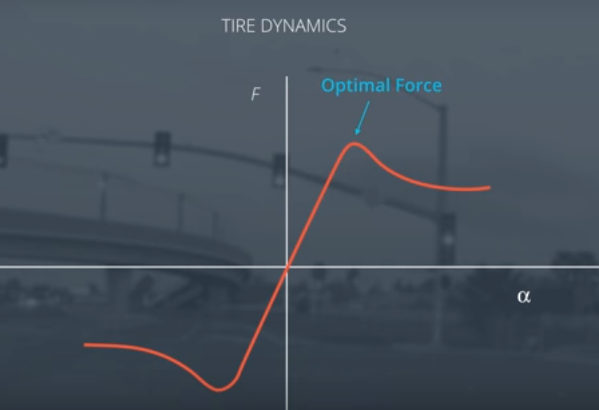

# Vehicle Dynamic Models

### Forces

The vehicle dynamics models - the complex interactions between the tires and the road - determine the motion of the vehicle. While there are many forces to consider in a dynamic model, they boil down to **longitudinal and lateral forces acting on the vehicle**. Think of longitudinal force as a force pushing the vehicle forward or backward and lateral force as a force pushing the vehicle side to side. Tires play a huge role here. The longitudinal and lateral force on the vehicle is the sum of the forces on the tires.

### Slip Angle

The slip angle can be interpreted as the angle between the velocity vector of the wheel and the orientation of the wheel itself. You're probably familiar with the sound of a tire squealing in parking lot. That is the result of having a slip angle. The slip angle can be expressed as the arc tangent of wheel longitudinal velocity divided by the wheel lateral velocity. The force generated by the slip angle is actually how a vehicle turns. Otherwise, inertia would carry the vehicle off the road. Different tires have different characteristics though. Racing tires generate much more force from the same slip angle than conventional tires.

### Slip Ratio

The slip ratio comes up when there is a mismatch between the speed of the vehicle wheel and the expected longitudinal velocity. This means, in addition to the tire's natural rolling motion, there's also a slipping motion. Similarly to how the slip angle's required to generate lateral force, the slip ratio is required to generate longitudinal force. In either case, all of this begins when the contact patch of the tire meets the road.

### Tire Models

The models aim to model the behavior of the tire as closely as possible. For example, the lateral force generated looks something like this:

**alpha** is the slip angle and **F** is the lateral force. Race car drivers have a fantastic mental model of this graph and can usually capture optimal longitudinal or lateral force for the situation. The slip angle is just one component used to calculate the longitudinal and lateral forces of tires. The most popular tire model is the [Pacejka Tire Model](http://www.theoryinpracticeengineering.com/resources/tires/pacejka87.pdf), also known as the Magic Tire Formula.
