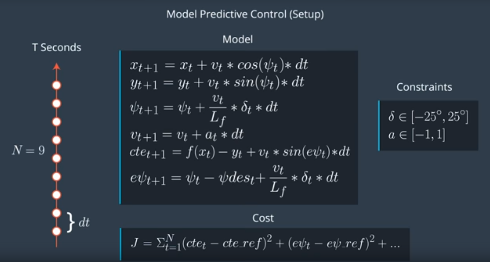
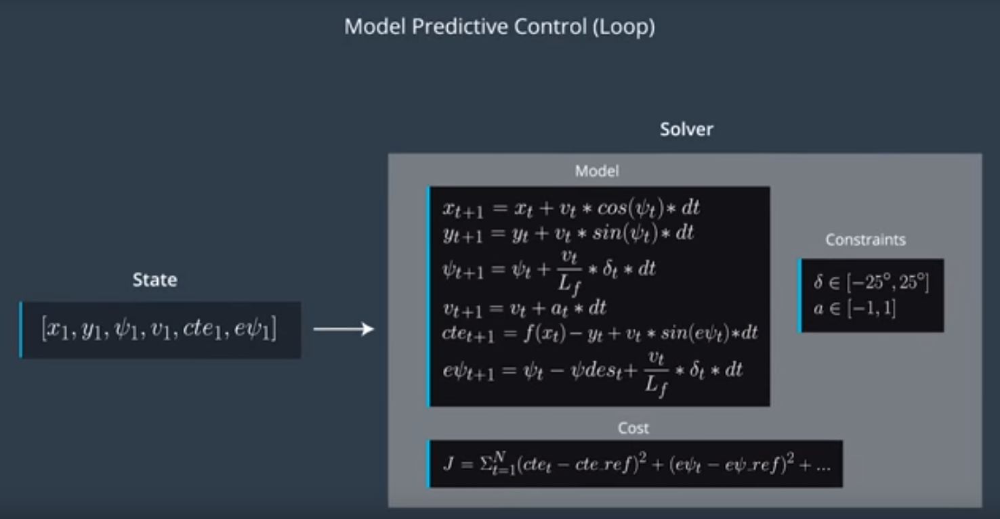

# Putting It All Together

Model predictive control uses an optimizer to find the control inputs and minimize the cost function. We only execute the very first set of control inputs. This brings the vehicle to a new state and then you repeat the process. Here is the MPC algorithm:

First we set up everything required for the model predictive control loop. This consists of defining the duration of the trajectory **T** by choosing **N** and **dt**. Next we define the vehicle model and constraints such as actual limitations. Finally we define the cost function. With this setup complete we begin the state feedback loop:

First we pass the current state to the model predictive controller. Next the optimization solver is called. The solver uses the initial state, the model constraints, and the cost function to return a vector of control inputs that minimize the cost function. The solver we will use is called IPOPT. We apply the first control input to the vehicle and repeat the loop.
