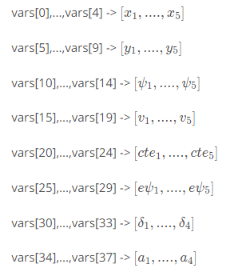
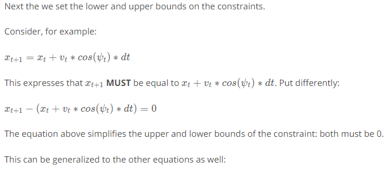
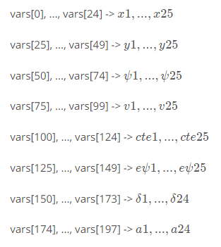
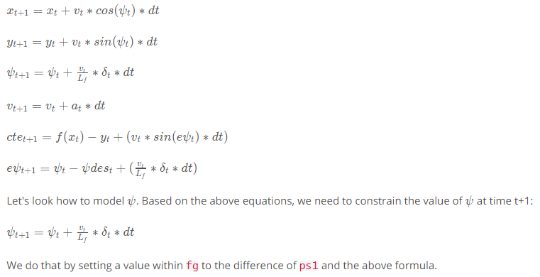
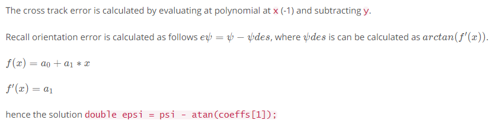

# Mind The Line

In this quiz you'll use MPC to follow the trajectory along a line.

Steps:

1. Set **N** and **dt**.
2. Fit the polynomial to the waypoints.
3. Calculate initial cross track error and orientation error values.
4. Define the components of the cost function (state, actuators, etc). You may use the methods previously discussed or make up something, up to you!
5. Define the model constraints. These are the state update equations defined in the Vehicle Models module.

Before you begin let's go over the libraries you'll use for this quiz and the following project.

### [Ipopt](https://projects.coin-or.org/Ipopt/)

Ipopt is the tool we'll be using to optimize the control inputs: **delta_1, a_1, ..., delta_N-1, a_n-1**. It's able to find locally optimal values (non-linear problem!) while keeping the constraints set directly to the actuators and the constraints defined by the vehicle model. Ipopt requires we give it the jacobians and hessians directly - it does not compute them for us. Hence, we need to either manually compute them or have have a library do this for us. Luckily, there is a library called CppAD which does exactly this.

### [CppAD](https://www.coin-or.org/CppAD/)

CppAD is a library we'll use for automatic differentiation. By using CppAD we don't have to manually compute derivatives, which is tedious and prone to error.

In order to use CppAD effectively, we have to use its types instead of regular double or std::vector types.

Additionally math functions must be called from CppAD. Here's an example of calling pow:

```c++
CppAD::pow(x, 2);
// instead of 
pow(x, 2);
```

Luckily most elementary math operations are overloaded. So calling *, +, -, / will work as intended as long as it's called on CppAD<double> instead of double. Most of this is done for you and there are examples to draw from in the code we provide.

### Code Structure

We've filled in most of the quiz starter code for you. The goal of this quiz is really just about getting everything to work as intended.

That said, it may be tricky to decipher some elements of the starter code, so we will walk you through it.

There are two main components in MPC.cpp:

```
1. vector<double> MPC::Solve(Eigen::VectorXd x0, Eigen::VectorXd coeffs) method
2. FG_eval class
```

### MPC::Solve

**x0** is the initial state: **x,y,cy,v,cte,e_cy**, coeffs are the coefficients of the fitting polynomial. The bulk of this method is setting up the vehicle model constraints (constraints) and variables (vars) for Ipopt.

#### Variables

```c++
double x = x0[0];
double y = x0[1];
double psi = x0[2];
double v = x0[3];
double cte = x0[4];
double epsi = x0[5];
...
// Set the initial variable values
vars[x_start] = x;
vars[y_start] = y;
vars[psi_start] = psi;
vars[v_start] = v;
vars[cte_start] = cte;
vars[epsi_start] = epsi;
```

Note Ipopt expects all the constraints and variables as vectors. For example, suppose **N** is 5, then the structure of vars a 38-element vector:



We then set lower and upper bounds on the variables. Here we set the range of values **delta** to [-25, 25] in radians:

```c++
for (int i = delta_start; i < a_start; i++)
{
    vars_lowerbound[i] = -0.436332;
    vars_upperbound[i] = 0.436332;
}
```

#### Constraints



```c++
for (int i = 0; i < n_constraints; i++) {
  constraints_lowerbound[i] = 0;
  constraints_upperbound[i] = 0;
}
```

### FG_eval

The FG_eval class has the constructor:

```c++
FG_eval(Eigen::VectorXd coeffs) { this->coeffs = coeffs; }
```

where coeffs are the coefficients of the fitted polynomial. coeffs will be used by the cross track error and heading error equations.

The FG_eval class has only one method:

```c++
void operator()(ADvector& fg, const ADvector& vars)
```

**vars** is the vector of variables (from the previous section) and **fg** is the vector of constraints.

One complication: **fg[0]** stores the cost value, so the **fg** vector is 1 element larger than it was in **MPC::Solve**.

Here in **operator()** you'll define the cost function and constraints. **x** is already completed:

```c++
for (int t = 1; t < N; t++) {
    AD<double> x1 = vars[x_start + t];

    AD<double> x0 = vars[x_start + t - 1];
    AD<double> psi0 = vars[psi_start + t - 1];
    AD<double> v0 = vars[v_start + t - 1];

    // Here's `x` to get you started.
    // The idea here is to constraint this value to be 0.
    //
    // NOTE: The use of `AD<double>` and use of `CppAD`!
    // This is also CppAD can compute derivatives and pass
    // these to the solver.

    // TODO: Setup the rest of the model constraints
    fg[1 + x_start + i] = x1 - (x0 + v0 * CppAD::cos(psi0) * dt);
  }
```

Note that we start the loop at **t=1**, because the values at **t=0** are set to our initial state - those values are not calculated by the solver.

An **FG_eval** object is created in **MPC::Solve**:

```c++
FG_eval fg_eval(coeffs);
```

This is then used by Ipopt to find the lowest cost trajectory:

```c++
// place to return solution
CppAD::ipopt::solve_result<Dvector> solution;

// solve the problem
CppAD::ipopt::solve<Dvector, FG_eval>(
    options, vars, vars_lowerbound, vars_upperbound, constraints_lowerbound,
    constraints_upperbound, fg_eval, solution);
```

The filled in **vars** vector is stored as **solution.x** and the cost as **solution.obj_value**

***

## Solutions

#### N & dt

```c++
// TODO: Set N and dt
size_t N = 25 ;
double dt = 0.05 ;
```

Here we had to assign values to **N** and **dt**. It's likely you set these variables to slightly different values. That's fine as long as the cross track error decreased to 0. It's a good idea to play with different values here.

For example, if we were to set **N** to 100, the simulation would run much slower. This is because the solver would have to optimize 4 times as many control inputs. Ipopt, the solver, permutes the control input values until it finds the lowest cost. If you were to open up Ipopt and plot the **x** and **y** values as the solver mutates them, the plot would look like a worm moving around trying to fit the shape of the reference trajectory.

#### Cost function

```c++
  void operator()(ADvector& fg, const ADvector& vars) {
    // The cost is stored is the first element of `fg`.
    // Any additions to the cost should be added to `fg[0]`.
    fg[0] = 0;

    // Cost function
    // TODO: Define the cost related the reference state and
    // any anything you think may be beneficial.

    // The part of the cost based on the reference state.
    for (int t = 0; t < N; t++) {
      fg[0] += CppAD::pow(vars[cte_start + t], 2);
      fg[0] += CppAD::pow(vars[epsi_start + t], 2);
      fg[0] += CppAD::pow(vars[v_start + t] - ref_v, 2);
    }

    // Minimize the use of actuators.
    for (int t = 0; t < N - 1; t++) {
      fg[0] += CppAD::pow(vars[delta_start + t], 2);
      fg[0] += CppAD::pow(vars[a_start + t], 2);
    }

    // Minimize the value gap between sequential actuations.
    for (int t = 0; t < N - 2; t++) {
      fg[0] += CppAD::pow(vars[delta_start + t + 1] - vars[delta_start + t], 2);
      fg[0] += CppAD::pow(vars[a_start + t + 1] - vars[a_start + t], 2);
    }
  ```

There's a lot to unwind here.

Let's start with the function arguments: **fg** and **vars**

The vector **fg** is where the cost function and vehicle model/constraints is defined. We'll go the **fg** vector in more detail shortly.

The other function argument is the vector **vars**. This vector contains all variables used by the cost function and model:

**x, y, cy, v, cte, e_cy**

**delta, a**

This is all one long vector, so if **N** is 25 then the indices are assigned as follows:



Now let's focus on the actual cost function. Since 0 is the index at which Ipopt expects **fg** to store the cost value, we sum all the components of the cost and store them at index 0.

In each iteration through the loop, we sum three components to reach the aggregate cost: our cross-track error, our heading error, and our velocity error.

```c++
// The part of the cost based on the reference state.
for (int t = 0; t < N; t++) {
  fg[0] += CppAD::pow(vars[cte_start + t] , 2);
  fg[0] += CppAD::pow(vars[epsi_start + t], 2);
  fg[0] += CppAD::pow(vars[v_start + t], 2);
}
```

We've already taken care of the main objective - to minimize our cross track, heading, and velocity errors. A further enhancement is to constrain erratic control inputs.

For example, if we're making a turn, we'd like the turn to be smooth, not sharp. Additionally, the vehicle velocity should not change too radically.

```c++
// Minimize change-rate.
for (int t = 0; t < N - 1; t++) {
  fg[0] += CppAD::pow(vars[delta_start + t], 2);
  fg[0] += CppAD::pow(vars[a_start + t], 2);
}
```

The goal of this final loop is to make control decisions more consistent, or smoother. The next control input should be similar to the current one.

```c++
// Minimize the value gap between sequential actuations.
for (int t = 0; t < N - 2; t++) {
  fg[0] += CppAD::pow(vars[delta_start + t + 1] - vars[delta_start + t], 2);
  fg[0] += CppAD::pow(vars[a_start + t + 1] - vars[a_start + t], 2);
}
```

#### Initialization & constraints

We initialize the model to the initial state. Recall **fg[0]** is reserved for the cost value, so the other indices are bumped up by 1.

```c++
fg[1 + x_start] = vars[x_start];
fg[1 + y_start] = vars[y_start];
fg[1 + psi_start] = vars[psi_start];
fg[1 + v_start] = vars[v_start];
fg[1 + cte_start] = vars[cte_start];
fg[1 + epsi_start] = vars[epsi_start];
```

All the other constraints based on the vehicle model:



Previously, we have set the corresponding **constraints_lowerbound** and the **constraints_upperbound** values to 0. That means the solver will force this value of **fg** to always be 0.

```c++
for (int t = 1; t < N ; t++) {
  // psi, v, delta at time t
  AD<double> psi0 = vars[psi_start + t - 1];
  AD<double> v0 = vars[v_start + t - 1];
  AD<double> delta0 = vars[delta_start + t - 1];

  // psi at time t+1
  AD<double> psi1 = vars[psi_start + t];

  // how psi changes
  fg[1 + psi_start + i] = psi1 - (psi0 + v0 * delta0 / Lf * dt);
}
```

The oddest line above is probably **fg[1 + psi_start + i]**.

**fg[0]** stores the cost value, so there's always an offset of 1. So **fg[1 + psi_start]** is where we store the initial value of **cy**. Finally, **fg[1 + psi_start + t]** is reserved for the **t**th of **N** values of **cy** that the solver computes.

Coding up the other parts of the model is similar.

```c++
for (int t = 1; t < N; t++) {
  // The state at time t+1 .
  AD<double> x1 = vars[x_start + t];
  AD<double> y1 = vars[y_start + t];
  AD<double> psi1 = vars[psi_start + t];
  AD<double> v1 = vars[v_start + t];
  AD<double> cte1 = vars[cte_start + t];
  AD<double> epsi1 = vars[epsi_start + t];

  // The state at time t.
  AD<double> x0 = vars[x_start + t - 1];
  AD<double> y0 = vars[y_start + t - 1];
  AD<double> psi0 = vars[psi_start + t - 1];
  AD<double> v0 = vars[v_start + t - 1];
  AD<double> cte0 = vars[cte_start + t - 1];
  AD<double> epsi0 = vars[epsi_start + t - 1];

  // Only consider the actuation at time t.
  AD<double> delta0 = vars[delta_start + t - 1];
  AD<double> a0 = vars[a_start + t - 1];

  AD<double> f0 = coeffs[0] + coeffs[1] * x0;
  AD<double> psides0 = CppAD::atan(coeffs[1]);

  // Here's `x` to get you started.
  // The idea here is to constraint this value to be 0.
  //
  // Recall the equations for the model:
  // x_[t] = x[t-1] + v[t-1] * cos(psi[t-1]) * dt
  // y_[t] = y[t-1] + v[t-1] * sin(psi[t-1]) * dt
  // psi_[t] = psi[t-1] + v[t-1] / Lf * delta[t-1] * dt
  // v_[t] = v[t-1] + a[t-1] * dt
  // cte[t] = f(x[t-1]) - y[t-1] + v[t-1] * sin(epsi[t-1]) * dt
  // epsi[t] = psi[t] - psides[t-1] + v[t-1] * delta[t-1] / Lf * dt
  fg[1 + x_start + t] = x1 - (x0 + v0 * CppAD::cos(psi0) * dt);
  fg[1 + y_start + t] = y1 - (y0 + v0 * CppAD::sin(psi0) * dt);
  fg[1 + psi_start + t] = psi1 - (psi0 + v0 * delta0 / Lf * dt);
  fg[1 + v_start + t] = v1 - (v0 + a0 * dt);
  fg[1 + cte_start + t] =
      cte1 - ((f0 - y0) + (v0 * CppAD::sin(epsi0) * dt));
  fg[1 + epsi_start + i] =
      epsi1 - ((psi0 - psides0) + v0 * delta0 / Lf * dt);
}
```

#### Fitting a polynomial to the waypoints

```c++
// TODO: fit a polynomial to the above x and y coordinates
auto coeffs = polyfit(ptsx, ptsy, 1);
```

The **x** and **y** coordinates are contained in the **ptsx** and **ptsy** vectors. Since these are 2-element vectors a 1-degree polynomial (straight line) is sufficient.

#### Calculating the cross track and orientation error

```c++
double x = -1;
double y = 10;
double psi = 0;
double v = 10;
// TODO: calculate the cross track error
double cte = polyeval(coeffs, x) - y;
// TODO: calculate the orientation error
double epsi = psi - atan(coeffs[1]);
```


