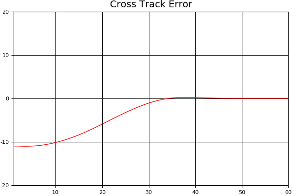
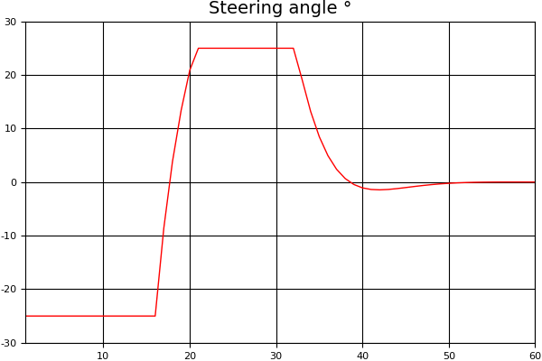
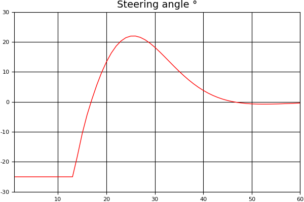
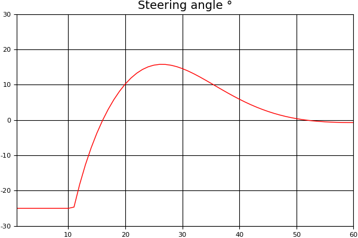

# Tuning MPC

In the previous quiz you used Model Predictive Control to minimize the cross track and orientation errors of the vehicle with respect to a line. As a result the cross track error graph looked something like this:



**N** is set to 25 and **dt** is set to 0.05 for all other graphs in this section unless specified. The simulation is run for 60 iterations.

This graph looks great! We see the cross track error starts at -11 and within a 30-40 steps it's at 0

Let's take a look at another graph, the steering angle values:



The steering starts out at a min value -25 degrees and then jumps, causing a spike in the graph, to 25 degrees. The second spike from 25 degrees to 0 degrees is more gradual but still sudden.

While this experiment works out fine in our sample program, on an actual road the vehicle would likely steer off the road and possibly crash. It would be a very unpleasant ride at best!

An approach to solving this problem is tuning a part of the cost function affecting steering.

```c++
for (int i = 0; i < N - 2; i++) {
  // Tune this part!
  fg[0] += CppAD::pow(vars[delta_start + i + 1] - vars[delta_start + i], 2);
  fg[0] += CppAD::pow(vars[a_start + i + 1] - vars[a_start + i], 2);
}
```

Multiplying that part by a value > 1 will influence the solver into keeping sequential steering values closer together.

```
fg[0] += 100 * CppAD::pow(vars[delta_start + i + 1] - vars[delta_start + i], 2);
```

results in:



```
fg[0] += 500 * CppAD::pow(vars[delta_start + i + 1] - vars[delta_start + i], 2);
```

results in:



As we can see tuning the steering value in the cost function results in a smoother steering transitions.

In general, we want the steering angle values to be smooth. If the vehicle is behaving erratically it's likely there will be spikes in the steering angle value graph and its one indication you should tune the cost function.
