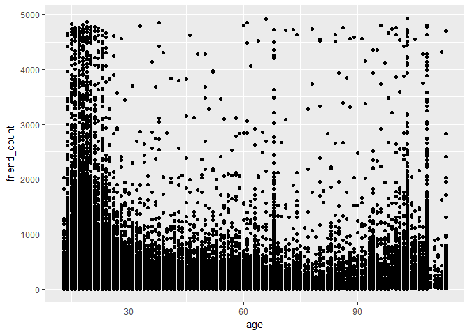
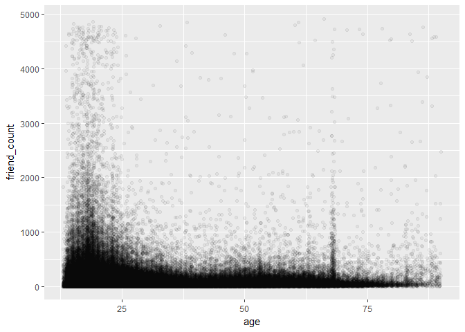
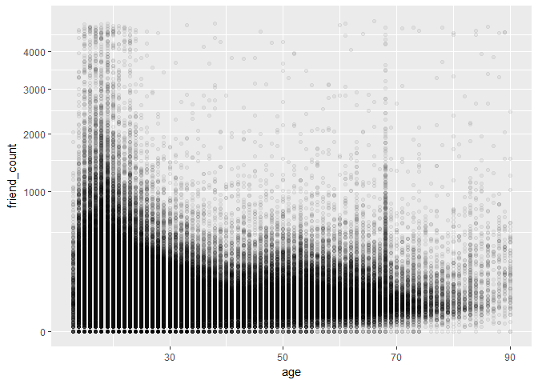
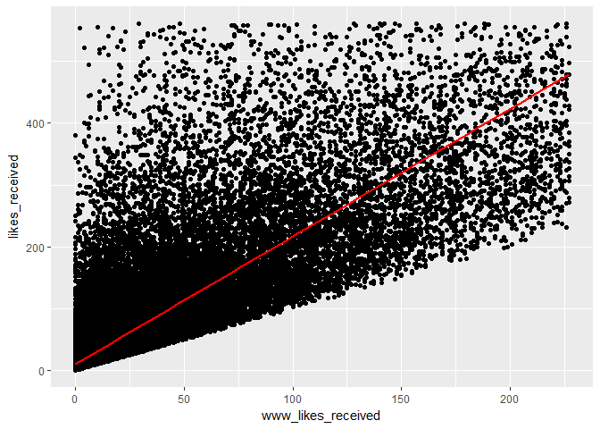
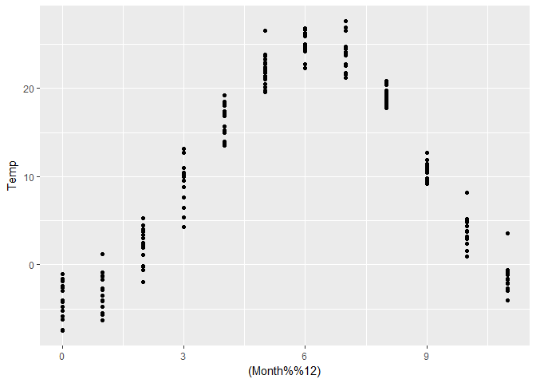

Lesson 4
========

------------------------------------------------------------------------

### Scatterplots and Perceived Audience Size

Notes:

------------------------------------------------------------------------

### Scatterplots

Notes:

    library(ggplot2)
    list.files()

    ## [1] "correlation_images.jpeg" "lesson4_student.rmd"    
    ## [3] "pseudo_facebook.tsv"

    pf <-read.csv('pseudo_facebook.tsv', sep = '\t')

    qplot(x = age, y = friend_count, data = pf)

    qplot(age, friend_count,data=pf)

------------------------------------------------------------------------

#### What are some things that you notice right away?

Response: Younger users have more friends. vertical bar fake accounts

------------------------------------------------------------------------

### ggplot Syntax

Notes:

    ggplot(aes(x= age, y =friend_count),data=pf) + geom_point() + xlim(13,90)

    ## Warning: Removed 4906 rows containing missing values (geom_point).

    summary(pf$age)

    ##    Min. 1st Qu.  Median    Mean 3rd Qu.    Max. 
    ##   13.00   20.00   28.00   37.28   50.00  113.00

------------------------------------------------------------------------

### Overplotting

Notes:

    ggplot(aes(x= age, y =friend_count),data=pf) + geom_jitter(alpha = 1/20) + xlim(13,90)

    ## Warning: Removed 5194 rows containing missing values (geom_point).

#### What do you notice in the plot?

Response: Youger friends is less than before Peak on age 69 \*\*\*

### Coord\_trans()

Notes:

    ggplot(aes(x= age, y =friend_count),data=pf) + geom_point(alpha = 1/20) + xlim(13,90)

    ## Warning: Removed 4906 rows containing missing values (geom_point).

-1.png)

    ggplot(aes(x= age, y =friend_count),data=pf) + geom_jitter(alpha = 1/20) + xlim(13,90)

    ## Warning: Removed 5181 rows containing missing values (geom_point).

-2.png)

    #add some jitter

#### Look up the documentation for coord\_trans() and add a layer to the plot that transforms friend\_count using the square root function. Create your plot!

    ggplot(aes(x= age, y =friend_count),data=pf) + geom_point(alpha = 1/20) + xlim(13,90) + coord_trans(y = 'sqrt') #back to gemo_point

    ## Warning: Removed 4906 rows containing missing values (geom_point).

    ggplot(aes(x= age, y =friend_count),data=pf) + geom_jitter(alpha = 1/20, position = position_jitter(h=0)) + xlim(13,90) + coord_trans(y = 'sqrt')

    ## Warning: Removed 5183 rows containing missing values (geom_point).

    #if you still want use jitter，aviod negetive number，add position = position_jitter(h=0) 

#### What do you notice?

------------------------------------------------------------------------

### Alpha and Jitter

Notes:

    ggplot(aes(x=age, y = friendships_initiated),data = pf)+
      geom_jitter(alpha = 1/10, position = position_jitter(h = 0)) + xlim(13,90)+
      coord_trans(y = 'sqrt')

    ## Warning: Removed 5187 rows containing missing values (geom_point).

    #both are the same

------------------------------------------------------------------------

### Overplotting and Domain Knowledge

Notes: Use percentage.

------------------------------------------------------------------------

### Conditional Means

Notes:

    library(dplyr)

    ## 
    ## Attaching package: 'dplyr'

    ## The following objects are masked from 'package:stats':
    ## 
    ##     filter, lag

    ## The following objects are masked from 'package:base':
    ## 
    ##     intersect, setdiff, setequal, union

    age_goups <- group_by(pf,age)
    pf.fc_by_age <- summarise(age_goups,
              friend_count_mean = mean(friend_count),
              friend_count_median = median(friend_count),
              n = n())

    pf.fc_by_age <- arrange(pf.fc_by_age,age)
    head(pf.fc_by_age)

    ## # A tibble: 6 × 4
    ##     age friend_count_mean friend_count_median     n
    ##   <int>             <dbl>               <dbl> <int>
    ## 1    13          164.7500                74.0   484
    ## 2    14          251.3901               132.0  1925
    ## 3    15          347.6921               161.0  2618
    ## 4    16          351.9371               171.5  3086
    ## 5    17          350.3006               156.0  3283
    ## 6    18          331.1663               162.0  5196

### Conditional Means Alternate Code

    pf.fc_by_age_2 <- pf %>%
      group_by(age) %>%
      summarise(friend_count_mean = mean(as.numeric(friend_count)),
              friend_count_median = median(as.numeric(friend_count)),
              n = n()) %>%
      arrange(age)

Create your plot!

    ggplot(aes(x = age, y =friend_count_mean), data = pf.fc_by_age)+
      geom_line()

------------------------------------------------------------------------

### Overlaying Summaries with Raw Data

Notes:

    ggplot(aes(x= age, y =friend_count),data=pf)+
      coord_cartesian(xlim = c(13, 70), ylim = c(0,1000)) + geom_point(alpha = 0.05, 
    position = position_jitter(h=0),color = 'orange')+
      geom_line(stat = 'summary', fun.y = mean)+
      geom_line(stat = 'summary', fun.y = quantile, fun.args = list(probs = .1), linetype = 2, color = 'blue')+
       geom_line(stat = 'summary', fun.y = quantile, fun.args = list(probs = .9), linetype = 2, color = 'blue')+
       geom_line(stat = 'summary', fun.y = quantile, fun.args = list(probs = .5), color = 'blue')

#### What are some of your observations of the plot?

Response: same tendency median lower than avarage.

------------------------------------------------------------------------

### Moira: Histogram Summary and Scatterplot

See the Instructor Notes of this video to download Moira's paper on
perceived audience size and to see the final plot.

Notes:

------------------------------------------------------------------------

### Correlation

Notes:

    cor.test(pf$age, pf$friend_count, method = c("pearson"))

    ## 
    ##  Pearson's product-moment correlation
    ## 
    ## data:  pf$age and pf$friend_count
    ## t = -8.6268, df = 99001, p-value < 2.2e-16
    ## alternative hypothesis: true correlation is not equal to 0
    ## 95 percent confidence interval:
    ##  -0.03363072 -0.02118189
    ## sample estimates:
    ##         cor 
    ## -0.02740737

    ?cor.test

    ## starting httpd help server ...

    ##  done

    with(pf, cor.test(age, friend_count,method = 'pearson'))

    ## 
    ##  Pearson's product-moment correlation
    ## 
    ## data:  age and friend_count
    ## t = -8.6268, df = 99001, p-value < 2.2e-16
    ## alternative hypothesis: true correlation is not equal to 0
    ## 95 percent confidence interval:
    ##  -0.03363072 -0.02118189
    ## sample estimates:
    ##         cor 
    ## -0.02740737

Look up the documentation for the cor.test function.

What's the correlation between age and friend count? Round to three
decimal places. Response:

------------------------------------------------------------------------

### Correlation on Subsets

Notes:

    with(subset(pf, age<=70), cor.test(age, friend_count,method = 'pearson'))

    ## 
    ##  Pearson's product-moment correlation
    ## 
    ## data:  age and friend_count
    ## t = -52.592, df = 91029, p-value < 2.2e-16
    ## alternative hypothesis: true correlation is not equal to 0
    ## 95 percent confidence interval:
    ##  -0.1780220 -0.1654129
    ## sample estimates:
    ##        cor 
    ## -0.1717245

------------------------------------------------------------------------

### Correlation Methods

Notes:

------------------------------------------------------------------------

Create Scatterplots
-------------------

Notes:

    ggplot(aes(www_likes_received, likes_received), data = pf) + 
      geom_point()+
      xlim(0, quantile(pf$www_likes_received,0.95))+
      ylim(0, quantile(pf$likes_received,0.95))+ geom_smooth(method = 'lm', color ='red')

    ## Warning: Removed 6075 rows containing non-finite values (stat_smooth).

    ## Warning: Removed 6075 rows containing missing values (geom_point).

------------------------------------------------------------------------

### Strong Correlations

Notes:

    with(pf, cor.test(www_likes_received, likes_received, method='pearson'))

    ## 
    ##  Pearson's product-moment correlation
    ## 
    ## data:  www_likes_received and likes_received
    ## t = 937.1, df = 99001, p-value < 2.2e-16
    ## alternative hypothesis: true correlation is not equal to 0
    ## 95 percent confidence interval:
    ##  0.9473553 0.9486176
    ## sample estimates:
    ##       cor 
    ## 0.9479902

What's the correlation betwen the two variables? Include the top 5% of
values for the variable in the calculation and round to 3 decimal
places.

Response:

------------------------------------------------------------------------

### Moira on Correlation

Notes:

------------------------------------------------------------------------

### More Caution with Correlation

Notes:

    #install.packages('alr3')
    library(alr3)

    ## Loading required package: car

    ## 
    ## Attaching package: 'car'

    ## The following object is masked from 'package:dplyr':
    ## 
    ##     recode

    data(Mitchell)
    ?Mitchell

Create your plot!

    ggplot(aes(y = Temp, x= Month),data = Mitchell)+geom_point()

------------------------------------------------------------------------

### Noisy Scatterplots

1.  Take a guess for the correlation coefficient for the scatterplot.

2.  What is the actual correlation of the two variables? (Round to the
    thousandths place)

<!-- -->

    with(Mitchell, cor.test(Month, Temp, method = 'pearson'))

    ## 
    ##  Pearson's product-moment correlation
    ## 
    ## data:  Month and Temp
    ## t = 0.81816, df = 202, p-value = 0.4142
    ## alternative hypothesis: true correlation is not equal to 0
    ## 95 percent confidence interval:
    ##  -0.08053637  0.19331562
    ## sample estimates:
    ##        cor 
    ## 0.05747063

------------------------------------------------------------------------

### Making Sense of Data

Notes:

    range(Mitchell$Month)

    ## [1]   0 203

    ggplot(aes(y = Temp, x= Month),data = Mitchell)+geom_point()+
      scale_x_continuous(breaks = seq(0,203,12))

------------------------------------------------------------------------

### A New Perspective

What do you notice? Response: \#seasonal change

    library(energy)
    #install.packages('energy')
    ggplot(aes(x=(Month%%12),y=Temp),data=Mitchell)+ 
      geom_point() 

    dcor.ttest(Mitchell$Month, Mitchell$Temp)

    ## 
    ##  dcor t-test of independence
    ## 
    ## data:  Mitchell$Month and Mitchell$Temp
    ## T = -0.93904, df = 20501, p-value = 0.8261
    ## sample estimates:
    ## Bias corrected dcor 
    ##        -0.006558215

Watch the solution video and check out the Instructor Notes! Notes:

------------------------------------------------------------------------

### Understanding Noise: Age to Age Months

Notes:

    ggplot(aes(x= age, y =friend_count_mean),data=pf.fc_by_age)+
      geom_line()

    head(pf.fc_by_age,10)

    ## # A tibble: 10 × 4
    ##      age friend_count_mean friend_count_median     n
    ##    <int>             <dbl>               <dbl> <int>
    ## 1     13          164.7500                74.0   484
    ## 2     14          251.3901               132.0  1925
    ## 3     15          347.6921               161.0  2618
    ## 4     16          351.9371               171.5  3086
    ## 5     17          350.3006               156.0  3283
    ## 6     18          331.1663               162.0  5196
    ## 7     19          333.6921               157.0  4391
    ## 8     20          283.4991               135.0  3769
    ## 9     21          235.9412               121.0  3671
    ## 10    22          211.3948               106.0  3032

    pf.fc_by_age[17:19,]

    ## # A tibble: 3 × 4
    ##     age friend_count_mean friend_count_median     n
    ##   <int>             <dbl>               <dbl> <int>
    ## 1    29          120.8182                66.0  1936
    ## 2    30          115.2080                67.5  1716
    ## 3    31          118.4599                63.0  1694

------------------------------------------------------------------------

### Age with Months Means

    pf$age_with_months <- pf$age + (1 - pf$dob_month / 12)

    age_months_group <- group_by(pf,age_with_months)
    pf.fc_by_age_months <- summarise(age_months_group,
                                     friend_count_mean=mean(friend_count), 
                                     friend_count_median = median(friend_count),
                                     n = n())
    pf.fc_by_age_months <- arrange(pf.fc_by_age_months, age_with_months)
    head(pf.fc_by_age_months, 5)

    ## # A tibble: 5 × 4
    ##   age_with_months friend_count_mean friend_count_median     n
    ##             <dbl>             <dbl>               <dbl> <int>
    ## 1        13.16667          46.33333                30.5     6
    ## 2        13.25000         115.07143                23.5    14
    ## 3        13.33333         136.20000                44.0    25
    ## 4        13.41667         164.24242                72.0    33
    ## 5        13.50000         131.17778                66.0    45

    #same method
    pf.fc_by_age_months <- pf %>%
      group_by(age_with_months) %>%
      summarise(friend_count_mean=mean(friend_count), 
                                     friend_count_median = median(friend_count),
                                     n = n()) %>%
      arrange(age_with_months)
    head(pf.fc_by_age_months, 5)

    ## # A tibble: 5 × 4
    ##   age_with_months friend_count_mean friend_count_median     n
    ##             <dbl>             <dbl>               <dbl> <int>
    ## 1        13.16667          46.33333                30.5     6
    ## 2        13.25000         115.07143                23.5    14
    ## 3        13.33333         136.20000                44.0    25
    ## 4        13.41667         164.24242                72.0    33
    ## 5        13.50000         131.17778                66.0    45

Programming Assignment

    ggplot(aes(x = age_with_months, y = friend_count_mean), data = subset(pf.fc_by_age_months, age_with_months < 71))+
      geom_line()

------------------------------------------------------------------------

### Noise in Conditional Means

    p1 <-ggplot(aes(x = age, y =friend_count_mean), data = subset(pf.fc_by_age, age<71))+
      geom_line()

    p2 <-ggplot(aes(x = age_with_months, y = friend_count_mean), data = subset(pf.fc_by_age_months, age_with_months < 71))+
      geom_line()

    library(gridExtra)

    ## 
    ## Attaching package: 'gridExtra'

    ## The following object is masked from 'package:dplyr':
    ## 
    ##     combine

    grid.arrange(p2,p1, ncol = 1)

------------------------------------------------------------------------

### Smoothing Conditional Means

Notes:

    p1 <-ggplot(aes(x = age, y =friend_count_mean), data = subset(pf.fc_by_age, age<71))+
      geom_line()+geom_smooth()

    p2 <-ggplot(aes(x = age_with_months, y = friend_count_mean), data = subset(pf.fc_by_age_months, age_with_months < 71))+
      geom_line()+geom_smooth()

    #round, decrease point
    p3 <-ggplot(aes(x = round(age /5) *5, y =friend_count_mean), data = subset(pf.fc_by_age, age<71))+
      geom_line(stat = 'summary', fun.y = mean) 

    library(gridExtra)
    grid.arrange(p2,p1, p3,ncol = 1)

    ## `geom_smooth()` using method = 'loess'
    ## `geom_smooth()` using method = 'loess'

------------------------------------------------------------------------

### Which Plot to Choose?

Notes:

------------------------------------------------------------------------

### Analyzing Two Variables

Reflection:

------------------------------------------------------------------------

Click **KnitHTML** to see all of your hard work and to have an html page
of this lesson, your answers, and your notes!
