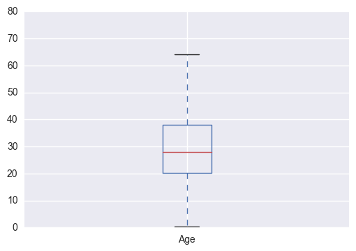
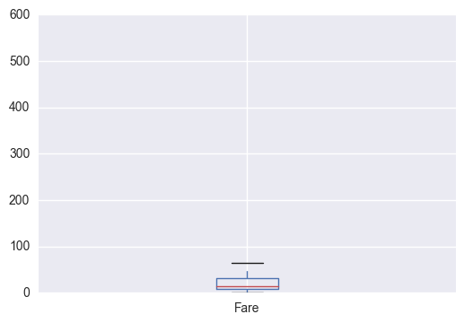
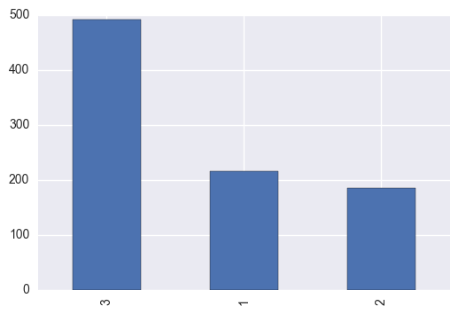
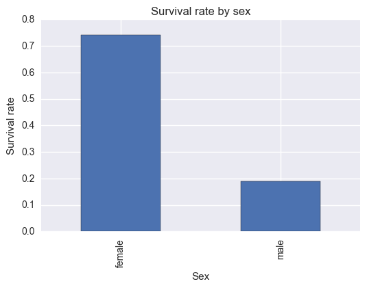
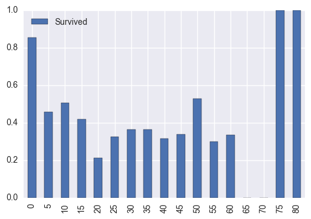

# Titanic Data analysis Report

## The aim of the analysis

Use NumPy and Pandas to analyze the Titanic data to find the relationship between multiple variables. 


```python
import matplotlib.pyplot as plt
import numpy as np
import pandas as pd
import seaborn as sns
%pylab inline

titanic_df = pd.read_csv('titanic-data.csv')
```
    

## Raise questions
Thus Titanic is a well-known tragedy, so the mortality rate is an important mesurement of the severity, in other word, the survived rate should be analyzed in detail.My major question is "What factors can influenced the survival rate and how to influence?"

In the case, the raw data uses 1 or 0 to represent the surivided condition, so the mean of "Survived" column is actually the survival rate.It makes analysis a little succinct.


## Data Wrangling
The Data is raw, so I need to check it and find if there are something needed to modify.


```python
titanic_df.describe()
```


<div>
<table border="1" class="dataframe">
  <thead>
    <tr style="text-align: right;">
      <th></th>
      <th>PassengerId</th>
      <th>Survived</th>
      <th>Pclass</th>
      <th>Age</th>
      <th>SibSp</th>
      <th>Parch</th>
      <th>Fare</th>
    </tr>
  </thead>
  <tbody>
    <tr>
      <th>count</th>
      <td>891.000000</td>
      <td>891.000000</td>
      <td>891.000000</td>
      <td>714.000000</td>
      <td>891.000000</td>
      <td>891.000000</td>
      <td>891.000000</td>
    </tr>
    <tr>
      <th>mean</th>
      <td>446.000000</td>
      <td>0.383838</td>
      <td>2.308642</td>
      <td>29.699118</td>
      <td>0.523008</td>
      <td>0.381594</td>
      <td>32.204208</td>
    </tr>
    <tr>
      <th>std</th>
      <td>257.353842</td>
      <td>0.486592</td>
      <td>0.836071</td>
      <td>14.526497</td>
      <td>1.102743</td>
      <td>0.806057</td>
      <td>49.693429</td>
    </tr>
    <tr>
      <th>min</th>
      <td>1.000000</td>
      <td>0.000000</td>
      <td>1.000000</td>
      <td>0.420000</td>
      <td>0.000000</td>
      <td>0.000000</td>
      <td>0.000000</td>
    </tr>
    <tr>
      <th>25%</th>
      <td>223.500000</td>
      <td>0.000000</td>
      <td>2.000000</td>
      <td>20.125000</td>
      <td>0.000000</td>
      <td>0.000000</td>
      <td>7.910400</td>
    </tr>
    <tr>
      <th>50%</th>
      <td>446.000000</td>
      <td>0.000000</td>
      <td>3.000000</td>
      <td>28.000000</td>
      <td>0.000000</td>
      <td>0.000000</td>
      <td>14.454200</td>
    </tr>
    <tr>
      <th>75%</th>
      <td>668.500000</td>
      <td>1.000000</td>
      <td>3.000000</td>
      <td>38.000000</td>
      <td>1.000000</td>
      <td>0.000000</td>
      <td>31.000000</td>
    </tr>
    <tr>
      <th>max</th>
      <td>891.000000</td>
      <td>1.000000</td>
      <td>3.000000</td>
      <td>80.000000</td>
      <td>8.000000</td>
      <td>6.000000</td>
      <td>512.329200</td>
    </tr>
  </tbody>
</table>
</div>


```python
titanic_df.info() 
```

    <class 'pandas.core.frame.DataFrame'>
    RangeIndex: 891 entries, 0 to 890
    Data columns (total 12 columns):
    PassengerId    891 non-null int64
    Survived       891 non-null int64
    Pclass         891 non-null int64
    Name           891 non-null object
    Sex            891 non-null object
    Age            714 non-null float64
    SibSp          891 non-null int64
    Parch          891 non-null int64
    Ticket         891 non-null object
    Fare           891 non-null float64
    Cabin          204 non-null object
    Embarked       889 non-null object
    dtypes: float64(2), int64(5), object(5)
    memory usage: 83.6+ KB
    

There are 891 rows in Titanic Data, it is noted that age,cabin and embarked datas are missing.While,in this report, I only focus on age data. When I look the "age" data, I find something are missing(NaN), I can use .dropna() to delete these missing data when I deal with the analysis that relates with the age.


```python
titanic_df_dropna = titanic_df.dropna(subset=['Age']) #use it when use age variables 把age当中的无效项目排除
titanic_df_dropna.describe()
```


<div>
<table border="1" class="dataframe">
  <thead>
    <tr style="text-align: right;">
      <th></th>
      <th>PassengerId</th>
      <th>Survived</th>
      <th>Pclass</th>
      <th>Age</th>
      <th>SibSp</th>
      <th>Parch</th>
      <th>Fare</th>
    </tr>
  </thead>
  <tbody>
    <tr>
      <th>count</th>
      <td>714.000000</td>
      <td>714.000000</td>
      <td>714.000000</td>
      <td>714.000000</td>
      <td>714.000000</td>
      <td>714.000000</td>
      <td>714.000000</td>
    </tr>
    <tr>
      <th>mean</th>
      <td>448.582633</td>
      <td>0.406162</td>
      <td>2.236695</td>
      <td>29.699118</td>
      <td>0.512605</td>
      <td>0.431373</td>
      <td>34.694514</td>
    </tr>
    <tr>
      <th>std</th>
      <td>259.119524</td>
      <td>0.491460</td>
      <td>0.838250</td>
      <td>14.526497</td>
      <td>0.929783</td>
      <td>0.853289</td>
      <td>52.918930</td>
    </tr>
    <tr>
      <th>min</th>
      <td>1.000000</td>
      <td>0.000000</td>
      <td>1.000000</td>
      <td>0.420000</td>
      <td>0.000000</td>
      <td>0.000000</td>
      <td>0.000000</td>
    </tr>
    <tr>
      <th>25%</th>
      <td>222.250000</td>
      <td>0.000000</td>
      <td>1.000000</td>
      <td>20.125000</td>
      <td>0.000000</td>
      <td>0.000000</td>
      <td>8.050000</td>
    </tr>
    <tr>
      <th>50%</th>
      <td>445.000000</td>
      <td>0.000000</td>
      <td>2.000000</td>
      <td>28.000000</td>
      <td>0.000000</td>
      <td>0.000000</td>
      <td>15.741700</td>
    </tr>
    <tr>
      <th>75%</th>
      <td>677.750000</td>
      <td>1.000000</td>
      <td>3.000000</td>
      <td>38.000000</td>
      <td>1.000000</td>
      <td>1.000000</td>
      <td>33.375000</td>
    </tr>
    <tr>
      <th>max</th>
      <td>891.000000</td>
      <td>1.000000</td>
      <td>3.000000</td>
      <td>80.000000</td>
      <td>5.000000</td>
      <td>6.000000</td>
      <td>512.329200</td>
    </tr>
  </tbody>
</table>
</div>


Now, **titanic_df_dropna** is a new dataframe work that reduce the row with missing age data.But when we analysis other data without age variables, still use titanic_df.

Besides, the max of Fare is 512.33,far out of the 75%. It maybe wrong. But when check the data again, there actually exists some ticket that are higher than others, it should be seen as normal data.

## Select variables
Due to the experience, before the analysis, I think the sex,age,class and whether having families aboard are major factors. So I will measure them one by one.

## Start analysis 
### Single-variable
First,use histogram or boxplot to conduct single-variable explorations.
### 1. age
The age data looks well after modified, and it can be seen from the hisyogram, most passengers are between 20~40 years old


```python
titanic_df_dropna['Age'].plot.box()
```


    <matplotlib.axes._subplots.AxesSubplot at 0x1a6447b8>





```python
titanic_df_dropna['Age'].plot.hist(bins=8)
```


    <matplotlib.axes._subplots.AxesSubplot at 0x1a621ba8>


### 2.Fare
Most passengers bought the cheap tickets lower than 50 dollars.I also note the weird of plotbox, it is due to the high outliers, while, the outliers are noraml, it can be ignore in the data.


```python
titanic_df['Fare'].plot.hist()
```


    <matplotlib.axes._subplots.AxesSubplot at 0x1a81eef0>


```python
titanic_df['Fare'].plot.box()
```


    <matplotlib.axes._subplots.AxesSubplot at 0x1a9bf5f8>





### 3. Class
The class categorial looks good,there are only 3 classes on the boat.


```python
titanic_df['Pclass'].value_counts()
```


    3    491
    1    216
    2    184
    Name: Pclass, dtype: int64


```python
titanic_df['Pclass'].value_counts().plot.bar() #注意value_counts()的使用
```


    <matplotlib.axes._subplots.AxesSubplot at 0x1ad6d3c8>





### 4. Sex
More male than female on the boat.The total count of femal is 314, male is 5777.


```python
sex_group = titanic_df.groupby(['Sex'])
sex_group.describe()
```


<div>
<table border="1" class="dataframe">
  <thead>
    <tr style="text-align: right;">
      <th></th>
      <th></th>
      <th>Age</th>
      <th>Fare</th>
      <th>Parch</th>
      <th>PassengerId</th>
      <th>Pclass</th>
      <th>SibSp</th>
      <th>Survived</th>
    </tr>
    <tr>
      <th>Sex</th>
      <th></th>
      <th></th>
      <th></th>
      <th></th>
      <th></th>
      <th></th>
      <th></th>
      <th></th>
    </tr>
  </thead>
  <tbody>
    <tr>
      <th rowspan="8" valign="top">female</th>
      <th>count</th>
      <td>261.000000</td>
      <td>314.000000</td>
      <td>314.000000</td>
      <td>314.000000</td>
      <td>314.000000</td>
      <td>314.000000</td>
      <td>314.000000</td>
    </tr>
    <tr>
      <th>mean</th>
      <td>27.915709</td>
      <td>44.479818</td>
      <td>0.649682</td>
      <td>431.028662</td>
      <td>2.159236</td>
      <td>0.694268</td>
      <td>0.742038</td>
    </tr>
    <tr>
      <th>std</th>
      <td>14.110146</td>
      <td>57.997698</td>
      <td>1.022846</td>
      <td>256.846324</td>
      <td>0.857290</td>
      <td>1.156520</td>
      <td>0.438211</td>
    </tr>
    <tr>
      <th>min</th>
      <td>0.750000</td>
      <td>6.750000</td>
      <td>0.000000</td>
      <td>2.000000</td>
      <td>1.000000</td>
      <td>0.000000</td>
      <td>0.000000</td>
    </tr>
    <tr>
      <th>25%</th>
      <td>18.000000</td>
      <td>12.071875</td>
      <td>0.000000</td>
      <td>231.750000</td>
      <td>1.000000</td>
      <td>0.000000</td>
      <td>0.000000</td>
    </tr>
    <tr>
      <th>50%</th>
      <td>27.000000</td>
      <td>23.000000</td>
      <td>0.000000</td>
      <td>414.500000</td>
      <td>2.000000</td>
      <td>0.000000</td>
      <td>1.000000</td>
    </tr>
    <tr>
      <th>75%</th>
      <td>37.000000</td>
      <td>55.000000</td>
      <td>1.000000</td>
      <td>641.250000</td>
      <td>3.000000</td>
      <td>1.000000</td>
      <td>1.000000</td>
    </tr>
    <tr>
      <th>max</th>
      <td>63.000000</td>
      <td>512.329200</td>
      <td>6.000000</td>
      <td>889.000000</td>
      <td>3.000000</td>
      <td>8.000000</td>
      <td>1.000000</td>
    </tr>
    <tr>
      <th rowspan="8" valign="top">male</th>
      <th>count</th>
      <td>453.000000</td>
      <td>577.000000</td>
      <td>577.000000</td>
      <td>577.000000</td>
      <td>577.000000</td>
      <td>577.000000</td>
      <td>577.000000</td>
    </tr>
    <tr>
      <th>mean</th>
      <td>30.726645</td>
      <td>25.523893</td>
      <td>0.235702</td>
      <td>454.147314</td>
      <td>2.389948</td>
      <td>0.429809</td>
      <td>0.188908</td>
    </tr>
    <tr>
      <th>std</th>
      <td>14.678201</td>
      <td>43.138263</td>
      <td>0.612294</td>
      <td>257.486139</td>
      <td>0.813580</td>
      <td>1.061811</td>
      <td>0.391775</td>
    </tr>
    <tr>
      <th>min</th>
      <td>0.420000</td>
      <td>0.000000</td>
      <td>0.000000</td>
      <td>1.000000</td>
      <td>1.000000</td>
      <td>0.000000</td>
      <td>0.000000</td>
    </tr>
    <tr>
      <th>25%</th>
      <td>21.000000</td>
      <td>7.895800</td>
      <td>0.000000</td>
      <td>222.000000</td>
      <td>2.000000</td>
      <td>0.000000</td>
      <td>0.000000</td>
    </tr>
    <tr>
      <th>50%</th>
      <td>29.000000</td>
      <td>10.500000</td>
      <td>0.000000</td>
      <td>464.000000</td>
      <td>3.000000</td>
      <td>0.000000</td>
      <td>0.000000</td>
    </tr>
    <tr>
      <th>75%</th>
      <td>39.000000</td>
      <td>26.550000</td>
      <td>0.000000</td>
      <td>680.000000</td>
      <td>3.000000</td>
      <td>0.000000</td>
      <td>0.000000</td>
    </tr>
    <tr>
      <th>max</th>
      <td>80.000000</td>
      <td>512.329200</td>
      <td>5.000000</td>
      <td>891.000000</td>
      <td>3.000000</td>
      <td>8.000000</td>
      <td>1.000000</td>
    </tr>
  </tbody>
</table>
</div>


### Multiple-variable
#### 1. Survival rate by class
In the below graph, it is clear to see that different class has different survival rate. The first class has the highest rate, followed by second class and third class. It accords with the fact that most of higher class people had well cabins which were easy to access the safe place on the boat when accident happend and these people might have the priority to use lifeboats.


```python
#avaerage survived rated differed by class
class_group = titanic_df.groupby(['Pclass'])
class_group.mean()['Survived'].plot(kind="bar")
plt.xlabel('Class')
plt.ylabel('Survival rate')
plt.title('Survival rate by class')
```


    <matplotlib.text.Text at 0x1b0ef1d0>


#### 2. Survival rate by sex
In the below graph, it is clear to see that difference between male and female. The rate of survived female is far higher than male.It was consistent with the history. 'Lady first', so if you were a woman, you had high possibility to survive.


```python
#survived rated differed by sex
sex_group = titanic_df.groupby(['Sex'])
sex_group.mean()['Survived'].plot(kind="bar")
plt.xlabel('Sex')
plt.ylabel('Survival rate')
plt.title('Survival rate by sex')
```


    <matplotlib.text.Text at 0x1b69beb8>





#### 3. Survival rate by age
Next, I try to focus the relationship between age and survival rate.The below graph is my initial grahp without the difference of sex. It can see the middle is lower than sides. 


```python
female_df_age = titanic_df[titanic_df['Sex'] == 'female']['Age'].dropna()
male_df_age = titanic_df[titanic_df['Sex'] == 'male']['Age'].dropna()
survived_df_age = titanic_df[titanic_df['Survived'] == 1]['Age'].dropna()
unsurvived_df_age = titanic_df[titanic_df['Survived'] == 0]['Age'].dropna()
```


```python
import seaborn as sns
sns.kdeplot(female_df_age, shade=True, shade_lowest=False,label='Female')
sns.kdeplot(male_df_age, shade=True, shade_lowest=False,label='Male')
```


    <matplotlib.axes._subplots.AxesSubplot at 0x18378358>


```python
#avaerage survived rated differed by age
age_group = titanic_df_dropna.groupby(['Age'], as_index=False).mean()['Survived']
age_group_plot = age_group.plot(kind='area')
plt.xlabel('Age')
plt.ylabel('Survival')
plt.title('Survival rate of age')
```


    <matplotlib.text.Text at 0x194fd438>


Then, to deeply understand I add another variable - sex. In the below graph it can be rougly seen that female has higer average survival rate than male, but the graph seems not good-looking.


```python
sex_age_group_mean = titanic_df_dropna.groupby(['Age','Sex'],as_index=False).mean()
male_group = sex_age_group_mean[sex_age_group_mean['Sex'] == 'male']
female_group = sex_age_group_mean[sex_age_group_mean['Sex'] == 'female']

male_survived_group = plt.plot(male_group['Age'],male_group['Survived'],label='Male')
female_survived_group = plt.plot(female_group['Age'],female_group['Survived'], label='Female',c="r")
plt.legend()
plt.xlabel('Age')
plt.ylabel('Survival rate')
plt.title('Survival rate of age and sex')
```


    <matplotlib.text.Text at 0x174425c0>


Next, I select the age range, from 0 to 80(because the maxium in the df.describe() tell us the max is 80),the interval is 10.The result can be seen in the below. Now it seems good, we can clearly find that for total, 20~40 years old people seems has relatively lower survival rate than others.Female has higer rate than males, and if you are a female, older age maybe an advantage, which is opposite to the male's condition.


```python
generate_range_df(age_group).plot(kind="bar")
generate_range_df(age_group).plot(kind="line")
#New in version 0.17.0: Each plot kind has a corresponding method on the DataFrame.plot accessor: 
#df.plot(kind='line') is equivalent to df.plot.line().
```


    <matplotlib.axes._subplots.AxesSubplot at 0x18971b38>





```python
#avaerage survived rated differed by age
age_group = titanic_df_dropna.groupby(['Age'], as_index=False).mean()

def generate_range_df(age_group):
    values =[]
    n = 0
    index_n = []
    while n<=80:
        value = age_group[age_group['Age'].between(n, n+5)]['Survived'].mean()
        values.append(value)
        #print value
        index_n.append(n)
        n = n + 5    
    return pd.DataFrame({'Survived': values},index=index_n)

def draw_survived_plot(df,label):
    return  plt.plot(df['Survived'],label=label)

total_surivied_group_range = generate_range_df(age_group)
male_survived_group_range = generate_range_df(male_group)
female_survived_group_range = generate_range_df(female_group)

draw_survived_plot(male_survived_group_range,"male")
draw_survived_plot(female_survived_group_range,"female")
draw_survived_plot(total_surivied_group_range,"Total")

plt.xlabel('Age')
plt.ylabel('Survival rate')
plt.title('Survial rate by age and sex')
plt.legend()
```


    <matplotlib.legend.Legend at 0x18cf8c18>


#### 4. Survival rate by family factor
I am curious whether family could be a important factor to influence the survival rate. I guess if you were not alone on the boat, you may get help from family members, although the type of family should be considered. So first, I focus of numbers of siblings/Spouses.In the below graph,you can infer that if you have one or two siblings or you were with your wife/husband, your survial rate would be higher than a single person, while if the number increased, it might be a burden to escape.


```python
def draw_barplot(variable, name, color):
    group_mean = titanic_df.groupby([variable],as_index=False).mean()
    survived_group = plt.bar(group_mean[variable], group_mean['Survived'], color=color)
    plt.xlabel('Numbers of {} Aboard'.format(name))
    plt.ylabel('Survival rate')
    plt.title('Survival rate by {} Aboard'.format(name))
    
draw_barplot('SibSp','Siblings/Spouses',"red")
```


```python
draw_barplot('Parch','Parents/Children',"yellow")
```


Second Survival rate by Parents/Children Aboard, the result was similar.

## Conclusion and limitation
So what factors could influence the survival rate? In other words, if you were a passenger on Titanic at that time,how could you be survived?
1. be a female. 
2. be younger. 
3. have some family members with you on the boat.
4. become a upper-class person.

While, there are some limitations or shortcomings of the methods through the analysis. 

1)In raw data, the Age column includes several missing values, if I didn't delete them, when the calculate the mean or the standard deviation, there may appear problem, because the amount is larger than the amount of useful date. So, I built a new dataframework that dosen't include passengers whose age is missing, it will totally reduce the risk of mistake.

2)Since there is an uneven distribution between the genders might tilt the results. It's a better way to sepearte by genders, calculate three serises data, total, female and male, analysis together and To make more accurate, some statistic test may be deployed such as chi-square test.

3)Since correlation does not imply causation,for example,**age change causes survival rate changes** solely on a **correlation**. We cannot be sure that it was based on causlity, to further study, Test of Causality sholud be employed.
