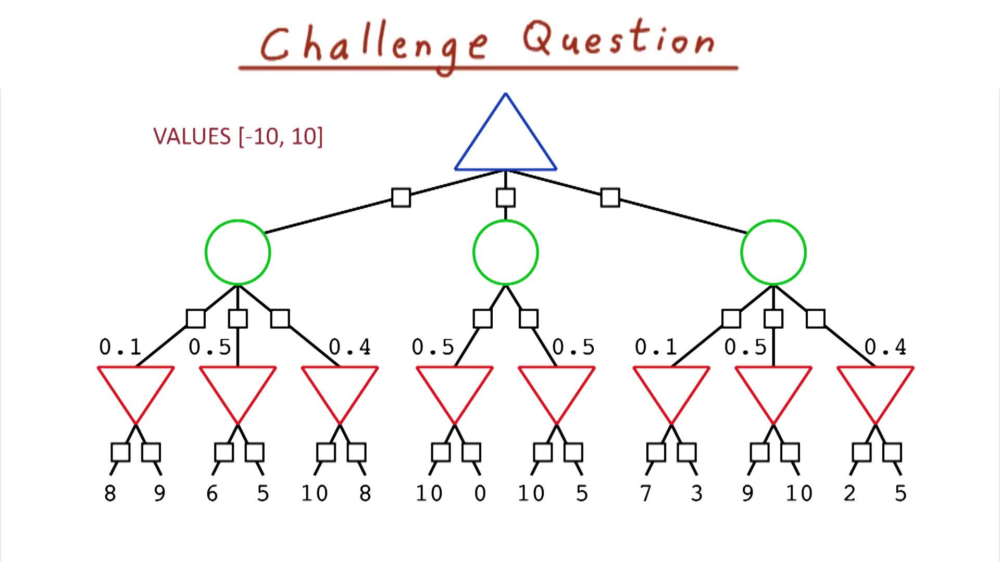
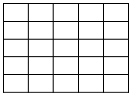
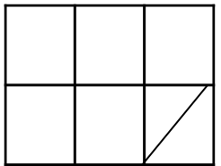
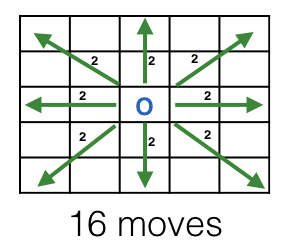

# 
 Introduction to Game Playing 

## Overview

Goal is to designing  an AI that is smarter than yourself, at least at playing a real game.

### Main Topics:
1. Adversarial Search
2. Minimax Algorithm
3. Alpha-Beta Pruning
4. Evaluation Functions
5. Isolation Game Player
6. Multiplayer, probabilistic Games

## Challenge Question Intro

Playing strategy **(deterministic)** games like checkers or isolation or chess, we can use the same algorithms, even the same code to make a computer player for a game  that's as simple as tic-tac-toe or as complex as chess.

In principle the only thing that is different between these games is the code for generating all the next possible moves as well as the user interface.

- **MiniMax** is our primary algorithm to figure out the best move at every turn.
- **Alpha-beta pruning**: helps optimize this algorithm, making the agent play quicker.
- **Expectimax**: modified version of Minimax for change games that considers all the possible outcomes and chooses the one with the maximum expected return, That is assuming the opponent is making the best moves available.

#### 
 QUIZ:
On this expected max game tree, max nodes are triangles faceing up, min nodes are triangles facing down and circles are probabilistic nodes. Mark which nodes do not need to be visited by the alpha beta algorithm to calculate the value of the optimal choice.

Alpha-beta pruning can still provide some performance improvements when applied to expected max game trees that have finite limits on the values the evaluation function returns.

## Isolation
 5x5 board

 

### Rules of isolation

- **objective**: last player to move.
- current board : 5x5
- O & X
- O goes first, places anywhere on the board
- X can place anywhere remaining
- from then on, players move like *queens* in chess, example the player can move horizontal, or vertical or diagonal from current location except that it cant move through opponents piece.
- Players cannot go outside the boundaries of the game board, nor through position that is  currently or was previously occupied.
- first player rot get isolated, unable to move on their turn, loses.
- when you move, only where you land becomes unobtainable for future moves, not the path.

## Building a Game tree

Build a simple 2x3 version to illustrate how to make a game tree that shows all the moves possible during a game.

Consider any field spot on the game board as unavailable.
We will start with one field spot( bottom right).

Assume that O is the computer player and is the first to move, so the computer has five choices in the beginning.

We Draw out all the possible boards for level one of the game tree.

### Full board

But how to we discover the best moves for a computer player?..

## Min and Max and Levels

#### Propagate Values Up a tree

The process of computing values for each node bottom to top is known as the mini max algorithm.
For each max node, pick the maximum value among its child nodes.
If there at least one plus one child, the computer can always pick that to win. Otherwise, it could never win from that point on , assuming a perfect opponent.

# Searching Simple Games
Optional Reading
Artificial Intelligence - A Modern Approach (AIMA): Chapter 5.1-5.2

Optional Readings like these will be assigned throughout the course. If you are interested in diving deeper, please take a break, read the designated chapter/section and come back to the lesson when done.

## Max Number of Nodes Visited

### How many leaf nodes can we expect?

On the First move, O can put its piece in 25 places, next X can put in any of 24 places, after that there are 23 empty places and so on.

$25*24*23*...3*2*1= 25!$ or $10^{25}$ nodes.

Now if we compute this with a computer that can do $10^9$ operations per second it would take $10^{16}$ seconds to search the entire game.

- $10^{16}$ sec
- $3600 \frac{sec}{hr}$
- $\frac{24}{day}$
- $ 365 \frac{days}{year}$
- $317,097920 $ years!

#### QUIZ:
Maximizing Options for third move

Center position has the maximum potential moves with 16 moves

## The Branching Factor

While the center position has 16 spaces in which it can move, most other positions have 12 or less. Lets make a better estimate on how many moves we can make.

The branching factor: $25*24*12^{23}$ *n* nodes in our game tree. or $> 10^{27}$ ( gross overestimate)

- $12^{12} \cong 10^{13}$
- $12*11*...3*2*1 \cong 5*10^8$

New branching factor is $25*24*12^{13}*5*10^8 \cong 3*10^{23}$  Better since most branches will have much less thatn the maximun branching factor.

### 
 Quiz: Nodes in a Game Tree

How many nodes do you thing **MINIMAX** will need to visit?

$b$ is the average branching factor, and $d$ is average depth

- $bd$
- $d^b$
- $d^2$
- $b^d$ <-- ANSWER!

## Average Branching Factor

The average branching factor when pieces are moving randomly is $8^{25} \cong 10^{22}$ nodes.

Thats about 1.2 million years to get our answer!

This means we need to be more clever about how we make a computer player for isolation.  The exponential grow of the game tree means we can't brute force the problem and search for the end-game easily. In general, more interesting games will note  be searchable until the end. Either the branching factor is too large, or the depth , or both.

When the number of nodes, which we can estimate by branching factors to the depth power, start becoming comparable to the number of second remaining in the life of the universe we know we are in trouble.

## Depth-Limited Search

Lets assume again that we can search $10^9$ nodes per second.

So in 2 seconds: $10^9* 2$ sec $= 2*10^9$ nodes

We need to solve the equation: $8^{x}<2*10^9$

We can do this by taking the log base8 on both sides: $\log_88^{x} < \log_8 2*10^9$

- $\log_ax = \frac{\log_bx}{\log_ba}  $

- $x < \frac{\log_{10}2*10^9}{\log_{10}8}$

- $x< 10.3$

Provided that our estimates of a branching factor of 8 on average is good, Its seems OK to only search 10 levels deep.11
