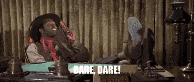

# <center>Introduction to AI Notes </center>


## Navigation

- computational hard
- finding shortest path between two location
- breath first search? (not very efficient)

#### How to find the shortest path between two locations
Only consider roadways going in you end destination.

Heuristic: some additional piece of information, a rule, function or constrain that informs an otherwise brute-force algorithm to act in a more optimal manner.

The actual shortest path between two cities is an actual direct line "as the crow flies".
If you take a random step in any direction, the new direct distance to destination has changed, in this case it has increase.

You test all possible next step from current position to see which one has the lowest distance, then choose that one.

Now, the current next step seems like the best choice may not turn out to be on the optimal path.

We are only using our direct distance **heuristic** to decide which step to explore next.
**foreshadowing..!**  A*search

## Game Playing

Question: Is optimizing really AI?

An intelligent should be able to react to changes in the environment and dare say..


.. anticipate them..

## QUIZ: Tic Tac Toe

**Goal**: Use a search strategy similar to the route-finding problem, to design and AI that can play Tic Tac Toe.

- A: should each cell be a separate node, with an edge connecting two of them if they are adjacent?
- B: Use the current position of the computer player as a node, expressed as a*row/col* tuple where row, column are *{0,1,2}*.
    - Two nodes can be connected if the row and col values differ by at most one, e.g(0,1) should be connected to (1,0) but not (2,2)
- C: keep track of the opponent's current position as well. So each node will be a pair of tuples  such as <(0,1),(2,0)>. For edges, we can use the same rule - connect if the computers player's positions differ by at most one.
- D: Think of the whole board as a node, so we'll have one node for every possible arrangement of X's and O's on the board. In this case, connected two nodes if there is a valid move that changes the board from one to the other.


## Tic Tac Toe: Heuristics

You are limited by the number of moves you might need to consider, especially later in the game when the board is more full.

Example:
- on a 3x3 board, the very first move has 9 different possibilities, and 8 for the opponent, and so on..
- But some moves are clearly a wasteful moves.

### Pruning the search tree
- When you have a move position that will never contribute to a winning combination.
- Being able to ignore moves based on easy to evaluate conditions
- Know that you are going against someone who is also trying to win.

#### Mini-Max Algorithm
You are trying to *maximize* your chances of winning on your turn, and  your opponents is trying to *minimize* your chance of winning on their turn.

A better definition of an Intelligent Agent: Anticipate and plan around expected changes in its environment including those introduced by other agents.


## Monty Hall  Explained.

You are show 3 doors...
```$
+----------+     +----------+     +----------+
|          |     |          |     |          |
|          |     |          |     |          |
|   DOOR   |     |   DOOR   |     |   DOOR   |
|    A     |     |    B     |     |    C     |
|        0 |     |        0 |     |        0 |
|          |     |          |     |          |
|          |     |          |     |          |
|          |     |          |     |          |
+----------+     +----------+     +----------+
```


$P(Car_A) + P(Car_B) + P(Car_C) = 1$

Because we have 3 doors we can say that each door has a probability of 1/3 or..

**Prior Probability**: Best guess given no further evidence.
$$
P(Car_A)= \frac{1}{3},  P(Car_B) \frac{1}{3}, P(Car_C) =  \frac{1}{3}
$$

Let Choose Door A as our first choice, then Monty opens one of the other two doors, say **B**, to reveal a goat, which clearly implies that door **B** does not have the car.
That leads to $Open_B$ Observation:$P(Car_B | Open_B)=0$ is known as the *posterior probability*: our belief after incorporating an observation.

Now Because we have two doors that are closed. You think now that the probability of each door should be 1/2 but it is not.

We need to find the *posterior probability* of the car being behind door **C**, given Monty open door **B** and the implicit rule that he would never reveal the car. $P(Car_C | Open_B)=?$

We can rewrite this *posterior probability* in terms of other quantities that we can computer using *Bayes' Theorem*
$$
= \frac{(P(Open_B|Car_C) * P(Car_C))}{P(Open_B)}
$$

- $P(Open_B | Car_C)=1$
- $P(Car_C) = \frac{1}{3}$

#### Marginal Probability

$P(Open_B) = P(Car_A) * P(Open_B | Car_A) + P(Car_B) * P(Open_B | Car_B) + P(Car_C) * P(Open_B | Car_C)$


$= \frac {1}{3} * \frac {1}{2} + \frac {1}{3} * 0 + \frac {1}{3} * 1 $

$= \frac {1}{6} + \frac {1}{3} $
$= \frac {1}{2}$

Lets Plug in the marginal probability to our original problem

$P(Car_C| Open_B) = \frac{1 * \frac{1}{3}}{\frac{1}{2}} = \frac{2}{3}$


## Intelligence

The true goal of intelligence is to be able to produce reasonable behavior while dealing with different sources of complexity.

But what is intelligence?

An agents domain affects how we judge its level of intelligence.

## Defining Intelligence

We often tend to use the word intelligence to describe things that we don't know how to explain, once we can explain then, we just say that they are algorithms or formulas.  They're only intelligent if we can't explain then.

This definition is problematic. It implies that anything we design can never be intelligent because we would know how it works.

Intelligence should be defined within the context of a task, it just turns out that humans are intelligent at doing allot of things.

## Agent, Environment and State

- Agent: intelligence system or software itself
- Environment:
- State:
- Goal State: result the agent is trying to achieve, it can be partial specification, but only include the final location
    - It can be a set of different states that are all considered acceptable goals

EXAMPLE: Roomba, An automated vacuum cleaner that moves around the house in consistent pattern sucking up dirt.

- **ENVIROMENT**: room or  house its operating, but more specifically, the floor, walls and all the objects that are on the floor that it may need to avoid bumping into.
    - hardware components: sensors, motors

- **AGENT**: from a Cartesian POV, you may only consider the software itself as the agent.
    -At a higher level: the entire robot should be the agent., include all component that are directly accessible or controllable with some reliability.

- STATE: current position as well as all the different areas that it has already cleaned.
    - We only represent those items in the state that are necessary for completing the task.

- GOAL STATE:


## Perception, Action and Cognition.

- PERCEPTION: agent interacts with the environment by sensing its properties. By producing  useful output or actions that typically change the state of the environment.

- COGNITION: The process which an agent decided what action to take based on its perceived inputs.

## Types of AI Problems

### Environment states

- Fully Observable
    ex. Tic Tac Toe: you can see the entire board
- Partially Observable
    - ex Battleship, you can't see your opponents ship positions.

- Deterministic: know for sure the results of each action.
- Stochastic: have uncertainty.

- Discrete: finite number of states
- Continuous: possible states is infinite, typically due to some properties that need to be stored as real numbers.]

- Benign: agent is the only on taking actions that intentionally affect its goal
- Adversarial: more than one agents that can take actions to defeat its goal(found in competitive games)

## Rational Behavior and Bounded Optimality

Definitions:

- **Intelligent agent**: one that takes actions to maximize its expected utility given a desired goal. commonly known as ***rational behavior***

problem. It requires agents to behave optimally yet its extremely hard to find the optimal solution to may of the problems we are concerned with.

We need to consider the constrains the agent is faced with. example: A partially observable environment, limited computational resources such as memory * processing speed. Rules imposed by the task at hand such as having to respond by a given deadline etc.

Given these constrains, we can not expect an agent to always behave optimally, but we can come up with a level of performance or **bound** that we desire the agent to meet.

Ex: We want a chess playing program to win 60% of the time against a chess master

- **Bounded Optimality**: Practical and feasible way of quantifying intelligence.

# End
