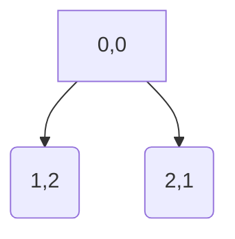

## Title

-  The agents can move to any open cell on the board that is 2-rows and 1-column or 2-columns and 1-row away from their current position on the board
## Legal moves [0,0]
|   |`[[1,2],[2,1]]`   |
|-------------------------------------------|------------------|

## Legal moves [0,1]
| |`[[2,0],[2,2],[1,3]]`|
|-------------------------------------------|-------------------|

## Legal moves [0,2]
| |`[[1,0],[2,1],[2,3],[1,4]]`|
|-------------------------------------------|-------------------|

## Legal moves [0,3]
| |`[[1,1],[2,2],[2,4]]`|
|-------------------------------------------|-------------------|

## Legal moves [0,4]
| |`[[1,2],[2,3]`|
|-------------------------------------------|-------------------|

## Legal moves [1,0]
| |`[[0,2],[2,2],[3,1]]`|
|-------------------------------------------|-------------------|

## Legal moves [1,1]
| |`[[0,3],[3,0],[2,3],[3,2]]`|
|-------------------------------------------|-------------------|

## Legal moves [1,2]
| |`[[0,0],[0,4],[2,0],[2,4],[3,1],[3,3]]`|
|-------------------------------------------|-------------------|

## Legal moves [1,3]
| |`[[0,1],[2,1],[3,2],[3,4]]`|
|-------------------------------------------|-------------------|

## Legal moves [1,4]
| |`[[0,2],[2,2],[3,3]]`|
|-------------------------------------------|-------------------|

## Legal moves [2,0]
| |`[[0,1],[1,2],[3,2],[4,1]]`|
|-------------------------------------------|-------------------|

## Legal moves [2,1]
| |`[[0,0],[0,2],[1,3],[4,0],[3,3],[4,2]]`|
|-------------------------------------------|-------------------|

## Legal moves [2,2]
| |`[[1,0],[0,1],[0,3],[1,4],[3,0],[4,1],[3,4],[4,3]]`|
|-------------------------------------------|-------------------|

## Legal moves [2,3]
| |`[[0,2],[0,4],[1,1],[3,1],[4,2],[4,4]]`|
|-------------------------------------------|-------------------|

## Legal moves [2,4]
| |`[[0,3],[1,2],[3,2],[4,3]]`|
|-------------------------------------------|-------------------|

## Legal moves [3,0]
| |`[[1,1],[2,2],[4,2]]`|
|-------------------------------------------|-------------------|

## Legal moves [3,1]
| |`[[1,0],[1,2],[2,3],[4,3]]`|
|-------------------------------------------|-------------------|

## Legal moves [3,2]
| |`[[1,1],[1,3],[2,0],[2,4],[4,0],[4,4]]`|
|-------------------------------------------|-------------------|

## Legal moves [3,3]
| |`[[1,2],[1,4],[2,1],[4,1]]`|
|-------------------------------------------|-------------------|

## Legal moves [3,4]
| |`[[1,3],[2,2],[4,2]]`|
|-------------------------------------------|-------------------|

## Legal moves [4,0]
| |`[[2,1],[3,2]]`|
|-------------------------------------------|-------------------|

## Legal moves [4,1]
| |`[[2,0],[2,2],[3,3]]`|
|-------------------------------------------|-------------------|

## Legal moves [4,2]
| |`[[2,1],[2,3],[3,0],[3,4]]`|
|-------------------------------------------|-------------------|

## Legal moves [4,3]
| |`[[2,2],[2,4],[3,1]]`|
|-------------------------------------------|-------------------|

## Legal moves [4,4]
| |`[[2,3],[3,2]]`|
|-------------------------------------------|-------------------|

