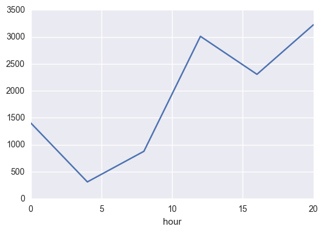

```python
#Histograms of subway ridership on both days with rain and days without rain
```


```python
import matplotlib.pyplot as plt
import numpy as np
import pandas as pd
import seaborn as sns
%pylab inline

subway_df = pd.read_csv('nyc_subway_weather.csv')
```

    Populating the interactive namespace from numpy and matplotlib


```python
subway_df.head()
```


<div>
<table border="1" class="dataframe">
  <thead>
    <tr style="text-align: right;">
      <th></th>
      <th>UNIT</th>
      <th>DATEn</th>
      <th>TIMEn</th>
      <th>ENTRIESn</th>
      <th>EXITSn</th>
      <th>ENTRIESn_hourly</th>
      <th>EXITSn_hourly</th>
      <th>datetime</th>
      <th>hour</th>
      <th>day_week</th>
      <th>...</th>
      <th>pressurei</th>
      <th>rain</th>
      <th>tempi</th>
      <th>wspdi</th>
      <th>meanprecipi</th>
      <th>meanpressurei</th>
      <th>meantempi</th>
      <th>meanwspdi</th>
      <th>weather_lat</th>
      <th>weather_lon</th>
    </tr>
  </thead>
  <tbody>
    <tr>
      <th>0</th>
      <td>R003</td>
      <td>05-01-11</td>
      <td>00:00:00</td>
      <td>4388333</td>
      <td>2911002</td>
      <td>0.0</td>
      <td>0.0</td>
      <td>2011-05-01 00:00:00</td>
      <td>0</td>
      <td>6</td>
      <td>...</td>
      <td>30.22</td>
      <td>0</td>
      <td>55.9</td>
      <td>3.5</td>
      <td>0.0</td>
      <td>30.258</td>
      <td>55.98</td>
      <td>7.86</td>
      <td>40.700348</td>
      <td>-73.887177</td>
    </tr>
    <tr>
      <th>1</th>
      <td>R003</td>
      <td>05-01-11</td>
      <td>04:00:00</td>
      <td>4388333</td>
      <td>2911002</td>
      <td>0.0</td>
      <td>0.0</td>
      <td>2011-05-01 04:00:00</td>
      <td>4</td>
      <td>6</td>
      <td>...</td>
      <td>30.25</td>
      <td>0</td>
      <td>52.0</td>
      <td>3.5</td>
      <td>0.0</td>
      <td>30.258</td>
      <td>55.98</td>
      <td>7.86</td>
      <td>40.700348</td>
      <td>-73.887177</td>
    </tr>
    <tr>
      <th>2</th>
      <td>R003</td>
      <td>05-01-11</td>
      <td>12:00:00</td>
      <td>4388333</td>
      <td>2911002</td>
      <td>0.0</td>
      <td>0.0</td>
      <td>2011-05-01 12:00:00</td>
      <td>12</td>
      <td>6</td>
      <td>...</td>
      <td>30.28</td>
      <td>0</td>
      <td>62.1</td>
      <td>6.9</td>
      <td>0.0</td>
      <td>30.258</td>
      <td>55.98</td>
      <td>7.86</td>
      <td>40.700348</td>
      <td>-73.887177</td>
    </tr>
    <tr>
      <th>3</th>
      <td>R003</td>
      <td>05-01-11</td>
      <td>16:00:00</td>
      <td>4388333</td>
      <td>2911002</td>
      <td>0.0</td>
      <td>0.0</td>
      <td>2011-05-01 16:00:00</td>
      <td>16</td>
      <td>6</td>
      <td>...</td>
      <td>30.26</td>
      <td>0</td>
      <td>57.9</td>
      <td>15.0</td>
      <td>0.0</td>
      <td>30.258</td>
      <td>55.98</td>
      <td>7.86</td>
      <td>40.700348</td>
      <td>-73.887177</td>
    </tr>
    <tr>
      <th>4</th>
      <td>R003</td>
      <td>05-01-11</td>
      <td>20:00:00</td>
      <td>4388333</td>
      <td>2911002</td>
      <td>0.0</td>
      <td>0.0</td>
      <td>2011-05-01 20:00:00</td>
      <td>20</td>
      <td>6</td>
      <td>...</td>
      <td>30.28</td>
      <td>0</td>
      <td>52.0</td>
      <td>10.4</td>
      <td>0.0</td>
      <td>30.258</td>
      <td>55.98</td>
      <td>7.86</td>
      <td>40.700348</td>
      <td>-73.887177</td>
    </tr>
  </tbody>
</table>
<p>5 rows × 27 columns</p>
</div>


```python
subway_df.groupby('rain')
```


    <pandas.core.groupby.DataFrameGroupBy object at 0x00000000094E4390>


```python
subway_df.groupby(['hour'])['ENTRIESn_hourly'].mean().plot() #0-20小时间进入旋转门的平均人数
```


    <matplotlib.axes._subplots.AxesSubplot at 0x94e4f60>





```python
rain_in_week = subway_df.groupby(['day_week','rain'])['ENTRIESn_hourly'].mean() #每周下雨天小时间进入旋转门的平均人数
rain_in_week
```


    day_week  rain
    0         0       1792.143970
              1       1948.177419
    1         0       2171.126911
              1       2139.860974
    2         0       2313.388767
              1       2280.795255
    3         0       2264.874673
              1       2584.054627
    4         0       2274.958944
              1       2284.644330
    5         0       1388.219575
              1       1317.855422
    6         0       1074.015694
              1       1036.095344
    Name: ENTRIESn_hourly, dtype: float64


```python
rain_group = subway_df.groupby(['rain','day_week'], as_index=False)['ENTRIESn_hourly'] #as_index=False避免第一个第一个key做参数
print rain_group.mean()
```

        rain  day_week  ENTRIESn_hourly
    0      0         0      1792.143970
    1      0         1      2171.126911
    2      0         2      2313.388767
    3      0         3      2264.874673
    4      0         4      2274.958944
    5      0         5      1388.219575
    6      0         6      1074.015694
    7      1         0      1948.177419
    8      1         1      2139.860974
    9      1         2      2280.795255
    10     1         3      2584.054627
    11     1         4      2284.644330
    12     1         5      1317.855422
    13     1         6      1036.095344


```python
no_rain = plt.plot(rain_group.mean().iloc[0:7]['day_week'],
                   rain_group.mean().iloc[0:7]['ENTRIESn_hourly'],
                   label='Days Without Rain')
# Days with rain
rain = plt.plot(rain_group.mean().iloc[7:]['day_week'],
                rain_group.mean().iloc[7:]['ENTRIESn_hourly'],c="r",
                label='Days With Rain')

plt.legend() #加标签
plt.xlabel('Day of Week (Monday=0)')
plt.ylabel('Mean Entries Per Hour')
plt.title('Ridership: Rain vs No Rain')
```


    <matplotlib.text.Text at 0x9ad4f98>


A scatterplot of subway stations with latitude and longitude as the x and y axes and ridership as the bubble size


```python
# A scatterplot of subway stations with latitude and longitude as the x and y axes and ridership as the bubble size
lat_lon_group = subway_df.groupby(['latitude', 'longitude'], as_index=False)
mean_entries = lat_lon_group['ENTRIESn'].mean()
N = len(mean_entries)
colors = np.random.rand(N,3)
print mean_entries[['latitude','longitude']]

plt.scatter(mean_entries['latitude'], mean_entries['longitude'], c=colors, s=mean_entries['ENTRIESn']/500000, alpha=0.5)
plt.xlabel('Latitude')
plt.ylabel('Longitude')
plt.title('Ridership by Latitude and Longitude')
```

          latitude  longitude
    0    40.576152 -73.975925
    1    40.576298 -73.968523
    2    40.577961 -73.961806
    3    40.589547 -73.974295
    4    40.590867 -73.797011
    5    40.592334 -73.788493
    6    40.593214 -73.776433
    7    40.595234 -73.955090
    8    40.595381 -73.768194
    9    40.600138 -73.761520
    10   40.603983 -73.755383
    11   40.604798 -73.998456
    12   40.607958 -74.001782
    13   40.608691 -73.957772
    14   40.609147 -73.972986
    15   40.613513 -74.000645
    16   40.616624 -74.030964
    17   40.617568 -73.959360
    18   40.619588 -73.998842
    19   40.622715 -74.028368
    20   40.625028 -73.960819
    21   40.629164 -73.961678
    22   40.629702 -74.025514
    23   40.629881 -73.977149
    24   40.631412 -73.995473
    25   40.634945 -74.023411
    26   40.636232 -73.994765
    27   40.640905 -73.963866
    28   40.641426 -74.017972
    29   40.643738 -74.073622
    ..         ...        ...
    204  40.829495 -73.874559
    205  40.833773 -73.918430
    206  40.834255 -73.851222
    207  40.835535 -73.921380
    208  40.839892 -73.842952
    209  40.840048 -73.917775
    210  40.840778 -73.940091
    211  40.844406 -73.914621
    212  40.845892 -73.910136
    213  40.847369 -73.939683
    214  40.848635 -73.912497
    215  40.849495 -73.933632
    216  40.852417 -73.828082
    217  40.852465 -73.828125
    218  40.853390 -73.907733
    219  40.855176 -73.929384
    220  40.856085 -73.900695
    221  40.858389 -73.903828
    222  40.859022 -73.934190
    223  40.860523 -73.925575
    224  40.862803 -73.901034
    225  40.862941 -73.901199
    226  40.864653 -73.918719
    227  40.869359 -73.915329
    228  40.873399 -73.890084
    229  40.874551 -73.909879
    230  40.877796 -73.866341
    231  40.878867 -73.904858
    232  40.885973 -73.878851
    233  40.889185 -73.898549

    [234 rows x 2 columns]


    <matplotlib.text.Text at 0xeb16a90>


