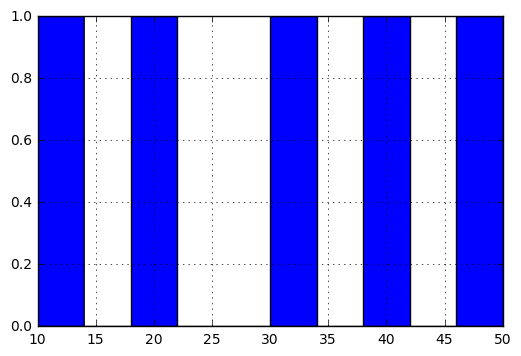

# 导入numpy库


```python
import numpy as np

# First 20 countries with employment data
countries = np.array([
    'Afghanistan', 'Albania', 'Algeria', 'Angola', 'Argentina',
    'Armenia', 'Australia', 'Austria', 'Azerbaijan', 'Bahamas',
    'Bahrain', 'Bangladesh', 'Barbados', 'Belarus', 'Belgium',
    'Belize', 'Benin', 'Bhutan', 'Bolivia',
    'Bosnia and Herzegovina'
])

# Employment data in 2007 for those 20 countries
employment = np.array([
    55.70000076,  51.40000153,  50.5       ,  75.69999695,
    58.40000153,  40.09999847,  61.5       ,  57.09999847,
    60.90000153,  66.59999847,  60.40000153,  68.09999847,
    66.90000153,  53.40000153,  48.59999847,  56.79999924,
    71.59999847,  58.40000153,  70.40000153,  41.20000076
])
 
```


```python
def max_employment(countries, employment):
    for i in range(len(employment)):
        if employment[i] == employment.max():
            max_country = countries[i]
            max_value = employment.max()
    return (max_country, max_value)
```


```python
print max_employment(countries, employment)
```

    ('Angola', 75.699996949999999)
    


```python
def max_employment2(countries, employment):
    i = employment.argmax()
    return (countries[i], employment[i])
```


```python
print  max_employment2(countries, employment)
```

    ('Angola', 75.699996949999999)
    


```python
# Accessing elements
if True:
    print countries[0]
    print countries[3]
```

    Afghanistan
    Angola
    


```python
# Slicing
if True:
    print countries[0:3] #[3]是不包括的，python的常识，记住了
    print countries[:3]
    print countries[17:]
    print countries[:]
```

    ['Afghanistan' 'Albania' 'Algeria']
    ['Afghanistan' 'Albania' 'Algeria']
    ['Bhutan' 'Bolivia' 'Bosnia and Herzegovina']
    ['Afghanistan' 'Albania' 'Algeria' 'Angola' 'Argentina' 'Armenia'
     'Australia' 'Austria' 'Azerbaijan' 'Bahamas' 'Bahrain' 'Bangladesh'
     'Barbados' 'Belarus' 'Belgium' 'Belize' 'Benin' 'Bhutan' 'Bolivia'
     'Bosnia and Herzegovina']
    


```python
# Element types
if True:
    print countries.dtype
    print employment.dtype
    print np.array([0, 1, 2, 3]).dtype
    print np.array([1.0, 1.5, 2.0, 2.5]).dtype
    print np.array([True, False, True]).dtype
    print np.array(['AL', 'AK', 'AZ', 'AR', 'CA']).dtype
```

    |S22
    float64
    int32
    float64
    bool
    |S2
    


```python
# Looping
if True:
    for country in countries:
        print 'Examining country {}'.format(country)

    for i in range(len(countries)):
        country = countries[i]
        country_employment = employment[i]
        print 'Country {} has employment {}'.format(country,
                country_employment)
```

    Examining country Afghanistan
    Examining country Albania
    Examining country Algeria
    Examining country Angola
    Examining country Argentina
    Examining country Armenia
    Examining country Australia
    Examining country Austria
    Examining country Azerbaijan
    Examining country Bahamas
    Examining country Bahrain
    Examining country Bangladesh
    Examining country Barbados
    Examining country Belarus
    Examining country Belgium
    Examining country Belize
    Examining country Benin
    Examining country Bhutan
    Examining country Bolivia
    Examining country Bosnia and Herzegovina
    Country Afghanistan has employment 55.70000076
    Country Albania has employment 51.40000153
    Country Algeria has employment 50.5
    Country Angola has employment 75.69999695
    Country Argentina has employment 58.40000153
    Country Armenia has employment 40.09999847
    Country Australia has employment 61.5
    Country Austria has employment 57.09999847
    Country Azerbaijan has employment 60.90000153
    Country Bahamas has employment 66.59999847
    Country Bahrain has employment 60.40000153
    Country Bangladesh has employment 68.09999847
    Country Barbados has employment 66.90000153
    Country Belarus has employment 53.40000153
    Country Belgium has employment 48.59999847
    Country Belize has employment 56.79999924
    Country Benin has employment 71.59999847
    Country Bhutan has employment 58.40000153
    Country Bolivia has employment 70.40000153
    Country Bosnia and Herzegovina has employment 41.20000076
    


```python
# Numpy functions
if True:
    print employment.mean()
    print employment.std()
    print employment.max()
    print employment.sum()   
```

    58.6850000385
    9.33826911369
    75.69999695
    1173.70000077
    

# 各种数理运算


```python
# Arithmetic operations between 2 NumPy arrays
if True:
    a = np.array([1, 2, 3, 4])
    b = np.array([1, 2, 1, 2])
    
    print a + b
    print a - b
    print a * b
    print a / b
    print a ** b
```

    [2 4 4 6]
    [0 0 2 2]
    [1 4 3 8]
    [1 1 3 2]
    [ 1  4  3 16]
    


```python
if True:
    a = np.array([1, 2, 3, 4])
    b = 2
    
    print a + b
    print a - b
    print a * b
    print a / b
    print a ** b
```

    [3 4 5 6]
    [-1  0  1  2]
    [2 4 6 8]
    [0 1 1 2]
    [ 1  4  9 16]
    


```python
# Logical operations with NumPy arrays
if True:
    a = np.array([True, True, False, False])
    b = np.array([True, False, True, False])
    
    print a & b
    print a | b
    print ~a
    
    print a & True
    print a & False
    
    print a | True
    print a | False #或
```

    [ True False False False]
    [ True  True  True False]
    [False False  True  True]
    [ True  True False False]
    [False False False False]
    [ True  True  True  True]
    [ True  True False False]
    


```python
# Comparison operations between 2 NumPy Arrays
if True:
    a = np.array([1, 2, 3, 4, 5])
    b = np.array([5, 4, 3, 2, 1])
    
    print a > b
    print a >= b
    print a < b
    print a <= b
    print a == b
    print a != b
```

    [False False False  True  True]
    [False False  True  True  True]
    [ True  True False False False]
    [ True  True  True False False]
    [False False  True False False]
    [ True  True False  True  True]
    


```python
# Comparison operations between a NumPy array and a single number
if True:
    a = np.array([1, 2, 3, 4])
    b = 2
    
    print a > b
    print a >= b
    print a < b
    print a <= b
    print a == b
    print a != b
```

    [False False  True  True]
    [False  True  True  True]
    [ True False False False]
    [ True  True False False]
    [False  True False False]
    [ True False  True  True]
    

# 函数的应用


```python
# First 20 countries with school completion data
countries = np.array([
       'Algeria', 'Argentina', 'Armenia', 'Aruba', 'Austria','Azerbaijan',
       'Bahamas', 'Barbados', 'Belarus', 'Belgium', 'Belize', 'Bolivia',
       'Botswana', 'Brunei', 'Bulgaria', 'Burkina Faso', 'Burundi',
       'Cambodia', 'Cameroon', 'Cape Verde'
])

# Female school completion rate in 2007 for those 20 countries
female_completion = np.array([
    97.35583,  104.62379,  103.02998,   95.14321,  103.69019,
    98.49185,  100.88828,   95.43974,   92.11484,   91.54804,
    95.98029,   98.22902,   96.12179,  119.28105,   97.84627,
    29.07386,   38.41644,   90.70509,   51.7478 ,   95.45072
])

# Male school completion rate in 2007 for those 20 countries
male_completion = np.array([
     95.47622,  100.66476,   99.7926 ,   91.48936,  103.22096,
     97.80458,  103.81398,   88.11736,   93.55611,   87.76347,
    102.45714,   98.73953,   92.22388,  115.3892 ,   98.70502,
     37.00692,   45.39401,   91.22084,   62.42028,   90.66958
])

def overall_completion_rate(female_completion, male_completion):
    '''
    Fill in this function to return a NumPy array containing the overall
    school completion rate for each country. The arguments are NumPy
    arrays giving the female and male completion of each country in
    the same order.
    '''
    overall_rate = 0.5 * female_completion + 0.5 * male_completion
    return overall_rate
```


```python
print overall_completion_rate(female_completion, male_completion)
```

    [  96.416025  102.644275  101.41129    93.316285  103.455575   98.148215
      102.35113    91.77855    92.835475   89.655755   99.218715   98.484275
       94.172835  117.335125   98.275645   33.04039    41.905225   90.962965
       57.08404    93.06015 ]
    


```python
# First 20 countries with employment data
countries = np.array([
    'Afghanistan', 'Albania', 'Algeria', 'Angola', 'Argentina',
    'Armenia', 'Australia', 'Austria', 'Azerbaijan', 'Bahamas',
    'Bahrain', 'Bangladesh', 'Barbados', 'Belarus', 'Belgium',
    'Belize', 'Benin', 'Bhutan', 'Bolivia',
    'Bosnia and Herzegovina'
])

# Employment data in 2007 for those 20 countries
employment = np.array([
    55.70000076,  51.40000153,  50.5       ,  75.69999695,
    58.40000153,  40.09999847,  61.5       ,  57.09999847,
    60.90000153,  66.59999847,  60.40000153,  68.09999847,
    66.90000153,  53.40000153,  48.59999847,  56.79999924,
    71.59999847,  58.40000153,  70.40000153,  41.20000076
])

```


```python
# Change this country name to change what country will be printed when you
# click "Test Run". Your function will be called to determine the standardized
# score for this country for each of the given 5 Gapminder variables in 2007.
# The possible country names are available in the Downloadables section.
def standardize_data(values):
    return (values-values.mean()) /values.std()

    
    '''
    Fill in this function to return a standardized version of the given values,
    which will be in a NumPy array. Each value should be translated into the
    number of standard deviations that value is away from the mean of the data.
    (A positive number indicates a value higher than the mean, and a negative
    number indicates a value lower than the mean.)
     '''
```


```python
print standardize_data(employment)
```

    [-0.31965231 -0.780123   -0.87650077  1.82207181 -0.03051941 -1.99019768
      0.30144772 -0.16973184  0.23719615  0.84758731  0.18365304  1.00821665
      0.87971351 -0.56595055 -1.07996476 -0.20185762  1.38301845 -0.03051941
      1.2545153  -1.87240259]
    

# 用index特性和逻辑关系来处理arrays


```python
# Using index arrays
if True:
    a = np.array([1, 2, 3, 4])
    b = np.array([True, True, False, False])
    
    print a[b]
    print a[np.array([True, False, True, False])]
```

    [1 2]
    [1 3]
    


```python
# Creating the index array using vectorized operations
if True:
    a = np.array([1, 2, 3, 2, 1])
    b = (a >= 2)
    
    print a[b]
    print a[a >= 2]
```

    [2 3 2]
    [2 3 2]
    


```python
# Creating the index array using vectorized operations on another array
if True:
    a = np.array([1, 2, 3, 4, 5])
    b = np.array([1, 2, 3, 2, 1])
    
    print b == 2
    print a[b == 2]
```

    [False  True False  True False]
    [2 4]
    


```python
def mean_time_for_paid_students(time_spent, days_to_cancel):
    '''
    Fill in this function to calculate the mean time spent in the classroom
    for students who stayed enrolled at least (greater than or equal to) 7 days.
    Unlike in Lesson 1, you can assume that days_to_cancel will contain only
    integers (there are no students who have not canceled yet).
    
    The arguments are NumPy arrays. time_spent contains the amount of time spent
    in the classroom for each student, and days_to_cancel contains the number
    of days until each student cancel. The data is given in the same order
    in both arrays.
    '''
    return time_spent[days_to_cancel>=7].mean()

# Time spent in the classroom in the first week for 20 students
time_spent = np.array([
       12.89697233,    0.        ,   64.55043217,    0.        ,
       24.2315615 ,   39.991625  ,    0.        ,    0.        ,
      147.20683783,    0.        ,    0.        ,    0.        ,
       45.18261617,  157.60454283,  133.2434615 ,   52.85000767,
        0.        ,   54.9204785 ,   26.78142417,    0.
])

# Days to cancel for 20 students
days_to_cancel = np.array([
      4,   5,  37,   3,  12,   4,  35,  38,   5,  37,   3,   3,  68,
     38,  98,   2, 249,   2, 127,  35
])


print mean_time_for_paid_students(time_spent, days_to_cancel)
```

    41.0540034855
    

# numpy数组互相的运算


```python
import numpy as np
a = np.array([1,2,3,4])
b = a
a += np.array([1,1,1,1])

print a
print b
#因为用了 +=，b已经等于a了， 所以b随着a变
```

    [2 3 4 5]
    [2 3 4 5]
    


```python
c = np.array([1,2,3,4])
d = c
c =  c+ np.array([1,1,1,1])

print c
print d
#用正常的 = + 不会改变第二个数组的值，相当于新建了一个d数组
```

    [2 3 4 5]
    [1 2 3 4]
    


```python
t = np.array([1,2,3,4,5,6])
slice = t[:3] #numpy实际上并没有创建新的array，只是提取了前三个值，进行切片
slice[0] =100 #切片的操作其实是在原来数组上进行的，所以此时原数组也发生了改变

print t
```

    [100   2   3   4   5   6]
    

# 导入Pandas库


```python
import pandas as pd

countries = ['Albania', 'Algeria', 'Andorra', 'Angola', 'Antigua and Barbuda',
             'Argentina', 'Armenia', 'Australia', 'Austria', 'Azerbaijan',
             'Bahamas', 'Bahrain', 'Bangladesh', 'Barbados', 'Belarus',
             'Belgium', 'Belize', 'Benin', 'Bhutan', 'Bolivia']

life_expectancy_values = [74.7,  75. ,  83.4,  57.6,  74.6,  75.4,  72.3,  81.5,  80.2,
                          70.3,  72.1,  76.4,  68.1,  75.2,  69.8,  79.4,  70.8,  62.7,
                          67.3,  70.6]

gdp_values = [ 1681.61390973,   2155.48523109,  21495.80508273,    562.98768478,
              13495.1274663 ,   9388.68852258,   1424.19056199,  24765.54890176,
              27036.48733192,   1945.63754911,  21721.61840978,  13373.21993972,
                483.97086804,   9783.98417323,   2253.46411147,  25034.66692293,
               3680.91642923,    366.04496652,   1175.92638695,   1132.21387981]

# Life expectancy and gdp data in 2007 for 20 countries
life_expectancy = pd.Series(life_expectancy_values)
gdp = pd.Series(gdp_values)
life_expectancy_list = pd.Series(life_expectancy_values, index = countries )

```


```python
# Accessing elements and slicing
if True:
    print life_expectancy[0]
    print gdp[3:6] #注意了pandas数组排列方式如下带着index和value
```

    74.7
    3      562.987685
    4    13495.127466
    5     9388.688523
    dtype: float64
    


```python
# Looping
if True:
    for country_life_expectancy in life_expectancy:
        print 'Examining life expectancy {}'.format(country_life_expectancy)
```

    Examining life expectancy 74.7
    Examining life expectancy 75.0
    Examining life expectancy 83.4
    Examining life expectancy 57.6
    Examining life expectancy 74.6
    Examining life expectancy 75.4
    Examining life expectancy 72.3
    Examining life expectancy 81.5
    Examining life expectancy 80.2
    Examining life expectancy 70.3
    Examining life expectancy 72.1
    Examining life expectancy 76.4
    Examining life expectancy 68.1
    Examining life expectancy 75.2
    Examining life expectancy 69.8
    Examining life expectancy 79.4
    Examining life expectancy 70.8
    Examining life expectancy 62.7
    Examining life expectancy 67.3
    Examining life expectancy 70.6
    


```python
# Pandas functions
if True:
    print life_expectancy.mean()
    print life_expectancy.std()
    print gdp.max()
    print gdp.sum()
```

    72.87
    6.21399947487
    27036.4873319
    182957.59833
    


```python
# Vectorized operations and index arrays
if True:
    a = pd.Series([1, 2, 3, 4])
    b = pd.Series([1, 2, 1, 2])
  
    print a + b
    print a * 2
    print a >= 3
    print a[a >= 3]
```

    0    2
    1    4
    2    4
    3    6
    dtype: int64
    0    2
    1    4
    2    6
    3    8
    dtype: int64
    0    False
    1    False
    2     True
    3     True
    dtype: bool
    2    3
    3    4
    dtype: int64
    


```python
a = pd.Series(life_expectancy_values)
print a[a>a.mean()]
print a.mean()
print True + True #两个true相加等于2
```

    0     74.7
    1     75.0
    2     83.4
    4     74.6
    5     75.4
    7     81.5
    8     80.2
    11    76.4
    13    75.2
    15    79.4
    dtype: float64
    72.87
    2
    


```python
def variable_correlation(variable1, variable2):
    '''
    Fill in this function to calculate the number of data points for which
    the directions of variable1 and variable2 relative to the mean are the
    same, and the number of data points for which they are different.
    Direction here means whether each value is above or below its mean.
    
    You can classify cases where the value is equal to the mean for one or
    both variables however you like.
    
    Each argument will be a Pandas series.
    
    For example, if the inputs were pd.Series([1, 2, 3, 4]) and
    pd.Series([4, 5, 6, 7]), then the output would be (4, 0).
    This is because 1 and 4 are both below their means, 2 and 5 are both
    below, 3 and 6 are both above, and 4 and 7 are both above.
    
    On the other hand, if the inputs were pd.Series([1, 2, 3, 4]) and
    pd.Series([7, 6, 5, 4]), then the output would be (0, 4).
    This is because 1 is below its mean but 7 is above its mean, and
    so on.
    '''
    both_above = (variable1 > variable1.mean()) & (variable2 > variable2.mean())
    both_below = (variable1 < variable1.mean()) & (variable2 < variable2.mean())
    is_same_direction = both_above | both_below
    num_same_direction = is_same_direction.sum()
    num_different_direction =len(variable1) - num_same_direction 
    
    return (num_same_direction, num_different_direction)
```


```python
#life_expectancy_list = pd.Series(life_expectancy_values, index = countries )
print variable_correlation(life_expectancy, gdp)
```

    (17, 3)
    


```python
print pd.Series.argmax(life_expectancy_list)
```

    Andorra
    


```python
import pandas as pd

countries = [
    'Afghanistan', 'Albania', 'Algeria', 'Angola', 'Argentina',
    'Armenia', 'Australia', 'Austria', 'Azerbaijan', 'Bahamas',
    'Bahrain', 'Bangladesh', 'Barbados', 'Belarus', 'Belgium',
    'Belize', 'Benin', 'Bhutan', 'Bolivia',
    'Bosnia and Herzegovina'
]


employment_values = [
    55.70000076,  51.40000153,  50.5       ,  75.69999695,
    58.40000153,  40.09999847,  61.5       ,  57.09999847,
    60.90000153,  66.59999847,  60.40000153,  68.09999847,
    66.90000153,  53.40000153,  48.59999847,  56.79999924,
    71.59999847,  58.40000153,  70.40000153,  41.20000076
]

# Employment data in 2007 for 20 countries
employment = pd.Series(employment_values, index=countries)

def max_employment(employment):
    '''
    Fill in this function to return the name of the country
    with the highest employment in the given employment
    data, and the employment in that country.
    
    The input will be a Pandas series where the values
    are employment and the index is country names.
    
    Try using the Pandas argmax() function. Documention is
    here: http://pandas.pydata.org/pandas-docs/stable/generated/pandas.Series.argmax.html
    '''
    max_country = employment.argmax()    
    max_value = employment.loc[max_country]  #定位用loc

    return (max_country, max_value)
    
print max_employment(employment)
```

    ('Angola', 75.699996949999999)
    


```python
    s1 = pd.Series([1, 2, 3, 4], index=['a', 'b', 'c', 'd'])
    s2 = pd.Series([10, 20, 30, 40], index=['a', 'b', 'c', 'd'])
    print s1 + s2
```

    a    11
    b    22
    c    33
    d    44
    dtype: int64
    


```python
    s1 = pd.Series([1, 2, 3, 4], index=['a', 'b', 'c', 'd'])
    s2 = pd.Series([10, 20, 30, 40], index=['b', 'd', 'a', 'c'])
    print s1 + s2
```

    a    31
    b    12
    c    43
    d    24
    dtype: int64
    


```python
    s1 = pd.Series([1, 2, 3, 4], index=['a', 'b', 'c', 'd'])
    s2 = pd.Series([10, 20, 30, 40], index=['c', 'd', 'e', 'f'])
    sum_result = s1 + s2
    print s1 + s2
```

    a     NaN
    b     NaN
    c    13.0
    d    24.0
    e     NaN
    f     NaN
    dtype: float64
    


```python
print sum_result.dropna() #去除无效项
```

    c    13.0
    d    24.0
    dtype: float64
    


```python
    s1 = pd.Series([1, 2, 3, 4], index=['a', 'b', 'c', 'd'])
    s2 = pd.Series([10, 20, 30, 40], index=['e', 'f', 'g', 'h'])
    sum_result = s1 + s2
    print sum_result #index对不上
```

    a   NaN
    b   NaN
    c   NaN
    d   NaN
    e   NaN
    f   NaN
    g   NaN
    h   NaN
    dtype: float64
    


```python
print sum_result.dropna()
```

    Series([], dtype: float64)
    


```python
import pandas as pd

s1 = pd.Series([1, 2, 3, 4], index=['a', 'b', 'c', 'd'])
s2 = pd.Series([10, 20, 30, 40], index=['c', 'd', 'e', 'f'])

print s1.add(s2, fill_value=0) #无效项目标变成0

# Try to write code that will add the 2 previous series together,
# but treating missing values from either series as 0. The result
# when printed out should be similar to the following line:
# print pd.Series([1, 2, 13, 24, 30, 40], index=['a', 'b', 'c', 'd', 'e', 'f'])
```

    a     NaN
    b     NaN
    c    13.0
    d    24.0
    e     NaN
    f     NaN
    dtype: float64
    


```python
# Example pandas apply() usage (although this could have been done
# without apply() using vectorized operations)
if True:
    s = pd.Series([1, 2, 3, 4, 5])
    def add_one(x):
        return x + 1
    print s.apply(add_one)
```

    0    2
    1    3
    2    4
    3    5
    4    6
    dtype: int64
    


```python
# Change False to True to see what the following block of code does
names = pd.Series([
    'Andre Agassi',
    'Barry Bonds',
    'Christopher Columbus',
    'Daniel Defoe',
    'Emilio Estevez',
    'Fred Flintstone',
    'Greta Garbo',
    'Humbert Humbert',
    'Ivan Ilych',
    'James Joyce',
    'Keira Knightley',
    'Lois Lane',
    'Mike Myers',
    'Nick Nolte',
    'Ozzy Osbourne',
    'Pablo Picasso',
    'Quirinus Quirrell',
    'Rachael Ray',
    'Susan Sarandon',
    'Tina Turner',
    'Ugueth Urbina',
    'Vince Vaughn',
    'Woodrow Wilson',
    'Yoji Yamada',
    'Zinedine Zidane'
])

def reverse_name(name): #先对单个项目进行出来
    new = name.split()
    return new[1]+ ", " + new[0]
    
def reverse_names(names): #当输入一组数列的时候
    '''
    Fill in this function to return a new series where each name
    in the input series has been transformed from the format
    "Firstname Lastname" to "Lastname, FirstName".
    
    Try to use the Pandas apply() function rather than a loop.
    '''
    return names.apply(reverse_name) #apply到每个单项
    
print  reverse_names(names)
```

    0             Agassi, Andre
    1              Bonds, Barry
    2     Columbus, Christopher
    3             Defoe, Daniel
    4           Estevez, Emilio
    5          Flintstone, Fred
    6              Garbo, Greta
    7          Humbert, Humbert
    8               Ilych, Ivan
    9              Joyce, James
    10         Knightley, Keira
    11               Lane, Lois
    12              Myers, Mike
    13              Nolte, Nick
    14           Osbourne, Ozzy
    15           Picasso, Pablo
    16       Quirrell, Quirinus
    17             Ray, Rachael
    18          Sarandon, Susan
    19             Turner, Tina
    20           Urbina, Ugueth
    21            Vaughn, Vince
    22          Wilson, Woodrow
    23             Yamada, Yoji
    24         Zidane, Zinedine
    dtype: object
    

在 Pandas 中绘图
如果变量 data 是一个 NumPy 数组或 Pandas Series，就像它是一个列表一样，代码将创建数据的直方图。
```
import matplotlib.pyplot as plt
plt.hist(data)
```


Pandas 还有在后台使用 matplotlib 的内置绘图函数，因此如果 data 是一个 Series，你可以使用 data.hist() 创建直方图。

在此情形中，这两者没有区别，但有时候 Pandas 封装器更加方便。例如，你可以使用 data.plot() 创建 Series 的线条图。Series 索引被用于 x 轴，值被用于 y 轴。

如果在notebook中要记得加上 %pylab inline，


```python
import matplotlib.pyplot as plt
%pylab inline
s = pd.Series([10, 20, 30, 40, 50])
print s.hist()
```

    Populating the interactive namespace from numpy and matplotlib
    Axes(0.125,0.125;0.775x0.775)
    





```python
print s.plot()
```

    Axes(0.125,0.125;0.775x0.775)
    


