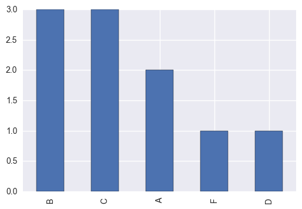
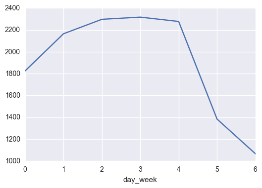

```python
import pandas as pd
import numpy as np
import matplotlib.pyplot as plt
import seaborn as sns
%pylab inline


subway_df = pd.read_csv('nyc_subway_weather.csv')
```

    Populating the interactive namespace from numpy and matplotlib
    


```python
subway_df.head()
```


<div>
<table border="1" class="dataframe">
  <thead>
    <tr style="text-align: right;">
      <th></th>
      <th>UNIT</th>
      <th>DATEn</th>
      <th>TIMEn</th>
      <th>ENTRIESn</th>
      <th>EXITSn</th>
      <th>ENTRIESn_hourly</th>
      <th>EXITSn_hourly</th>
      <th>datetime</th>
      <th>hour</th>
      <th>day_week</th>
      <th>...</th>
      <th>pressurei</th>
      <th>rain</th>
      <th>tempi</th>
      <th>wspdi</th>
      <th>meanprecipi</th>
      <th>meanpressurei</th>
      <th>meantempi</th>
      <th>meanwspdi</th>
      <th>weather_lat</th>
      <th>weather_lon</th>
    </tr>
  </thead>
  <tbody>
    <tr>
      <th>0</th>
      <td>R003</td>
      <td>05-01-11</td>
      <td>00:00:00</td>
      <td>4388333</td>
      <td>2911002</td>
      <td>0.0</td>
      <td>0.0</td>
      <td>2011-05-01 00:00:00</td>
      <td>0</td>
      <td>6</td>
      <td>...</td>
      <td>30.22</td>
      <td>0</td>
      <td>55.9</td>
      <td>3.5</td>
      <td>0.0</td>
      <td>30.258</td>
      <td>55.98</td>
      <td>7.86</td>
      <td>40.700348</td>
      <td>-73.887177</td>
    </tr>
    <tr>
      <th>1</th>
      <td>R003</td>
      <td>05-01-11</td>
      <td>04:00:00</td>
      <td>4388333</td>
      <td>2911002</td>
      <td>0.0</td>
      <td>0.0</td>
      <td>2011-05-01 04:00:00</td>
      <td>4</td>
      <td>6</td>
      <td>...</td>
      <td>30.25</td>
      <td>0</td>
      <td>52.0</td>
      <td>3.5</td>
      <td>0.0</td>
      <td>30.258</td>
      <td>55.98</td>
      <td>7.86</td>
      <td>40.700348</td>
      <td>-73.887177</td>
    </tr>
    <tr>
      <th>2</th>
      <td>R003</td>
      <td>05-01-11</td>
      <td>12:00:00</td>
      <td>4388333</td>
      <td>2911002</td>
      <td>0.0</td>
      <td>0.0</td>
      <td>2011-05-01 12:00:00</td>
      <td>12</td>
      <td>6</td>
      <td>...</td>
      <td>30.28</td>
      <td>0</td>
      <td>62.1</td>
      <td>6.9</td>
      <td>0.0</td>
      <td>30.258</td>
      <td>55.98</td>
      <td>7.86</td>
      <td>40.700348</td>
      <td>-73.887177</td>
    </tr>
    <tr>
      <th>3</th>
      <td>R003</td>
      <td>05-01-11</td>
      <td>16:00:00</td>
      <td>4388333</td>
      <td>2911002</td>
      <td>0.0</td>
      <td>0.0</td>
      <td>2011-05-01 16:00:00</td>
      <td>16</td>
      <td>6</td>
      <td>...</td>
      <td>30.26</td>
      <td>0</td>
      <td>57.9</td>
      <td>15.0</td>
      <td>0.0</td>
      <td>30.258</td>
      <td>55.98</td>
      <td>7.86</td>
      <td>40.700348</td>
      <td>-73.887177</td>
    </tr>
    <tr>
      <th>4</th>
      <td>R003</td>
      <td>05-01-11</td>
      <td>20:00:00</td>
      <td>4388333</td>
      <td>2911002</td>
      <td>0.0</td>
      <td>0.0</td>
      <td>2011-05-01 20:00:00</td>
      <td>20</td>
      <td>6</td>
      <td>...</td>
      <td>30.28</td>
      <td>0</td>
      <td>52.0</td>
      <td>10.4</td>
      <td>0.0</td>
      <td>30.258</td>
      <td>55.98</td>
      <td>7.86</td>
      <td>40.700348</td>
      <td>-73.887177</td>
    </tr>
  </tbody>
</table>
<p>5 rows × 27 columns</p>
</div>


```python
subway_df.describe()
```


<div>
<table border="1" class="dataframe">
  <thead>
    <tr style="text-align: right;">
      <th></th>
      <th>ENTRIESn</th>
      <th>EXITSn</th>
      <th>ENTRIESn_hourly</th>
      <th>EXITSn_hourly</th>
      <th>hour</th>
      <th>day_week</th>
      <th>weekday</th>
      <th>latitude</th>
      <th>longitude</th>
      <th>fog</th>
      <th>...</th>
      <th>pressurei</th>
      <th>rain</th>
      <th>tempi</th>
      <th>wspdi</th>
      <th>meanprecipi</th>
      <th>meanpressurei</th>
      <th>meantempi</th>
      <th>meanwspdi</th>
      <th>weather_lat</th>
      <th>weather_lon</th>
    </tr>
  </thead>
  <tbody>
    <tr>
      <th>count</th>
      <td>4.264900e+04</td>
      <td>4.264900e+04</td>
      <td>42649.000000</td>
      <td>42649.000000</td>
      <td>42649.000000</td>
      <td>42649.000000</td>
      <td>42649.000000</td>
      <td>42649.000000</td>
      <td>42649.000000</td>
      <td>42649.000000</td>
      <td>...</td>
      <td>42649.000000</td>
      <td>42649.000000</td>
      <td>42649.000000</td>
      <td>42649.000000</td>
      <td>42649.000000</td>
      <td>42649.000000</td>
      <td>42649.000000</td>
      <td>42649.000000</td>
      <td>42649.000000</td>
      <td>42649.000000</td>
    </tr>
    <tr>
      <th>mean</th>
      <td>2.812486e+07</td>
      <td>1.986993e+07</td>
      <td>1886.589955</td>
      <td>1361.487866</td>
      <td>10.046754</td>
      <td>2.905719</td>
      <td>0.714436</td>
      <td>40.724647</td>
      <td>-73.940364</td>
      <td>0.009824</td>
      <td>...</td>
      <td>29.971096</td>
      <td>0.224741</td>
      <td>63.103780</td>
      <td>6.927872</td>
      <td>0.004618</td>
      <td>29.971096</td>
      <td>63.103780</td>
      <td>6.927872</td>
      <td>40.728555</td>
      <td>-73.938693</td>
    </tr>
    <tr>
      <th>std</th>
      <td>3.043607e+07</td>
      <td>2.028986e+07</td>
      <td>2952.385585</td>
      <td>2183.845409</td>
      <td>6.938928</td>
      <td>2.079231</td>
      <td>0.451688</td>
      <td>0.071650</td>
      <td>0.059713</td>
      <td>0.098631</td>
      <td>...</td>
      <td>0.137942</td>
      <td>0.417417</td>
      <td>8.455597</td>
      <td>4.510178</td>
      <td>0.016344</td>
      <td>0.131158</td>
      <td>6.939011</td>
      <td>3.179832</td>
      <td>0.065420</td>
      <td>0.059582</td>
    </tr>
    <tr>
      <th>min</th>
      <td>0.000000e+00</td>
      <td>0.000000e+00</td>
      <td>0.000000</td>
      <td>0.000000</td>
      <td>0.000000</td>
      <td>0.000000</td>
      <td>0.000000</td>
      <td>40.576152</td>
      <td>-74.073622</td>
      <td>0.000000</td>
      <td>...</td>
      <td>29.550000</td>
      <td>0.000000</td>
      <td>46.900000</td>
      <td>0.000000</td>
      <td>0.000000</td>
      <td>29.590000</td>
      <td>49.400000</td>
      <td>0.000000</td>
      <td>40.600204</td>
      <td>-74.014870</td>
    </tr>
    <tr>
      <th>25%</th>
      <td>1.039762e+07</td>
      <td>7.613712e+06</td>
      <td>274.000000</td>
      <td>237.000000</td>
      <td>4.000000</td>
      <td>1.000000</td>
      <td>0.000000</td>
      <td>40.677107</td>
      <td>-73.987342</td>
      <td>0.000000</td>
      <td>...</td>
      <td>29.890000</td>
      <td>0.000000</td>
      <td>57.000000</td>
      <td>4.600000</td>
      <td>0.000000</td>
      <td>29.913333</td>
      <td>58.283333</td>
      <td>4.816667</td>
      <td>40.688591</td>
      <td>-73.985130</td>
    </tr>
    <tr>
      <th>50%</th>
      <td>1.818389e+07</td>
      <td>1.331609e+07</td>
      <td>905.000000</td>
      <td>664.000000</td>
      <td>12.000000</td>
      <td>3.000000</td>
      <td>1.000000</td>
      <td>40.717241</td>
      <td>-73.953459</td>
      <td>0.000000</td>
      <td>...</td>
      <td>29.960000</td>
      <td>0.000000</td>
      <td>61.000000</td>
      <td>6.900000</td>
      <td>0.000000</td>
      <td>29.958000</td>
      <td>60.950000</td>
      <td>6.166667</td>
      <td>40.720570</td>
      <td>-73.949150</td>
    </tr>
    <tr>
      <th>75%</th>
      <td>3.263049e+07</td>
      <td>2.393771e+07</td>
      <td>2255.000000</td>
      <td>1537.000000</td>
      <td>16.000000</td>
      <td>5.000000</td>
      <td>1.000000</td>
      <td>40.759123</td>
      <td>-73.907733</td>
      <td>0.000000</td>
      <td>...</td>
      <td>30.060000</td>
      <td>0.000000</td>
      <td>69.100000</td>
      <td>9.200000</td>
      <td>0.000000</td>
      <td>30.060000</td>
      <td>67.466667</td>
      <td>8.850000</td>
      <td>40.755226</td>
      <td>-73.912033</td>
    </tr>
    <tr>
      <th>max</th>
      <td>2.357746e+08</td>
      <td>1.493782e+08</td>
      <td>32814.000000</td>
      <td>34828.000000</td>
      <td>20.000000</td>
      <td>6.000000</td>
      <td>1.000000</td>
      <td>40.889185</td>
      <td>-73.755383</td>
      <td>1.000000</td>
      <td>...</td>
      <td>30.320000</td>
      <td>1.000000</td>
      <td>86.000000</td>
      <td>23.000000</td>
      <td>0.157500</td>
      <td>30.293333</td>
      <td>79.800000</td>
      <td>17.083333</td>
      <td>40.862064</td>
      <td>-73.694176</td>
    </tr>
  </tbody>
</table>
<p>8 rows × 21 columns</p>
</div>


DATEn和TIMEn这两个参数是指信息在旋转门处采集数据的日期与时间。
ENTRIESn和EXITSn是在这个时间，入口与出口累计的总人数。（如果上个小时入口处计数是10000，这一个小时没有人进入，这个小时的入口计数仍然是10000。出口同理）
ENTIRESn_hourly和EXITSn_hourly是指在这一个小时内，入口和出口计数增加的净人数。（如果这一小时没有人进入，ENTRIESn_hourly的计数应该是0）


```python
def correlation1(x, y):
    '''
    Fill in this function to compute the correlation between the two
    input variables. Each input is either a NumPy array or a Pandas
    Series.
    
    correlation = average of (x in standard units) times (y in standard units)
    
    Remember to pass the argument "ddof=0" to the Pandas std() function!
    '''
    cov = (x - x.mean()) * (y - y.mean()) / len(x)
    correlation = cov.sum() / ( x.std(ddof=0) * y.std(ddof=0))
    return correlation
```


```python
def correlation(x, y): #课堂上教的标准写法，其实和上面是一样的
    std_x = (x - x.mean())/ x.std(ddof=0)
    std_y = (y - y.mean())/ y.std(ddof=0)
    correlation = (std_x * std_y).mean()
    return correlation
```


```python
entries = subway_df['ENTRIESn_hourly']
cum_entries = subway_df['ENTRIESn']
rain = subway_df['meanprecipi']
temp = subway_df['meantempi']

print correlation(entries, rain)
print correlation(entries, temp)
print correlation(rain, temp)
print correlation(entries, cum_entries)
```

    0.0356485157722
    -0.0266933483216
    -0.229034323408
    0.585895470766
    


```python
import pandas as pd

# Examples of vectorized operations on DataFrames:
# Change False to True for each block of code to see what it does

# Adding DataFrames with the column names
if True:
    df1 = pd.DataFrame({'a': [1, 2, 3], 'b': [4, 5, 6], 'c': [7, 8, 9]})
    df2 = pd.DataFrame({'a': [10, 20, 30], 'b': [40, 50, 60], 'c': [70, 80, 90]})
    print df1 + df2
    
# Adding DataFrames with overlapping column names 
if True:
    df1 = pd.DataFrame({'a': [1, 2, 3], 'b': [4, 5, 6], 'c': [7, 8, 9]})
    df2 = pd.DataFrame({'d': [10, 20, 30], 'c': [40, 50, 60], 'b': [70, 80, 90]})
    print df1 + df2

# Adding DataFrames with overlapping row indexes
if False:
    df1 = pd.DataFrame({'a': [1, 2, 3], 'b': [4, 5, 6], 'c': [7, 8, 9]},
                       index=['row1', 'row2', 'row3'])
    df2 = pd.DataFrame({'a': [10, 20, 30], 'b': [40, 50, 60], 'c': [70, 80, 90]},
                       index=['row4', 'row3', 'row2'])
    print df1 + df2

# --- Quiz ---
# Cumulative entries and exits for one station for a few hours.
entries_and_exits = pd.DataFrame({
    'ENTRIESn': [3144312, 3144335, 3144353, 3144424, 3144594,
                 3144808, 3144895, 3144905, 3144941, 3145094],
    'EXITSn': [1088151, 1088159, 1088177, 1088231, 1088275,
               1088317, 1088328, 1088331, 1088420, 1088753]
})
```

        a   b   c
    0  11  44  77
    1  22  55  88
    2  33  66  99
        a   b   c   d
    0 NaN  74  47 NaN
    1 NaN  85  58 NaN
    2 NaN  96  69 NaN
    


```python
def get_hourly_entries_and_exits(entries_and_exits):
    '''
    Fill in this function to take a DataFrame with cumulative entries
    and exits (entries in the first column, exits in the second) and
    return a DataFrame with hourly entries and exits (entries in the
    first column, exits in the second).
    '''
    return entries_and_exits-entries_and_exits.shift(periods=1)

```


```python
get_hourly_entries_and_exits(entries_and_exits) #ENTRIESn和EXITSn是在这个时间，入口与出口累计的总人数,所以相减就是一个小时内整体客流总人数
```


<div>
<table border="1" class="dataframe">
  <thead>
    <tr style="text-align: right;">
      <th></th>
      <th>ENTRIESn</th>
      <th>EXITSn</th>
    </tr>
  </thead>
  <tbody>
    <tr>
      <th>0</th>
      <td>NaN</td>
      <td>NaN</td>
    </tr>
    <tr>
      <th>1</th>
      <td>23.0</td>
      <td>8.0</td>
    </tr>
    <tr>
      <th>2</th>
      <td>18.0</td>
      <td>18.0</td>
    </tr>
    <tr>
      <th>3</th>
      <td>71.0</td>
      <td>54.0</td>
    </tr>
    <tr>
      <th>4</th>
      <td>170.0</td>
      <td>44.0</td>
    </tr>
    <tr>
      <th>5</th>
      <td>214.0</td>
      <td>42.0</td>
    </tr>
    <tr>
      <th>6</th>
      <td>87.0</td>
      <td>11.0</td>
    </tr>
    <tr>
      <th>7</th>
      <td>10.0</td>
      <td>3.0</td>
    </tr>
    <tr>
      <th>8</th>
      <td>36.0</td>
      <td>89.0</td>
    </tr>
    <tr>
      <th>9</th>
      <td>153.0</td>
      <td>333.0</td>
    </tr>
  </tbody>
</table>
</div>


```python
# DataFrame applymap() #遍历每个cell
if True:
    df = pd.DataFrame({
        'a': [1, 2, 3],
        'b': [10, 20, 30],
        'c': [5, 10, 15]
    })
    
    def add_one(x):
        return x + 1
        
    print df.applymap(add_one)
```

       a   b   c
    0  2  11   6
    1  3  21  11
    2  4  31  16
    


```python
grades_df = pd.DataFrame(
    data={'exam1': [43, 81, 78, 75, 89, 70, 91, 65, 98, 87],
          'exam2': [24, 63, 56, 56, 67, 51, 79, 46, 72, 60]},
    index=['Andre', 'Barry', 'Chris', 'Dan', 'Emilio', 
           'Fred', 'Greta', 'Humbert', 'Ivan', 'James']
)
    
def convert_grades(grades):
    '''
    Fill in this function to convert the given DataFrame of numerical
    grades to letter grades. Return a new DataFrame with the converted
    grade.
    
    The conversion rule is:
        90-100 -> A
        80-89  -> B
        70-79  -> C
        60-69  -> D
        0-59   -> F
    '''
    return grades.applymap(convert_grade)
    
def convert_grade(grade):
    if grade>= 90 and grade <=100:
        return 'A'
    if grade>= 80 and grade < 100:
        return 'B'
    if grade>= 70 and grade < 80:
        return 'C'
    if grade>= 60 and grade < 70:
        return 'D'
    if grade < 60:
        return 'F'
```


```python
convert_grades(grades_df)
```


<div>
<table border="1" class="dataframe">
  <thead>
    <tr style="text-align: right;">
      <th></th>
      <th>exam1</th>
      <th>exam2</th>
    </tr>
  </thead>
  <tbody>
    <tr>
      <th>Andre</th>
      <td>F</td>
      <td>F</td>
    </tr>
    <tr>
      <th>Barry</th>
      <td>B</td>
      <td>D</td>
    </tr>
    <tr>
      <th>Chris</th>
      <td>C</td>
      <td>F</td>
    </tr>
    <tr>
      <th>Dan</th>
      <td>C</td>
      <td>F</td>
    </tr>
    <tr>
      <th>Emilio</th>
      <td>B</td>
      <td>D</td>
    </tr>
    <tr>
      <th>Fred</th>
      <td>C</td>
      <td>F</td>
    </tr>
    <tr>
      <th>Greta</th>
      <td>A</td>
      <td>C</td>
    </tr>
    <tr>
      <th>Humbert</th>
      <td>D</td>
      <td>F</td>
    </tr>
    <tr>
      <th>Ivan</th>
      <td>A</td>
      <td>C</td>
    </tr>
    <tr>
      <th>James</th>
      <td>B</td>
      <td>D</td>
    </tr>
  </tbody>
</table>
</div>


```python
convert_grades(grades_df)['exam1'].value_counts().plot.bar()
```


    <matplotlib.axes._subplots.AxesSubplot at 0xed009e8>





```python
# DataFrame apply()
if True:
    def convert_grades_curve(exam_grades):
        # Pandas has a bult-in function that will perform this calculation
        # This will give the bottom 0% to 10% of students the grade 'F',
        # 10% to 20% the grade 'D', and so on. You can read more about
        # the qcut() function here:
        # http://pandas.pydata.org/pandas-docs/stable/generated/pandas.qcut.html
        #按照比例分配标签
        return pd.qcut(exam_grades,
                       [0, 0.1, 0.2, 0.5, 0.8, 1],
                       labels=['F', 'D', 'C', 'B', 'A'])
```


```python
print convert_grades_curve(grades_df['exam1'])
```

    Andre      F
    Barry      B
    Chris      C
    Dan        C
    Emilio     B
    Fred       C
    Greta      A
    Humbert    D
    Ivan       A
    James      B
    Name: exam1, dtype: category
    Categories (5, object): [F < D < C < B < A]
    


```python
print grades_df.apply(convert_grades_curve) #apply是一个column一个map,不是每一个都遍历，所以基本上实现功能的话一次要写两个函数
```

            exam1 exam2
    Andre       F     F
    Barry       B     B
    Chris       C     C
    Dan         C     C
    Emilio      B     B
    Fred        C     C
    Greta       A     A
    Humbert     D     D
    Ivan        A     A
    James       B     B
    


```python
def standardize_each_column(column):
    return (column - column.mean()) / column.std(ddof = 0) #don't forget to set ddof = 0 !!!!! 意味着是population而不是sample

def standardize(df): 
    return df.apply(standardize_each_column)
```


```python
standardize(grades_df) #所有的column都标准化
```


<div>
<table border="1" class="dataframe">
  <thead>
    <tr style="text-align: right;">
      <th></th>
      <th>exam1</th>
      <th>exam2</th>
    </tr>
  </thead>
  <tbody>
    <tr>
      <th>Andre</th>
      <td>-2.315341</td>
      <td>-2.304599</td>
    </tr>
    <tr>
      <th>Barry</th>
      <td>0.220191</td>
      <td>0.386400</td>
    </tr>
    <tr>
      <th>Chris</th>
      <td>0.020017</td>
      <td>-0.096600</td>
    </tr>
    <tr>
      <th>Dan</th>
      <td>-0.180156</td>
      <td>-0.096600</td>
    </tr>
    <tr>
      <th>Emilio</th>
      <td>0.753987</td>
      <td>0.662400</td>
    </tr>
    <tr>
      <th>Fred</th>
      <td>-0.513779</td>
      <td>-0.441600</td>
    </tr>
    <tr>
      <th>Greta</th>
      <td>0.887436</td>
      <td>1.490400</td>
    </tr>
    <tr>
      <th>Humbert</th>
      <td>-0.847401</td>
      <td>-0.786600</td>
    </tr>
    <tr>
      <th>Ivan</th>
      <td>1.354508</td>
      <td>1.007400</td>
    </tr>
    <tr>
      <th>James</th>
      <td>0.620538</td>
      <td>0.179400</td>
    </tr>
  </tbody>
</table>
</div>


```python
df = pd.DataFrame({
    'a': [4, 5, 3, 1, 2],
    'b': [20, 10, 40, 50, 30],
    'c': [25, 20, 5, 15, 10]
})
# DataFrame apply() - use case 2
if True:   
    print df.apply(np.mean)
    print df.apply(np.max)
print df
```

    a     5
    b    50
    c    25
    dtype: int64
    a     3.0
    b    30.0
    c    15.0
    dtype: float64
    a     5
    b    50
    c    25
    dtype: int64
       a   b   c
    0  4  20  25
    1  5  10  20
    2  3  40   5
    3  1  50  15
    4  2  30  10
    


```python
b = df['a'].sort_values(ascending=False) #排序，但是注意index也发生了变化
print b
```

    1    5
    0    4
    2    3
    4    2
    3    1
    Name: a, dtype: int64
    


```python
def second_largest(df):
    '''
    Fill in this function to return the second-largest value of each 
    column of the input DataFrame.
    '''
    return df.apply(column_second_largest)

def column_second_largest(column):
    new = column.sort_values(ascending=False)
    return new.iloc[1]
```


```python
print second_largest(df)
```

    a     4
    b    40
    c    20
    dtype: int64
    


```python
# Adding a Series to a square DataFrame
if True:
    s = pd.Series([1, 2, 3, 4]) #按照每个column相应加
    df = pd.DataFrame({
        0: [10, 20, 30, 40],
        1: [50, 60, 70, 80],
        2: [90, 100, 110, 120],
        3: [130, 140, 150, 160]
    })
    
    print df
    print '' # Create a blank line between outputs
    print df + s
```

        0   1    2    3
    0  10  50   90  130
    1  20  60  100  140
    2  30  70  110  150
    3  40  80  120  160
    
        0   1    2    3
    0  11  52   93  134
    1  21  62  103  144
    2  31  72  113  154
    3  41  82  123  164
    


```python
# Adding a Series to a one-row DataFrame 
if True:
    s = pd.Series([1, 2, 3, 4])
    df = pd.DataFrame({0: [10], 1: [20], 2: [30], 3: [40]})
    
    print df
    print s
    print '' # Create a blank line between outputs
    print df + s
```

        0   1   2   3
    0  10  20  30  40
    0    1
    1    2
    2    3
    3    4
    dtype: int64
    
        0   1   2   3
    0  11  22  33  44
    


```python
# Adding a Series to a one-column DataFrame
if True:
    s = pd.Series([1, 2, 3, 4])
    df = pd.DataFrame({0: [10, 20, 30, 40]})
    
    print df
    print '' # Create a blank line between outputs
    print df + s
```

        0
    0  10
    1  20
    2  30
    3  40
    
        0   1   2   3
    0  11 NaN NaN NaN
    1  21 NaN NaN NaN
    2  31 NaN NaN NaN
    3  41 NaN NaN NaN
    


```python
# Adding when DataFrame column names match Series index
if True:
    s = pd.Series([1, 2, 3, 4], index=['a', 'b', 'c', 'd'])
    df = pd.DataFrame({
        'a': [10, 20, 30, 40],
        'b': [50, 60, 70, 80],
        'c': [90, 100, 110, 120],
        'd': [130, 140, 150, 160]
    })
    
    print df
    print s
    print '' # Create a blank line between outputs
    print df + s
```

        a   b    c    d
    0  10  50   90  130
    1  20  60  100  140
    2  30  70  110  150
    3  40  80  120  160
    a    1
    b    2
    c    3
    d    4
    dtype: int64
    
        a   b    c    d
    0  11  52   93  134
    1  21  62  103  144
    2  31  72  113  154
    3  41  82  123  164
    


```python
# Adding when DataFrame column names don't match Series index
if True:
    s = pd.Series([1, 2, 3, 4])
    df = pd.DataFrame({
        0: [10, 20, 30, 40],
        1: [50, 60, 70, 80],
        2: [90, 100, 110, 120],
        3: [130, 140, 150, 160]
    })
    
    print df
    print ''
    print df+s
    print '' # Create a blank line between outputs
    print df.add(s, axis='columns')


    # The functions sub(), mul(), and div() work similarly to add()
```

        0   1    2    3
    0  10  50   90  130
    1  20  60  100  140
    2  30  70  110  150
    3  40  80  120  160
    
        0   1    2    3
    0  11  52   93  134
    1  21  62  103  144
    2  31  72  113  154
    3  41  82  123  164
    
        0   1    2    3
    0  11  52   93  134
    1  21  62  103  144
    2  31  72  113  154
    3  41  82  123  164
    


```python
grades_df = pd.DataFrame(
    data={'exam1': [43, 81, 78, 75, 89, 70, 91, 65, 98, 87],
          'exam2': [24, 63, 56, 56, 67, 51, 79, 46, 72, 60]},
    index=['Andre', 'Barry', 'Chris', 'Dan', 'Emilio', 
           'Fred', 'Greta', 'Humbert', 'Ivan', 'James']
)

grades_df.mean(axis=1)
```


    Andre      33.5
    Barry      72.0
    Chris      67.0
    Dan        65.5
    Emilio     78.0
    Fred       60.5
    Greta      85.0
    Humbert    55.5
    Ivan       85.0
    James      73.5
    dtype: float64


```python
grades_df.mean(axis=0)
```


    exam1    77.7
    exam2    57.4
    dtype: float64


```python
mean_diffs = grades_df.sub(grades_df.mean(axis=0), axis="columns") #根据columns做减法
mean_diffs.div(grades_df.std(axis=0),axis="columns")
```


<div>
<table border="1" class="dataframe">
  <thead>
    <tr style="text-align: right;">
      <th></th>
      <th>exam1</th>
      <th>exam2</th>
    </tr>
  </thead>
  <tbody>
    <tr>
      <th>Andre</th>
      <td>-2.196525</td>
      <td>-2.186335</td>
    </tr>
    <tr>
      <th>Barry</th>
      <td>0.208891</td>
      <td>0.366571</td>
    </tr>
    <tr>
      <th>Chris</th>
      <td>0.018990</td>
      <td>-0.091643</td>
    </tr>
    <tr>
      <th>Dan</th>
      <td>-0.170911</td>
      <td>-0.091643</td>
    </tr>
    <tr>
      <th>Emilio</th>
      <td>0.715295</td>
      <td>0.628408</td>
    </tr>
    <tr>
      <th>Fred</th>
      <td>-0.487413</td>
      <td>-0.418938</td>
    </tr>
    <tr>
      <th>Greta</th>
      <td>0.841896</td>
      <td>1.413917</td>
    </tr>
    <tr>
      <th>Humbert</th>
      <td>-0.803916</td>
      <td>-0.746234</td>
    </tr>
    <tr>
      <th>Ivan</th>
      <td>1.284999</td>
      <td>0.955703</td>
    </tr>
    <tr>
      <th>James</th>
      <td>0.588694</td>
      <td>0.170194</td>
    </tr>
  </tbody>
</table>
</div>


```python
mean_diffs = grades_df.sub(grades_df.mean(axis=1), axis="index") #根据index做减法
mean_diffs.div(grades_df.std(axis=1),axis="index")
```


<div>
<table border="1" class="dataframe">
  <thead>
    <tr style="text-align: right;">
      <th></th>
      <th>exam1</th>
      <th>exam2</th>
    </tr>
  </thead>
  <tbody>
    <tr>
      <th>Andre</th>
      <td>0.707107</td>
      <td>-0.707107</td>
    </tr>
    <tr>
      <th>Barry</th>
      <td>0.707107</td>
      <td>-0.707107</td>
    </tr>
    <tr>
      <th>Chris</th>
      <td>0.707107</td>
      <td>-0.707107</td>
    </tr>
    <tr>
      <th>Dan</th>
      <td>0.707107</td>
      <td>-0.707107</td>
    </tr>
    <tr>
      <th>Emilio</th>
      <td>0.707107</td>
      <td>-0.707107</td>
    </tr>
    <tr>
      <th>Fred</th>
      <td>0.707107</td>
      <td>-0.707107</td>
    </tr>
    <tr>
      <th>Greta</th>
      <td>0.707107</td>
      <td>-0.707107</td>
    </tr>
    <tr>
      <th>Humbert</th>
      <td>0.707107</td>
      <td>-0.707107</td>
    </tr>
    <tr>
      <th>Ivan</th>
      <td>0.707107</td>
      <td>-0.707107</td>
    </tr>
    <tr>
      <th>James</th>
      <td>0.707107</td>
      <td>-0.707107</td>
    </tr>
  </tbody>
</table>
</div>


```python
def standardize(df):
    '''
    Fill in this function to standardize each column of the given
    DataFrame. To standardize a variable, convert each value to the
    number of standard deviations it is above or below the mean.
    
    This time, try to use vectorized operations instead of apply().
    You should get the same results as you did before.
    '''
    return (df - df.mean())/df.std(ddof=0)

```


```python
def standardize_rows(df):
    '''
    Optional: Fill in this function to standardize each row of the given
    DataFrame. Again, try not to use apply().
    
    This one is more challenging than standardizing each column!
    '''
    return None
```


```python
values = np.array([1, 3, 2, 4, 1, 6, 4])
example_df = pd.DataFrame({
    'value': values,
    'even': values % 2 == 0,
    'above_three': values > 3 
}, index=['a', 'b', 'c', 'd', 'e', 'f', 'g'])
```


```python
# Examine DataFrame
if True:
    print example_df
```

      above_three   even  value
    a       False  False      1
    b       False  False      3
    c       False   True      2
    d        True   True      4
    e       False  False      1
    f        True   True      6
    g        True   True      4
    


```python
# Examine groups
if True:
    grouped_data = example_df.groupby('even')
    # The groups attribute is a dictionary mapping keys to lists of row indexes
    print grouped_data.groups
```

    {False: Index([u'a', u'b', u'e'], dtype='object'), True: Index([u'c', u'd', u'f', u'g'], dtype='object')}
    


```python
# Group by multiple columns
if True:
    grouped_data = example_df.groupby(['even', 'above_three'])
    print grouped_data.groups
```

    {(True, False): Index([u'c'], dtype='object'), (False, False): Index([u'a', u'b', u'e'], dtype='object'), (True, True): Index([u'd', u'f', u'g'], dtype='object')}
    


```python
# Get sum of each group
if True:
    grouped_data = example_df.groupby('even')
    print grouped_data.sum()
```

           above_three  value
    even                     
    False          0.0      5
    True           3.0     16
    


```python
# Limit columns in result
if True:
    grouped_data = example_df.groupby('even')
    
    # You can take one or more columns from the result DataFrame
    print grouped_data.sum()['value']
    
    print '\n' # Blank line to separate results
    
    # You can also take a subset of columns from the grouped data before 
    # collapsing to a DataFrame. In this case, the result is the same.
    
    print grouped_data['value'].sum()
```

    even
    False     5
    True     16
    Name: value, dtype: int32
    
    
    even
    False     5
    True     16
    Name: value, dtype: int32
    


```python
filename = 'nyc_subway_weather.csv'
subway_df = pd.read_csv(filename)
```


```python
subway_df.head()
```


<div>
<table border="1" class="dataframe">
  <thead>
    <tr style="text-align: right;">
      <th></th>
      <th>UNIT</th>
      <th>DATEn</th>
      <th>TIMEn</th>
      <th>ENTRIESn</th>
      <th>EXITSn</th>
      <th>ENTRIESn_hourly</th>
      <th>EXITSn_hourly</th>
      <th>datetime</th>
      <th>hour</th>
      <th>day_week</th>
      <th>...</th>
      <th>pressurei</th>
      <th>rain</th>
      <th>tempi</th>
      <th>wspdi</th>
      <th>meanprecipi</th>
      <th>meanpressurei</th>
      <th>meantempi</th>
      <th>meanwspdi</th>
      <th>weather_lat</th>
      <th>weather_lon</th>
    </tr>
  </thead>
  <tbody>
    <tr>
      <th>0</th>
      <td>R003</td>
      <td>05-01-11</td>
      <td>00:00:00</td>
      <td>4388333</td>
      <td>2911002</td>
      <td>0.0</td>
      <td>0.0</td>
      <td>2011-05-01 00:00:00</td>
      <td>0</td>
      <td>6</td>
      <td>...</td>
      <td>30.22</td>
      <td>0</td>
      <td>55.9</td>
      <td>3.5</td>
      <td>0.0</td>
      <td>30.258</td>
      <td>55.98</td>
      <td>7.86</td>
      <td>40.700348</td>
      <td>-73.887177</td>
    </tr>
    <tr>
      <th>1</th>
      <td>R003</td>
      <td>05-01-11</td>
      <td>04:00:00</td>
      <td>4388333</td>
      <td>2911002</td>
      <td>0.0</td>
      <td>0.0</td>
      <td>2011-05-01 04:00:00</td>
      <td>4</td>
      <td>6</td>
      <td>...</td>
      <td>30.25</td>
      <td>0</td>
      <td>52.0</td>
      <td>3.5</td>
      <td>0.0</td>
      <td>30.258</td>
      <td>55.98</td>
      <td>7.86</td>
      <td>40.700348</td>
      <td>-73.887177</td>
    </tr>
    <tr>
      <th>2</th>
      <td>R003</td>
      <td>05-01-11</td>
      <td>12:00:00</td>
      <td>4388333</td>
      <td>2911002</td>
      <td>0.0</td>
      <td>0.0</td>
      <td>2011-05-01 12:00:00</td>
      <td>12</td>
      <td>6</td>
      <td>...</td>
      <td>30.28</td>
      <td>0</td>
      <td>62.1</td>
      <td>6.9</td>
      <td>0.0</td>
      <td>30.258</td>
      <td>55.98</td>
      <td>7.86</td>
      <td>40.700348</td>
      <td>-73.887177</td>
    </tr>
    <tr>
      <th>3</th>
      <td>R003</td>
      <td>05-01-11</td>
      <td>16:00:00</td>
      <td>4388333</td>
      <td>2911002</td>
      <td>0.0</td>
      <td>0.0</td>
      <td>2011-05-01 16:00:00</td>
      <td>16</td>
      <td>6</td>
      <td>...</td>
      <td>30.26</td>
      <td>0</td>
      <td>57.9</td>
      <td>15.0</td>
      <td>0.0</td>
      <td>30.258</td>
      <td>55.98</td>
      <td>7.86</td>
      <td>40.700348</td>
      <td>-73.887177</td>
    </tr>
    <tr>
      <th>4</th>
      <td>R003</td>
      <td>05-01-11</td>
      <td>20:00:00</td>
      <td>4388333</td>
      <td>2911002</td>
      <td>0.0</td>
      <td>0.0</td>
      <td>2011-05-01 20:00:00</td>
      <td>20</td>
      <td>6</td>
      <td>...</td>
      <td>30.28</td>
      <td>0</td>
      <td>52.0</td>
      <td>10.4</td>
      <td>0.0</td>
      <td>30.258</td>
      <td>55.98</td>
      <td>7.86</td>
      <td>40.700348</td>
      <td>-73.887177</td>
    </tr>
  </tbody>
</table>
<p>5 rows × 27 columns</p>
</div>


```python
%pylab inline
grouped_data = subway_df.groupby('day_week')
print grouped_data.mean()['ENTRIESn_hourly'].plot()
```

    Populating the interactive namespace from numpy and matplotlib
    Axes(0.125,0.125;0.775x0.775)
    





```python
grouped_data = subway_df.groupby('rain')
print plt.hist(grouped_data.mean()['EXITSn_hourly'])
```

    rain
    0    1333.111451
    1    1459.373918
    Name: EXITSn_hourly, dtype: float64
    


```python
grouped_data = subway_df.groupby(['UNIT'])
```


```python
grouped_data['ENTRIESn', 'EXITSn'].apply(hourly_for_group)
```


<div>
<table border="1" class="dataframe">
  <thead>
    <tr style="text-align: right;">
      <th></th>
      <th>ENTRIESn</th>
      <th>EXITSn</th>
    </tr>
  </thead>
  <tbody>
    <tr>
      <th>0</th>
      <td>NaN</td>
      <td>NaN</td>
    </tr>
    <tr>
      <th>1</th>
      <td>0.0</td>
      <td>0.0</td>
    </tr>
    <tr>
      <th>2</th>
      <td>0.0</td>
      <td>0.0</td>
    </tr>
    <tr>
      <th>3</th>
      <td>0.0</td>
      <td>0.0</td>
    </tr>
    <tr>
      <th>4</th>
      <td>0.0</td>
      <td>0.0</td>
    </tr>
    <tr>
      <th>5</th>
      <td>15.0</td>
      <td>34.0</td>
    </tr>
    <tr>
      <th>6</th>
      <td>1430341.0</td>
      <td>963731.0</td>
    </tr>
    <tr>
      <th>7</th>
      <td>-1429834.0</td>
      <td>-963573.0</td>
    </tr>
    <tr>
      <th>8</th>
      <td>490.0</td>
      <td>132.0</td>
    </tr>
    <tr>
      <th>9</th>
      <td>231.0</td>
      <td>232.0</td>
    </tr>
    <tr>
      <th>10</th>
      <td>235.0</td>
      <td>405.0</td>
    </tr>
    <tr>
      <th>11</th>
      <td>74.0</td>
      <td>164.0</td>
    </tr>
    <tr>
      <th>12</th>
      <td>20.0</td>
      <td>33.0</td>
    </tr>
    <tr>
      <th>13</th>
      <td>975.0</td>
      <td>234.0</td>
    </tr>
    <tr>
      <th>14</th>
      <td>267.0</td>
      <td>257.0</td>
    </tr>
    <tr>
      <th>15</th>
      <td>277.0</td>
      <td>398.0</td>
    </tr>
    <tr>
      <th>16</th>
      <td>83.0</td>
      <td>174.0</td>
    </tr>
    <tr>
      <th>17</th>
      <td>24.0</td>
      <td>35.0</td>
    </tr>
    <tr>
      <th>18</th>
      <td>532.0</td>
      <td>130.0</td>
    </tr>
    <tr>
      <th>19</th>
      <td>454.0</td>
      <td>107.0</td>
    </tr>
    <tr>
      <th>20</th>
      <td>247.0</td>
      <td>249.0</td>
    </tr>
    <tr>
      <th>21</th>
      <td>220.0</td>
      <td>356.0</td>
    </tr>
    <tr>
      <th>22</th>
      <td>59.0</td>
      <td>184.0</td>
    </tr>
    <tr>
      <th>23</th>
      <td>19.0</td>
      <td>35.0</td>
    </tr>
    <tr>
      <th>24</th>
      <td>995.0</td>
      <td>190.0</td>
    </tr>
    <tr>
      <th>25</th>
      <td>307.0</td>
      <td>245.0</td>
    </tr>
    <tr>
      <th>26</th>
      <td>228.0</td>
      <td>391.0</td>
    </tr>
    <tr>
      <th>27</th>
      <td>73.0</td>
      <td>176.0</td>
    </tr>
    <tr>
      <th>28</th>
      <td>22.0</td>
      <td>48.0</td>
    </tr>
    <tr>
      <th>29</th>
      <td>970.0</td>
      <td>221.0</td>
    </tr>
    <tr>
      <th>...</th>
      <td>...</td>
      <td>...</td>
    </tr>
    <tr>
      <th>42619</th>
      <td>0.0</td>
      <td>0.0</td>
    </tr>
    <tr>
      <th>42620</th>
      <td>0.0</td>
      <td>0.0</td>
    </tr>
    <tr>
      <th>42621</th>
      <td>0.0</td>
      <td>0.0</td>
    </tr>
    <tr>
      <th>42622</th>
      <td>0.0</td>
      <td>0.0</td>
    </tr>
    <tr>
      <th>42623</th>
      <td>0.0</td>
      <td>0.0</td>
    </tr>
    <tr>
      <th>42624</th>
      <td>0.0</td>
      <td>0.0</td>
    </tr>
    <tr>
      <th>42625</th>
      <td>0.0</td>
      <td>0.0</td>
    </tr>
    <tr>
      <th>42626</th>
      <td>0.0</td>
      <td>0.0</td>
    </tr>
    <tr>
      <th>42627</th>
      <td>0.0</td>
      <td>0.0</td>
    </tr>
    <tr>
      <th>42628</th>
      <td>0.0</td>
      <td>0.0</td>
    </tr>
    <tr>
      <th>42629</th>
      <td>0.0</td>
      <td>0.0</td>
    </tr>
    <tr>
      <th>42630</th>
      <td>0.0</td>
      <td>0.0</td>
    </tr>
    <tr>
      <th>42631</th>
      <td>0.0</td>
      <td>0.0</td>
    </tr>
    <tr>
      <th>42632</th>
      <td>0.0</td>
      <td>0.0</td>
    </tr>
    <tr>
      <th>42633</th>
      <td>-290767.0</td>
      <td>-59788.0</td>
    </tr>
    <tr>
      <th>42634</th>
      <td>290767.0</td>
      <td>59788.0</td>
    </tr>
    <tr>
      <th>42635</th>
      <td>0.0</td>
      <td>0.0</td>
    </tr>
    <tr>
      <th>42636</th>
      <td>0.0</td>
      <td>0.0</td>
    </tr>
    <tr>
      <th>42637</th>
      <td>0.0</td>
      <td>0.0</td>
    </tr>
    <tr>
      <th>42638</th>
      <td>0.0</td>
      <td>0.0</td>
    </tr>
    <tr>
      <th>42639</th>
      <td>-290767.0</td>
      <td>-59788.0</td>
    </tr>
    <tr>
      <th>42640</th>
      <td>290767.0</td>
      <td>59788.0</td>
    </tr>
    <tr>
      <th>42641</th>
      <td>0.0</td>
      <td>0.0</td>
    </tr>
    <tr>
      <th>42642</th>
      <td>0.0</td>
      <td>0.0</td>
    </tr>
    <tr>
      <th>42643</th>
      <td>0.0</td>
      <td>0.0</td>
    </tr>
    <tr>
      <th>42644</th>
      <td>147417.0</td>
      <td>37524.0</td>
    </tr>
    <tr>
      <th>42645</th>
      <td>-276544.0</td>
      <td>-73016.0</td>
    </tr>
    <tr>
      <th>42646</th>
      <td>129127.0</td>
      <td>35492.0</td>
    </tr>
    <tr>
      <th>42647</th>
      <td>0.0</td>
      <td>0.0</td>
    </tr>
    <tr>
      <th>42648</th>
      <td>0.0</td>
      <td>0.0</td>
    </tr>
  </tbody>
</table>
<p>42649 rows × 2 columns</p>
</div>


```python
def hourly_for_group(entries_and_exits):
    return entries_and_exits-entries_and_exits.shift(periods=1)
```


```python
subway_df = pd.DataFrame({
    'UNIT': ['R003', 'R003', 'R003', 'R003', 'R003', 'R004', 'R004', 'R004',
             'R004', 'R004'],
    'DATEn': ['05-01-11', '05-02-11', '05-03-11', '05-04-11', '05-05-11',
              '05-01-11', '05-02-11', '05-03-11', '05-04-11', '05-05-11'],
    'hour': [0, 0, 0, 0, 0, 0, 0, 0, 0, 0],
    'ENTRIESn': [ 4388333,  4388348,  4389885,  4391507,  4393043, 14656120,
                 14656174, 14660126, 14664247, 14668301],
    'EXITSn': [ 2911002,  2911036,  2912127,  2913223,  2914284, 14451774,
               14451851, 14454734, 14457780, 14460818],
    'latitude': [ 40.689945,  40.689945,  40.689945,  40.689945,  40.689945,
                  40.69132 ,  40.69132 ,  40.69132 ,  40.69132 ,  40.69132 ],
    'longitude': [-73.872564, -73.872564, -73.872564, -73.872564, -73.872564,
                  -73.867135, -73.867135, -73.867135, -73.867135, -73.867135]
})

weather_df = pd.DataFrame({
    'DATEn': ['05-01-11', '05-01-11', '05-02-11', '05-02-11', '05-03-11',
              '05-03-11', '05-04-11', '05-04-11', '05-05-11', '05-05-11'],
    'hour': [0, 0, 0, 0, 0, 0, 0, 0, 0, 0],
    'latitude': [ 40.689945,  40.69132 ,  40.689945,  40.69132 ,  40.689945,
                  40.69132 ,  40.689945,  40.69132 ,  40.689945,  40.69132 ],
    'longitude': [-73.872564, -73.867135, -73.872564, -73.867135, -73.872564,
                  -73.867135, -73.872564, -73.867135, -73.872564, -73.867135],
    'pressurei': [ 30.24,  30.24,  30.32,  30.32,  30.14,  30.14,  29.98,  29.98,
                   30.01,  30.01],
    'fog': [0, 0, 0, 0, 0, 0, 0, 0, 0, 0],
    'rain': [0, 0, 0, 0, 0, 0, 0, 0, 0, 0],
    'tempi': [ 52. ,  52. ,  48.9,  48.9,  54. ,  54. ,  57.2,  57.2,  48.9,  48.9],
    'wspdi': [  8.1,   8.1,   6.9,   6.9,   3.5,   3.5,  15. ,  15. ,  15. ,  15. ]
})


```


```python
def combine_dfs(subway_df, weather_df):
    '''
    Fill in this function to take 2 DataFrames, one with subway data and one with weather data,
    and return a single dataframe with one row for each date, hour, and location. Only include
    times and locations that have both subway data and weather data available.
    '''
    return pd.merge(subway_df,weather_df, on =['DATEn','hour','latitude','longitude'], how = 'inner')
    
combine_dfs(subway_df, weather_df)[['DATEn', 'UNIT']]
```


<div>
<table border="1" class="dataframe">
  <thead>
    <tr style="text-align: right;">
      <th></th>
      <th>DATEn</th>
      <th>UNIT</th>
    </tr>
  </thead>
  <tbody>
    <tr>
      <th>0</th>
      <td>05-01-11</td>
      <td>R003</td>
    </tr>
    <tr>
      <th>1</th>
      <td>05-02-11</td>
      <td>R003</td>
    </tr>
    <tr>
      <th>2</th>
      <td>05-03-11</td>
      <td>R003</td>
    </tr>
    <tr>
      <th>3</th>
      <td>05-04-11</td>
      <td>R003</td>
    </tr>
    <tr>
      <th>4</th>
      <td>05-05-11</td>
      <td>R003</td>
    </tr>
    <tr>
      <th>5</th>
      <td>05-01-11</td>
      <td>R004</td>
    </tr>
    <tr>
      <th>6</th>
      <td>05-02-11</td>
      <td>R004</td>
    </tr>
    <tr>
      <th>7</th>
      <td>05-03-11</td>
      <td>R004</td>
    </tr>
    <tr>
      <th>8</th>
      <td>05-04-11</td>
      <td>R004</td>
    </tr>
    <tr>
      <th>9</th>
      <td>05-05-11</td>
      <td>R004</td>
    </tr>
  </tbody>
</table>
</div>


