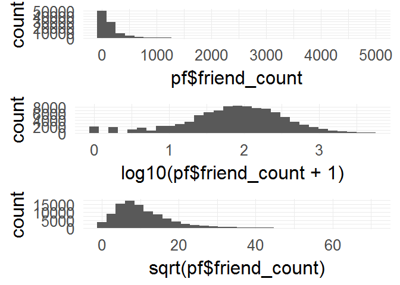

Lesson 3
========

------------------------------------------------------------------------

### What to Do First?

Notes:

------------------------------------------------------------------------

### Pseudo-Facebook User Data

Notes:

    getwd()

    ## [1] "F:/Udacity/Data-Analyst-Nanodegree/P4 R/notescripts/lesson3"

    list.files()

    ## [1] "HIV.csv"              "lesson3_student.html" "lesson3_student.rmd" 
    ## [4] "priceHistogram.png"   "pseudo_facebook.tsv"  "quiz.R"              
    ## [7] "quiz.rmd"

    pf <- read.csv('pseudo_facebook.tsv', sep= '\t')
    names(pf)

    ##  [1] "userid"                "age"                  
    ##  [3] "dob_day"               "dob_year"             
    ##  [5] "dob_month"             "gender"               
    ##  [7] "tenure"                "friend_count"         
    ##  [9] "friendships_initiated" "likes"                
    ## [11] "likes_received"        "mobile_likes"         
    ## [13] "mobile_likes_received" "www_likes"            
    ## [15] "www_likes_received"

------------------------------------------------------------------------

### Histogram of Users' Birthdays

Notes:

    #install.packages('ggplot2')
    library(ggplot2)
    library(ggthemes)

    theme_set(theme_minimal(24)) 

    ggplot(aes(x = dob_day), data = pf) + 
     geom_histogram(binwidth = 1) + 
      scale_x_continuous(breaks = 1:31)

    #both are equal
    qplot(x = dob_day, data = pf) + 
     scale_x_continuous(breaks=1:31)

    ## `stat_bin()` using `bins = 30`. Pick better value with `binwidth`.

------------------------------------------------------------------------

#### What are some things that you notice about this histogram?

Response:

------------------------------------------------------------------------

### Moira's Investigation

Notes:

------------------------------------------------------------------------

### Estimating Your Audience Size

Notes:

------------------------------------------------------------------------

#### Think about a time when you posted a specific message or shared a photo on Facebook. What was it?

Response:

#### How many of your friends do you think saw that post?

Response:

#### Think about what percent of your friends on Facebook see any posts or comments that you make in a month. What percent do you think that is?

Response:25%

------------------------------------------------------------------------

### Perceived Audience Size

Notes:

------------------------------------------------------------------------

### Faceting

Notes:

    #facet_wrap
    qplot(x = dob_day, data = pf) + 
     scale_x_continuous(breaks=1:31)+
      facet_wrap(~dob_month, ncol= 3)

    ## `stat_bin()` using `bins = 30`. Pick better value with `binwidth`.

#### Let's take another look at our plot. What stands out to you here?

Response:

------------------------------------------------------------------------

### Be Skeptical - Outliers and Anomalies

Notes:

------------------------------------------------------------------------

### Moira's Outlier

Notes: \#\#\#\# Which case do you think applies to Moira's outlier?
Response: Bad data as an outliner

------------------------------------------------------------------------

### Friend Count

Notes:

#### What code would you enter to create a histogram of friend counts?

    qplot(data = pf, x = friend_count)

    ## `stat_bin()` using `bins = 30`. Pick better value with `binwidth`.

#### How is this plot similar to Moira's first plot?

Response:

------------------------------------------------------------------------

### Limiting the Axes

Notes:

    qplot(data = pf, x = friend_count, xlim = c(0,1000))

    ## `stat_bin()` using `bins = 30`. Pick better value with `binwidth`.

    ## Warning: Removed 2951 rows containing non-finite values (stat_bin).

    qplot(data = pf, x = friend_count)+
            scale_x_continuous(limits = c(0,1000))

    ## `stat_bin()` using `bins = 30`. Pick better value with `binwidth`.

    ## Warning: Removed 2951 rows containing non-finite values (stat_bin).

### Exploring with Bin Width

Notes:

------------------------------------------------------------------------

### Adjusting the Bin Width

Notes:

### Faceting Friend Count

    #What code would you add to create a facet the histogram by gender?
    #Add it to the code below.
    qplot(x = friend_count, data = pf, binwidth = 25) +
     scale_x_continuous(limits = c(0, 1000),
                         breaks = seq(0, 1000, 50))

    ## Warning: Removed 2951 rows containing non-finite values (stat_bin).

------------------------------------------------------------------------

### Omitting NA Values

Notes:

    qplot(x = friend_count, data = subset(pf,!is.na(gender)), binwidth = 25) +
     scale_x_continuous(limits = c(0, 1000),
                         breaks = seq(0, 1000, 50))+
      facet_wrap(~gender)

    ## Warning: Removed 2949 rows containing non-finite values (stat_bin).

    qplot(x = friend_count, data = na.omit(pf), binwidth = 25) +
     scale_x_continuous(limits = c(0, 1000),
                         breaks = seq(0, 1000, 50))+
      facet_wrap(~gender)   #ʡ???????е???na??ֵ

    ## Warning: Removed 2949 rows containing non-finite values (stat_bin).

------------------------------------------------------------------------

### Statistics 'by' Gender

Notes:

    table(pf$gender)

    ## 
    ## female   male 
    ##  40254  58574

    by(pf$friend_count,pf$gender,summary)

    ## pf$gender: female
    ##    Min. 1st Qu.  Median    Mean 3rd Qu.    Max. 
    ##       0      37      96     242     244    4923 
    ## -------------------------------------------------------- 
    ## pf$gender: male
    ##    Min. 1st Qu.  Median    Mean 3rd Qu.    Max. 
    ##       0      27      74     165     182    4917

#### Who on average has more friends: men or women?

Response:

#### What's the difference between the median friend count for women and men?

Response:

#### Why would the median be a better measure than the mean?

Response:

------------------------------------------------------------------------

### Tenure

Notes:

    qplot(x = tenure, data = pf,binwidth = 1,
          color = I('black'), fill = I('#F79420'))

    ## Warning: Removed 2 rows containing non-finite values (stat_bin).

------------------------------------------------------------------------

#### How would you create a histogram of tenure by year?

    qplot(x = tenure/365, data = pf,binwidth = 1,
          color = I('black'), fill = I('#F79420')) + 
      scale_x_continuous(breaks = seq(1,7,1), limits = c(0,7))

    ## Warning: Removed 26 rows containing non-finite values (stat_bin).

------------------------------------------------------------------------

### Labeling Plots

Notes:

    qplot(x = tenure/365, data = pf,binwidth = 1,
          xlab = 'Number of years using Facebook',
        ylab = 'Number of users in sample',
          color = I('black'), fill = I('#F79420')) + 
      scale_x_continuous(breaks = seq(1,7,1), limits = c(0,7))

    ## Warning: Removed 26 rows containing non-finite values (stat_bin).

------------------------------------------------------------------------

### User Ages

Notes:

    summary(pf$age)

    ##    Min. 1st Qu.  Median    Mean 3rd Qu.    Max. 
    ##   13.00   20.00   28.00   37.28   50.00  113.00

    qplot(x = age, data = pf,
         ylab = 'Number of age using Facebook',
          xlab = 'Age',
          color = I('White'), fill = I('#E79420')) + 
      scale_x_continuous(breaks = seq(0,113,5),limits = c(0,113))

    ## `stat_bin()` using `bins = 30`. Pick better value with `binwidth`.

#### What do you notice?

Response:

------------------------------------------------------------------------

### The Spread of Memes

Notes:

------------------------------------------------------------------------

### Lada's Money Bag Meme

Notes:

------------------------------------------------------------------------

### Transforming Data

Notes:

    summary(pf$friend_count)

    ##    Min. 1st Qu.  Median    Mean 3rd Qu.    Max. 
    ##     0.0    31.0    82.0   196.4   206.0  4923.0

    summary(log10(pf$friend_count+1))

    ##    Min. 1st Qu.  Median    Mean 3rd Qu.    Max. 
    ##   0.000   1.505   1.919   1.868   2.316   3.692

    summary(sqrt(pf$friend_count))

    ##    Min. 1st Qu.  Median    Mean 3rd Qu.    Max. 
    ##   0.000   5.568   9.055  11.090  14.350  70.160

    library(gridExtra) 
    p1 = qplot(data=pf, x = pf$friend_count)
    p2 = qplot(data=pf, x = log10(pf$friend_count+1))
    p3 = qplot(data=pf, x = sqrt(pf$friend_count))
    # arrange plots in grid
    grid.arrange(p1, p2, p3, ncol=1)

    ## `stat_bin()` using `bins = 30`. Pick better value with `binwidth`.
    ## `stat_bin()` using `bins = 30`. Pick better value with `binwidth`.
    ## `stat_bin()` using `bins = 30`. Pick better value with `binwidth`.

------------------------------------------------------------------------

    p1 <- ggplot(aes(x= friend_count), data = pf) + geom_histogram()
    p2 <- p1 + scale_x_log10()
    p3 <- p1 + scale_x_sqrt()
    grid.arrange(p1, p2, p3, ncol=1)

    ## `stat_bin()` using `bins = 30`. Pick better value with `binwidth`.

    ## Warning: Transformation introduced infinite values in continuous x-axis

    ## `stat_bin()` using `bins = 30`. Pick better value with `binwidth`.

    ## Warning: Removed 1962 rows containing non-finite values (stat_bin).

    ## `stat_bin()` using `bins = 30`. Pick better value with `binwidth`.

### Add a Scaling Layer

Notes:

    logScale <- qplot(data=pf, x = log10(pf$friend_count))
    countScale <- ggplot(aes(x= friend_count), data = pf) + geom_histogram()+scale_x_log10()

    grid.arrange(logScale, countScale, ncol =2)

    ## `stat_bin()` using `bins = 30`. Pick better value with `binwidth`.

    ## Warning: Removed 1962 rows containing non-finite values (stat_bin).

    ## Warning: Transformation introduced infinite values in continuous x-axis

    ## `stat_bin()` using `bins = 30`. Pick better value with `binwidth`.

    ## Warning: Removed 1962 rows containing non-finite values (stat_bin).

------------------------------------------------------------------------

### Frequency Polygons

    qplot(x = friend_count, data = subset(pf, !is.na(gender)), binwidth = 10) +
      scale_x_continuous(lim = c(0,1000), breaks = seq(0,1000,50))+ facet_wrap(~gender)

    ## Warning: Removed 2949 rows containing non-finite values (stat_bin).

    qplot(x = friend_count, y = ..count../sum(..count..),
         data = subset(pf, !is.na(gender)), 
          xlab = 'Friend Count',
          ylab = 'Percentage of users with that friend count',
          binwidth = 10, geom = 'freqpoly', color = gender) +
      scale_x_continuous(lim = c(0,1000), breaks = seq(0,1000,50))

    ## Warning: Removed 2949 rows containing non-finite values (stat_bin).

    ## Warning: Removed 4 rows containing missing values (geom_path).

------------------------------------------------------------------------

### Likes on the Web

Notes:

    qplot(x = www_likes+1,
          data = subset(pf, !is.na(gender)), 
         xlab = 'likes',
          ylab = 'count',geom = 'freqpoly', color = gender)+scale_x_log10()

    ## `stat_bin()` using `bins = 30`. Pick better value with `binwidth`.

    by(pf$www_likes, pf$gender, sum)

    ## pf$gender: female
    ## [1] 3507665
    ## -------------------------------------------------------- 
    ## pf$gender: male
    ## [1] 1430175

    scale_x_continuous(lim = c(0,70), breaks = seq(0,70,5))

    ## <ScaleContinuousPosition>
    ##  Range:  
    ##  Limits:    0 --   70

------------------------------------------------------------------------

### Box Plots

Notes:

    qplot( x= gender, y= friend_count, data = subset(pf, !is.na(gender)),geom = 'boxplot',
           ylim = c(0,1000)) #actually remove some data

    ## Warning: Removed 2949 rows containing non-finite values (stat_boxplot).

    qplot( x= gender, y= friend_count, data = subset(pf, !is.na(gender)),geom = 'boxplot')+
      scale_y_continuous(limits = c(0,1000))

    ## Warning: Removed 2949 rows containing non-finite values (stat_boxplot).

#### Adjust the code to focus on users who have friend counts between 0 and 1000.

    #better way
    qplot( x= gender, y= friend_count, data = subset(pf, !is.na(gender)),geom = 'boxplot')+
      coord_cartesian(ylim = c(0,1000)) #don't remove the data, more accurate

------------------------------------------------------------------------

### Box Plots, Quartiles, and Friendships

Notes:

    qplot( x= gender, y= friend_count, data = subset(pf, !is.na(gender)),geom = 'boxplot')+
      coord_cartesian(ylim = c(0,250)) 

    by(pf$friend_count, pf$gender, summary)

    ## pf$gender: female
    ##    Min. 1st Qu.  Median    Mean 3rd Qu.    Max. 
    ##       0      37      96     242     244    4923 
    ## -------------------------------------------------------- 
    ## pf$gender: male
    ##    Min. 1st Qu.  Median    Mean 3rd Qu.    Max. 
    ##       0      27      74     165     182    4917

#### On average, who initiated more friendships in our sample: men or women?

Response: \#\#\#\# Write about some ways that you can verify your
answer. Response:

    qplot( x= gender, y= friendships_initiated, data = subset(pf, !is.na(gender)),geom = 'boxplot')+
      coord_cartesian(ylim = c(0,150)) 

    by(pf$friendships_initiated, pf$gender,summary)

    ## pf$gender: female
    ##    Min. 1st Qu.  Median    Mean 3rd Qu.    Max. 
    ##     0.0    19.0    49.0   113.9   124.8  3654.0 
    ## -------------------------------------------------------- 
    ## pf$gender: male
    ##    Min. 1st Qu.  Median    Mean 3rd Qu.    Max. 
    ##     0.0    15.0    44.0   103.1   111.0  4144.0

Response:

------------------------------------------------------------------------

### Getting Logical

Notes:

    summary(pf$mobile_likes)

    ##    Min. 1st Qu.  Median    Mean 3rd Qu.    Max. 
    ##     0.0     0.0     4.0   106.1    46.0 25110.0

    summary(pf$mobile_likes > 0)

    ##    Mode   FALSE    TRUE    NA's 
    ## logical   35056   63947       0

    mobile_check_in <- NA
    pf$mobile_check_in <- ifelse(pf$mobile_likes > 0 ,1, 0)
    pf$mobile_check_in <- factor(pf$mobile_check_in)

    summary(pf$mobile_check_in)

    ##     0     1 
    ## 35056 63947

    sum(pf$mobile_check_in==1)/length(pf$mobile_check_in)

    ## [1] 0.6459097

Response: 65%

------------------------------------------------------------------------

### Analyzing One Variable

Reflection:

------------------------------------------------------------------------

Click **KnitHTML** to see all of your hard work and to have an html page
of this lesson, your answers, and your notes!
