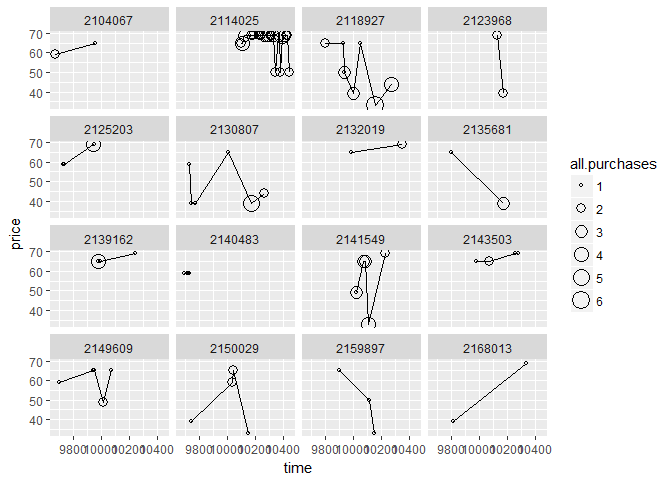
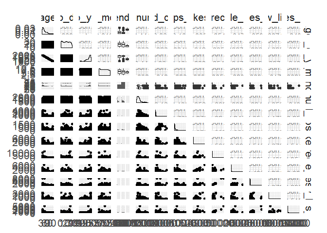
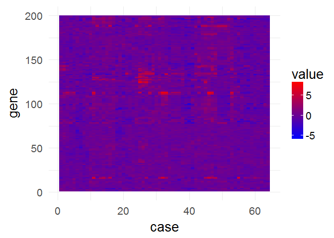

Lesson 5
========

    library(ggplot2)

### Multivariate Data

Notes:

------------------------------------------------------------------------

### Moira Perceived Audience Size Colored by Age

Notes:

------------------------------------------------------------------------

### Third Qualitative Variable

Notes:

    pf <- read.csv("pseudo_facebook.tsv",sep = "\t")

    ggplot(aes(x = gender, y = age),
           data = subset(pf, !is.na(gender))) + geom_boxplot()+
      stat_summary(fun.y = mean, geom = "point", shape = 4)

    #shape 4 is cross

    ggplot(aes(x = age, y = friend_count), data = subset(pf, !is.na(gender)))+
      geom_line(aes(color = gender),stat = "summary",
                fun.y = median)

------------------------------------------------------------------------

### Plotting Conditional Summaries

Notes:

    library(dplyr)

    ## 
    ## Attaching package: 'dplyr'

    ## The following objects are masked from 'package:stats':
    ## 
    ##     filter, lag

    ## The following objects are masked from 'package:base':
    ## 
    ##     intersect, setdiff, setequal, union

    pf.fc_by_age_gender <- pf %>%
      filter(!is.na(gender)) %>%
      group_by(age,gender) %>%
      summarise(mean_friend_count = mean(as.numeric(friend_count)),
                median_friend_count = median(as.numeric(friend_count)),
                n = n()) %>%
      ungroup() %>%
      arrange(age)

    head(pf.fc_by_age_gender,10)

    ## # A tibble: 10 × 5
    ##      age gender mean_friend_count median_friend_count     n
    ##    <int> <fctr>             <dbl>               <dbl> <int>
    ## 1     13 female          259.1606               148.0   193
    ## 2     13   male          102.1340                55.0   291
    ## 3     14 female          362.4286               224.0   847
    ## 4     14   male          164.1456                92.5  1078
    ## 5     15 female          538.6813               276.0  1139
    ## 6     15   male          200.6658               106.5  1478
    ## 7     16 female          519.5145               258.5  1238
    ## 8     16   male          239.6748               136.0  1848
    ## 9     17 female          538.9943               245.5  1236
    ## 10    17   male          236.4924               125.0  2045

    ggplot(aes( x = age, y = mean_friend_count), data = pf.fc_by_age_gender)+
      geom_line(aes(color = gender))

------------------------------------------------------------------------

### Thinking in Ratios

Notes: Maybe 10 times, or 2 times \*\*\*

### Wide and Long Format

Notes: convert long to wide using reshape package \*\*\*

### Reshaping Data

Notes:

    #install.packages('reshape2')
    library(reshape2)

    pf.fc_by_age_gender.wide <- dcast(pf.fc_by_age_gender,
                                      age ~ gender,
                                      value.var = 'median_friend_count')

    head(pf.fc_by_age_gender.wide)

    ##   age female  male
    ## 1  13  148.0  55.0
    ## 2  14  224.0  92.5
    ## 3  15  276.0 106.5
    ## 4  16  258.5 136.0
    ## 5  17  245.5 125.0
    ## 6  18  243.0 122.0

    library(tidyr)

    ## 
    ## Attaching package: 'tidyr'

    ## The following object is masked from 'package:reshape2':
    ## 
    ##     smiths

    library(dplyr)
    pf.fc_by_age_gender.wide2 <- subset(pf.fc_by_age_gender[c('age', 'gender', 'median_friend_count')],                   !is.na(gender)) %>% 
      spread(gender, median_friend_count) %>% 
      mutate(ratio = male / female)

    head(pf.fc_by_age_gender.wide2)

    ## # A tibble: 6 × 4
    ##     age female  male     ratio
    ##   <int>  <dbl> <dbl>     <dbl>
    ## 1    13  148.0  55.0 0.3716216
    ## 2    14  224.0  92.5 0.4129464
    ## 3    15  276.0 106.5 0.3858696
    ## 4    16  258.5 136.0 0.5261122
    ## 5    17  245.5 125.0 0.5091650
    ## 6    18  243.0 122.0 0.5020576

------------------------------------------------------------------------

### Ratio Plot

Notes:

    ggplot(aes(x =age, y = female/male), data = pf.fc_by_age_gender.wide)+
      geom_line()+geom_hline(yintercept =1, alpha = 0.3, linetype = 2 )

------------------------------------------------------------------------

### Third Quantitative Variable

Notes:

    pf$year_joined <- floor(2014 - pf$tenure / 365)
    #because this course is 2014, so use 2014 subtract

------------------------------------------------------------------------

### Cut a Variable

Notes:

    summary(pf$year_joined)

    ##    Min. 1st Qu.  Median    Mean 3rd Qu.    Max.    NA's 
    ##    2005    2012    2012    2012    2013    2014       2

    table(pf$year_joined)

    ## 
    ##  2005  2006  2007  2008  2009  2010  2011  2012  2013  2014 
    ##     9    15   581  1507  4557  5448  9860 33366 43588    70

------------------------------------------------------------------------

### Plotting it All Together

Notes:

    pf$year_joined.bucket <- cut(pf$year_joined, c(2004,2009,2011,2012,2014))

    table(pf$year_joined.bucket,useNA = 'ifany')

    ## 
    ## (2004,2009] (2009,2011] (2011,2012] (2012,2014]        <NA> 
    ##        6669       15308       33366       43658           2

    ggplot(aes(x = age, y = friend_count), data = subset(pf, !is.na(year_joined.bucket)))+
      geom_line(aes(color = year_joined.bucket),
                stat = "summary",
                fun.y = median)

------------------------------------------------------------------------

### Plot the Grand Mean

Notes:

    ggplot(aes(x = age, y = friend_count), data = subset(pf, !is.na(year_joined.bucket)))+
      geom_line(aes(color = year_joined.bucket),
                stat = "summary",
                fun.y = mean)+
      geom_line(stat="summary", fun.y=mean,linetype = 2)

------------------------------------------------------------------------

### Friending Rate

Notes:

    friending_rate <- subset(pf, tenure>1)$friend_count / subset(pf, tenure>1)$tenure
    summary(friending_rate)

    ##     Min.  1st Qu.   Median     Mean  3rd Qu.     Max. 
    ##   0.0000   0.0775   0.2204   0.6069   0.5652 417.0000

    with(subset(pf,tenure>=1),summary(friend_count/ tenure))

    ##     Min.  1st Qu.   Median     Mean  3rd Qu.     Max. 
    ##   0.0000   0.0775   0.2205   0.6096   0.5658 417.0000

------------------------------------------------------------------------

### Friendships Initiated

Notes:

What is the median friend rate? 0.220

What is the maximum friend rate? 417

    ggplot(aes(x = tenure, y = friendships_initiated / tenure), data = subset(pf, !is.na(year_joined.bucket) & tenure >=1))+
      geom_line(aes(color = year_joined.bucket))

    #+
      #geom_line(stat="summary", fun.y=mean,linetype = 2)

------------------------------------------------------------------------

### Bias-Variance Tradeoff Revisited

Notes:

    ggplot(aes(x = tenure, y = friendships_initiated / tenure),
           data = subset(pf, tenure >= 1)) +
      geom_line(aes(color = year_joined.bucket),
                stat = 'summary',
                fun.y = mean)

    ggplot(aes(x = 7 * round(tenure / 7), y = friendships_initiated / tenure),
           data = subset(pf, tenure > 0)) +
      geom_line(aes(color = year_joined.bucket),
                stat = "summary",
                fun.y = mean)

    ggplot(aes(x = 30 * round(tenure / 30), y = friendships_initiated / tenure),
           data = subset(pf, tenure > 0)) +
      geom_line(aes(color = year_joined.bucket),
                stat = "summary",
                fun.y = mean)

    ggplot(aes(x = 90 * round(tenure / 90), y = friendships_initiated / tenure),
           data = subset(pf, tenure > 0)) +
      geom_line(aes(color = year_joined.bucket),
                stat = "summary",
                fun.y = mean)

    ggplot(aes(x = tenure, y = friendships_initiated / tenure),
           data = subset(pf, tenure >= 1)) +
      geom_smooth(aes(color = year_joined.bucket))

    ## `geom_smooth()` using method = 'gam'

------------------------------------------------------------------------

### Sean's NFL Fan Sentiment Study

Notes:

------------------------------------------------------------------------

### Introducing the Yogurt Data Set

Notes:

------------------------------------------------------------------------

### Histograms Revisited

Notes:

    yo <- read.csv('yogurt.csv')
    str(yo)

    ## 'data.frame':    2380 obs. of  9 variables:
    ##  $ obs        : int  1 2 3 4 5 6 7 8 9 10 ...
    ##  $ id         : int  2100081 2100081 2100081 2100081 2100081 2100081 2100081 2100081 2100081 2100081 ...
    ##  $ time       : int  9678 9697 9825 9999 10015 10029 10036 10042 10083 10091 ...
    ##  $ strawberry : int  0 0 0 0 1 1 0 0 0 0 ...
    ##  $ blueberry  : int  0 0 0 0 0 0 0 0 0 0 ...
    ##  $ pina.colada: int  0 0 0 0 1 2 0 0 0 0 ...
    ##  $ plain      : int  0 0 0 0 0 0 0 0 0 0 ...
    ##  $ mixed.berry: int  1 1 1 1 1 1 1 1 1 1 ...
    ##  $ price      : num  59 59 65 65 49 ...

    #change the id from an int to a factor
    yo$id <- factor(yo$id)

    str(yo)

    ## 'data.frame':    2380 obs. of  9 variables:
    ##  $ obs        : int  1 2 3 4 5 6 7 8 9 10 ...
    ##  $ id         : Factor w/ 332 levels "2100081","2100370",..: 1 1 1 1 1 1 1 1 1 1 ...
    ##  $ time       : int  9678 9697 9825 9999 10015 10029 10036 10042 10083 10091 ...
    ##  $ strawberry : int  0 0 0 0 1 1 0 0 0 0 ...
    ##  $ blueberry  : int  0 0 0 0 0 0 0 0 0 0 ...
    ##  $ pina.colada: int  0 0 0 0 1 2 0 0 0 0 ...
    ##  $ plain      : int  0 0 0 0 0 0 0 0 0 0 ...
    ##  $ mixed.berry: int  1 1 1 1 1 1 1 1 1 1 ...
    ##  $ price      : num  59 59 65 65 49 ...

    qplot(data = yo, x = price, fill = I("#F79420"))

    ## `stat_bin()` using `bins = 30`. Pick better value with `binwidth`.

    qplot(data = yo, x = price, fill = I("#F79420"), binwidth = 10)

------------------------------------------------------------------------

### Number of Purchases

Notes:

    unique(yo$price)

    ##  [1] 58.96 65.04 48.96 68.96 39.04 24.96 50.00 45.04 33.04 44.00 33.36
    ## [12] 55.04 62.00 20.00 49.60 49.52 33.28 63.04 33.20 33.52

    table(yo$price)

    ## 
    ##    20 24.96 33.04  33.2 33.28 33.36 33.52 39.04    44 45.04 48.96 49.52 
    ##     2    11    54     1     1    22     1   234    21    11    81     1 
    ##  49.6    50 55.04 58.96    62 63.04 65.04 68.96 
    ##     1   205     6   303    15     2   799   609

    yo$all.purchases <- yo$strawberry + yo$blueberry + 
                      yo$pina.colada + yo$plain + yo$mixed.berry

    #yo <- transform(yo, all,purchases = strawberry + blueberry + 
                      #pina.colada + plain + mixed.berry)

    summary(yo$all.purchases)

    ##    Min. 1st Qu.  Median    Mean 3rd Qu.    Max. 
    ##   1.000   1.000   2.000   1.971   2.000  21.000

------------------------------------------------------------------------

### Prices over Time

Notes:

    qplot(data = yo, x=all.purchases, binwidth = 1, fill =I("#099dd9"))

    ggplot(aes(y = price, x = time), data = yo)+
      geom_jitter(alpha = 0.25, shape = 21, fill = I("#f79420"))

------------------------------------------------------------------------

### Sampling Observations

Notes:

------------------------------------------------------------------------

### Looking at Samples of Households

    set.seed(4230)
    sample.ids <- sample(levels(yo$id),16)

    ggplot(aes(x = time, y = price),data = subset(yo, id %in% sample.ids))+
      facet_wrap(~id)+
      geom_line()+
      geom_point(aes(size = all.purchases), pch = 1)

    set.seed(2770)
    sample.ids2 <- sample(levels(yo$id),16)

    ggplot(aes(x = time, y = price),data = subset(yo, id %in% sample.ids2))+
      facet_wrap(~id)+
      geom_line()+
      geom_point(aes(size = all.purchases), pch = 1)

------------------------------------------------------------------------

### The Limits of Cross Sectional Data

Notes:

yogurt : process with the time, can track with the time facebook: cross
section, just a snapshot

------------------------------------------------------------------------

### Many Variables

Notes:

------------------------------------------------------------------------

### Scatterplot Matrix

Notes:

    #install.packages('GGally')
    library(GGally)

    ## 
    ## Attaching package: 'GGally'

    ## The following object is masked from 'package:dplyr':
    ## 
    ##     nasa

    library(progress)
    theme_set(theme_minimal(20))

    set.seed(1836)
    pf_subset <- pf[ ,c(2:15)]
    names(pf_subset)

    ##  [1] "age"                   "dob_day"              
    ##  [3] "dob_year"              "dob_month"            
    ##  [5] "gender"                "tenure"               
    ##  [7] "friend_count"          "friendships_initiated"
    ##  [9] "likes"                 "likes_received"       
    ## [11] "mobile_likes"          "mobile_likes_received"
    ## [13] "www_likes"             "www_likes_received"

    ggpairs(pf_subset[sample.int(nrow(pf_subset),1000), ])

    ## `stat_bin()` using `bins = 30`. Pick better value with `binwidth`.

    ## `stat_bin()` using `bins = 30`. Pick better value with `binwidth`.
    ## `stat_bin()` using `bins = 30`. Pick better value with `binwidth`.
    ## `stat_bin()` using `bins = 30`. Pick better value with `binwidth`.
    ## `stat_bin()` using `bins = 30`. Pick better value with `binwidth`.
    ## `stat_bin()` using `bins = 30`. Pick better value with `binwidth`.
    ## `stat_bin()` using `bins = 30`. Pick better value with `binwidth`.
    ## `stat_bin()` using `bins = 30`. Pick better value with `binwidth`.
    ## `stat_bin()` using `bins = 30`. Pick better value with `binwidth`.
    ## `stat_bin()` using `bins = 30`. Pick better value with `binwidth`.
    ## `stat_bin()` using `bins = 30`. Pick better value with `binwidth`.
    ## `stat_bin()` using `bins = 30`. Pick better value with `binwidth`.
    ## `stat_bin()` using `bins = 30`. Pick better value with `binwidth`.

Scatterplots are below the diagonal, and categorical variables, like
gender, create faceted histograms.

------------------------------------------------------------------------

### Even More Variables

Notes:

    nci <- read.table("nci.tsv")
    colnames(nci) <- c(1:64)

------------------------------------------------------------------------

### Heat Maps

Notes:

    nci.long.samp <- melt(as.matrix(nci[1:200,]))
    names(nci.long.samp) <- c("gene", "case", "value")
    head(nci.long.samp)

    ##   gene case  value
    ## 1    1    1  0.300
    ## 2    2    1  1.180
    ## 3    3    1  0.550
    ## 4    4    1  1.140
    ## 5    5    1 -0.265
    ## 6    6    1 -0.070

    ggplot(aes(y = gene, x = case, fill = value),
      data = nci.long.samp) +
      geom_tile() +
      scale_fill_gradientn(colours = colorRampPalette(c("blue", "red"))(100))

------------------------------------------------------------------------

### Analyzing Three of More Variables

Reflection:

------------------------------------------------------------------------

Click **KnitHTML** to see all of your hard work and to have an html page
of this lesson, your answers, and your notes!
