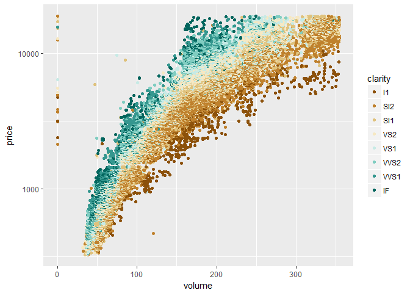
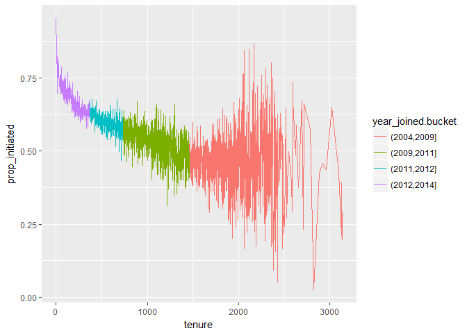
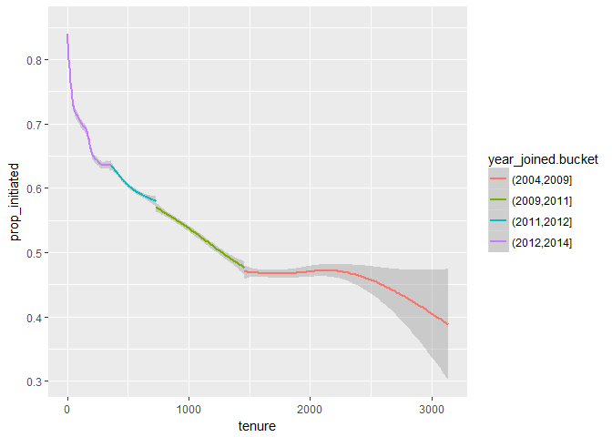
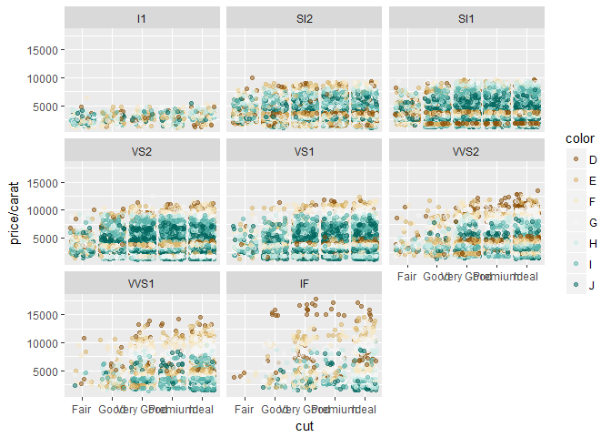

Lesson 5 -quiz
==============

Price Histograms with Facet and Color
-------------------------------------

    # Create a histogram of diamond prices.
    # Facet the histogram by diamond color
    # and use cut to color the histogram bars.

    # The plot should look something like this.
    # http://i.imgur.com/b5xyrOu.jpg

    # Note: In the link, a color palette of type
    # 'qual' was used to color the histogram using
    # scale_fill_brewer(type = 'qual')

    # This assignment is not graded and
    # will be marked as correct when you submit.

    library(ggplot2)
    data("diamonds")

    qplot(x = price, data = diamonds, fill = cut)+
      scale_x_log10()+
      facet_wrap(~color) + 
      scale_fill_brewer(type = "qual")

    ## `stat_bin()` using `bins = 30`. Pick better value with `binwidth`.

    ggplot(aes(x = log(price)), data = diamonds) +
    geom_histogram(aes(fill = cut)) +
    facet_wrap( ~ color)+
    scale_fill_brewer(type = 'qual')

    ## `stat_bin()` using `bins = 30`. Pick better value with `binwidth`.

\#\# Price vs. Table Colored by Cut

    # Create a scatterplot of diamond price vs.
    # table and color the points by the cut of
    # the diamond.

    # The plot should look something like this.
    # http://i.imgur.com/rQF9jQr.jpg

    # Note: In the link, a color palette of type
    # 'qual' was used to color the scatterplot using
    # scale_color_brewer(type = 'qual')

    # This assignment is not graded and
    # will be marked as correct when you submit.

    # ENTER YOUR CODE BELOW THIS LINE

    summary(diamonds$table)

    ##    Min. 1st Qu.  Median    Mean 3rd Qu.    Max. 
    ##   43.00   56.00   57.00   57.46   59.00   95.00

    ggplot(aes(x = table, y = price), data = diamonds) + 
      scale_x_continuous(breaks = seq(50,80,2), limits = c(50,80))+
      geom_point(aes(color = cut)) + 
      scale_color_brewer(type = 'qual')

    ## Warning: Removed 5 rows containing missing values (geom_point).

Price vs. Volume and Diamond Clarity
------------------------------------

    # Create a scatterplot of diamond price vs.
    # volume (x * y * z) and color the points by
    # the clarity of diamonds. Use scale on the y-axis
    # to take the log10 of price. You should also
    # omit the top 1% of diamond volumes from the plot.

    # Note: Volume is a very rough approximation of
    # a diamond's actual volume.

    # The plot should look something like this.
    # http://i.imgur.com/excUpea.jpg

    # Note: In the link, a color palette of type
    # 'div' was used to color the scatterplot using
    # scale_color_brewer(type = 'div')

    diamonds = transform(diamonds, volume = x * y * z)
    ggplot(aes(x = volume, y = price), data = subset(diamonds, volume < quantile(diamonds$volume, 0.99)))+
      geom_point(aes(color = clarity))+ 
      scale_y_log10()+
      scale_color_brewer(type = 'div')

Proportion of Friendships Initiated
-----------------------------------

    # Many interesting variables are derived from two or more others.
    # For example, we might wonder how much of a person's network on
    # a service like Facebook the user actively initiated. Two users
    # with the same degree (or number of friends) might be very
    # different if one initiated most of those connections on the
    # service, while the other initiated very few. So it could be
    # useful to consider this proportion of existing friendships that
    # the user initiated. This might be a good predictor of how active
    # a user is compared with their peers, or other traits, such as
    # personality (i.e., is this person an extrovert?).

    # Your task is to create a new variable called 'prop_initiated'
    # in the Pseudo-Facebook data set. The variable should contain
    # the proportion of friendships that the user initiated.

    pf <- read.csv("pseudo_facebook.tsv",sep = "\t")
    pf$prop_initiated <- pf$friendships_initiated / pf$friend_count

    pf$prop_initiated[is.nan(pf$prop_initiated)] <- 0
    #if is nan, make it to zero
    summary(pf$prop_initiated)

    ##    Min. 1st Qu.  Median    Mean 3rd Qu.    Max. 
    ##  0.0000  0.4400  0.6184  0.5958  0.7795  1.0000

prop\_initiated vs. tenure
--------------------------

    # Create a line graph of the median proportion of
    # friendships initiated ('prop_initiated') vs.
    # tenure and color the line segment by
    # year_joined.bucket.

    # Recall, we created year_joined.bucket in Lesson 5
    # by first creating year_joined from the variable tenure.
    # Then, we used the cut function on year_joined to create
    # four bins or cohorts of users.

    # (2004, 2009]
    # (2009, 2011]
    # (2011, 2012]
    # (2012, 2014]

    # The plot should look something like this.
    # http://i.imgur.com/vNjPtDh.jpg
    # OR this
    # http://i.imgur.com/IBN1ufQ.jpg

    pf$year_joined <- floor(2014 - pf$tenure / 365)
    pf$year_joined.bucket <- cut(pf$year_joined, c(2004,2009,2011,2012,2014))

    ggplot(aes(y = prop_initiated, x = tenure), data = subset(pf, pf$prop_initiated>0))+
      geom_line(aes(color = year_joined.bucket), stat = 'summary', fun.y = mean)

    ## Warning: Removed 2 rows containing non-finite values (stat_summary).

Smoothing prop\_initiated vs. tenure
------------------------------------

    # Smooth the last plot you created of
    # of prop_initiated vs tenure colored by
    # year_joined.bucket. You can bin together ranges
    # of tenure or add a smoother to the plot.

    # There won't be a solution image for this exercise.
    # You will answer some questions about your plot in
    # the next two exercises.

    ggplot(aes(y = prop_initiated, x = tenure), data = subset(pf, prop_initiated>0))+
        geom_smooth(aes(color = year_joined.bucket))

    ## `geom_smooth()` using method = 'gam'

    ## Warning: Removed 2 rows containing non-finite values (stat_smooth).

    str(pf$year_joined.bucket)

    ##  Factor w/ 4 levels "(2004,2009]",..: 4 4 4 4 4 4 4 4 4 4 ...

    levels(pf$year_joined.bucket)

    ## [1] "(2004,2009]" "(2009,2011]" "(2011,2012]" "(2012,2014]"

    summary(subset(pf,year_joined.bucket == "(2012,2014]")
      $prop_initiated)

    ##    Min. 1st Qu.  Median    Mean 3rd Qu.    Max. 
    ##  0.0000  0.5000  0.6912  0.6430  0.8438  1.0000

Price/Carat Binned, Faceted, & Colored
--------------------------------------

    # Create a scatter plot of the price/carat ratio
    # of diamonds. The variable x should be
    # assigned to cut. The points should be colored
    # by diamond color, and the plot should be
    # faceted by clarity.

    # The plot should look something like this.
    # http://i.imgur.com/YzbWkHT.jpg.

    # Note: In the link, a color palette of type
    # 'div' was used to color the histogram using
    # scale_color_brewer(type = 'div')

    ggplot(aes(x = cut, y = price/carat), data = diamonds)+
      geom_jitter(aes(color = color), alpha = 0.5)+
      facet_wrap(~clarity)+
      scale_color_brewer(type = 'div')

