#Premier League Football Exploration

This report explores a dataset containing 25+ variables for 5,170
matches. It comes from <http://www.football-data.co.uk/englandm.php>

some variables have used the abbreviation, whose description are shown
below:

1.  HomeTeam = Home Team
2.  AwayTeam = Away Team
3.  FTHG = Full-Time Home Team Goals
4.  FTAG = Full-Time Away Team Goals
5.  FTR = Full-Time Result (H=Home Win, D=Draw, A=Away Win)
6.  Referee = Match Referee
7.  HS = Home Team Shots
8.  AS = Away Team Shots
9.  HST = Home Team Shots on Target
10. AST = Away Team Shots on Target
11. HF = Home Team Fouls Committed
12. AF = Away Team Fouls Committed
13. HO = Home Team Offsides
14. AO = Away Team Offsides
15. HY = Home Team Yellow Cards
16. AY = Away Team Yellow Cards
17. HR = Home Team Red Cards
18. AR = Away Team Red Cards

Main question
=============

What factor can influence the result of a match in Premier League?

Univariate Plots Section
========================

Overview
--------

    ##        X             Year            HomeTeam         AwayTeam   
    ##  Min.   :   1   Min.   :2004   Arsenal   : 259   Chelsea  : 259  
    ##  1st Qu.:1293   1st Qu.:2007   Man United: 259   Everton  : 259  
    ##  Median :2586   Median :2010   Chelsea   : 258   Liverpool: 259  
    ##  Mean   :2586   Mean   :2010   Everton   : 258   Man City : 259  
    ##  3rd Qu.:3878   3rd Qu.:2014   Liverpool : 258   Tottenham: 259  
    ##  Max.   :5170   Max.   :2017   Man City  : 258   Arsenal  : 258  
    ##                                (Other)   :3620   (Other)  :3617  
    ##       FTHG           FTAG           FTG         FTR     
    ##  Min.   :0.00   Min.   :0.00   Min.   : 0.000   A:1451  
    ##  1st Qu.:1.00   1st Qu.:0.00   1st Qu.: 2.000   D:1331  
    ##  Median :1.00   Median :1.00   Median : 2.000   H:2388  
    ##  Mean   :1.53   Mean   :1.13   Mean   : 2.531           
    ##  3rd Qu.:2.00   3rd Qu.:2.00   3rd Qu.: 3.000           
    ##  Max.   :9.00   Max.   :6.00   Max.   :10.000           
    ##                                                         
    ##           Referee           HS              AS             HST        
    ##  M Dean       : 363   Min.   : 1.00   Min.   : 0.00   Min.   : 0.000  
    ##  M Atkinson   : 307   1st Qu.:10.00   1st Qu.: 7.00   1st Qu.: 4.000  
    ##  H Webb       : 296   Median :13.00   Median :10.00   Median : 6.000  
    ##  M Clattenburg: 288   Mean   :13.66   Mean   :10.69   Mean   : 6.638  
    ##  P Dowd       : 287   3rd Qu.:17.00   3rd Qu.:13.00   3rd Qu.: 9.000  
    ##  C Foy        : 250   Max.   :43.00   Max.   :30.00   Max.   :24.000  
    ##  (Other)      :3379                                                   
    ##       AST               HC               AC               HF      
    ##  Min.   : 0.000   Min.   : 0.000   Min.   : 0.000   Min.   : 1.0  
    ##  1st Qu.: 3.000   1st Qu.: 4.000   1st Qu.: 3.000   1st Qu.: 9.0  
    ##  Median : 5.000   Median : 6.000   Median : 4.000   Median :11.0  
    ##  Mean   : 5.109   Mean   : 6.147   Mean   : 4.825   Mean   :11.4  
    ##  3rd Qu.: 7.000   3rd Qu.: 8.000   3rd Qu.: 6.000   3rd Qu.:14.0  
    ##  Max.   :20.000   Max.   :20.000   Max.   :19.000   Max.   :33.0  
    ##                                                                   
    ##        AF           HY              AY             HR        
    ##  Min.   : 1   Min.   :0.000   Min.   :0.00   Min.   :0.0000  
    ##  1st Qu.: 9   1st Qu.:0.000   1st Qu.:1.00   1st Qu.:0.0000  
    ##  Median :12   Median :1.000   Median :2.00   Median :0.0000  
    ##  Mean   :12   Mean   :1.388   Mean   :1.78   Mean   :0.0646  
    ##  3rd Qu.:14   3rd Qu.:2.000   3rd Qu.:3.00   3rd Qu.:0.0000  
    ##  Max.   :28   Max.   :7.000   Max.   :9.00   Max.   :3.0000  
    ##                                                              
    ##        AR              Season    
    ##  Min.   :0.00000   Min.   :2003  
    ##  1st Qu.:0.00000   1st Qu.:2006  
    ##  Median :0.00000   Median :2009  
    ##  Mean   :0.09497   Mean   :2009  
    ##  3rd Qu.:0.00000   3rd Qu.:2013  
    ##  Max.   :2.00000   Max.   :2016  
    ##

winning times
-------------

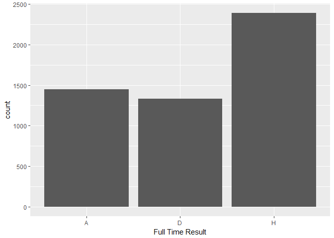

From this plot above, it is clear that Home Team has won more matches
from 2003-2016 Premier League.

Full time goals
---------------

From this histogram, we can see that most matches had full time goals
less than 2.5. And there wasn't a match up to 10 goals in the history
from 2003 - 2016.

Full time shots
---------------

From above plot, the full time shot seems to be a normal distribution,
most full time shots was bewteen 20 and 30.

Full time shot on target
------------------------

From above plot, the full time shot on target also seems to be a normal
distribution. Most shot on target was around 10.

Cards
-----

Above plot is the histogram of cards, In most matches, the number of
cards was less than 4. And the max can be up to 12.

Full time corners
-----------------

Most matches had around five corners full time. And there existed that
full time match had zero corner. It was really rare. And max number can
up to 20.

Bivariate Analysis and Multivariate Plots Section
=================================================

> Attention: To make the analysis more like a report and interesting, I
> will analysis several factors in football matches, so bivariate and
> multivariate plots are mixed, because they are connected and easy to
> understand together.

Home VS Away?
-------------

Frome the plot above, we can find that in all seasons from 2003 to 2017,
Home team has won more matches.So I am curious, why Home team can win
more than Away Team? In other words, which factors influence the final
results?

### Full time goals

Home team

    ##    Min. 1st Qu.  Median    Mean 3rd Qu.    Max.
    ##    0.00    1.00    1.00    1.53    2.00    9.00

Away team

    ##    Min. 1st Qu.  Median    Mean 3rd Qu.    Max.
    ##    0.00    0.00    1.00    1.13    2.00    6.00

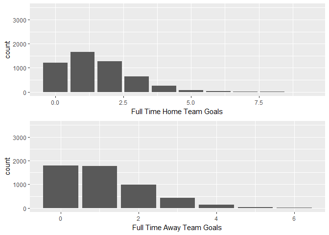

Comparing the full-time goals, mean and max of Home Team is higher than
that of Away team, so it means, home team won more games because of it
had more goals than away team on the average. While, this seems a little
meaningless because the goal number decide the game results.

However, Home teams seem to have advantages because they are more
familiar with the pitch they play on. They spend a lot of time training
tactics and shooting on their own pitch and they know the environment
better than the away teams. I guess the home teams shoot more than away
team on average.

### Shots

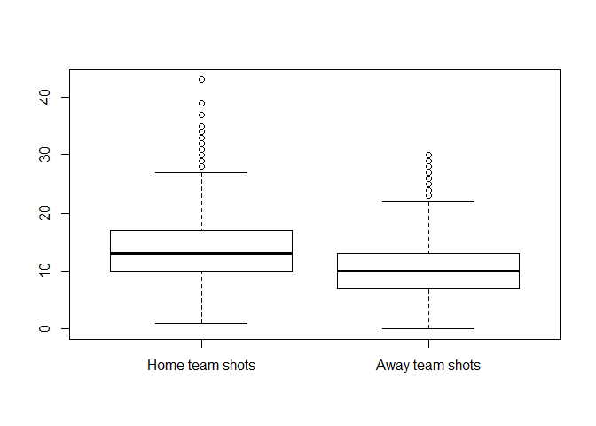

### Shots on Target

It is clear that my guess is right, from two box plots above, home teams
attempted to shot more than away teams and the shot on target is higher
than away team, it seems home teams know where the net is.

### Corner

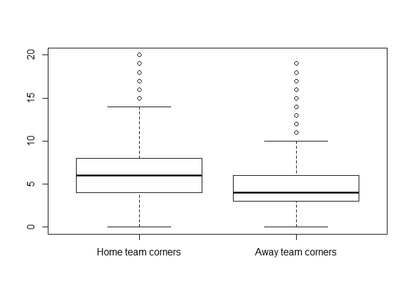

In the aspect of the corner, it is obvious that home team have more
advantages on corners, more corners mean more opportunities to goal, it
increased the possibility of home team win.

The exploration on teams
------------------------

Next, I want to check how different teams perform from several aspects,
such as performances as Home and Away, shot times and foul times.

### Plot by Home team

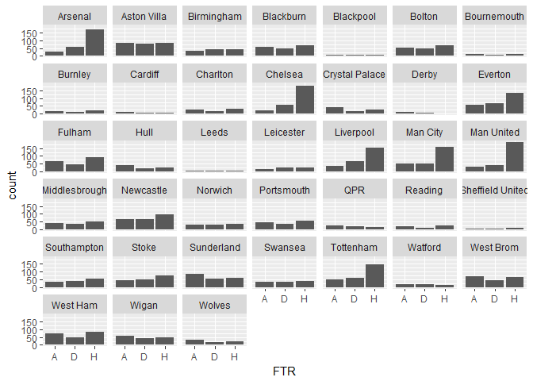

### Plot by Away team

### Who is the best home team from 2013-2016?

    ## # A tibble: 6 × 4
    ##         team   win     n  win_rate
    ##       <fctr> <dbl> <int>     <dbl>
    ## 1 Man United   190   259 0.7335907
    ## 2    Chelsea   179   258 0.6937984
    ## 3    Arsenal   173   259 0.6679537
    ## 4   Man City   157   258 0.6085271
    ## 5  Liverpool   156   258 0.6046512
    ## 6  Tottenham   147   258 0.5697674

### who is the worst home team from 2013-2016?

    ## # A tibble: 6 × 4
    ##        team   win     n   win_rate
    ##      <fctr> <dbl> <int>      <dbl>
    ## 1     Derby     1    19 0.05263158
    ## 2 Blackpool     5    19 0.26315789
    ## 3   Cardiff     5    19 0.26315789
    ## 4     Leeds     5    19 0.26315789
    ## 5       QPR    15    57 0.26315789
    ## 6   Watford    13    49 0.26530612

### Who is the best away team from 2013-2016?

    ## # A tibble: 6 × 4
    ##         team   win     n  win_rate
    ##       <fctr> <dbl> <int>     <dbl>
    ## 1    Chelsea   146   259 0.5637066
    ## 2 Man United   138   258 0.5348837
    ## 3    Arsenal   125   258 0.4844961
    ## 4  Liverpool   106   259 0.4092664
    ## 5   Man City    93   259 0.3590734
    ## 6  Tottenham    90   259 0.3474903

### Who is the worst away team from 2013-2016?

    ## # A tibble: 6 × 4
    ##      team   win     n   win_rate
    ##    <fctr> <dbl> <int>      <dbl>
    ## 1   Derby     0    19 0.00000000
    ## 2 Burnley     4    48 0.08333333
    ## 3 Cardiff     2    19 0.10526316
    ## 4  Wolves     9    76 0.11842105
    ## 5     QPR     7    57 0.12280702
    ## 6 Norwich    12    95 0.12631579

Summary of win rate rate by teams
---------------------------------

From the summary plot, We can see Man United, Chelsa, Arsenal, Liverpool
and Man city are teams that performed both well whether they are home
teams or away teams. In addition to the above teams, some are also
difficult to beat at home, such as Stoke and Fulham.

Fouls and win rate
------------------

In our impression, if a team is very fierce on the pitch, it is likely
to win the game; The opponents are afraid of them. So I want to verify
this views, whether the more fierce a team is, the higher possibility to
win it has. I will compare the fierce rate with win rate.

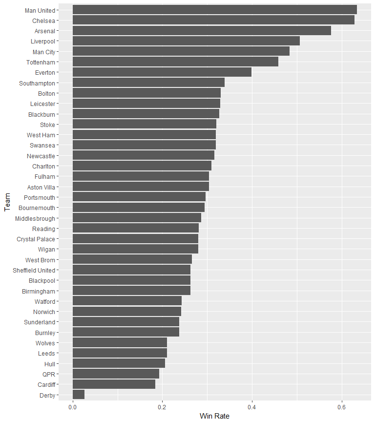

While it seems foul is uncorrelated with win rate. We can see the
highest win rate team has a low fouls. The win rate of the team who has
the highest foul is much lower. It can be explained by the fact that
sometimes better team didn't need to make fouls to win the game. As a
result, a fierce team is likely to be a team that feel more pressure on
matches, so it seems fierce to try to win the game. While the team has
great advantage may be more gentle on the pitches.

Shot on target and win rate
---------------------------

Win rate and Referre
--------------------

Referee is another important factor in the football game. Different
referee has a different style, it influenced the game.

Referee influence on th results
-------------------------------

Home team to away wins

    ##    Min. 1st Qu.  Median    Mean 3rd Qu.    Max.
    ##   0.000   1.327   1.643   1.621   1.887   4.333

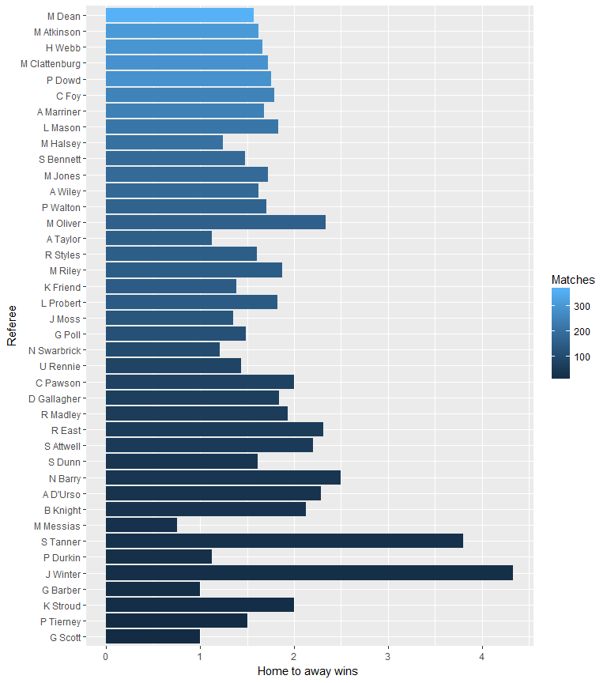

Then, I try to compare all these referees in the same plot. I use the
home team to away wins as the x-axis, and the number of away team win as
x-axis under the each referee.In this plot, I can see home team won more
than away team under any referee almost(all the number is larger than
1). But I can still observe home team may have a high probability of
victory when their referee is, for example, Oliver and Reliy. If the
referee is Halsey, the home team may be careful, because the ration of
Halsey and Taylor is much lower than the mean.

### Referee and Card

I also want to explore the relation between referee and cards. Some
referees are famous for strict and often give yellow cards and red
cards.

The summary of matches each referee officated

    ##    Min. 1st Qu.  Median    Mean 3rd Qu.    Max.
    ##    1.00    1.50   39.00   87.63  155.00  363.00

Because the median number is 39, so I only choose the referees who
officiated more the 39 matches.

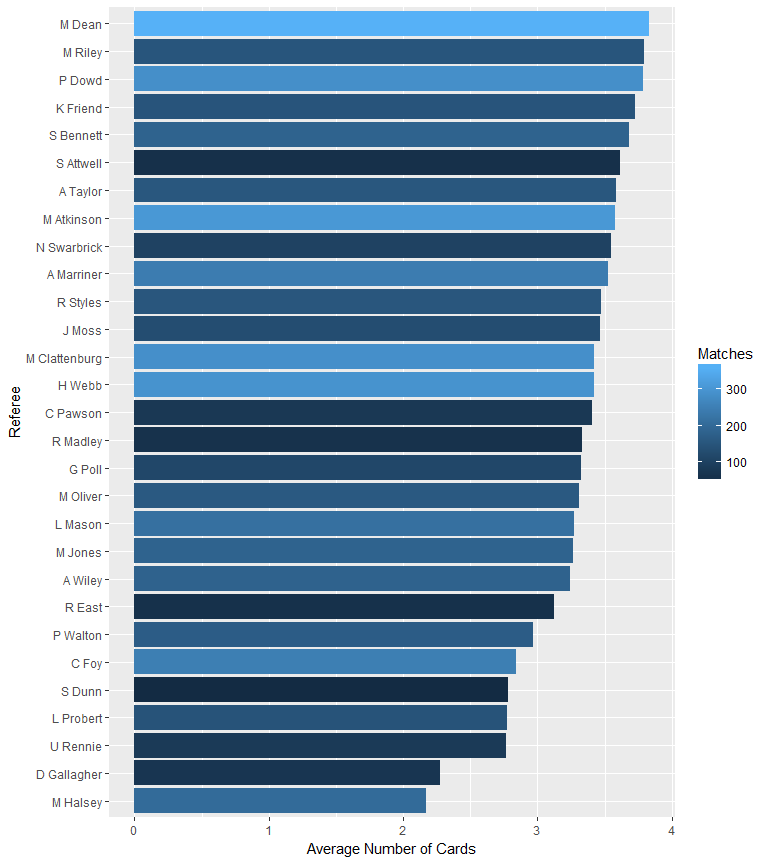

Exploration by season
---------------------

Full Time Goals with the year
-----------------------------

This plot is interesting. If you don't know Premier League before, you
can still see there are clear intervals between different seasons. In
fact, these are holidays for the Premier League players. It usually
lasts two months, from June and July. Besides, we can also find the
highest goals in a match happens in season 2009.

The below plots shows the average number of goals, shots, shots on
target, cards and corner by different numbers.

Goals by season
---------------

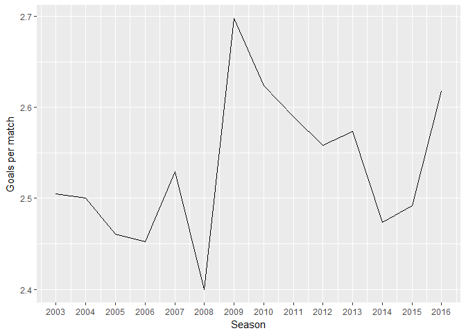

From 2003- 2016 seasons, 2009 was the year had highest goals per match.
It was a highly ornamental season. Later, the number decreased. But we
can see there is a increasing trend in 2016 season. While, 2016 season
is still on, so let's wait and see what happens.

Shots by season
---------------

The average shots appears rising trend since 2005. It means players
tried to shot more than before, to be honest, this trend shows that the
Premier League is more Worth seeing.

Shots on target by season
-------------------------

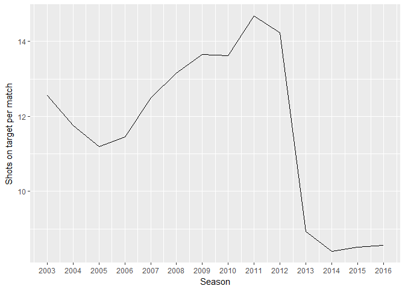

There is a obvious decrease of shots on target from 2012 to 2014, and it
perhaps will keep at a low level for in the fture. According to the
common sense, the shots on target should increase due to the increase of
shots. However, the fact is reverse.

Cards by season
---------------

The cards number is increasing with fluctuations. It shows that the
premier league is more and more fierce and worth seeing!!!

Corner by season
----------------

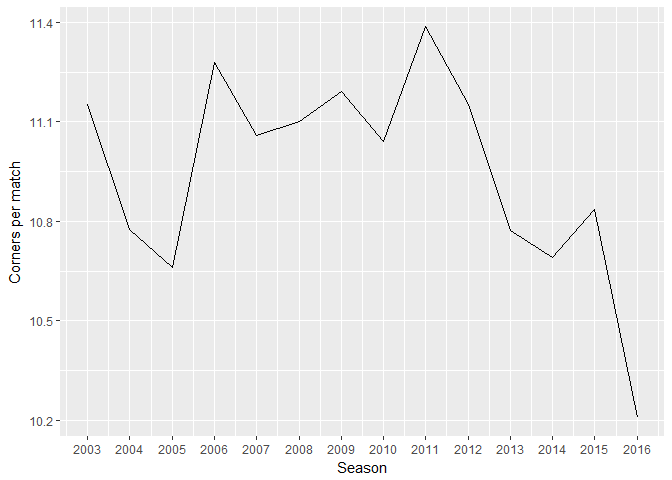

While, the corner number reduces from 2003 to 2016.

Home team Win rate by Season
----------------------------

The plot above shows that although Man United is the best home team from
2013-2016, it wasn't always the best from different season. Arsenal,
Chelsa and Man city once was the best home team in specific season.

Away team win rate by season
----------------------------

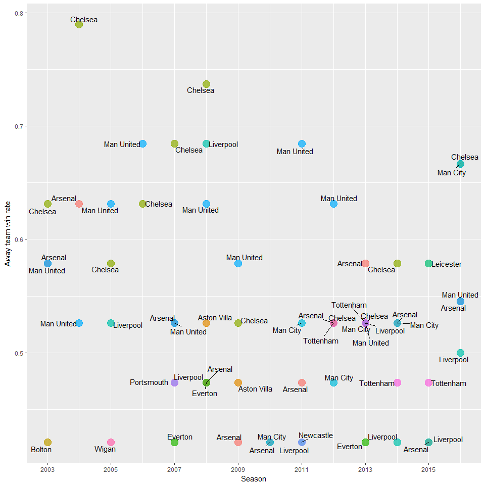

The plot above shows that although Chelsea is the best away team from
2013-2016, it wasn't always the best. Arsenal, Man United once was the
best home team in specific season.

Final Plots and Summary
=======================

In this part, three major graphs are chose to reflect the main
exploration for this report.

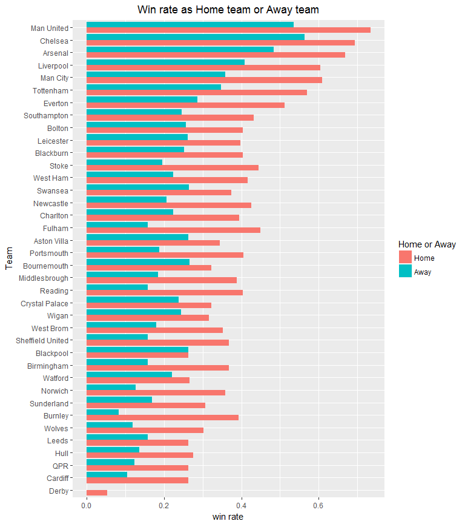

This bar plot reveals the win rate of different teams in the Premier
League from 2013-2016.First, We can see from the plot, most of the teams
have higher win rate when they play as home team rather than play as
away team.Second, we can find that several best teams like Man United,
Chelsea, Arsenal, they all have high win rate whether play as home team
or as any team. And you can find your favourite team and see how they
perform in this bar plot.

This plot reflects the factor of the referee in a match. The X-axis is
Home to away wins, the Y-axis is Referee's name. The each point
represent the each referee. So, you can look for a specific referee and
easy to know, when he officiated matches, how times home to away wins,
and how many away team win.Second, different referee officiate exactly
have different home-away win rate.

So the team should consider the referee factor. If the referee is
strict, players should be careful and try to reduce unnecessary fouls to
avoid yellow card and red card. If the referee is not too strict, it is
reasonable to use some foul to prevent rivals. The team can adjust their
defence style according to the referee.

And the match variables here shows that generally, when a referee
officiated more game, his home to away wins value decreased. The
difference between home team and away team reduced. And the number of
macthes also reflected the team should pay more attention on referees
who have large match number, perhaps he will officiate your next match.

This is the plot reflect the win rate and accuracy(shot on the target).
The X-axis is shot on the target/per game, the Y-axis is win rate for
each team. The point represent the different teams.It is clear that team
have high win rate must shot on the target more frequently than another
team on the average. Actually, shot on the target is really one of the
most important data to justice whether the team can win in a match.

Reflection
==========

In this report I successfully explore the relationships among win rate,
home team/away team, shot accuracy and referees.

But there are still some struggles during my exploration. I tried to set
up criteria for each team, and evaluate them from different aspects and
gave them each a score. The higher score means the team is more strong.
But I cannot figure out how to calculate the score and use which
formulas. And I also want to make a radius plot, but I cannot put all of
the teams on the same plot. The extragrid library didn't work for the
radius plot.

While, actually, there are various other data can also have an impact on
the result, for example, the status of players, the number of audiences,
the weather and so on. Due to the limitation of the data, I cannot
explore them in details. These are some questions for the future
research:

1.  Wheather the number of the audience can influence the result of the
    match?
2.  Does the possession percentage still important in the Premier
    League?
3.  Which formation has the highest win rate, 4-3-3?
