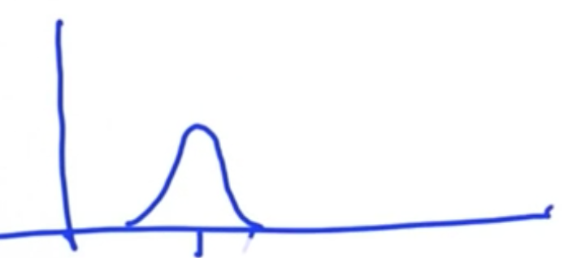
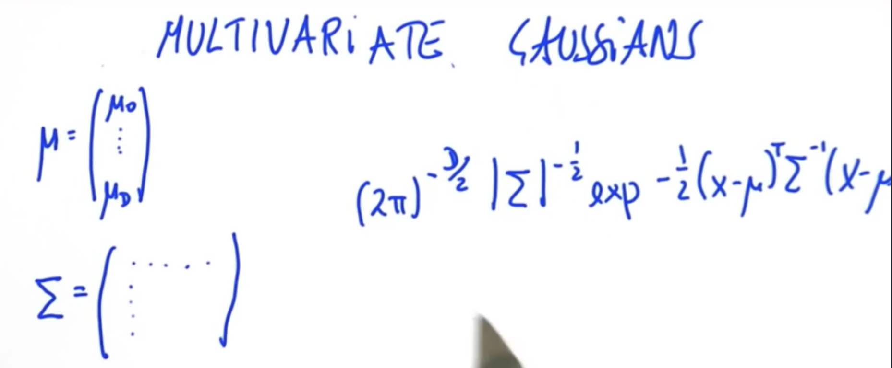

# Kalman Filters

Sensors:

- Spinning Laser range finder: takes distance scans 10x / second, about 1M data points (each time). -> spot cars so you don't run into them.
- Camera on top.
- Stereo camera system
- Antennas for GPS at rear to estimate where car is in the world.

### Tracking using Kalman Filters

- Similar to Monte Carlo localisation, except it's
  - continuous (as opposed to divided into discrete grids)
  - uni-model (as opposed to multi-modal)
- Kalman filter estimates future locations based on previous locational datapoints (even if they're noisy).

### Gaussian

- 1-D Gaussian N(μ, σ^2) -> only need to estimate two parameters.
  - μ is the mean
  - σ^2 is the variance: measure of uncertainty
- Facts:
  - Continuous distribution, vs Monte Carlo localisation where distribution estimated by a histogram.
  - Area under the Gaussian sums to 1.
  - Exponential of a quadratic function

We prefer low-variance Gaussians for locating cars.

```
# Program the Gaussian
from math import *

def f(mu, sigma2, x):
    return 1/sqrt(2.*pi*sigma2) * exp(-.5 * (x-mu)**2 / sigma2)

print (f(10., 4., 8.))

```

```
0.12098536225957168

```

### Kalman Filter

The Kalman Filter represents our distributions by guassians and iterates on two main cycles. Iterates two things, as with localisation:

1. **Measurement updates**
   - [requires product](https://classroom.udacity.com/courses/cs373/lessons/48739381/concepts/487235990923#) - By updating belief by a multiplicative factor (multiplying the Gaussians)
   - Uses [Bayes Rule](https://classroom.udacity.com/courses/cs373/lessons/48739381/concepts/487221690923#)
2. **Prediction (Motion updates in localisation)**
   - By performing a convolution (addition)
   - Uses [total Probability](https://classroom.udacity.com/courses/cs373/lessons/48739381/concepts/486736290923#) to keep track of where all of our probability 'goes' when we move

#### 1. Measurement cycle

- Mean:
  - The lower the variance of our new measurement, the more weight we give it (pull our prior mean towards the measurement mean).
- Variance:
  - More measurements -> greater certainty (lower variance). New Gaussian has lower variance than either the prior or the measurement Gaussian.
  - Unaffected by means

In [4]:

```
# Write a program to update your mean and variance
# when given the mean and variance of your belief
# and the mean and variance of your measurement.
# This program will update the parameters of your
# belief function.

def update(mean1, var1, mean2, var2):
    new_mean = (mean1 * var2 + mean2 * var1)/(var1 + var2)
    new_var = 1/ (1/var1 + 1/var2)
    return [new_mean, new_var]

print(update(10.,8.,13., 2.))
```

```
[12.4, 1.6]

```

#### 2. Motion Update (Prediction)

- Suppose you live in a world like this:
  
- Suppose you move to the right by a certain distance. Your movement has some uncertainty, so variance increases.
  

Now the math for this is very simple

```
μ'= μ + u
σ'^2 = σ^2 + r^2
```


```
# Write a program that will iteratively update and
# predict based on the location measurements 
# and inferred motions shown below. 

def update(mean1, var1, mean2, var2):
    new_mean = float(var2 * mean1 + var1 * mean2) / (var1 + var2)
    new_var = 1./(1./var1 + 1./var2)
    return [new_mean, new_var]

def predict(mean1, var1, mean2, var2):
    new_mean = mean1 + mean2
    new_var = var1 + var2
    return [new_mean, new_var]

measurements = [5., 6., 7., 9., 10.]
motion = [1., 1., 2., 1., 1.]
measurement_sig = 4.
motion_sig = 2.
mu = 0.
sig = 10000.

#Please print out ONLY the final values of the mean
#and the variance in a list [mu, sig]. 

# Insert code here
for i in range(len(measurements)):
    mu, sig = update(mu, sig, measurements[i], measurement_sig)
    print('Update: ', [mu, sig])
    mu, sig = predict(mu, sig, motion[i], motion_sig)
    print('Predict: ', [mu, sig])
print([mu, sig])
```

```
Update:  [4.998000799680128, 3.9984006397441023]
Predict:  [5.998000799680128, 5.998400639744102]
Update:  [5.999200191953932, 2.399744061425258]
Predict:  [6.999200191953932, 4.399744061425258]
Update:  [6.999619127420922, 2.0951800575117594]
Predict:  [8.999619127420921, 4.09518005751176]
Update:  [8.999811802788143, 2.0235152416216957]
Predict:  [9.999811802788143, 4.023515241621696]
Update:  [9.999906177177365, 2.0058615808441944]
Predict:  [10.999906177177365, 4.005861580844194]
[10.999906177177365, 4.005861580844194]

```

It is unexpected that the code is so simple for a Kalman filter in 1D.

### Multi-dimensional Kalman Filter

- Implicitly figures out velocity from seeing multiple positions, and from that makes predictions about future location.
  

#### Multivariate Gaussians

Mean is now a vector for each of the dimension, variance here is replaced by covariance which is a matrix with D rows and D columns if the dimensionality of the estimate is D. The formula is something you have to get used to:




E.g. contour lines of a 2D Gaussian: Tilted Gaussian (not parallel or perpendicular to x or y axes): x and y correlated.


Build 2-dimensional estimate: one for location, one for velocity.

If we project the new 2D Gaussian into the space of velocity or x, we can't predict the velocity or the location. But this Gaussian expresses that velocity is correlated to location.

- img

Now we fold in the second observation (green)

and we can have our new predicted Gaussians (purple / blue Gaussians on the red Gaussian)

- img Subsequent observables give us information about the hidden variables, so we can estimate hidden variables.

#### Designing Kalman Filters

- State transition function
- Measurement function

(img)

Kalman Filtetr equations (don't need to know for this course)


(img)

K: Kalman gain Final lines in red: update

In [ ]:

```python
# Multidimensional Kalman Filter
# Write a function 'kalman_filter' that implements a multi-
# dimensional Kalman Filter for the example given

from math import *

class matrix:
    
    # implements basic operations of a matrix class
    
    def __init__(self, value):
        self.value = value
        self.dimx = len(value)
        self.dimy = len(value[0])
        if value == [[]]:
            self.dimx = 0
    
    def zero(self, dimx, dimy):
        # check if valid dimensions
        if dimx < 1 or dimy < 1:
            raise ValueError, "Invalid size of matrix"
        else:
            self.dimx = dimx
            self.dimy = dimy
            self.value = [[0 for row in range(dimy)] for col in range(dimx)]
    
    def identity(self, dim):
        # check if valid dimension
        if dim < 1:
            raise ValueError, "Invalid size of matrix"
        else:
            self.dimx = dim
            self.dimy = dim
            self.value = [[0 for row in range(dim)] for col in range(dim)]
            for i in range(dim):
                self.value[i][i] = 1
    
    def show(self):
        for i in range(self.dimx):
            print self.value[i]
        print ' '
    
    def __add__(self, other):
        # check if correct dimensions
        if self.dimx != other.dimx or self.dimy != other.dimy:
            raise ValueError, "Matrices must be of equal dimensions to add"
        else:
            # add if correct dimensions
            res = matrix([[]])
            res.zero(self.dimx, self.dimy)
            for i in range(self.dimx):
                for j in range(self.dimy):
                    res.value[i][j] = self.value[i][j] + other.value[i][j]
            return res
    
    def __sub__(self, other):
        # check if correct dimensions
        if self.dimx != other.dimx or self.dimy != other.dimy:
            raise ValueError, "Matrices must be of equal dimensions to subtract"
        else:
            # subtract if correct dimensions
            res = matrix([[]])
            res.zero(self.dimx, self.dimy)
            for i in range(self.dimx):
                for j in range(self.dimy):
                    res.value[i][j] = self.value[i][j] - other.value[i][j]
            return res
    
    def __mul__(self, other):
        # check if correct dimensions
        if self.dimy != other.dimx:
            raise ValueError, "Matrices must be m*n and n*p to multiply"
        else:
            # subtract if correct dimensions
            res = matrix([[]])
            res.zero(self.dimx, other.dimy)
            for i in range(self.dimx):
                for j in range(other.dimy):
                    for k in range(self.dimy):
                        res.value[i][j] += self.value[i][k] * other.value[k][j]
            return res
    
    def transpose(self):
        # compute transpose
        res = matrix([[]])
        res.zero(self.dimy, self.dimx)
        for i in range(self.dimx):
            for j in range(self.dimy):
                res.value[j][i] = self.value[i][j]
        return res
    
    # Thanks to Ernesto P. Adorio for use of Cholesky and CholeskyInverse functions
    
    def Cholesky(self, ztol=1.0e-5):
        # Computes the upper triangular Cholesky factorization of
        # a positive definite matrix.
        res = matrix([[]])
        res.zero(self.dimx, self.dimx)
        
        for i in range(self.dimx):
            S = sum([(res.value[k][i])**2 for k in range(i)])
            d = self.value[i][i] - S
            if abs(d) < ztol:
                res.value[i][i] = 0.0
            else:
                if d < 0.0:
                    raise ValueError, "Matrix not positive-definite"
                res.value[i][i] = sqrt(d)
            for j in range(i+1, self.dimx):
                S = sum([res.value[k][i] * res.value[k][j] for k in range(self.dimx)])
                if abs(S) < ztol:
                    S = 0.0
                res.value[i][j] = (self.value[i][j] - S)/res.value[i][i]
        return res
    
    def CholeskyInverse(self):
        # Computes inverse of matrix given its Cholesky upper Triangular
        # decomposition of matrix.
        res = matrix([[]])
        res.zero(self.dimx, self.dimx)
        
        # Backward step for inverse.
        for j in reversed(range(self.dimx)):
            tjj = self.value[j][j]
            S = sum([self.value[j][k]*res.value[j][k] for k in range(j+1, self.dimx)])
            res.value[j][j] = 1.0/tjj**2 - S/tjj
            for i in reversed(range(j)):
                res.value[j][i] = res.value[i][j] = -sum([self.value[i][k]*res.value[k][j] for k in range(i+1, self.dimx)])/self.value[i][i]
        return res
    
    def inverse(self):
        aux = self.Cholesky()
        res = aux.CholeskyInverse()
        return res
    
    def __repr__(self):
        return repr(self.value)


########################################

# Implement the filter function below

def kalman_filter(x, P):
    for n in range(len(measurements)):
        
        # measurement update
		Z = matrix([[measurements[n]]])
        y = Z - (H*x)
        S = H * P * H.transpose() + R
        K = P * H.transpose() * S.inverse()
        x = x + (K*y)
        
        P = (I - (K * H)) * P
        # prediction
        x = (F * x) + u
        P = F * P * F.transpose()
    return x,P

############################################
### use the code below to test your filter!
############################################

measurements = [1, 2, 3]

x = matrix([[0.], [0.]]) # initial state (location and velocity)
P = matrix([[1000., 0.], [0., 1000.]]) # initial uncertainty
u = matrix([[0.], [0.]]) # external motion
F = matrix([[1., 1.], [0, 1.]]) # next state function
H = matrix([[1., 0.]]) # measurement function
R = matrix([[1.]]) # measurement uncertainty
I = matrix([[1., 0.], [0., 1.]]) # identity matrix

print kalman_filter(x, P)
# output should be:
# x: [[3.9996664447958645], [0.9999998335552873]]
# P: [[2.3318904241194827, 0.9991676099921091], [0.9991676099921067, 0.49950058263974184]]
```

#### Looking ahead

Particle Filters

- Easy to implement
- Powerful